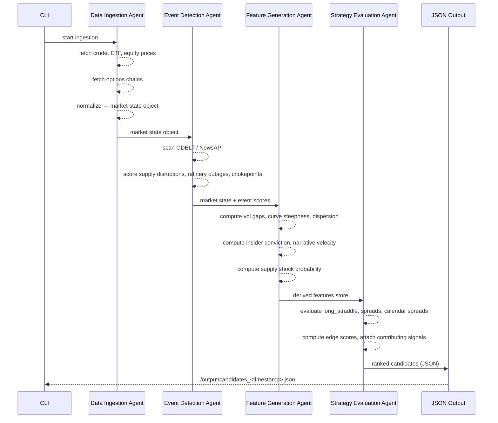

# Energy Options Opportunity Agent — User Guide

> **Version 1.0 • March 2026**
> This guide walks you through installing, configuring, and running the full four-agent pipeline that identifies oil-market-driven options trading opportunities.

---

## Table of Contents

1. [Overview](#overview)
2. [Prerequisites](#prerequisites)
3. [Setup & Configuration](#setup--configuration)
4. [Running the Pipeline](#running-the-pipeline)
5. [Interpreting the Output](#interpreting-the-output)
6. [Troubleshooting](#troubleshooting)

---

## Overview

The **Energy Options Opportunity Agent** is a modular, autonomous Python pipeline composed of four loosely coupled agents. It ingests market data, supply signals, news events, and alternative datasets, then produces a ranked list of candidate options strategies with full explainability.

### Pipeline Architecture

```mermaid
flowchart LR
    subgraph Feeds["External Data Feeds"]
        F1(Alpha Vantage / MetalpriceAPI)
        F2(Yahoo Finance / yfinance)
        F3(EIA API)
        F4(GDELT / NewsAPI)
        F5(SEC EDGAR / Quiver Quant)
        F6(MarineTraffic / VesselFinder)
        F7(Reddit / Stocktwits)
    end

    subgraph Pipeline["Four-Agent Pipeline"]
        A1["📥 Data Ingestion Agent\n─────────────────\nFetch & Normalize\nMarket State Object"]
        A2["🔍 Event Detection Agent\n─────────────────\nSupply & Geo Signals\nConfidence + Intensity Scores"]
        A3["⚙️ Feature Generation Agent\n─────────────────\nDerived Signal Computation\nVol Gaps, Curve, Dispersion…"]
        A4["🏆 Strategy Evaluation Agent\n─────────────────\nOpportunity Ranking\nEdge Scores + Explainability"]
    end

    OUT["📄 JSON Output\nRanked Candidate Strategies"]

    Feeds --> A1
    A1 -->|"Unified Market State"| A2
    A2 -->|"Event Scores"| A3
    A3 -->|"Derived Features"| A4
    A4 --> OUT
```



Data flows **unidirectionally** through the pipeline. Each agent can be deployed and updated independently without disrupting the others.

### What Each Agent Does

| Agent | Role | Key Outputs |
|---|---|---|
| **Data Ingestion Agent** | Fetch & Normalize | Unified market state object; historical price/vol store |
| **Event Detection Agent** | Supply & Geo Signals | Confidence and intensity scores per detected event |
| **Feature Generation Agent** | Derived Signal Computation | Vol gaps, curve steepness, sector dispersion, supply shock probability, etc. |
| **Strategy Evaluation Agent** | Opportunity Ranking | Ranked candidates with `edge_score` and contributing signals |

### In-Scope Instruments

| Category | Instruments |
|---|---|
| Crude Futures | Brent Crude, WTI (`CL=F`) |
| ETFs | USO, XLE |
| Energy Equities | Exxon Mobil (XOM), Chevron (CVX) |

### In-Scope Option Structures (MVP)

| Structure | Enum Value |
|---|---|
| Long Straddle | `long_straddle` |
| Call Spread | `call_spread` |
| Put Spread | `put_spread` |
| Calendar Spread | `calendar_spread` |

> ⚠️ **Advisory Only.** The system generates ranked recommendations. No automated trade execution occurs in this release.

---

## Prerequisites

### System Requirements

| Requirement | Minimum |
|---|---|
| OS | Linux, macOS, or Windows (WSL2 recommended) |
| Python | 3.10 or later |
| RAM | 2 GB available |
| Disk | 5 GB free (for 6–12 months of historical data) |
| Network | Outbound HTTPS access to all data source APIs |

### Required Software

```bash
# Verify Python version
python --version   # must be >= 3.10

# Verify pip
pip --version

# Verify git
git --version
```

### API Accounts

You must obtain free (or free-tier) API keys from the following services before running the pipeline. All are zero-cost for the MVP data volumes.

| Service | URL | Used By | Notes |
|---|---|---|---|
| Alpha Vantage | https://www.alphavantage.co/support/#api-key | Data Ingestion | WTI / Brent spot & futures |
| NewsAPI | https://newsapi.org/register | Event Detection | Energy headlines |
| EIA Open Data | https://www.eia.gov/opendata/ | Event Detection | Inventory & refinery data |
| Polygon.io | https://polygon.io | Data Ingestion | Options chains (free tier) |
| Quiver Quant | https://www.quiverquant.com | Feature Generation | Insider trade data |
| SEC EDGAR | https://efts.sec.gov/LATEST/search-index | Feature Generation | No key required |
| GDELT | https://www.gdeltproject.org | Event Detection | No key required |
| MarineTraffic | https://www.marinetraffic.com/en/ais-api-services | Feature Generation | Free tier |
| Reddit API | https://www.reddit.com/prefs/apps | Feature Generation | Narrative velocity |
| Yahoo Finance / yfinance | (no key needed) | Data Ingestion | ETF & equity prices |
| Stocktwits | https://api.stocktwits.com/developers | Feature Generation | Sentiment |

---

## Setup & Configuration

### 1. Clone the Repository

```bash
git clone https://github.com/your-org/energy-options-agent.git
cd energy-options-agent
```

### 2. Create and Activate a Virtual Environment

```bash
python -m venv .venv

# macOS / Linux
source .venv/bin/activate

# Windows (PowerShell)
.\.venv\Scripts\Activate.ps1
```

### 3. Install Dependencies

```bash
pip install --upgrade pip
pip install -r requirements.txt
```

### 4. Configure Environment Variables

The pipeline reads all secrets and tunable parameters from environment variables. The recommended approach is a `.env` file in the project root (loaded automatically at startup via `python-dotenv`).

```bash
cp .env.example .env
```

Open `.env` in your editor and fill in every value:

```bash
# ── API Keys ───────────────────────────────────────────────────────────────
ALPHA_VANTAGE_API_KEY=your_alpha_vantage_key
NEWS_API_KEY=your_newsapi_key
EIA_API_KEY=your_eia_key
POLYGON_API_KEY=your_polygon_key
QUIVER_QUANT_API_KEY=your_quiverquant_key
MARINE_TRAFFIC_API_KEY=your_marinetraffic_key
REDDIT_CLIENT_ID=your_reddit_client_id
REDDIT_CLIENT_SECRET=your_reddit_client_secret
REDDIT_USER_AGENT=energy-options-agent/1.0
STOCKTWITS_API_TOKEN=your_stocktwits_token

# ── Data Storage ────────────────────────────────────────────────────────────
DATA_DIR=./data                  # Root directory for all persisted data
RETENTION_DAYS=365               # Historical data retention window (days)

# ── Pipeline Cadence ────────────────────────────────────────────────────────
MARKET_DATA_INTERVAL_MINUTES=5   # Refresh cadence for prices & options
EIA_FETCH_SCHEDULE=weekly        # weekly | daily
EDGAR_FETCH_SCHEDULE=daily       # daily | weekly

# ── Instruments ─────────────────────────────────────────────────────────────
INSTRUMENTS=CL=F,BZ=F,USO,XLE,XOM,CVX   # Comma-separated list

# ── Strategy Evaluation ─────────────────────────────────────────────────────
EDGE_SCORE_THRESHOLD=0.30        # Minimum edge_score to include in output
MAX_CANDIDATES=20                # Maximum ranked candidates per run
OPTION_STRUCTURES=long_straddle,call_spread,put_spread,calendar_spread

# ── Output ──────────────────────────────────────────────────────────────────
OUTPUT_DIR=./output              # JSON output destination
OUTPUT_FORMAT=json               # json (future: csv, dashboard)
LOG_LEVEL=INFO                   # DEBUG | INFO | WARNING | ERROR
```

#### Complete Environment Variable Reference

| Variable | Required | Default | Description |
|---|---|---|---|
| `ALPHA_VANTAGE_API_KEY` | ✅ | — | Crude price feed (WTI, Brent) |
| `NEWS_API_KEY` | ✅ | — | Energy headline ingestion |
| `EIA_API_KEY` | ✅ | — | Inventory & refinery utilization |
| `POLYGON_API_KEY` | ✅ | — | Options chains (strike, expiry, IV, volume) |
| `QUIVER_QUANT_API_KEY` | ✅ | — | Insider conviction data |
| `MARINE_TRAFFIC_API_KEY` | ✅ | — | Tanker flow data |
| `REDDIT_CLIENT_ID` | ✅ | — | Reddit API OAuth client ID |
| `REDDIT_CLIENT_SECRET` | ✅ | — | Reddit API OAuth client secret |
| `REDDIT_USER_AGENT` | ✅ | — | Reddit API user-agent string |
| `STOCKTWITS_API_TOKEN` | ✅ | — | Stocktwits sentiment stream |
| `DATA_DIR` | ✅ | `./data` | Root path for raw & derived data storage |
| `RETENTION_DAYS` | ❌ | `365` | Days of historical data to retain |
| `MARKET_DATA_INTERVAL_MINUTES` | ❌ | `5` | Price & options refresh cadence |
| `EIA_FETCH_SCHEDULE` | ❌ | `weekly` | EIA data pull frequency |
| `EDGAR_FETCH_SCHEDULE` | ❌ | `daily` | EDGAR insider data pull frequency |
| `INSTRUMENTS` | ❌ | `CL=F,BZ=F,USO,XLE,XOM,CVX` | Instruments to monitor |
| `EDGE_SCORE_THRESHOLD` | ❌ | `0.30` | Minimum score to surface a candidate |
| `MAX_CANDIDATES` | ❌ | `20` | Maximum candidates emitted per run |
| `OPTION_STRUCTURES` | ❌ | all four | Comma-separated list of eligible structures |
| `OUTPUT_DIR` | ❌ | `./output` | Directory for JSON output files |
| `OUTPUT_FORMAT` | ❌ | `json` | Output format (`json` in MVP) |
| `LOG_LEVEL` | ❌ | `INFO` | Python logging level |

### 5. Initialise Data Directories

```bash
python -m agent.cli init
```

This command creates the `DATA_DIR` and `OUTPUT_DIR` subdirectory tree and validates that all required API keys are present before the first run.

Expected output:

```
[INFO] Data directory initialised at ./data
[INFO] Output directory initialised at ./output
[INFO] All required API keys present ✓
[INFO] Ready to run.
```

---

## Running the Pipeline

### Full Pipeline — Single Run

Execute all four agents in sequence for a one-shot evaluation:

```bash
python -m agent.cli run
```

The pipeline stages execute in order:



### Continuous Mode (Scheduled Refresh)

To run the pipeline repeatedly on the `MARKET_DATA_INTERVAL_MINUTES` cadence, use the `--watch` flag:

```bash
python -m agent.cli run --watch
```

Press `Ctrl+C` to stop. Each completed cycle writes a new timestamped output file to `OUTPUT_DIR`.

### Running Individual Agents

Each agent can be invoked in isolation for debugging or incremental development:

```bash
# Agent 1 — fetch and normalize data only
python -m agent.cli run --agent ingest

# Agent 2 — event detection only (requires a prior ingest run)
python -m agent.cli run --agent events

# Agent 3 — feature generation only (requires prior ingest + events)
python -m agent.cli run --agent features

# Agent 4 — strategy evaluation only (requires all prior agents)
python -m agent.cli run --agent strategy
```

### Filtering Output at Runtime

Override configuration values without editing `.env`:

```bash
# Raise the minimum edge score threshold
python -m agent.cli run --edge-threshold 0.50

# Limit to a single instrument
python -m agent.cli run --instruments USO

# Limit to one option structure
python -m agent.cli run --structures long_straddle

# Combine filters
python -m agent.cli run --instruments XOM,CVX --structures call_spread,put_spread --edge-threshold 0.40
```

### Checking Pipeline Health

```bash
python -m agent.cli status
```

Displays API connectivity, last successful run timestamp, record counts in the data store, and any feed errors.

---

## Interpreting the Output

### Output File Location

Each run produces a file in `OUTPUT_DIR` named:

```
candidates_<ISO8601_UTC_timestamp>.json
```

For example:

```
./output/candidates_2026-03-15T14_32_07Z.json
```

### Output Schema

Each file contains a JSON array of candidate objects. All candidates have an `edge_score` at or above `EDGE_SCORE_THRESHOLD`, sorted descending by `edge_score`.

| Field | Type | Description |
|---|---|---|
| `instrument` | string | Target instrument (e.g. `USO`, `XLE`, `CL=F`) |
| `structure` | enum string | `long_straddle` \| `call_spread` \| `put_spread` \| `calendar_spread` |
| `expiration` | integer (days) | Calendar days from evaluation date to target expiration |
| `edge_score` | float [0.0–1.0] | Composite opportunity score; higher = stronger signal confluence |
| `signals` | object | Map of contributing signal names to qualitative levels |
| `generated_at` | ISO 8601 datetime | UTC timestamp of candidate generation |

### Annotated Example

```json
[
  {
    "instrument": "USO",
    "structure": "long_straddle",
    "expiration": 30,
    "edge_score": 0.47,
    "signals": {
      "tanker_disruption_index": "high",
      "volatility_gap": "positive",
      "narrative_velocity": "rising"
    },
    "generated_at": "2026-03-15T14:32:07Z"
  },
  {
    "instrument": "XOM",
    "structure": "call_spread",
    "expiration": 21,
    