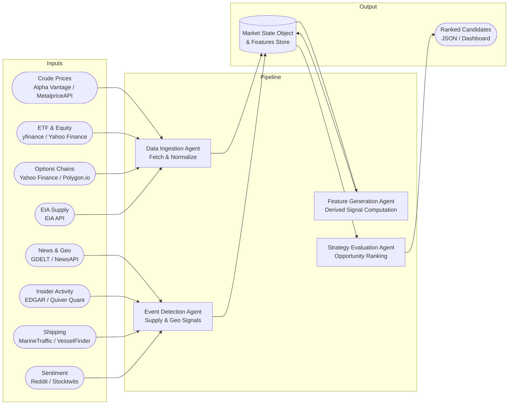
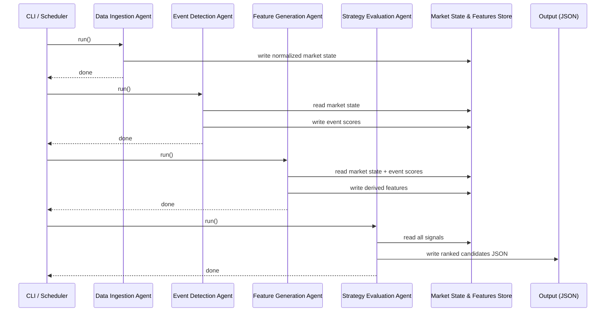

# Energy Options Opportunity Agent — User Guide

> **Version 1.0 • March 2026**
> This guide walks a developer through setting up, configuring, and running the full Energy Options Opportunity Agent pipeline end-to-end.

---

## Table of Contents

1. [Overview](#overview)
2. [Prerequisites](#prerequisites)
3. [Setup & Configuration](#setup--configuration)
4. [Running the Pipeline](#running-the-pipeline)
5. [Interpreting the Output](#interpreting-the-output)
6. [Troubleshooting](#troubleshooting)

---

## Overview

The **Energy Options Opportunity Agent** is a modular, four-agent Python pipeline that identifies options trading opportunities driven by oil market instability. It ingests market data, supply signals, news events, and alternative datasets to produce structured, ranked candidate options strategies.

The pipeline is **advisory only** — it produces ranked recommendations but does not execute trades.

### Pipeline Architecture

Data flows unidirectionally through four loosely coupled agents that communicate via a shared **market state object** and a **derived features store**.



### In-Scope Instruments & Strategies

| Category | Items |
|---|---|
| **Crude futures** | Brent Crude, WTI (`CL=F`) |
| **ETFs** | USO, XLE |
| **Energy equities** | Exxon Mobil (XOM), Chevron (CVX) |
| **Option structures (MVP)** | Long straddles, call/put spreads, calendar spreads |

> **Out of scope (initially):** Exotic/multi-legged strategies, regional refined product pricing (OPIS), automated trade execution.

---

## Prerequisites

### System Requirements

| Requirement | Minimum |
|---|---|
| Python | 3.10+ |
| Memory | 2 GB RAM |
| Disk | 5 GB free (for 6–12 months of historical data) |
| Deployment target | Local machine, single VM, or container |

### Python Dependencies

Install all dependencies from the project root:

```bash
pip install -r requirements.txt
```

Key packages the pipeline depends on:

| Package | Purpose |
|---|---|
| `yfinance` | ETF, equity, and options chain data |
| `requests` | REST calls to EIA, Alpha Vantage, GDELT, etc. |
| `pandas` / `numpy` | Data normalization and feature computation |
| `pydantic` | Market state object and output schema validation |
| `schedule` / `apscheduler` | Cadenced polling for each feed layer |
| `sqlitedict` / `tinydb` | Lightweight local historical data store |

### External API Keys

You must obtain free-tier credentials for the following services before running the pipeline:

| Service | Where to register | Required for |
|---|---|---|
| Alpha Vantage | [alphavantage.co](https://www.alphavantage.co/support/#api-key) | WTI / Brent spot prices |
| EIA Open Data | [eia.gov/opendata](https://www.eia.gov/opendata/register.php) | Inventory & refinery utilization |
| NewsAPI | [newsapi.org](https://newsapi.org/register) | Energy news headlines |
| Polygon.io *(optional)* | [polygon.io](https://polygon.io) | Higher-fidelity options chains |
| Quiver Quant *(optional)* | [quiverquant.com](https://www.quiverquant.com) | Insider conviction scores |

> **Note:** Yahoo Finance (via `yfinance`), GDELT, SEC EDGAR, MarineTraffic free tier, Reddit, and Stocktwits do not require API keys at the free tier.

---

## Setup & Configuration

### 1. Clone the Repository

```bash
git clone https://github.com/your-org/energy-options-agent.git
cd energy-options-agent
```

### 2. Create and Activate a Virtual Environment

```bash
python -m venv .venv
source .venv/bin/activate        # macOS / Linux
.venv\Scripts\activate           # Windows
```

### 3. Install Dependencies

```bash
pip install -r requirements.txt
```

### 4. Configure Environment Variables

Copy the provided template and populate your credentials:

```bash
cp .env.example .env
```

Open `.env` in your editor and fill in each value. The full set of supported environment variables is described in the table below.

#### Environment Variable Reference

| Variable | Required | Default | Description |
|---|---|---|---|
| `ALPHA_VANTAGE_API_KEY` | **Yes** | — | API key for crude spot/futures prices (Alpha Vantage) |
| `EIA_API_KEY` | **Yes** | — | API key for EIA supply and inventory data |
| `NEWSAPI_KEY` | **Yes** | — | API key for energy-related news headlines |
| `POLYGON_API_KEY` | No | `""` | Polygon.io key for options chain data (falls back to `yfinance`) |
| `QUIVER_QUANT_API_KEY` | No | `""` | Quiver Quant key for insider activity (Phase 3) |
| `DATA_STORE_PATH` | No | `./data` | Local directory for raw and derived historical data |
| `HISTORY_RETENTION_DAYS` | No | `365` | Days of historical data to retain (minimum 180 for backtesting) |
| `MARKET_DATA_POLL_INTERVAL_SECONDS` | No | `60` | Cadence for minute-level market data refresh |
| `EIA_POLL_INTERVAL_HOURS` | No | `24` | Cadence for EIA weekly feed check |
| `GDELT_POLL_INTERVAL_HOURS` | No | `1` | Cadence for GDELT geopolitical event check |
| `LOG_LEVEL` | No | `INFO` | Logging verbosity (`DEBUG`, `INFO`, `WARNING`, `ERROR`) |
| `OUTPUT_PATH` | No | `./output` | Directory where ranked candidate JSON files are written |
| `INSTRUMENTS` | No | `USO,XLE,XOM,CVX,CL=F` | Comma-separated list of instruments to track |
| `MIN_EDGE_SCORE` | No | `0.25` | Minimum edge score threshold for a candidate to appear in output |
| `MAX_CANDIDATES` | No | `20` | Maximum number of ranked candidates to emit per pipeline run |

> **Tip:** Set `LOG_LEVEL=DEBUG` during your first run to see verbose per-agent output.

### 5. Verify Configuration

Run the built-in configuration check before executing the full pipeline:

```bash
python -m agent.cli check-config
```

Expected output on success:

```
[OK] ALPHA_VANTAGE_API_KEY     reachable
[OK] EIA_API_KEY               reachable
[OK] NEWSAPI_KEY               reachable
[--] POLYGON_API_KEY           not set — falling back to yfinance (options data)
[--] QUIVER_QUANT_API_KEY      not set — insider signals disabled (Phase 3)
[OK] DATA_STORE_PATH           ./data (writable)
[OK] OUTPUT_PATH               ./output (writable)
Configuration check complete. Pipeline is ready to run.
```

---

## Running the Pipeline

### Agent Execution Order

Each agent must complete before the next begins. The diagram below shows the sequence for a single pipeline run.



### Running the Full Pipeline Once

Execute a single end-to-end pipeline run from the project root:

```bash
python -m agent.cli run --all
```

This invokes all four agents in sequence and writes output to `$OUTPUT_PATH`.

### Running Individual Agents

You can run each agent independently for development or debugging:

```bash
# Data Ingestion Agent only
python -m agent.cli run --agent ingestion

# Event Detection Agent only
python -m agent.cli run --agent events

# Feature Generation Agent only
python -m agent.cli run --agent features

# Strategy Evaluation Agent only
python -m agent.cli run --agent strategy
```

> **Note:** Running agents out of order is supported for debugging, but the pipeline will use whatever data is currently in the store. Stale data will produce stale recommendations.

### Running the Pipeline on a Schedule

To run the full pipeline continuously at the cadence defined by `MARKET_DATA_POLL_INTERVAL_SECONDS`:

```bash
python -m agent.cli run --all --loop
```

The scheduler respects each feed's appropriate cadence:

| Feed layer | Cadence |
|---|---|
| Crude prices, ETF/equity prices | Minutes (configurable via `MARKET_DATA_POLL_INTERVAL_SECONDS`) |
| Options chains, insider activity | Daily |
| EIA inventory / refinery data | Daily/weekly |
| News, GDELT, shipping, sentiment | Continuous / hourly |

### Running in a Container

A `Dockerfile` is included for containerized deployment:

```bash
docker build -t energy-options-agent .

docker run --env-file .env \
  -v $(pwd)/data:/app/data \
  -v $(pwd)/output:/app/output \
  energy-options-agent python -m agent.cli run --all --loop
```

---

## Interpreting the Output

### Output Location

Each pipeline run writes a timestamped JSON file to `$OUTPUT_PATH`:

```
output/
└── candidates_2026-03-15T14:30:00Z.json
```

The file contains a JSON array of ranked strategy candidates, ordered from highest to lowest `edge_score`.

### Output Schema

Each candidate object conforms to the following schema:

| Field | Type | Description |
|---|---|---|
| `instrument` | `string` | Target instrument, e.g. `"USO"`, `"XLE"`, `"CL=F"` |
| `structure` | `enum` | Option structure: `long_straddle` \| `call_spread` \| `put_spread` \| `calendar_spread` |
| `expiration` | `integer` | Target expiration in calendar days from the evaluation date |
| `edge_score` | `float [0.0–1.0]` | Composite opportunity score — higher values indicate stronger signal confluence |
| `signals` | `object` | Map of contributing signals and their qualitative values |
| `generated_at` | `ISO 8601 datetime` | UTC timestamp of candidate generation |

### Example Candidate

```json
{
  "instrument": "USO",
  "structure": "long_straddle",
  "expiration": 30,
  "edge_score": 0.47,
  "signals": {
    "tanker_disruption_index": "high",
    "volatility_gap": "positive",
    "narrative_velocity": "rising"
  },
  "generated_at": "2026-03-15T14:30:00Z"
}
```

### Reading the `edge_score`

The `edge_score` is a composite \[0.0–1.0\] float derived from the confluence of all active signals. Use the table below as a rough interpretive guide:

| Score range | Interpretation |
|---|---|
| `0.75 – 1.0` | Strong signal confluence — high-priority candidate |
| `0.50 – 0.74` | Moderate confluence — worth reviewing |
| `0.25 – 0.49` | Weak signal overlap — marginal candidate (default minimum threshold) |
| `< 0.25` | Below threshold — filtered out by default |

> Adjust `MIN_EDGE_SCORE` in `.env` to raise or lower the filter threshold.

### Reading the `signals` Map

Each key in the `signals` object maps to one of the derived features computed by the Feature Generation Agent:

| Signal key | Source agent | What it represents |
|---|---|---|
| `volatility_gap` | Feature Generation | Realized vs. implied volatility divergence |
| `futures_curve_steepness` | Feature Generation | Contango / backwardation signal from futures curve |
| `sector_dispersion` | Feature Generation | Cross-sector correlation breakdown |
| `insider_conviction_score` | Feature Generation | Aggregated insider trade signal (EDGAR/Quiver) |
| `narrative_velocity` | Feature Generation | Headline acceleration from news and social feeds |
| `supply_shock_probability` | Feature Generation | Probability estimate of near-term supply disruption |
| `tanker_disruption_index` | Event Detection | Shipping flow anomalies at key chokepoints |
| `refinery_outage_index` | Event Detection | Detected refinery disruption events |
| `geopolitical_event_score` | Event Detection | Confidence-weighted geopolitical event intensity |

### Consuming Output in thinkorswim or a Dashboard

The JSON output is compatible with any JSON-capable dashboard or thinkorswim's script import. Point your tool at the latest file in `$OUTPUT_PATH`, or configure the pipeline to write to a fixed path:

```bash
# Write to a fixed filename for easy dashboard polling
python -m agent.cli run --all --output-file output/latest_candidates.json
```

---

## Troubleshooting

### Common Issues

| Symptom | Likely cause | Resolution |
|---|---|---|
| `check-config` reports an API key as unreachable | Invalid or missing key in `.env` | Re-check the key value; verify the service is not rate-limiting your IP |
| Pipeline run exits with no candidates in output | All candidates below `MIN_EDGE_SCORE` | Lower `MIN_EDGE_SCORE` temporarily, or run in `DEBUG` mode to inspect signal values |
| `yfinance` returns empty options chain | Market is closed or data is delayed | Options data updates daily; run during market hours or accept previous day's chain |
| Event Detection Agent produces no events | GDELT/NewsAPI returning no matching articles | Verify `NEWSAPI_KEY` is valid; check GDELT connectivity; inspect logs for HTTP errors |
| Feature Generation Agent raises `KeyError` on market state | Data Ingestion Agent did not complete successfully | Re-run ingestion step first: `python -m agent.cli run --agent ingestion` |
| Historical store grows beyond available disk | Retention policy not enforced | Verify `HISTORY_RETENTION_DAYS` is set; run `python -m agent.cli pr