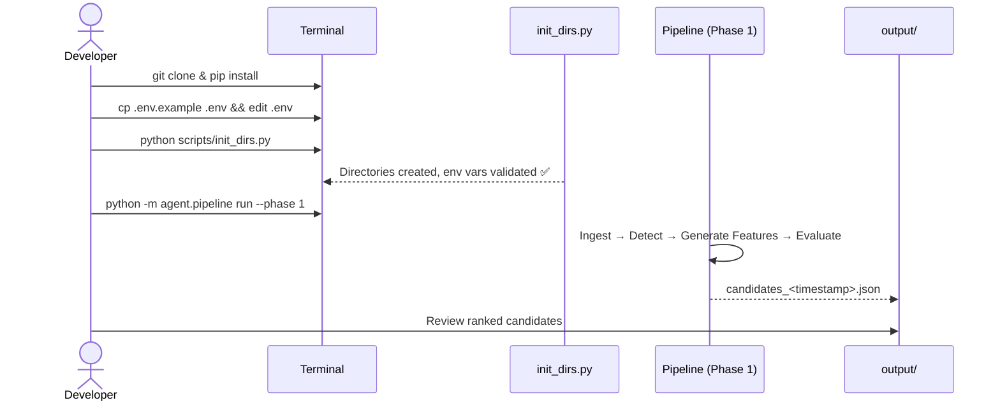

# Energy Options Opportunity Agent — User Guide

> **Version 1.0 · March 2026**
> This guide covers the full pipeline: setup, configuration, execution, output interpretation, and troubleshooting.

---

## Table of Contents

1. [Overview](#overview)
2. [Prerequisites](#prerequisites)
3. [Setup & Configuration](#setup--configuration)
4. [Running the Pipeline](#running-the-pipeline)
5. [Interpreting the Output](#interpreting-the-output)
6. [Troubleshooting](#troubleshooting)

---

## Overview

The **Energy Options Opportunity Agent** is a modular, autonomous Python pipeline that identifies options trading opportunities driven by oil market instability. It is designed for an individual contributor running on local hardware or a single low-cost cloud VM.

The pipeline is composed of four loosely coupled agents that execute in sequence:


| Agent | Role | Key Output |
|---|---|---|
| **Data Ingestion** | Fetch & normalize crude prices, ETF/equity data, and options chains | Unified market state object |
| **Event Detection** | Monitor news and geopolitical feeds; score supply disruptions | Confidence- and intensity-scored events |
| **Feature Generation** | Compute derived signals (volatility gaps, curve steepness, etc.) | Derived features store |
| **Strategy Evaluation** | Evaluate option structures and rank by edge score | Ranked candidate list (JSON) |

Data flows **unidirectionally** through the agents. No automated trade execution occurs — the system is **advisory only**.

### In-Scope Instruments (MVP)

| Category | Instruments |
|---|---|
| Crude futures | Brent Crude, WTI (`CL=F`) |
| ETFs | USO, XLE |
| Energy equities | Exxon Mobil (XOM), Chevron (CVX) |

### In-Scope Option Structures (MVP)

`long_straddle` · `call_spread` · `put_spread` · `calendar_spread`

---

## Prerequisites

### System Requirements

| Requirement | Minimum |
|---|---|
| Python | 3.10 or later |
| OS | Linux, macOS, or Windows (WSL recommended) |
| RAM | 2 GB |
| Disk | 10 GB free (for 6–12 months of historical data) |
| Network | Outbound HTTPS access to data provider APIs |

### Required Knowledge

- Comfortable with the Python CLI and virtual environments
- Familiarity with environment variables and `.env` files
- Basic understanding of options terminology (IV, strike, expiry)

### External API Accounts

Register for the following free (or free-tier) services before proceeding:

| Service | Used For | Sign-up URL |
|---|---|---|
| Alpha Vantage | WTI / Brent crude prices | `https://www.alphavantage.co` |
| Yahoo Finance / `yfinance` | ETF, equity, and options data | No key required |
| Polygon.io | Supplemental options chains | `https://polygon.io` |
| EIA Open Data | Inventory & refinery utilization | `https://www.eia.gov/opendata` |
| GDELT Project | Geopolitical news events | No key required |
| NewsAPI | Energy news headlines | `https://newsapi.org` |
| SEC EDGAR | Insider trade filings | No key required |
| Quiver Quant | Parsed insider activity | `https://www.quiverquant.com` |
| MarineTraffic | Tanker/shipping flows | `https://www.marinetraffic.com` |
| Reddit API | Retail sentiment | `https://www.reddit.com/prefs/apps` |
| Stocktwits | Narrative velocity | `https://api.stocktwits.com` |

> **Note:** Phase 1 only requires Alpha Vantage, `yfinance`, and optionally Polygon.io. Additional keys become necessary as you progress through phases 2 and 3.

---

## Setup & Configuration

### 1. Clone the Repository

```bash
git clone https://github.com/your-org/energy-options-agent.git
cd energy-options-agent
```

### 2. Create and Activate a Virtual Environment

```bash
python -m venv .venv

# Linux / macOS
source .venv/bin/activate

# Windows (PowerShell)
.\.venv\Scripts\Activate.ps1
```

### 3. Install Dependencies

```bash
pip install --upgrade pip
pip install -r requirements.txt
```

### 4. Configure Environment Variables

Copy the provided template and populate it with your credentials:

```bash
cp .env.example .env
```

Open `.env` in your editor and fill in the values described in the table below.

#### Environment Variable Reference

| Variable | Required | Phase | Description |
|---|---|---|---|
| `ALPHA_VANTAGE_API_KEY` | ✅ Yes | 1 | API key for crude spot/futures prices (WTI, Brent) |
| `POLYGON_API_KEY` | Optional | 1 | Supplemental options chain data from Polygon.io |
| `EIA_API_KEY` | ✅ Yes | 2 | EIA Open Data key for inventory and refinery utilization |
| `NEWSAPI_KEY` | ✅ Yes | 2 | NewsAPI key for energy headline feeds |
| `GDELT_ENABLED` | Optional | 2 | Set to `true` to enable GDELT geopolitical event ingestion (no key needed) |
| `QUIVER_QUANT_API_KEY` | Optional | 3 | Quiver Quant key for parsed insider activity |
| `MARINETRAFFIC_API_KEY` | Optional | 3 | MarineTraffic free-tier key for tanker flow data |
| `REDDIT_CLIENT_ID` | Optional | 3 | Reddit OAuth client ID for sentiment ingestion |
| `REDDIT_CLIENT_SECRET` | Optional | 3 | Reddit OAuth client secret |
| `REDDIT_USER_AGENT` | Optional | 3 | Reddit API user-agent string, e.g. `energy-agent/1.0` |
| `STOCKTWITS_ACCESS_TOKEN` | Optional | 3 | Stocktwits API access token |
| `OUTPUT_DIR` | ✅ Yes | 1 | Filesystem path where JSON output is written, e.g. `./output` |
| `HISTORY_DIR` | ✅ Yes | 1 | Filesystem path for persisted historical raw and derived data, e.g. `./data/history` |
| `LOG_LEVEL` | Optional | 1 | Logging verbosity: `DEBUG`, `INFO` (default), `WARNING`, `ERROR` |
| `PIPELINE_CADENCE_MINUTES` | Optional | 1 | How often the pipeline refreshes market data (default: `5`) |
| `HISTORY_RETENTION_DAYS` | Optional | 1 | Days of historical data to retain for backtesting (default: `180`; max recommended: `365`) |
| `EDGE_SCORE_THRESHOLD` | Optional | 1 | Minimum edge score to include in output (default: `0.0`; range: `0.0–1.0`) |

#### Example `.env`

```dotenv
# === Core / Phase 1 ===
ALPHA_VANTAGE_API_KEY=YOUR_ALPHA_VANTAGE_KEY
POLYGON_API_KEY=YOUR_POLYGON_KEY
OUTPUT_DIR=./output
HISTORY_DIR=./data/history
LOG_LEVEL=INFO
PIPELINE_CADENCE_MINUTES=5
HISTORY_RETENTION_DAYS=180
EDGE_SCORE_THRESHOLD=0.1

# === Phase 2 ===
EIA_API_KEY=YOUR_EIA_KEY
NEWSAPI_KEY=YOUR_NEWSAPI_KEY
GDELT_ENABLED=true

# === Phase 3 ===
QUIVER_QUANT_API_KEY=YOUR_QUIVER_KEY
MARINETRAFFIC_API_KEY=YOUR_MARINETRAFFIC_KEY
REDDIT_CLIENT_ID=YOUR_REDDIT_CLIENT_ID
REDDIT_CLIENT_SECRET=YOUR_REDDIT_CLIENT_SECRET
REDDIT_USER_AGENT=energy-agent/1.0
STOCKTWITS_ACCESS_TOKEN=YOUR_STOCKTWITS_TOKEN
```

### 5. Initialise the Data Directories

```bash
python scripts/init_dirs.py
```

This creates `OUTPUT_DIR` and `HISTORY_DIR` if they do not already exist and validates that all required environment variables are set for the current pipeline phase.

---

## Running the Pipeline

### Pipeline Phases

Each phase is a superset of the previous one. Run only the phase matching your current API key availability.

| Phase | Name | Minimum Keys Required |
|---|---|---|
| 1 | Core Market Signals & Options | `ALPHA_VANTAGE_API_KEY`, `OUTPUT_DIR`, `HISTORY_DIR` |
| 2 | Supply & Event Augmentation | Phase 1 + `EIA_API_KEY`, `NEWSAPI_KEY` |
| 3 | Alternative / Contextual Signals | Phase 2 + at least one of: `QUIVER_QUANT_API_KEY`, `MARINETRAFFIC_API_KEY`, Reddit vars, `STOCKTWITS_ACCESS_TOKEN` |
| 4 | High-Fidelity Enhancements | Deferred — requires paid data sources and is out of MVP scope |

### Single Run (One-Shot)

Execute the pipeline once and write output to `OUTPUT_DIR`:

```bash
python -m agent.pipeline run --phase 1
```

Override the phase and output directory at runtime:

```bash
python -m agent.pipeline run --phase 2 --output-dir /tmp/agent_output
```

### Continuous Mode (Scheduled Refresh)

Run the pipeline in a loop, refreshing market data at the cadence set by `PIPELINE_CADENCE_MINUTES`:

```bash
python -m agent.pipeline run --phase 2 --continuous
```

Stop the loop with `Ctrl+C`. The pipeline will complete the current cycle before exiting cleanly.

### Run Individual Agents

Each agent can be invoked independently for development and debugging:

```bash
# Data Ingestion Agent only
python -m agent.ingestion

# Event Detection Agent only
python -m agent.events

# Feature Generation Agent only
python -m agent.features

# Strategy Evaluation Agent only
python -m agent.strategy
```

> **Note:** Running agents individually requires that the upstream agents have already written their state to `HISTORY_DIR`. Run them in order on first use.

### Running Inside Docker

A minimal `Dockerfile` is included for containerised deployments:

```bash
# Build the image
docker build -t energy-options-agent:latest .

# Run a one-shot pipeline (phase 1)
docker run --rm \
  --env-file .env \
  -v "$(pwd)/output:/app/output" \
  -v "$(pwd)/data:/app/data" \
  energy-options-agent:latest \
  python -m agent.pipeline run --phase 1
```

### Typical Setup Sequence (First Run)



---

## Interpreting the Output

### Output File Location

Each pipeline run writes a timestamped JSON file to `OUTPUT_DIR`:

```
output/
└── candidates_2026-03-15T14:32:00Z.json
```

### Output Schema

Each file contains an array of candidate objects. Fields are defined as follows:

| Field | Type | Description |
|---|---|---|
| `instrument` | `string` | Target instrument, e.g. `"USO"`, `"XLE"`, `"CL=F"` |
| `structure` | `enum` | One of: `long_straddle`, `call_spread`, `put_spread`, `calendar_spread` |
| `expiration` | `integer` | Target expiration in calendar days from the evaluation date |
| `edge_score` | `float [0.0–1.0]` | Composite opportunity score; higher = stronger signal confluence |
| `signals` | `object` | Map of contributing signals and their current state |
| `generated_at` | `ISO 8601 datetime` | UTC timestamp of candidate generation |

### Example Output File

```json
[
  {
    "instrument": "USO",
    "structure": "long_straddle",
    "expiration": 30,
    "edge_score": 0.47,
    "signals": {
      "tanker_disruption_index": "high",
      "volatility_gap": "positive",
      "narrative_velocity": "rising"
    },
    "generated_at": "2026-03-15T14:32:00Z"
  },
  {
    "instrument": "XOM",
    "structure": "call_spread",
    "expiration": 14,
    "edge_score": 0.31,
    "signals": {
      "volatility_gap": "positive",
      "supply_shock_probability": "elevated",
      "insider_conviction": "moderate"
    },
    "generated_at": "2026-03-15T14:32:00Z"
  }
]
```

### Understanding the Edge Score

The `edge_score` is a composite float in the range `[0.0, 1.0]` that represents the degree of signal confluence supporting a given trade candidate. It is **not** a probability of profit.

| Edge Score Range | Interpretation |
|---|---|
| `0.0 – 0.2` | Weak signal; low confluence |
| `0.2 – 0.4` | Moderate signal; consider monitoring |
| `0.4 – 0.6` | Strong signal; notable confluence of supporting indicators |
| `0.6 – 1.0` | Very strong signal; multiple high-confidence signals aligned |

Use `EDGE_SCORE_THRESHOLD` in your `.env` to filter candidates below a minimum score.

### Understanding the Signals Map

The `signals` object provides the explainability layer for each candidate. Each key is a derived feature and its value reflects the current state assessed at generation time.

| Signal Key | Produced By | Possible Values |
|---|---|---|
| `volatility_gap` | Feature Generation Agent | `positive`, `negative`, `neutral` |
| `futures_curve_steepness` | Feature Generation Agent | `steep`, `flat`, `inverted` |
| `sector_dispersion` | Feature Generation Agent | `high`, `moderate`, `low` |
| `insider_conviction` | Feature Generation Agent | `high`, `moderate`, `low` |
| `narrative_velocity` | Feature Generation Agent | `rising`, `stable`, `falling` |
| `supply_shock_probability` | Feature Generation Agent | `elevated`, `moderate`, `low` |
| `tanker_disruption_index` | Event Detection Agent | `high`, `moderate`, `low` |
| `refinery_outage_detected` | Event Detection Agent | `true`, `false` |
| `geopolitical_event_score` | Event Detection Agent | `high`, `moderate`, `low` |

> **Tip:** A candidate with a high `edge_score` but only one contributing signal warrants more scrutiny than one with a moderate score but four corroborating signals.

### Consuming Output in thinkorswim or a Dashboard

The JSON output is designed to be compatible with any JSON-capable dashboard or the thinkorswim platform