# Energy Options Opportunity Agent — User Guide

> **Version 1.0 • March 2026**
> Advisory only. This system surfaces ranked trading candidates; it does **not** execute trades automatically.

---

## Table of Contents

1. [Overview](#overview)
2. [Prerequisites](#prerequisites)
3. [Setup & Configuration](#setup--configuration)
4. [Running the Pipeline](#running-the-pipeline)
5. [Interpreting the Output](#interpreting-the-output)
6. [Troubleshooting](#troubleshooting)

---

## Overview

The **Energy Options Opportunity Agent** is a modular, four-agent Python pipeline that identifies options trading opportunities driven by oil market instability. It ingests market data, supply signals, news events, and alternative datasets, then ranks candidate options strategies by a computed **edge score**.

### Pipeline Architecture

Data flows unidirectionally through four loosely coupled agents that communicate via a shared market state object and a derived features store.

```mermaid
flowchart LR
    subgraph Inputs
        A1[Crude Prices\nAlpha Vantage / MetalpriceAPI]
        A2[ETF & Equity Prices\nyfinance / Yahoo Finance]
        A3[Options Chains\nYahoo Finance / Polygon.io]
        A4[Supply & Inventory\nEIA API]
        A5[News & Geo Events\nGDELT / NewsAPI]
        A6[Insider Activity\nSEC EDGAR / Quiver Quant]
        A7[Shipping & Logistics\nMarineTraffic / VesselFinder]
        A8[Narrative / Sentiment\nReddit / Stocktwits]
    end

    subgraph Pipeline
        direction TB
        P1["🟦 Data Ingestion Agent\nFetch & Normalize"]
        P2["🟨 Event Detection Agent\nSupply & Geo Signals"]
        P3["🟩 Feature Generation Agent\nDerived Signal Computation"]
        P4["🟥 Strategy Evaluation Agent\nOpportunity Ranking"]
    end

    subgraph Output
        O1[Ranked Candidates\nJSON / Dashboard]
    end

    Inputs --> P1
    P1 -->|Unified market state object| P2
    P2 -->|Scored events| P3
    P3 -->|Derived features store| P4
    P4 --> O1
```



### Agent Responsibilities at a Glance

| Agent | Role | Key Outputs |
|---|---|---|
| **Data Ingestion Agent** | Fetch & Normalize | Unified market state object; historical data store |
| **Event Detection Agent** | Supply & Geo Signals | Scored supply disruptions, outages, chokepoints |
| **Feature Generation Agent** | Derived Signal Computation | Volatility gaps, curve steepness, shock probability, etc. |
| **Strategy Evaluation Agent** | Opportunity Ranking | Ranked candidates with edge scores and signal references |

### In-Scope Instruments (MVP)

| Category | Instruments |
|---|---|
| Crude Futures | Brent Crude, WTI (`CL=F`) |
| ETFs | USO, XLE |
| Energy Equities | Exxon Mobil (XOM), Chevron (CVX) |

### In-Scope Option Structures (MVP)

| Structure | Enum Value |
|---|---|
| Long Straddle | `long_straddle` |
| Call Spread | `call_spread` |
| Put Spread | `put_spread` |
| Calendar Spread | `calendar_spread` |

> **Out of scope (MVP):** Exotic or multi-legged strategies, regional refined product pricing (OPIS), and automated trade execution.

---

## Prerequisites

### System Requirements

| Requirement | Minimum |
|---|---|
| Python | 3.10+ |
| Operating System | Linux, macOS, or Windows (WSL recommended) |
| RAM | 2 GB |
| Disk | 10 GB free (for 6–12 months of historical data) |
| Network | Outbound HTTPS access to all data source APIs |

### Required Knowledge

- Comfortable running Python scripts and CLI commands
- Familiarity with virtual environments (`venv` or `conda`)
- Basic understanding of options trading concepts (IV, straddles, spreads)

### API Accounts

Register for the following free (or free-tier) services before proceeding. All are zero- or low-cost.

| Service | Used For | Cost | Sign-Up URL |
|---|---|---|---|
| Alpha Vantage | WTI / Brent crude prices | Free | https://www.alphavantage.co |
| Yahoo Finance / yfinance | ETF, equity, options data | Free | *(no account needed for yfinance)* |
| Polygon.io | Options chains (fallback) | Free tier | https://polygon.io |
| EIA API | Inventory & refinery data | Free | https://www.eia.gov/opendata |
| GDELT | News & geopolitical events | Free | https://www.gdeltproject.org |
| NewsAPI | News headlines | Free tier | https://newsapi.org |
| SEC EDGAR | Insider trading filings | Free | https://www.sec.gov/developer |
| Quiver Quant | Insider conviction scores | Free/Limited | https://www.quiverquant.com |
| MarineTraffic | Tanker shipping data | Free tier | https://www.marinetraffic.com |
| VesselFinder | Tanker flows (fallback) | Free tier | https://www.vesselfinder.com |
| Reddit API | Narrative / sentiment | Free | https://www.reddit.com/dev/api |
| Stocktwits API | Retail sentiment | Free | https://api.stocktwits.com |

---

## Setup & Configuration

### 1. Clone the Repository

```bash
git clone https://github.com/your-org/energy-options-agent.git
cd energy-options-agent
```

### 2. Create and Activate a Virtual Environment

```bash
python3 -m venv .venv
source .venv/bin/activate        # Linux / macOS
# .venv\Scripts\activate.bat    # Windows CMD
# .venv\Scripts\Activate.ps1   # Windows PowerShell
```

### 3. Install Dependencies

```bash
pip install --upgrade pip
pip install -r requirements.txt
```

### 4. Configure Environment Variables

The pipeline is configured entirely through environment variables. Copy the provided template and fill in your credentials:

```bash
cp .env.example .env
```

Open `.env` in your editor and set each variable as described in the table below.

#### Complete Environment Variable Reference

| Variable | Required | Default | Description |
|---|---|---|---|
| **Data Ingestion** | | | |
| `ALPHA_VANTAGE_API_KEY` | ✅ | — | API key for crude price feeds (WTI, Brent) |
| `POLYGON_API_KEY` | ⚠️ | — | Polygon.io key; used as options chain fallback when Yahoo Finance is unavailable |
| `EIA_API_KEY` | ✅ | — | EIA Open Data API key for inventory and refinery utilization |
| `MARKET_DATA_REFRESH_INTERVAL_SECONDS` | ❌ | `60` | Polling interval for minute-level market data feeds |
| `OPTIONS_DATA_REFRESH_INTERVAL_SECONDS` | ❌ | `86400` | Polling interval for options chain data (daily by default) |
| `EIA_REFRESH_INTERVAL_SECONDS` | ❌ | `604800` | Polling interval for EIA data (weekly by default) |
| **Event Detection** | | | |
| `NEWSAPI_KEY` | ✅ | — | NewsAPI key for energy headline ingestion |
| `GDELT_ENABLED` | ❌ | `true` | Set to `false` to disable GDELT event monitoring |
| `EVENT_CONFIDENCE_THRESHOLD` | ❌ | `0.5` | Minimum confidence score `[0.0–1.0]` for an event to be forwarded to feature generation |
| **Feature Generation** | | | |
| `QUIVER_QUANT_API_KEY` | ⚠️ | — | Quiver Quant key for insider conviction scores (optional; falls back to raw EDGAR) |
| `REDDIT_CLIENT_ID` | ⚠️ | — | Reddit API client ID for narrative velocity computation |
| `REDDIT_CLIENT_SECRET` | ⚠️ | — | Reddit API client secret |
| `REDDIT_USER_AGENT` | ⚠️ | — | Reddit API user-agent string, e.g. `energy-agent/1.0` |
| `STOCKTWITS_ENABLED` | ❌ | `true` | Set to `false` to disable Stocktwits sentiment ingestion |
| `MARINE_TRAFFIC_API_KEY` | ⚠️ | — | MarineTraffic API key for tanker flow data |
| **Strategy Evaluation** | | | |
| `EDGE_SCORE_MIN_THRESHOLD` | ❌ | `0.0` | Candidates with an edge score below this value are excluded from output |
| `MAX_CANDIDATES_OUTPUT` | ❌ | `20` | Maximum number of ranked candidates written per pipeline run |
| `TARGET_EXPIRATION_DAYS` | ❌ | `30` | Default target expiration window (calendar days) for generated candidates |
| **Storage & Output** | | | |
| `DATA_STORE_PATH` | ❌ | `./data` | Local directory for raw and derived historical data |
| `HISTORICAL_RETENTION_DAYS` | ❌ | `365` | Number of days of historical data to retain (minimum 180 recommended) |
| `OUTPUT_PATH` | ❌ | `./output` | Directory where JSON output files are written |
| `OUTPUT_FORMAT` | ❌ | `json` | Output format; currently only `json` is supported |
| **Deployment** | | | |
| `LOG_LEVEL` | ❌ | `INFO` | Logging verbosity: `DEBUG`, `INFO`, `WARNING`, `ERROR` |
| `PIPELINE_MODE` | ❌ | `continuous` | `continuous` (polling loop) or `once` (single run and exit) |

> **Legend:** ✅ Required · ⚠️ Recommended (pipeline degrades gracefully without it) · ❌ Optional

#### Example `.env` File

```dotenv
# --- Data Ingestion ---
ALPHA_VANTAGE_API_KEY=your_alpha_vantage_key_here
POLYGON_API_KEY=your_polygon_key_here
EIA_API_KEY=your_eia_key_here
MARKET_DATA_REFRESH_INTERVAL_SECONDS=60
OPTIONS_DATA_REFRESH_INTERVAL_SECONDS=86400
EIA_REFRESH_INTERVAL_SECONDS=604800

# --- Event Detection ---
NEWSAPI_KEY=your_newsapi_key_here
GDELT_ENABLED=true
EVENT_CONFIDENCE_THRESHOLD=0.5

# --- Feature Generation ---
QUIVER_QUANT_API_KEY=your_quiver_key_here
REDDIT_CLIENT_ID=your_reddit_client_id
REDDIT_CLIENT_SECRET=your_reddit_client_secret
REDDIT_USER_AGENT=energy-agent/1.0
STOCKTWITS_ENABLED=true
MARINE_TRAFFIC_API_KEY=your_marinetraffic_key_here

# --- Strategy Evaluation ---
EDGE_SCORE_MIN_THRESHOLD=0.25
MAX_CANDIDATES_OUTPUT=20
TARGET_EXPIRATION_DAYS=30

# --- Storage & Output ---
DATA_STORE_PATH=./data
HISTORICAL_RETENTION_DAYS=365
OUTPUT_PATH=./output
OUTPUT_FORMAT=json

# --- Deployment ---
LOG_LEVEL=INFO
PIPELINE_MODE=continuous
```

### 5. Initialise the Data Store

Run the initialisation script once before the first pipeline execution. It creates the directory structure and seeds the historical data store.

```bash
python -m agent.init
```

Expected output:

```
[INFO] Data store initialised at ./data
[INFO] Output directory created at ./output
[INFO] Schema validation: OK
[INFO] Ready to run.
```

---

## Running the Pipeline

### Quick Start — Single Run

To execute all four agents once and write output to `./output`, set `PIPELINE_MODE=once` in your `.env` (or override inline):

```bash
PIPELINE_MODE=once python -m agent.pipeline
```

### Continuous Mode (Default)

In continuous mode the pipeline polls market data on the configured intervals without manual intervention:

```bash
python -m agent.pipeline
```

The agents execute in sequence on each polling cycle:

```
[INFO] Cycle 1 starting at 2026-03-15T09:30:00Z
[INFO] [DataIngestionAgent]     Fetching crude prices ... OK
[INFO] [DataIngestionAgent]     Fetching ETF/equity prices ... OK
[INFO] [DataIngestionAgent]     Fetching options chains ... OK
[INFO] [EventDetectionAgent]    Processing GDELT feed ... 3 events detected
[INFO] [EventDetectionAgent]    Processing NewsAPI feed ... 1 event detected
[INFO] [FeatureGenerationAgent] Computing volatility gaps ... OK
[INFO] [FeatureGenerationAgent] Computing supply shock probability ... OK
[INFO] [StrategyEvaluationAgent] Evaluating structures ... 5 candidates generated
[INFO] Output written to ./output/candidates_20260315T093012Z.json
[INFO] Cycle 1 complete. Next cycle in 60s.
```

### Running Individual Agents

Each agent can be invoked independently for testing or incremental development:

```bash
# Run only the Data Ingestion Agent
python -m agent.ingestion

# Run only the Event Detection Agent
python -m agent.events

# Run only the Feature Generation Agent
python -m agent.features

# Run only the Strategy Evaluation Agent
python -m agent.strategy
```

> **Note:** Agents downstream of Data Ingestion read from the shared market state object written to `DATA_STORE_PATH`. Run ingestion at least once before running downstream agents in isolation.

### Running with Docker

A single-container deployment is supported for local or cloud VM use:

```bash
# Build the image
docker build -t energy-options-agent:1.0 .

# Run with your .env file mounted
docker run --env-file .env \
           -v $(pwd)/data:/app/data \
           -v $(pwd)/output:/app/output \
           energy-options-agent:1.0
```

### Scheduling (Cron Example)

To run a single pipeline pass on a schedule, set `PIPELINE_MODE=once` and use cron:

```cron
# Run every weekday at 09:00 and 15:00 UTC
0 9,15 * * 1-5 /path/to/.venv/bin/python -m agent.pipeline >> /var/log/energy-agent.log 2>&1
```

---

## Interpreting the Output

### Output File Location

Each pipeline run writes a timestamped JSON file to `OUTPUT_PATH`:

```
./output/candidates_20260315T093012Z.json
```

### Output Schema

Each file contains a JSON array of candidate objects. Every candidate has the following fields:

| Field | Type | Description |
|---|---|---|
| `instrument` | `string` | Target instrument, e.g. `USO`, `XLE`, `CL=F` |
| `structure` | `enum` | `long_straddle` \| `call_spread` \| `put_spread` \| `calendar_spread` |
| `expiration` | `integer` | Target expiration in calendar days from evaluation date |
| `edge_score` | `float [0.0–1.0]` | Composite opportunity score — higher = stronger signal confluence |
| `signals` | `object` | Map of contributing signals and their assessed levels |
| `generated_at` | `ISO 8601 datetime` | UTC timestamp of candidate generation |

### Example Output

```json
[
  {
    "instrument": "USO",
    "structure": "long_straddle",
    "expiration": 30,
    "edge_score": 0.47,
    "signals": {
      "tanker_disruption_index": "high",
      "volatility_gap": "positive",
      "narrative_velocity