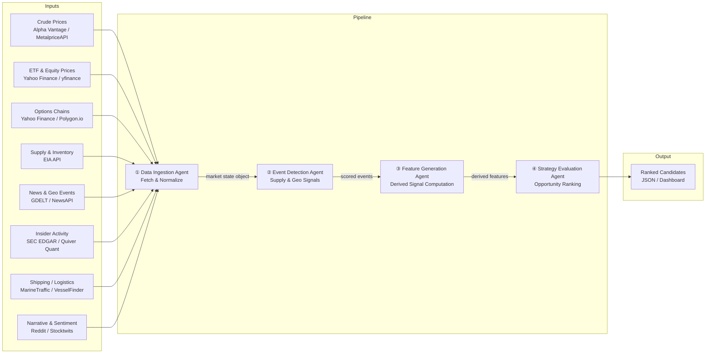

# Energy Options Opportunity Agent — User Guide

> **Version 1.0 • March 2026**
> This guide walks a developer through installing, configuring, and running the full four-agent pipeline from a clean environment to ranked options candidates.

---

## Table of Contents

1. [Overview](#overview)
2. [Prerequisites](#prerequisites)
3. [Setup & Configuration](#setup--configuration)
4. [Running the Pipeline](#running-the-pipeline)
5. [Interpreting the Output](#interpreting-the-output)
6. [Troubleshooting](#troubleshooting)

---

## Overview

The **Energy Options Opportunity Agent** is a modular Python pipeline that identifies options trading opportunities driven by oil market instability. It ingests market data, supply signals, news events, and alternative datasets, then produces a structured, ranked list of candidate options strategies.

The pipeline is composed of four loosely coupled agents that execute in sequence, communicating through a shared **market state object** and a **derived features store**.



### Agent Responsibilities

| # | Agent | Role | Key Outputs |
|---|-------|------|-------------|
| 1 | **Data Ingestion Agent** | Fetch & Normalize | Unified market state object; historical store |
| 2 | **Event Detection Agent** | Supply & Geo Signals | Events with confidence and intensity scores |
| 3 | **Feature Generation Agent** | Derived Signal Computation | Volatility gaps, curve steepness, supply shock probability, etc. |
| 4 | **Strategy Evaluation Agent** | Opportunity Ranking | Ranked candidates with edge scores and signal references |

> **Advisory only.** The pipeline surfaces opportunities; it does **not** execute trades automatically.

---

## Prerequisites

### System Requirements

| Requirement | Minimum |
|-------------|---------|
| Python | 3.10 or later |
| Operating system | Linux, macOS, or Windows (WSL2 recommended) |
| RAM | 2 GB |
| Disk | 10 GB free (for 6–12 months of historical data) |
| Network | Outbound HTTPS to data-source APIs |

### Required Tools

```bash
# Verify Python version
python --version        # should print 3.10.x or later

# Verify pip
pip --version

# Verify git
git --version
```

### API Access

You need free-tier (or low-cost) accounts for the data sources used by each pipeline phase. Register for the services you intend to use before proceeding.

| Data Source | Registration URL | Cost | Notes |
|-------------|-----------------|------|-------|
| Alpha Vantage | https://www.alphavantage.co | Free | WTI, Brent spot/futures |
| MetalpriceAPI | https://metalpriceapi.com | Free | Crude price fallback |
| Polygon.io | https://polygon.io | Free/Limited | Options chains |
| EIA API | https://www.eia.gov/opendata | Free | Inventory, refinery utilization |
| NewsAPI | https://newsapi.org | Free | Geopolitical news events |
| GDELT | https://www.gdeltproject.org | Free | No key required |
| SEC EDGAR | https://efts.sec.gov/LATEST/search-index | Free | Insider filings |
| Quiver Quant | https://www.quiverquant.com | Free/Limited | Insider trade scores |
| MarineTraffic | https://www.marinetraffic.com | Free tier | Tanker flows |
| VesselFinder | https://www.vesselfinder.com | Free tier | Tanker flow fallback |
| Reddit API | https://www.reddit.com/prefs/apps | Free | Narrative sentiment |
| Stocktwits | https://api.stocktwits.com | Free | Retail sentiment |

> **Phase dependency:** API keys are required incrementally by MVP phase. See [MVP Phasing](#mvp-phasing-and-enabling-agents) for details.

---

## Setup & Configuration

### 1. Clone the Repository

```bash
git clone https://github.com/your-org/energy-options-agent.git
cd energy-options-agent
```

### 2. Create and Activate a Virtual Environment

```bash
python -m venv .venv

# Linux / macOS
source .venv/bin/activate

# Windows (PowerShell)
.venv\Scripts\Activate.ps1
```

### 3. Install Dependencies

```bash
pip install --upgrade pip
pip install -r requirements.txt
```

### 4. Configure Environment Variables

All runtime configuration is supplied through environment variables. Copy the provided template and fill in your values:

```bash
cp .env.example .env
```

Then open `.env` in your editor and populate the values described in the table below.

#### Environment Variable Reference

| Variable | Required | Default | Description |
|----------|----------|---------|-------------|
| `ALPHA_VANTAGE_API_KEY` | Phase 1 | — | API key for Alpha Vantage crude price feed |
| `METALPRICE_API_KEY` | Optional | — | Fallback crude price key (MetalpriceAPI) |
| `POLYGON_API_KEY` | Phase 1 | — | Polygon.io key for options chain data |
| `EIA_API_KEY` | Phase 2 | — | EIA Open Data API key for supply/inventory |
| `NEWSAPI_KEY` | Phase 2 | — | NewsAPI key for geopolitical news events |
| `QUIVER_API_KEY` | Phase 3 | — | Quiver Quant key for insider conviction data |
| `MARINETRAFFIC_API_KEY` | Phase 3 | — | MarineTraffic key for tanker flow data |
| `REDDIT_CLIENT_ID` | Phase 3 | — | Reddit OAuth client ID |
| `REDDIT_CLIENT_SECRET` | Phase 3 | — | Reddit OAuth client secret |
| `REDDIT_USER_AGENT` | Phase 3 | `energy-agent/1.0` | Reddit API user-agent string |
| `STOCKTWITS_API_KEY` | Phase 3 | — | Stocktwits API key for retail sentiment |
| `DATA_DIR` | All | `./data` | Directory for persisted raw and derived data |
| `OUTPUT_DIR` | All | `./output` | Directory where JSON candidate files are written |
| `LOG_LEVEL` | All | `INFO` | Logging verbosity: `DEBUG`, `INFO`, `WARNING`, `ERROR` |
| `MARKET_DATA_INTERVAL_MIN` | All | `5` | Polling interval in minutes for market price feeds |
| `HISTORY_RETENTION_DAYS` | All | `365` | Days of historical data to retain (180–365 recommended) |
| `PIPELINE_PHASE` | All | `1` | Active MVP phase (`1`–`4`); gates which agents and sources are enabled |
| `INSTRUMENTS` | All | `USO,XLE,XOM,CVX,CL=F,BZ=F` | Comma-separated list of instruments to track |
| `OPTIONS_EXPIRY_WINDOW_DAYS` | All | `90` | Maximum calendar days to expiration for candidate options |
| `EDGE_SCORE_THRESHOLD` | All | `0.25` | Minimum edge score for a candidate to appear in output |

#### Example `.env` File

```dotenv
# ── Core keys (Phase 1) ───────────────────────────────────────────────────
ALPHA_VANTAGE_API_KEY=YOUR_AV_KEY_HERE
POLYGON_API_KEY=YOUR_POLYGON_KEY_HERE

# ── Supply & event keys (Phase 2) ────────────────────────────────────────
EIA_API_KEY=YOUR_EIA_KEY_HERE
NEWSAPI_KEY=YOUR_NEWSAPI_KEY_HERE

# ── Alternative signal keys (Phase 3) ────────────────────────────────────
QUIVER_API_KEY=YOUR_QUIVER_KEY_HERE
MARINETRAFFIC_API_KEY=YOUR_MT_KEY_HERE
REDDIT_CLIENT_ID=YOUR_REDDIT_ID
REDDIT_CLIENT_SECRET=YOUR_REDDIT_SECRET
REDDIT_USER_AGENT=energy-agent/1.0
STOCKTWITS_API_KEY=YOUR_ST_KEY_HERE

# ── Pipeline behaviour ────────────────────────────────────────────────────
PIPELINE_PHASE=1
DATA_DIR=./data
OUTPUT_DIR=./output
LOG_LEVEL=INFO
MARKET_DATA_INTERVAL_MIN=5
HISTORY_RETENTION_DAYS=365
INSTRUMENTS=USO,XLE,XOM,CVX,CL=F,BZ=F
OPTIONS_EXPIRY_WINDOW_DAYS=90
EDGE_SCORE_THRESHOLD=0.25
```

### 5. Initialise the Data Store

Run the initialisation command to create the required directory structure and empty database tables before the first pipeline run:

```bash
python -m agent init
```

Expected output:

```
[INFO] Data directory created: ./data
[INFO] Output directory created: ./output
[INFO] Historical store initialised (SQLite): ./data/market_history.db
[INFO] Initialisation complete.
```

### MVP Phasing and Enabling Agents

The `PIPELINE_PHASE` variable gates which data sources and agents are active. Increment the phase only after the corresponding API keys are configured.

| Phase | Name | What is enabled |
|-------|------|-----------------|
| `1` | Core Market Signals & Options | Crude benchmarks (WTI, Brent), USO/XLE prices, options surface analysis, long straddles and call/put spreads |
| `2` | Supply & Event Augmentation | EIA inventory, refinery utilisation, event detection via GDELT/NewsAPI, supply disruption indices |
| `3` | Alternative / Contextual Signals | Insider trades, narrative velocity, shipping data, cross-sector correlation; full edge score |
| `4` | High-Fidelity Enhancements | OPIS or regional refined pricing (paid), exotic/multi-legged structures, execution integration |

---

## Running the Pipeline

### Single On-Demand Run

Execute all four agents once in sequence and write candidates to `OUTPUT_DIR`:

```bash
python -m agent run
```

The pipeline stages run in order and log their progress to stdout:

```
[INFO] ── Stage 1/4: Data Ingestion Agent ──────────────────────────────
[INFO] Fetching WTI spot price          ... OK (Alpha Vantage)
[INFO] Fetching Brent spot price        ... OK (Alpha Vantage)
[INFO] Fetching options chain: USO      ... OK (Polygon.io)
[INFO] Fetching options chain: XLE      ... OK (Polygon.io)
[INFO] Market state object written      ... ./data/market_state.json

[INFO] ── Stage 2/4: Event Detection Agent ─────────────────────────────
[INFO] Scanning GDELT for energy events ... 3 events detected
[INFO] Events scored and stored         ... ./data/events.json

[INFO] ── Stage 3/4: Feature Generation Agent ──────────────────────────
[INFO] Computing volatility gaps        ... done
[INFO] Computing futures curve steepness... done
[INFO] Computing supply shock probability... done
[INFO] Derived features written         ... ./data/features.json

[INFO] ── Stage 4/4: Strategy Evaluation Agent ─────────────────────────
[INFO] Evaluating option structures     ... 12 candidates scored
[INFO] Candidates above threshold (0.25): 4
[INFO] Output written                   ... ./output/candidates_20260315T143002Z.json
[INFO] Pipeline complete.
```

### Running a Single Agent in Isolation

Each agent can be run independently for debugging or incremental updates:

```bash
# Run only the Data Ingestion Agent
python -m agent run --stage ingest

# Run only the Event Detection Agent
python -m agent run --stage events

# Run only the Feature Generation Agent
python -m agent run --stage features

# Run only the Strategy Evaluation Agent
python -m agent run --stage strategy
```

### Continuous / Scheduled Mode

To poll market feeds at the configured `MARKET_DATA_INTERVAL_MIN` cadence and re-evaluate strategies on each tick:

```bash
python -m agent run --continuous
```

> **Tip:** For production use, consider running in a container or behind a process supervisor (e.g., `systemd`, `supervisord`, or a cron job) rather than relying on the built-in loop.

#### Example cron schedule (Linux)

```cron
# Run the full pipeline every 5 minutes during market hours (Mon–Fri, 09:00–17:00 ET)
*/5 9-17 * * 1-5 /path/to/.venv/bin/python -m agent run >> /var/log/energy-agent.log 2>&1
```

### Dry-Run Mode

Validate configuration and connectivity without writing any output files:

```bash
python -m agent run --dry-run
```

### Overriding Configuration at the Command Line

Any environment variable can be overridden inline for a single run:

```bash
PIPELINE_PHASE=2 EDGE_SCORE_THRESHOLD=0.30 python -m agent run
```

---

## Interpreting the Output

### Output File Location

Each run appends a timestamped JSON file to `OUTPUT_DIR`:

```
output/
└── candidates_20260315T143002Z.json
```

### Output Schema

Each file contains a JSON array of candidate objects. The fields are:

| Field | Type | Description |
|-------|------|-------------|
| `instrument` | `string` | Target instrument, e.g. `USO`, `XLE`, `CL=F` |
| `structure` | `enum` | One of: `long_straddle`, `call_spread`, `put_spread`, `calendar_spread` |
| `expiration` | `integer` | Calendar days to target expiration from evaluation date |
| `edge_score` | `float [0.0–1.0]` | Composite opportunity score; higher = stronger signal confluence |
| `signals` | `object` | Map of contributing signals and their qualitative values |
| `generated_at` | `ISO 8601 datetime` | UTC timestamp of candidate generation |

### Example Candidate Output

```json
[
  {
    "instrument": "USO",
    "structure": "long_straddle",
    "expiration": 30,
    "edge_score": 0.47,
    "signals": {
      "tanker_disruption_index": "high",
      "volatility_gap": "positive",
      "narrative_velocity": "rising"
    },
    "generated_at": "2026-03-15T14:30:02Z"
  },
  {
    "instrument": "XLE",
    "structure": "call_spread",
    "expiration": 45,
    "edge_score": 0.31,
    "signals": {
      "volatility_gap": "positive