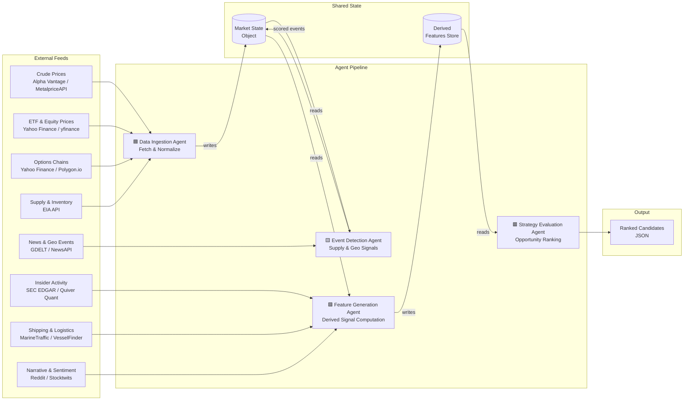

# Energy Options Opportunity Agent — User Guide

> **Version 1.0 • March 2026**
> This guide walks a developer through installing, configuring, and running the full pipeline end-to-end, and explains how to read and act on its output.

---

## Table of Contents

1. [Overview](#overview)
2. [Prerequisites](#prerequisites)
3. [Setup & Configuration](#setup--configuration)
4. [Running the Pipeline](#running-the-pipeline)
5. [Interpreting the Output](#interpreting-the-output)
6. [Troubleshooting](#troubleshooting)

---

## Overview

The **Energy Options Opportunity Agent** is a four-agent Python pipeline that detects volatility mispricing in oil-related instruments and produces ranked, explainable options trading candidates.

### What the pipeline does

| Stage | Agent | Input | Output |
|---|---|---|---|
| 1 | **Data Ingestion Agent** | Raw API feeds | Unified market state object |
| 2 | **Event Detection Agent** | Market state + news/geo feeds | Scored supply & geopolitical events |
| 3 | **Feature Generation Agent** | Market state + event scores | Derived signal set |
| 4 | **Strategy Evaluation Agent** | Derived signals | Ranked candidate opportunities (JSON) |

Data flows **unidirectionally** through the agents via a shared market state object and a derived features store. No stage writes back to an earlier stage.



### In-scope instruments (MVP)

| Category | Instruments |
|---|---|
| Crude futures | Brent Crude, WTI (`CL=F`) |
| ETFs | USO, XLE |
| Energy equities | XOM (ExxonMobil), CVX (Chevron) |

### In-scope option structures (MVP)

`long_straddle` · `call_spread` · `put_spread` · `calendar_spread`

> **Advisory only.** Automated trade execution is out of scope. All output is for informational purposes.

---

## Prerequisites

### System requirements

| Requirement | Minimum |
|---|---|
| Python | 3.10 or later |
| OS | Linux, macOS, or Windows (WSL2 recommended on Windows) |
| RAM | 2 GB |
| Disk | 10 GB (for 6–12 months of historical data) |
| Network | Outbound HTTPS to API endpoints |

### Required tools

```bash
# Verify Python version
python --version   # must be >= 3.10

# Verify pip
pip --version

# Optional but recommended: create an isolated environment
python -m venv .venv
source .venv/bin/activate      # Linux / macOS
# .venv\Scripts\activate       # Windows PowerShell
```

### API accounts

Obtain free (or free-tier) credentials from the following providers before proceeding. All are zero-cost for MVP usage.

| Provider | Used by | Sign-up URL |
|---|---|---|
| Alpha Vantage | Crude prices | https://www.alphavantage.co/support/#api-key |
| MetalpriceAPI | Crude prices (fallback) | https://metalpriceapi.com |
| Polygon.io | Options chains | https://polygon.io |
| EIA API | Supply & inventory | https://www.eia.gov/opendata/ |
| NewsAPI | News & geo events | https://newsapi.org |
| Quiver Quant | Insider activity | https://www.quiverquant.com |
| MarineTraffic | Shipping & logistics | https://www.marinetraffic.com/en/p/api-services |

> `yfinance`, GDELT, SEC EDGAR, Reddit, and Stocktwits do not require API keys for basic access.

---

## Setup & Configuration

### 1. Clone the repository

```bash
git clone https://github.com/your-org/energy-options-agent.git
cd energy-options-agent
```

### 2. Install dependencies

```bash
pip install -r requirements.txt
```

### 3. Configure environment variables

The pipeline reads all secrets and tuneable parameters from environment variables. The recommended approach is to copy the provided template and edit it in place.

```bash
cp .env.example .env
# then open .env in your editor of choice
```

#### Full environment variable reference

| Variable | Required | Default | Description |
|---|---|---|---|
| `ALPHA_VANTAGE_API_KEY` | Yes | — | API key for Alpha Vantage crude price feed |
| `METALPRICE_API_KEY` | No | — | Fallback crude price key (MetalpriceAPI) |
| `POLYGON_API_KEY` | No | — | Polygon.io key for options chain data |
| `EIA_API_KEY` | Yes | — | EIA Open Data API key for supply/inventory |
| `NEWS_API_KEY` | Yes | — | NewsAPI key for news & geopolitical events |
| `QUIVER_API_KEY` | No | — | Quiver Quant key for insider conviction data |
| `MARINETRAFFIC_API_KEY` | No | — | MarineTraffic API key for tanker flow data |
| `DATA_DIR` | No | `./data` | Root directory for persisted market state and historical data |
| `OUTPUT_DIR` | No | `./output` | Directory where ranked candidate JSON files are written |
| `LOG_LEVEL` | No | `INFO` | Logging verbosity: `DEBUG`, `INFO`, `WARNING`, `ERROR` |
| `MARKET_DATA_INTERVAL_MINUTES` | No | `5` | Polling cadence for minute-level market data feeds |
| `OPTIONS_DATA_INTERVAL_HOURS` | No | `24` | Polling cadence for options chain data (daily feeds) |
| `EIA_INTERVAL_HOURS` | No | `168` | Polling cadence for EIA inventory data (weekly = 168 h) |
| `HISTORY_RETENTION_DAYS` | No | `365` | Days of historical data to retain for backtesting support |
| `MIN_EDGE_SCORE` | No | `0.20` | Minimum `edge_score` threshold; candidates below this are suppressed |
| `TARGET_INSTRUMENTS` | No | `USO,XLE,XOM,CVX,CL=F,BZ=F` | Comma-separated list of instruments to evaluate |
| `TARGET_STRUCTURES` | No | `long_straddle,call_spread,put_spread,calendar_spread` | Comma-separated list of option structures to evaluate |
| `TIMEZONE` | No | `UTC` | Timezone for all timestamps in output (`UTC` strongly recommended) |

#### Example `.env` file

```dotenv
# === Required API keys ===
ALPHA_VANTAGE_API_KEY=YOUR_AV_KEY_HERE
EIA_API_KEY=YOUR_EIA_KEY_HERE
NEWS_API_KEY=YOUR_NEWSAPI_KEY_HERE

# === Optional API keys ===
POLYGON_API_KEY=YOUR_POLYGON_KEY_HERE
QUIVER_API_KEY=YOUR_QUIVER_KEY_HERE
MARINETRAFFIC_API_KEY=YOUR_MT_KEY_HERE

# === Storage ===
DATA_DIR=./data
OUTPUT_DIR=./output
HISTORY_RETENTION_DAYS=365

# === Pipeline behaviour ===
MARKET_DATA_INTERVAL_MINUTES=5
OPTIONS_DATA_INTERVAL_HOURS=24
EIA_INTERVAL_HOURS=168
MIN_EDGE_SCORE=0.20
LOG_LEVEL=INFO
TIMEZONE=UTC
```

### 4. Initialise the data store

Run the initialisation command once to create the required directory structure and seed the historical data store:

```bash
python -m agent init
```

Expected output:

```
[INFO] Creating data directory at ./data
[INFO] Creating output directory at ./output
[INFO] Historical store initialised (retention: 365 days)
[INFO] Init complete.
```

---

## Running the Pipeline

### Pipeline phases

The pipeline ships with support for the four MVP phases. You can run a specific phase or the full stack. Phases build on each other — running Phase 3 implicitly requires Phases 1 and 2 to have run at least once.

| Phase flag | Name | What it enables |
|---|---|---|
| `--phase 1` | Core Market Signals & Options | Crude/ETF prices, options surface, straddle & spread strategies |
| `--phase 2` | Supply & Event Augmentation | EIA inventory, GDELT/NewsAPI event detection, event-driven scoring |
| `--phase 3` | Alternative / Contextual Signals | Insider trades, narrative velocity, shipping data, full edge scoring |
| `--phase 4` | High-Fidelity Enhancements | Reserved for future paid data sources and exotic structures |

### Single run (one-shot)

Execute the full pipeline once and write results to `OUTPUT_DIR`:

```bash
python -m agent run
```

Run only through Phase 2:

```bash
python -m agent run --phase 2
```

Run a single named agent in isolation (useful for debugging):

```bash
python -m agent run --agent ingestion
python -m agent run --agent event_detection
python -m agent run --agent feature_generation
python -m agent run --agent strategy_evaluation
```

### Continuous mode (scheduled polling)

Run the pipeline continuously, respecting the cadence variables defined in `.env`:

```bash
python -m agent run --continuous
```

In continuous mode the scheduler honours:
- `MARKET_DATA_INTERVAL_MINUTES` for fast feeds (prices)
- `OPTIONS_DATA_INTERVAL_HOURS` for options chains
- `EIA_INTERVAL_HOURS` for supply/inventory data

Stop with `Ctrl+C`; the pipeline completes its current cycle before exiting.

### Running inside Docker (recommended for production)

```bash
# Build the image
docker build -t energy-options-agent:latest .

# Run one-shot with your .env file mounted
docker run --rm \
  --env-file .env \
  -v "$(pwd)/data:/app/data" \
  -v "$(pwd)/output:/app/output" \
  energy-options-agent:latest run

# Run in continuous mode
docker run -d \
  --name energy-agent \
  --env-file .env \
  -v "$(pwd)/data:/app/data" \
  -v "$(pwd)/output:/app/output" \
  energy-options-agent:latest run --continuous
```

### Typical run sequence (what the pipeline does internally)

```mermaid
sequenceDiagram
    participant CLI as CLI / Scheduler
    participant DIA as Data Ingestion Agent
    participant EDA as Event Detection Agent
    participant FGA as Feature Generation Agent
    participant SEA as Strategy Evaluation Agent
    participant Store as Market State / Feature Store
    participant Out as JSON Output

    CLI->>DIA: trigger run
    DIA->>Store: fetch raw feeds; write normalised market state
    DIA-->>CLI: ingestion complete

    CLI->>EDA: trigger run
    EDA->>Store: read market state; read news/geo feeds
    EDA->>Store: write scored events (confidence + intensity)
    EDA-->>CLI: event detection complete

    CLI->>FGA: trigger run
    FGA->>Store: read market state + scored events
    FGA->>Store: write derived features\n(vol gap, curve steepness, dispersion,\ninsider score, narrative velocity,\nsupply shock probability)
    FGA-->>CLI: feature generation complete

    CLI->>SEA: trigger run
    SEA->>Store: read derived features
    SEA->>Out: write ranked candidate JSON\n(instrument, structure, expiration,\nedge_score, signals, generated_at)
    SEA-->>CLI: strategy evaluation complete
```

---

## Interpreting the Output

### Output file location

Each pipeline run produces a timestamped JSON file in `OUTPUT_DIR`:

```
output/
└── candidates_2026-03-15T14:32:00Z.json
```

A `latest.json` symlink always points to the most recent run.

### Output schema

Each element in the output array is a **strategy candidate** with the following fields:

| Field | Type | Description |
|---|---|---|
| `instrument` | `string` | Target instrument, e.g. `USO`, `XLE`, `CL=F` |
| `structure` | `enum` | `long_straddle` · `call_spread` · `put_spread` · `calendar_spread` |
| `expiration` | `integer` (days) | Calendar days from evaluation date to target expiration |
| `edge_score` | `float` [0.0–1.0] | Composite opportunity score; higher = stronger signal confluence |
| `signals` | `object` | Map of contributing signal names to their qualitative levels |
| `generated_at` | ISO 8601 datetime | UTC timestamp of candidate generation |

### Example output

```json
[
  {
    "instrument": "USO",
    "structure": "long_straddle",
    "expiration": 30,
    "edge_score": 0.47,
    "signals": {
      "tanker_disruption_index": "high",
      "volatility_gap": "positive",
      "narrative_velocity": "rising"
    },
    "generated_at": "2026-03-15T14:32:00Z"
  },
  {
    "instrument": "XLE",
    "structure": "call_spread",
    "expiration": 21,
    "edge_score": 0.31,
    "signals": {
      "supply_shock_probability": "elevated",
      "volatility_gap": "positive",
      "eia_inventory_draw": "above_average"
    },
    "generated_at": "2026-03-15T14:32:00Z"
  }
]
```

### Reading the edge score

| `edge_score` range | Interpretation | Suggested action |
|---|---|---|
| `0.70 – 1.00` | Strong signal confluence | High-priority candidate; review all contributing signals |
| `0.40 – 0.69` | Moderate confluence | Candidate warrants further analysis |
| `0.20 – 0.39` | Weak / marginal signal | Low conviction; monitor only |
| `< 0.20` | Below threshold | Suppressed by default (`MIN_EDGE_SCORE`) |

> The `edge_score` is a composite heuristic, not a probability of profit. It reflects the degree to which multiple independent signals agree that a mispricing opportunity may exist.

### Reading the signals map

Each key in the `signals` object corresponds to a derived feature computed by the Feature Generation Agent:

| Signal key | Description |
|---|---|