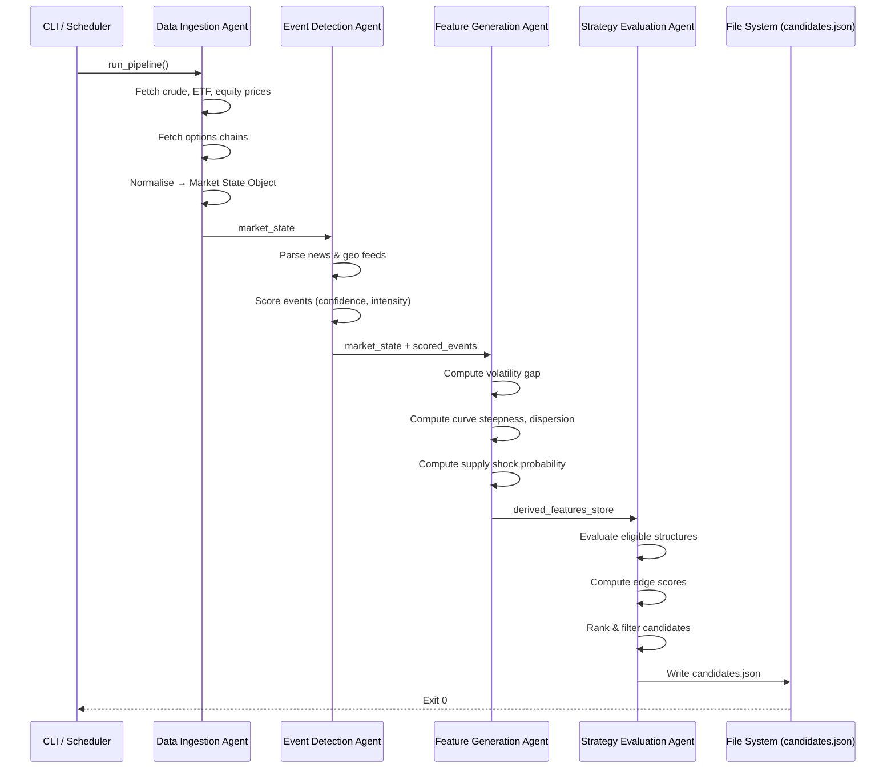

# Energy Options Opportunity Agent — User Guide

> **Version 1.0 • March 2026**
> This guide walks you through configuring, running, and interpreting results from the full Energy Options Opportunity Agent pipeline. It assumes familiarity with Python 3 and the command line.

---

## Table of Contents

1. [Overview](#overview)
2. [Prerequisites](#prerequisites)
3. [Setup & Configuration](#setup--configuration)
4. [Running the Pipeline](#running-the-pipeline)
5. [Interpreting the Output](#interpreting-the-output)
6. [Troubleshooting](#troubleshooting)

---

## Overview

The Energy Options Opportunity Agent is an autonomous, modular pipeline that identifies options trading opportunities driven by oil market instability. It ingests market data, supply signals, news events, and alternative datasets, then produces structured, ranked candidate options strategies.

The pipeline is composed of **four loosely coupled agents** that communicate through a shared market state object and a derived features store:

```mermaid
flowchart LR
    subgraph Ingestion["1 · Data Ingestion Agent"]
        direction TB
        A1[Crude Prices\nAlpha Vantage / MetalpriceAPI]
        A2[ETF & Equity Prices\nyfinance / Yahoo Finance]
        A3[Options Chains\nYahoo Finance / Polygon.io]
        A4[Supply & Inventory\nEIA API]
    end

    subgraph EventDet["2 · Event Detection Agent"]
        direction TB
        B1[News & Geo Events\nGDELT / NewsAPI]
        B2[Shipping & Logistics\nMarineTraffic / VesselFinder]
        B3[Confidence & Intensity\nScoring]
    end

    subgraph FeatGen["3 · Feature Generation Agent"]
        direction TB
        C1[Volatility Gap\nRealised vs Implied]
        C2[Futures Curve\nSteepness]
        C3[Narrative Velocity\n& Sector Dispersion]
        C4[Supply Shock\nProbability]
        C5[Insider Conviction\nScore]
    end

    subgraph StratEval["4 · Strategy Evaluation Agent"]
        direction TB
        D1[Eligible Structure\nSelection]
        D2[Edge Score\nComputation]
        D3[Ranked Candidate\nOutput — JSON]
    end

    RawFeeds[(Raw Feeds)] --> Ingestion
    Ingestion -->|Market State Object| EventDet
    EventDet -->|Scored Events| FeatGen
    FeatGen -->|Derived Features Store| StratEval
    StratEval -->|candidates.json| Dashboard[(Dashboard /\nthinkorswim)]
```



Data flows **unidirectionally**: raw feeds → event scoring → feature derivation → strategy ranking. No agent writes back upstream.

### In-Scope Instruments

| Category | Instruments |
|---|---|
| Crude futures | Brent Crude, WTI (`CL=F`) |
| ETFs | USO, XLE |
| Energy equities | Exxon Mobil (XOM), Chevron (CVX) |

### In-Scope Option Structures (MVP)

| Structure | Description |
|---|---|
| `long_straddle` | Long call + long put at the same strike |
| `call_spread` | Buy lower-strike call, sell higher-strike call |
| `put_spread` | Buy higher-strike put, sell lower-strike put |
| `calendar_spread` | Same strike, different expirations |

> **Advisory only.** Automated trade execution is out of scope for the MVP. All output is informational.

---

## Prerequisites

### System Requirements

| Requirement | Minimum |
|---|---|
| Python | 3.10 or later |
| Operating system | Linux, macOS, or Windows (WSL2 recommended) |
| RAM | 2 GB |
| Disk | 5 GB free (for 6–12 months of historical data) |
| Deployment target | Local machine, single VM, or container |

### Python Dependencies

Install dependencies from the project root:

```bash
pip install -r requirements.txt
```

Core packages used by the pipeline include:

```
yfinance
requests
pandas
numpy
schedule
python-dotenv
```

### External API Access

All data sources used in the MVP are **free or low-cost**. You will need to register and obtain API keys for the services below before running the pipeline.

| Agent | Service | Registration URL | Notes |
|---|---|---|---|
| Data Ingestion | Alpha Vantage | https://www.alphavantage.co/support/#api-key | Free tier; WTI/Brent prices |
| Data Ingestion | Polygon.io | https://polygon.io | Free/limited; options chains |
| Data Ingestion | EIA API | https://www.eia.gov/opendata/ | Free; weekly supply/inventory |
| Event Detection | NewsAPI | https://newsapi.org | Free tier; news headlines |
| Event Detection | GDELT | No key required | Free; geopolitical event stream |
| Event Detection | MarineTraffic | https://www.marinetraffic.com/en/p/api-services | Free tier; tanker flow data |
| Feature Generation | SEC EDGAR | No key required | Free; insider trade filings |
| Feature Generation | Quiver Quant | https://www.quiverquant.com | Free/limited; parsed insider data |

---

## Setup & Configuration

### 1. Clone the Repository

```bash
git clone https://github.com/your-org/energy-options-agent.git
cd energy-options-agent
```

### 2. Create and Activate a Virtual Environment

```bash
python -m venv .venv
source .venv/bin/activate        # Linux / macOS
# .venv\Scripts\activate         # Windows (PowerShell)
```

### 3. Install Dependencies

```bash
pip install -r requirements.txt
```

### 4. Configure Environment Variables

Copy the provided template and populate it with your credentials:

```bash
cp .env.example .env
```

Open `.env` in your editor and fill in all required values. The full set of recognised environment variables is listed below.

#### Environment Variable Reference

| Variable | Required | Default | Description |
|---|---|---|---|
| `ALPHA_VANTAGE_API_KEY` | Yes | — | API key for crude price feeds (WTI, Brent) |
| `POLYGON_API_KEY` | Yes | — | API key for options chain data |
| `EIA_API_KEY` | Yes | — | API key for EIA supply and inventory data |
| `NEWS_API_KEY` | Yes | — | API key for NewsAPI headline feed |
| `MARINETRAFFIC_API_KEY` | No | — | API key for tanker/shipping flow data (Phase 3) |
| `QUIVER_QUANT_API_KEY` | No | — | API key for parsed insider conviction data (Phase 3) |
| `DATA_REFRESH_INTERVAL_MINUTES` | No | `5` | Polling cadence for market price feeds (minutes) |
| `OUTPUT_DIR` | No | `./output` | Directory where `candidates.json` is written |
| `HISTORY_DAYS` | No | `180` | Days of historical data to retain (180–365 recommended) |
| `LOG_LEVEL` | No | `INFO` | Logging verbosity: `DEBUG`, `INFO`, `WARNING`, `ERROR` |
| `EDGE_SCORE_THRESHOLD` | No | `0.30` | Minimum edge score for a candidate to appear in output |
| `MAX_CANDIDATES` | No | `20` | Maximum number of ranked candidates written per run |
| `ENABLE_INSIDER_SIGNALS` | No | `false` | Set `true` to activate insider conviction scoring (Phase 3) |
| `ENABLE_SHIPPING_SIGNALS` | No | `false` | Set `true` to activate tanker disruption index (Phase 3) |
| `ENABLE_NARRATIVE_SIGNALS` | No | `false` | Set `true` to activate Reddit/Stocktwits narrative velocity (Phase 3) |

> **Security note.** Never commit `.env` to version control. The repository's `.gitignore` excludes it by default.

#### Example `.env`

```dotenv
# --- Required ---
ALPHA_VANTAGE_API_KEY=YOUR_AV_KEY_HERE
POLYGON_API_KEY=YOUR_POLYGON_KEY_HERE
EIA_API_KEY=YOUR_EIA_KEY_HERE
NEWS_API_KEY=YOUR_NEWSAPI_KEY_HERE

# --- Optional ---
DATA_REFRESH_INTERVAL_MINUTES=5
OUTPUT_DIR=./output
HISTORY_DAYS=180
LOG_LEVEL=INFO
EDGE_SCORE_THRESHOLD=0.30
MAX_CANDIDATES=20

# Phase 3 alternative signals (leave false until Phase 3 is active)
ENABLE_INSIDER_SIGNALS=false
ENABLE_SHIPPING_SIGNALS=false
ENABLE_NARRATIVE_SIGNALS=false
```

### 5. Initialise the Data Store

On first run, populate the local historical data store (this may take several minutes):

```bash
python -m agent.ingest --init-history
```

This command fetches and persists historical price, volatility, and curve data for the configured `HISTORY_DAYS` window. Subsequent runs consume the live feed only.

---

## Running the Pipeline

### Pipeline Execution Flow



### Single Run (One-Shot)

Execute the complete four-agent pipeline once and write results to `OUTPUT_DIR`:

```bash
python -m agent.pipeline run
```

Expected console output:

```
[INFO] Data Ingestion Agent — fetching prices (WTI, Brent, USO, XLE, XOM, CVX)
[INFO] Data Ingestion Agent — fetching options chains
[INFO] Data Ingestion Agent — market state object ready
[INFO] Event Detection Agent — processing 42 news items
[INFO] Event Detection Agent — 3 supply disruption events scored
[INFO] Feature Generation Agent — volatility gap: positive (USO, XLE)
[INFO] Feature Generation Agent — supply shock probability: 0.61
[INFO] Strategy Evaluation Agent — 7 candidates generated above threshold 0.30
[INFO] Output written to ./output/candidates.json
```

### Continuous Mode (Scheduled Polling)

Run the pipeline on a recurring cadence driven by `DATA_REFRESH_INTERVAL_MINUTES`:

```bash
python -m agent.pipeline run --continuous
```

The scheduler wakes every `DATA_REFRESH_INTERVAL_MINUTES` minutes, re-fetches live market data, and overwrites `candidates.json` with the latest ranked candidates. Press `Ctrl+C` to stop.

> **Note.** Slower feeds (EIA inventory, EDGAR filings) are fetched on their own daily or weekly sub-schedules and do not block the faster market-data cadence.

### Running Individual Agents

Each agent can be executed independently for testing or incremental integration:

```bash
# Data Ingestion only
python -m agent.ingest

# Event Detection only (requires market state from a prior ingestion run)
python -m agent.events

# Feature Generation only
python -m agent.features

# Strategy Evaluation only
python -m agent.strategy
```

### Running with Docker

```bash
# Build the image
docker build -t energy-options-agent:latest .

# Run one-shot
docker run --env-file .env -v $(pwd)/output:/app/output energy-options-agent:latest

# Run continuous mode
docker run --env-file .env -v $(pwd)/output:/app/output energy-options-agent:latest --continuous
```

---

## Interpreting the Output

### Output File

After each run, the pipeline writes (or overwrites) a JSON file at:

```
{OUTPUT_DIR}/candidates.json
```

### Output Schema

Each element of the top-level array represents one ranked strategy candidate.

| Field | Type | Description |
|---|---|---|
| `instrument` | `string` | Target instrument, e.g. `"USO"`, `"XLE"`, `"CL=F"` |
| `structure` | `string` (enum) | `long_straddle` \| `call_spread` \| `put_spread` \| `calendar_spread` |
| `expiration` | `integer` | Target expiration in calendar days from evaluation date |
| `edge_score` | `float [0.0–1.0]` | Composite opportunity score — higher = stronger signal confluence |
| `signals` | `object` | Map of contributing signals and their qualitative levels |
| `generated_at` | `ISO 8601 datetime` | UTC timestamp of candidate generation |

### Example `candidates.json`

```json
[
  {
    "instrument": "USO",
    "structure": "long_straddle",
    "expiration": 30,
    "edge_score": 0.47,
    "signals": {
      "tanker_disruption_index": "high",
      "volatility_gap": "positive",
      "narrative_velocity": "rising"
    },
    "generated_at": "2026-03-15T14:32:00Z"
  },
  {
    "instrument": "XLE",
    "structure": "call_spread",
    "expiration": 45,
    "edge_score": 0.38,
    "signals": {
      "supply_shock_probability": "elevated",
      "volatility_gap": "positive",
      "futures_curve_steepness": "steep"
    },
    "generated_at": "2026-03-15T14:32:00Z"
  }
]
```

### Reading the Edge Score

| Edge Score Range | Interpretation | Suggested Action |
|---|---|---|
| `0.70 – 1.00` | Strong signal confluence | High-priority review |
| `0.50 – 0.69` | Moderate confluence | Review before next refresh |
| `0.30 – 0.49` | Weak but above threshold | Monitor; low conviction |
| `< 0.30` | Below threshold | Filtered from output by default |

> The edge score is a **heuristic composite**. It reflects the weighted combination of signals listed in the `signals` field. Always review contributing signals before acting on any candidate.

### Reading the `signals` Map

The `signals` object tells you *why* a candidate was surfaced. Common signal keys and their possible values:

| Signal Key | Possible Values | Source Agent |
|---|---|---|
| `volatility_gap` | `positive`, `negative`, `neutral` | Feature Generation |
| `futures_curve_steepness` | `steep`, `flat`, `inverted` | Feature Generation |
| `supply_shock_probability` | `low`, `elevated`, `high` | Feature Generation |
| `sector_dispersion` | `low`, `moderate`, `high` | Feature Generation |
| `narrative_velocity` | `falling`, `stable`, `rising` | Feature Generation (Phase 3) |
| `tanker_disruption_index` | `normal`, `elevated`, `high` | Event Detection (Phase 3) |
| `insider_conviction` | `low`, `moderate`, `high` | Feature Generation (Phase 3) |

### Visualising Output

`candidates.json` is compatible with any JSON-capable dashboard. To load it into **thinkorswim**,