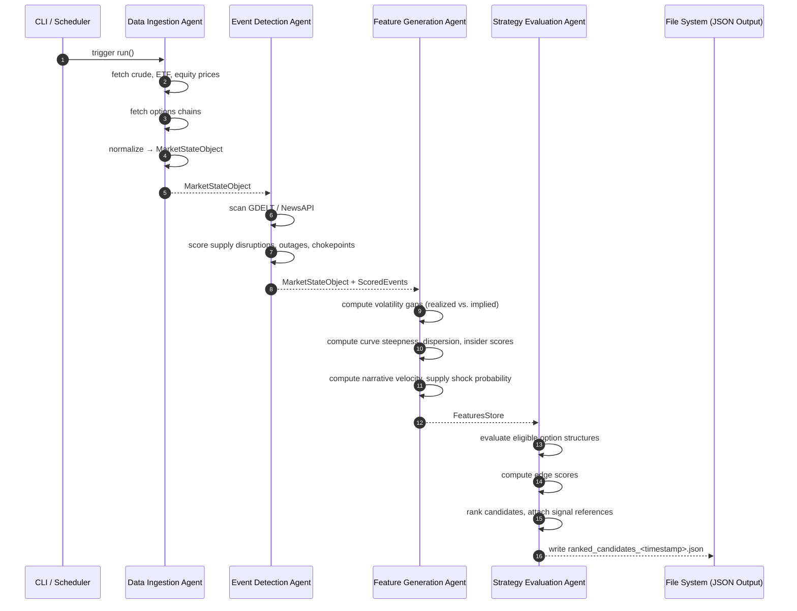

# Energy Options Opportunity Agent — User Guide

> **Version 1.0 · March 2026**
> Advisory system only. No automated trade execution occurs at any point in the pipeline.

---

## Table of Contents

1. [Overview](#overview)
2. [Prerequisites](#prerequisites)
3. [Setup & Configuration](#setup--configuration)
4. [Running the Pipeline](#running-the-pipeline)
5. [Interpreting the Output](#interpreting-the-output)
6. [Troubleshooting](#troubleshooting)

---

## Overview

The **Energy Options Opportunity Agent** is an autonomous, modular Python pipeline that identifies options trading opportunities driven by oil market instability. It ingests market data, supply signals, news events, and alternative datasets, then surfaces volatility mispricing in oil-related instruments and ranks candidate strategies by a computed **edge score**.

### Pipeline Architecture

The system is composed of four loosely coupled agents that pass data through a shared **market state object** and a **derived features store**.

```mermaid
flowchart LR
    subgraph Inputs
        A1([Crude Prices\nAlpha Vantage / MetalpriceAPI])
        A2([ETF & Equity Prices\nyfinance])
        A3([Options Chains\nYahoo / Polygon.io])
        A4([Supply / Inventory\nEIA API])
        A5([News & Geo Events\nGDELT / NewsAPI])
        A6([Insider Activity\nSEC EDGAR / Quiver])
        A7([Shipping\nMarineTraffic])
        A8([Sentiment\nReddit / Stocktwits])
    end

    subgraph Pipeline["Four-Agent Pipeline"]
        direction TB
        B["🟦 Data Ingestion Agent\nFetch & Normalize\n→ Market State Object"]
        C["🟨 Event Detection Agent\nSupply & Geo Signals\n→ Scored Events"]
        D["🟩 Feature Generation Agent\nDerived Signal Computation\n→ Features Store"]
        E["🟥 Strategy Evaluation Agent\nOpportunity Ranking\n→ Ranked Candidates"]
        B --> C --> D --> E
    end

    subgraph Output
        F([JSON Candidates\nedge_score · signals\nexpiration · structure])
    end

    Inputs --> B
    E --> Output
```



### In-Scope Instruments

| Category | Instruments |
|---|---|
| Crude Futures | Brent Crude, WTI (`CL=F`) |
| ETFs | USO, XLE |
| Energy Equities | Exxon Mobil (XOM), Chevron (CVX) |

### In-Scope Option Structures (MVP)

| Structure | Enum Value |
|---|---|
| Long Straddle | `long_straddle` |
| Call Spread | `call_spread` |
| Put Spread | `put_spread` |
| Calendar Spread | `calendar_spread` |

> **Out of scope (MVP):** exotic or multi-legged strategies, regional refined product pricing (OPIS), and automated trade execution.

---

## Prerequisites

### System Requirements

| Requirement | Minimum |
|---|---|
| Python | 3.10+ |
| OS | Linux, macOS, or Windows (WSL recommended) |
| RAM | 2 GB |
| Disk | 5 GB (6–12 months of historical data) |
| Network | Outbound HTTPS to external APIs |

### Python Dependencies

Install all dependencies from the project root:

```bash
pip install -r requirements.txt
```

Key packages the pipeline relies on include:

| Package | Purpose |
|---|---|
| `yfinance` | ETF, equity, and options chain data |
| `requests` | HTTP calls to EIA, Alpha Vantage, GDELT, NewsAPI |
| `pandas` / `numpy` | Data normalization and feature computation |
| `pydantic` | Market state object and output schema validation |
| `schedule` or `apscheduler` | Cadence-based refresh scheduling |

### API Accounts

You must obtain API keys (all free or freemium) before running the pipeline:

| Service | Registration URL | Tier Needed |
|---|---|---|
| Alpha Vantage | https://www.alphavantage.co/support/#api-key | Free |
| MetalpriceAPI | https://metalpriceapi.com | Free |
| Polygon.io | https://polygon.io | Free / Limited |
| EIA API | https://www.eia.gov/opendata/ | Free |
| NewsAPI | https://newsapi.org | Free |
| GDELT | No key required (public dataset) | — |
| SEC EDGAR | No key required (public dataset) | — |
| Quiver Quant | https://www.quiverquant.com | Free / Limited |
| MarineTraffic | https://www.marinetraffic.com/en/ais-api-services | Free tier |

---

## Setup & Configuration

### 1. Clone the Repository

```bash
git clone https://github.com/your-org/energy-options-agent.git
cd energy-options-agent
```

### 2. Create a Virtual Environment

```bash
python -m venv .venv
source .venv/bin/activate        # Linux / macOS
# .venv\Scripts\activate.bat     # Windows CMD
# .venv\Scripts\Activate.ps1     # Windows PowerShell
```

### 3. Install Dependencies

```bash
pip install --upgrade pip
pip install -r requirements.txt
```

### 4. Configure Environment Variables

Copy the example environment file and populate it with your credentials:

```bash
cp .env.example .env
```

Open `.env` in your editor and set each value. The full set of supported environment variables is listed below.

#### Environment Variable Reference

| Variable | Required | Default | Description |
|---|---|---|---|
| `ALPHA_VANTAGE_API_KEY` | Yes | — | API key for Alpha Vantage crude price feed |
| `METALPRICE_API_KEY` | Yes | — | API key for MetalpriceAPI (Brent/WTI spot) |
| `POLYGON_API_KEY` | No | — | API key for Polygon.io options chain data |
| `EIA_API_KEY` | Yes | — | API key for EIA inventory and refinery utilization |
| `NEWS_API_KEY` | Yes | — | API key for NewsAPI geopolitical/energy news |
| `QUIVER_QUANT_API_KEY` | No | — | API key for Quiver Quant insider activity |
| `MARINETRAFFIC_API_KEY` | No | — | API key for MarineTraffic tanker flow data |
| `OUTPUT_DIR` | No | `./output` | Directory where JSON candidate files are written |
| `DATA_STORE_DIR` | No | `./data` | Root directory for raw and derived historical data |
| `RETENTION_DAYS` | No | `365` | Days of historical data to retain (180–365 recommended) |
| `MARKET_DATA_INTERVAL_MIN` | No | `5` | Refresh cadence in minutes for market price feeds |
| `SLOW_FEED_INTERVAL_HOURS` | No | `24` | Refresh cadence in hours for EIA and EDGAR feeds |
| `LOG_LEVEL` | No | `INFO` | Logging verbosity: `DEBUG`, `INFO`, `WARNING`, `ERROR` |
| `PIPELINE_PHASE` | No | `1` | Active MVP phase (`1`–`4`); gates which agents are enabled |
| `MIN_EDGE_SCORE` | No | `0.20` | Minimum edge score threshold for emitting a candidate |
| `MAX_CANDIDATES` | No | `10` | Maximum number of ranked candidates per pipeline run |

> **Tip:** Variables marked **No** under *Required* are optional. The pipeline degrades gracefully when optional data sources are unavailable — it will log a warning and continue rather than halting.

#### Example `.env`

```dotenv
# --- Required API Keys ---
ALPHA_VANTAGE_API_KEY=YOUR_AV_KEY_HERE
METALPRICE_API_KEY=YOUR_MP_KEY_HERE
EIA_API_KEY=YOUR_EIA_KEY_HERE
NEWS_API_KEY=YOUR_NEWS_API_KEY_HERE

# --- Optional API Keys ---
POLYGON_API_KEY=
QUIVER_QUANT_API_KEY=
MARINETRAFFIC_API_KEY=

# --- Pipeline Behaviour ---
PIPELINE_PHASE=1
MIN_EDGE_SCORE=0.20
MAX_CANDIDATES=10
MARKET_DATA_INTERVAL_MIN=5
SLOW_FEED_INTERVAL_HOURS=24

# --- Storage ---
OUTPUT_DIR=./output
DATA_STORE_DIR=./data
RETENTION_DAYS=365

# --- Observability ---
LOG_LEVEL=INFO
```

### 5. Initialise the Data Store

Run the one-time initialisation script to create the required directory structure and seed the historical data store:

```bash
python -m agent.cli init
```

Expected output:

```
[INFO] Creating data store at ./data ...
[INFO] Creating output directory at ./output ...
[INFO] Initialisation complete. Run `python -m agent.cli run` to start the pipeline.
```

---

## Running the Pipeline

### Pipeline Data Flow (Sequence)



### Single Run (One-Shot)

Execute the full pipeline once and write output to `OUTPUT_DIR`:

```bash
python -m agent.cli run
```

To override the active phase without editing `.env`:

```bash
python -m agent.cli run --phase 2
```

To lower the minimum edge score for a broader candidate set:

```bash
python -m agent.cli run --min-edge-score 0.10
```

### Continuous Mode (Scheduled)

Run the pipeline on a recurring cadence driven by `MARKET_DATA_INTERVAL_MIN`:

```bash
python -m agent.cli run --continuous
```

The scheduler will:
- Refresh market price feeds every `MARKET_DATA_INTERVAL_MIN` minutes.
- Refresh slow feeds (EIA, EDGAR) every `SLOW_FEED_INTERVAL_HOURS` hours.
- Append a new output file per cycle to `OUTPUT_DIR`.

Stop the process with `Ctrl+C`.

### Running Individual Agents

Each agent can be run in isolation for development or debugging:

```bash
# Data Ingestion only
python -m agent.cli run --agent ingestion

# Event Detection only (requires a prior ingestion snapshot)
python -m agent.cli run --agent event-detection

# Feature Generation only
python -m agent.cli run --agent feature-generation

# Strategy Evaluation only
python -m agent.cli run --agent strategy-evaluation
```

### Running in Docker

A minimal container target is provided for cloud or server deployment:

```bash
# Build the image
docker build -t energy-options-agent:latest .

# Run with your local .env file
docker run --env-file .env \
  -v $(pwd)/data:/app/data \
  -v $(pwd)/output:/app/output \
  energy-options-agent:latest
```

---

## Interpreting the Output

### Output File Location

Each pipeline run writes a timestamped JSON file to `OUTPUT_DIR`:

```
output/
└── ranked_candidates_2026-03-15T14:05:00Z.json
```

### Output Schema

Each file contains an array of candidate objects. The fields are:

| Field | Type | Description |
|---|---|---|
| `instrument` | `string` | Target instrument, e.g. `"USO"`, `"XLE"`, `"CL=F"` |
| `structure` | `enum` | One of: `long_straddle`, `call_spread`, `put_spread`, `calendar_spread` |
| `expiration` | `integer` | Target expiration in calendar days from the evaluation date |
| `edge_score` | `float [0.0–1.0]` | Composite opportunity score; higher = stronger signal confluence |
| `signals` | `object` | Map of contributing signals and their qualitative levels |
| `generated_at` | `ISO 8601 datetime` | UTC timestamp of candidate generation |

### Example Output

```json
[
  {
    "instrument": "USO",
    "structure": "long_straddle",
    "expiration": 30,
    "edge_score": 0.47,
    "signals": {
      "tanker_disruption_index": "high",
      "volatility_gap": "positive",
      "narrative_velocity": "rising"
    },
    "generated_at": "2026-03-15T14:05:00Z"
  },
  {
    "instrument": "XLE",
    "structure": "call_spread",
    "expiration": 45,
    "edge_score": 0.31,
    "signals": {
      "supply_shock_probability": "elevated",
      "volatility_gap": "positive",
      "sector_dispersion": "widening"
    },
    "generated_at": "2026-03-15T14:05:00Z"
  }
]
```

### Reading the Edge Score

| Edge Score Range | Interpretation |
|---|---|
| `0.70 – 1.00` | Strong signal confluence — multiple independent signals align |
| `0.40 – 0.69` | Moderate confluence — worthy of further review |
| `0.20 – 0.39` | Weak signal — monitor rather than act |
| `< 0.20` | Below threshold — suppressed by default (`MIN_EDGE_SCORE`) |

> **Important:** The edge score is an advisory signal, not a trade recommendation. The system does not execute trades and does not account for individual risk tolerance, position sizing, or transaction costs.

### Signal Reference

The `signals` map reports the state of each contributing derived feature at the time of evaluation:

| Signal Key | What It Measures |
|---|---|
| `volatility_gap` | Realized vs. implied volatility divergence |
| `futures_curve_steepness` | Contango or backwardation steepness |
| `sector_dispersion` | Cross-instrument spread within the energy sector |
| `insider_conviction_score` | Aggregated executive trade activity (EDGAR/Quiver) |
| `narrative_velocity` | Headline acceleration from GDELT / NewsAPI / Reddit |
| `supply_shock_probability` | Probability of near-term supply disruption |
| `tanker_disruption_index` | Shipping flow anomaly from MarineTraffic |

### Using the Output with thinkorswim

The JSON output is compatible with any thinkorswim thinkScript study or third-party dashboard that can consume a JSON file. Load `ranked_candidates_<timestamp>.json` from your `OUTPUT_DIR` into your visualization layer. Candidates are pre-sorted by `edge_score` descending.

---

## Troubleshooting

### Common Issues

| Symptom | Likely Cause | Resolution |
|---|---|---|
| `KeyError: ALPHA_VANTAGE_API_KEY` | Environment variable not set | Verify `.env` is populated and loaded; re-run `source .venv/bin/activate` |
| `WARNING: options chain unavailable for XOM` | Polygon.io