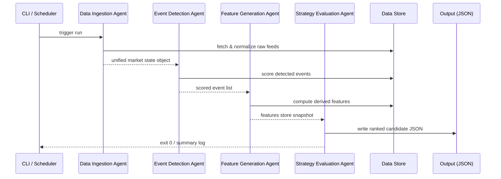

# Energy Options Opportunity Agent — User Guide

> **Version 1.0 • March 2026**
> This guide walks you through installing, configuring, and running the full pipeline end-to-end, then interpreting the ranked output it produces.

---

## Table of Contents

1. [Overview](#overview)
2. [Prerequisites](#prerequisites)
3. [Setup & Configuration](#setup--configuration)
4. [Running the Pipeline](#running-the-pipeline)
5. [Interpreting the Output](#interpreting-the-output)
6. [Troubleshooting](#troubleshooting)

---

## Overview

The **Energy Options Opportunity Agent** is an autonomous, modular Python pipeline that identifies options trading opportunities driven by oil market instability. It ingests market data, supply signals, news events, and alternative datasets, then produces structured, ranked candidate options strategies.

### What the pipeline does

```mermaid
flowchart LR
    subgraph Inputs
        A1[Crude Prices\nAlpha Vantage / MetalpriceAPI]
        A2[ETF & Equity Prices\nyfinance / Yahoo Finance]
        A3[Options Chains\nYahoo Finance / Polygon.io]
        A4[Supply & Inventory\nEIA API]
        A5[News & Geo Events\nGDELT / NewsAPI]
        A6[Insider Activity\nSEC EDGAR / Quiver Quant]
        A7[Shipping & Logistics\nMarineTraffic / VesselFinder]
        A8[Narrative & Sentiment\nReddit / Stocktwits]
    end

    subgraph Pipeline["Four-Agent Pipeline"]
        direction TB
        B1["① Data Ingestion Agent\nFetch & Normalize"]
        B2["② Event Detection Agent\nSupply & Geo Signals"]
        B3["③ Feature Generation Agent\nDerived Signal Computation"]
        B4["④ Strategy Evaluation Agent\nOpportunity Ranking"]
    end

    subgraph Output
        C1[Ranked Candidates\nJSON / Dashboard]
    end

    Inputs --> B1
    B1 -->|Unified market state object| B2
    B2 -->|Scored events| B3
    B3 -->|Derived features store| B4
    B4 --> C1
```



### Agent responsibilities at a glance

| Agent | Role | Key outputs |
|---|---|---|
| **Data Ingestion** | Fetch & normalize all raw feeds | Unified market state object, historical store |
| **Event Detection** | Monitor news and geo feeds | Detected events with confidence & intensity scores |
| **Feature Generation** | Compute derived signals | Volatility gaps, curve steepness, supply shock probability, etc. |
| **Strategy Evaluation** | Rank opportunities | Scored candidate list with explainability references |

### In-scope instruments (MVP)

| Category | Instruments |
|---|---|
| Crude futures | Brent Crude, WTI (`CL=F`) |
| ETFs | USO, XLE |
| Energy equities | Exxon Mobil (XOM), Chevron (CVX) |

### In-scope option structures (MVP)

`long_straddle` · `call_spread` · `put_spread` · `calendar_spread`

> **Advisory only.** Automated trade execution is explicitly out of scope. All output is informational and requires human review before acting.

---

## Prerequisites

### System requirements

| Requirement | Minimum |
|---|---|
| Python | 3.10 or later |
| Operating system | Linux, macOS, or Windows (WSL recommended) |
| RAM | 2 GB |
| Disk | 5 GB free (for 6–12 months of historical data) |
| Deployment target | Local machine, single VM, or Docker container |

### Required tools

```bash
# Verify Python version
python --version          # must be >= 3.10

# Verify pip
pip --version

# Verify git
git --version
```

### External API accounts

All data sources are free or offer a free tier. Register for credentials before proceeding.

| Source | Registration URL | Free tier notes |
|---|---|---|
| Alpha Vantage | https://www.alphavantage.co/support/#api-key | 25 req/day free |
| MetalpriceAPI | https://metalpriceapi.com | Free plan available |
| Polygon.io | https://polygon.io | Free tier; options data limited |
| EIA API | https://www.eia.gov/opendata/ | Fully free |
| NewsAPI | https://newsapi.org | Free developer plan |
| GDELT | https://www.gdeltproject.org | No key required |
| SEC EDGAR | https://efts.sec.gov/LATEST/search-index | No key required |
| Quiver Quant | https://www.quiverquant.com/home/api | Free tier available |
| MarineTraffic | https://www.marinetraffic.com/en/p/api-services | Free tier available |
| VesselFinder | https://www.vesselfinder.com | Free tier available |
| Reddit (PRAW) | https://www.reddit.com/prefs/apps | Free OAuth app |
| Stocktwits | https://api.stocktwits.com/developers | Free public API |

> `yfinance` and GDELT do not require API keys.

---

## Setup & Configuration

### 1 — Clone the repository

```bash
git clone https://github.com/your-org/energy-options-agent.git
cd energy-options-agent
```

### 2 — Create and activate a virtual environment

```bash
python -m venv .venv

# Linux / macOS
source .venv/bin/activate

# Windows (PowerShell)
.venv\Scripts\Activate.ps1
```

### 3 — Install dependencies

```bash
pip install --upgrade pip
pip install -r requirements.txt
```

### 4 — Configure environment variables

Copy the provided template and populate each value:

```bash
cp .env.example .env
```

Open `.env` in your editor and fill in the values described in the table below.

#### Environment variable reference

| Variable | Required | Default | Description |
|---|---|---|---|
| `ALPHA_VANTAGE_API_KEY` | Yes | — | API key for crude price feeds (WTI, Brent spot/futures) |
| `METALPRICE_API_KEY` | Yes | — | Fallback crude price source |
| `POLYGON_API_KEY` | Recommended | — | Options chain data (strike, expiry, IV, volume) |
| `EIA_API_KEY` | Yes | — | EIA weekly inventory and refinery utilization data |
| `NEWS_API_KEY` | Yes | — | NewsAPI key for energy-related headline ingestion |
| `QUIVER_QUANT_API_KEY` | Optional | — | Insider trade activity (supplements SEC EDGAR) |
| `MARINE_TRAFFIC_API_KEY` | Optional | — | Tanker flow data; free tier is limited |
| `REDDIT_CLIENT_ID` | Optional | — | Reddit PRAW OAuth client ID |
| `REDDIT_CLIENT_SECRET` | Optional | — | Reddit PRAW OAuth client secret |
| `REDDIT_USER_AGENT` | Optional | `energy-agent/1.0` | PRAW user-agent string |
| `DATA_DIR` | No | `./data` | Root directory for persisted raw and derived data |
| `OUTPUT_DIR` | No | `./output` | Directory where JSON candidate files are written |
| `LOG_LEVEL` | No | `INFO` | Python logging level (`DEBUG`, `INFO`, `WARNING`, `ERROR`) |
| `PIPELINE_CADENCE_MINUTES` | No | `5` | How often the market-data refresh cycle runs |
| `HISTORY_RETENTION_DAYS` | No | `365` | Days of historical data to retain (recommended 180–365) |
| `EDGE_SCORE_THRESHOLD` | No | `0.30` | Minimum edge score for a candidate to appear in output |

**Example `.env` snippet:**

```dotenv
ALPHA_VANTAGE_API_KEY=YOUR_KEY_HERE
EIA_API_KEY=YOUR_KEY_HERE
NEWS_API_KEY=YOUR_KEY_HERE
POLYGON_API_KEY=YOUR_KEY_HERE

DATA_DIR=./data
OUTPUT_DIR=./output
LOG_LEVEL=INFO
PIPELINE_CADENCE_MINUTES=5
HISTORY_RETENTION_DAYS=365
EDGE_SCORE_THRESHOLD=0.30
```

> Variables marked **Optional** map to Phase 3 alternative signals. The pipeline tolerates missing values for these and continues without that signal layer rather than failing.

### 5 — Initialise the data store

Run the one-time initialisation command to create directory structure and seed the historical data store:

```bash
python -m agent init
```

Expected output:

```
[INFO] Data directory created: ./data
[INFO] Output directory created: ./output
[INFO] Historical store initialised (0 records).
[INFO] Initialisation complete.
```

---

## Running the Pipeline

### Pipeline execution flow



### Single run (on-demand)

Execute one complete pipeline cycle — all four agents in sequence:

```bash
python -m agent run
```

### Single run with verbose logging

```bash
python -m agent run --log-level DEBUG
```

### Continuous mode (scheduled refresh)

Run the pipeline on a repeating cadence defined by `PIPELINE_CADENCE_MINUTES`:

```bash
python -m agent run --continuous
```

Press `Ctrl+C` to stop gracefully.

### Running individual agents

Each agent can be executed independently for development or debugging:

```bash
# Data Ingestion only
python -m agent run --agent ingestion

# Event Detection only
python -m agent run --agent events

# Feature Generation only
python -m agent run --agent features

# Strategy Evaluation only
python -m agent run --agent strategy
```

> **Dependency note:** downstream agents depend on state written by their upstream counterparts. Running `strategy` in isolation requires a valid features store snapshot already present in `DATA_DIR`.

### Running in Docker

```bash
# Build the image
docker build -t energy-options-agent:latest .

# Run a single pipeline cycle
docker run --env-file .env energy-options-agent:latest

# Run in continuous mode
docker run --env-file .env energy-options-agent:latest python -m agent run --continuous
```

### CLI reference

| Command | Description |
|---|---|
| `python -m agent init` | Initialise directories and data store |
| `python -m agent run` | Execute one full pipeline cycle |
| `python -m agent run --continuous` | Run on repeating cadence |
| `python -m agent run --agent <name>` | Run a single named agent |
| `python -m agent run --log-level DEBUG` | Override log level for this run |
| `python -m agent status` | Show last-run summary and data freshness |
| `python -m agent purge --older-than 365` | Remove historical records beyond N days |

---

## Interpreting the Output

### Output location

After each pipeline run, ranked candidates are written to:

```
./output/candidates_<ISO8601_timestamp>.json
```

A symlink `./output/latest.json` always points to the most recent file.

### Output schema

Each element in the output array represents one candidate strategy opportunity.

| Field | Type | Description |
|---|---|---|
| `instrument` | `string` | Target instrument, e.g. `USO`, `XLE`, `CL=F` |
| `structure` | `enum` | One of: `long_straddle`, `call_spread`, `put_spread`, `calendar_spread` |
| `expiration` | `integer` | Target expiration in calendar days from the evaluation date |
| `edge_score` | `float [0.0–1.0]` | Composite opportunity score — higher means stronger signal confluence |
| `signals` | `object` | Map of contributing signals and their current state |
| `generated_at` | `ISO 8601 datetime` | UTC timestamp of candidate generation |

### Example output record

```json
{
  "instrument": "USO",
  "structure": "long_straddle",
  "expiration": 30,
  "edge_score": 0.47,
  "signals": {
    "tanker_disruption_index": "high",
    "volatility_gap": "positive",
    "narrative_velocity": "rising"
  },
  "generated_at": "2026-03-15T14:32:00Z"
}
```

### Reading the edge score

| Edge score range | Interpretation | Suggested action |
|---|---|---|
| `0.70 – 1.00` | Strong signal confluence | High-priority review |
| `0.50 – 0.69` | Moderate confluence | Review alongside broader context |
| `0.30 – 0.49` | Weak but present signal | Monitor; low conviction |
| `< 0.30` | Below threshold | Filtered from output by default |

> The default threshold (`EDGE_SCORE_THRESHOLD=0.30`) can be lowered to surface weaker signals during development, or raised to reduce noise in production.

### Signal map keys

| Signal key | What it measures |
|---|---|
| `volatility_gap` | Spread between realized and implied volatility |
| `futures_curve_steepness` | Contango / backwardation of the crude futures curve |
| `sector_dispersion` | Divergence between energy equity returns |
| `insider_conviction_score` | Clustering of executive buy/sell activity from EDGAR |
| `narrative_velocity` | Acceleration of energy-related headline volume |
| `supply_shock_probability` | Composite probability of near-term supply disruption |
| `tanker_disruption_index` | Derived from shipping flow anomalies |

Signal values are qualitative labels (`"low"`, `"moderate"`, `"high"`, `"positive"`, `"negative"`, `"rising"`, `"falling"`) rather than raw numbers, preserving human readability. Raw underlying values are stored in the features store at `DATA_DIR/features/`.

### Loading output in Python

```python
import json
from pathlib import Path

candidates = json.loads(Path("output/latest.json").read_text())

# Print all candidates above a custom threshold
for c in candidates:
    if c["edge_score"] >= 0.50:
        print(f"{c['instrument']:6s}  {c['structure']:20s}  score={c['edge_score']:.2f}  exp={c['expiration']}d")
```

### Visualising in thinkorswim

The output JSON is compatible with thinkorswim's **watchlist import** and **custom script** features. Import `output/latest.json` via the platform's data-import workflow, or reference the file path from a thinkScript external data call.

---

## Troubleshooting

### General diagnostic steps

```bash
# Check last-run status and data freshness
python -m agent status

# Re-run with full debug output
python -m agent run --log-level DEBUG 2>&1 | tee debug.log
```

---

### Common issues

#### Pipeline exits immediately with `KeyError: 'ALPHA_VANTAGE_API_KEY'`

**Cause:** Required environment variable is not set.

```bash
# Verify .env is present and populated
cat .env | grep ALPHA_VANTAGE_API_KEY

# Ensure your shell has loaded it
source .env  # or use `python-dotenv` automatically via the runner
```

**Fix:** Add the missing key to `.env` and re-run.

---

#### `[WARNING] Skipping insider_conviction_score — QUIVER_QUANT_API_KEY not set`

**Cause:** An optional Phase 3 API key is absent.

**Behaviour:** This is expected