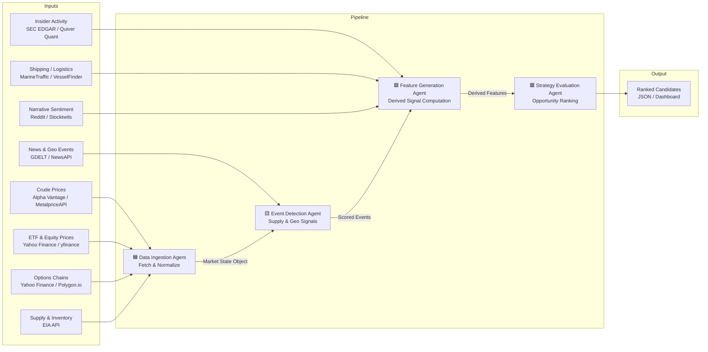

# Energy Options Opportunity Agent — User Guide

> **Version 1.0 · March 2026**
> Advisory only. The system produces ranked candidate strategies; no trades are executed automatically.

---

## Table of Contents

1. [Overview](#overview)
2. [Prerequisites](#prerequisites)
3. [Setup & Configuration](#setup--configuration)
4. [Running the Pipeline](#running-the-pipeline)
5. [Interpreting the Output](#interpreting-the-output)
6. [Troubleshooting](#troubleshooting)

---

## Overview

The **Energy Options Opportunity Agent** is a modular, autonomous Python pipeline that identifies options trading opportunities driven by oil market instability. It ingests market data, supply signals, news events, and alternative datasets, then surfaces volatility mispricing in oil-related instruments and produces a ranked list of candidate option strategies.

The pipeline is composed of **four loosely coupled agents** that communicate via a shared market state object and a derived features store:



### In-scope instruments

| Category | Instruments |
|---|---|
| Crude Futures | Brent Crude, WTI (`CL=F`) |
| ETFs | USO, XLE |
| Energy Equities | Exxon Mobil (XOM), Chevron (CVX) |

### In-scope option structures (MVP)

| Structure | Enum Value |
|---|---|
| Long straddle | `long_straddle` |
| Call spread | `call_spread` |
| Put spread | `put_spread` |
| Calendar spread | `calendar_spread` |

> **Out of scope (MVP):** exotic/multi-legged strategies, OPIS regional pricing, automated trade execution.

---

## Prerequisites

Ensure the following are available before installing the agent.

### System requirements

| Requirement | Minimum |
|---|---|
| Python | 3.10+ |
| RAM | 2 GB |
| Disk | 10 GB (for 6–12 months of historical data) |
| OS | Linux, macOS, or Windows (WSL recommended) |
| Deployment target | Local machine, single VM, or container |

### Python dependencies

Install dependencies from the project root:

```bash
pip install -r requirements.txt
```

Key packages included in `requirements.txt`:

```text
yfinance
requests
pandas
numpy
python-dotenv
schedule
```

### API access

Obtain free-tier credentials for the following services before running the pipeline. All sources listed below are free or low-cost.

| Service | Used by | Sign-up URL |
|---|---|---|
| Alpha Vantage or MetalpriceAPI | Crude prices | https://www.alphavantage.co / https://metalpriceapi.com |
| Polygon.io (optional) | Options chains | https://polygon.io |
| EIA Open Data | Supply & inventory | https://www.eia.gov/opendata/ |
| NewsAPI | News & geopolitical events | https://newsapi.org |
| GDELT (no key needed) | News & geopolitical events | https://www.gdeltproject.org |
| SEC EDGAR (no key needed) | Insider activity | https://www.sec.gov/cgi-bin/browse-edgar |
| Quiver Quant (optional) | Insider activity | https://www.quiverquant.com |
| MarineTraffic / VesselFinder (free tier) | Shipping/logistics | https://www.marinetraffic.com |
| Reddit API | Narrative sentiment | https://www.reddit.com/prefs/apps |

---

## Setup & Configuration

### 1. Clone the repository

```bash
git clone https://github.com/your-org/energy-options-agent.git
cd energy-options-agent
```

### 2. Create a virtual environment

```bash
python -m venv .venv
source .venv/bin/activate        # macOS / Linux
.venv\Scripts\activate           # Windows
```

### 3. Install dependencies

```bash
pip install -r requirements.txt
```

### 4. Configure environment variables

Copy the provided template and populate your credentials:

```bash
cp .env.example .env
```

Open `.env` in your editor and fill in each value. The table below documents every variable the pipeline reads.

| Variable | Required | Default | Description |
|---|---|---|---|
| `ALPHA_VANTAGE_API_KEY` | Conditional¹ | — | API key for Alpha Vantage crude price feed |
| `METALPRICE_API_KEY` | Conditional¹ | — | API key for MetalpriceAPI crude price feed |
| `POLYGON_API_KEY` | Optional | — | API key for Polygon.io options chain data |
| `EIA_API_KEY` | Yes | — | API key for EIA supply/inventory data |
| `NEWS_API_KEY` | Yes | — | API key for NewsAPI news & geopolitical events |
| `QUIVER_QUANT_API_KEY` | Optional | — | API key for Quiver Quant insider activity data |
| `MARINE_TRAFFIC_API_KEY` | Optional | — | API key for MarineTraffic shipping data |
| `REDDIT_CLIENT_ID` | Optional | — | Reddit OAuth app client ID |
| `REDDIT_CLIENT_SECRET` | Optional | — | Reddit OAuth app client secret |
| `REDDIT_USER_AGENT` | Optional | `energy-agent/1.0` | Reddit API user agent string |
| `DATA_DIR` | No | `./data` | Local directory for raw and derived data storage |
| `OUTPUT_DIR` | No | `./output` | Directory where JSON output files are written |
| `LOG_LEVEL` | No | `INFO` | Logging verbosity: `DEBUG`, `INFO`, `WARNING`, `ERROR` |
| `MARKET_DATA_INTERVAL_MINUTES` | No | `5` | Polling cadence for minute-level market data feeds |
| `EIA_REFRESH_SCHEDULE` | No | `weekly` | Refresh schedule for EIA inventory data (`daily` or `weekly`) |
| `EDGAR_REFRESH_SCHEDULE` | No | `daily` | Refresh schedule for SEC EDGAR insider filings |
| `HISTORY_RETENTION_DAYS` | No | `365` | Days of historical data to retain (180–365 recommended) |
| `EDGE_SCORE_THRESHOLD` | No | `0.30` | Minimum edge score `[0.0–1.0]` for a candidate to appear in output |

> ¹ At least one of `ALPHA_VANTAGE_API_KEY` or `METALPRICE_API_KEY` must be set for the crude price feed.

**Example `.env`:**

```dotenv
ALPHA_VANTAGE_API_KEY=YOUR_ALPHA_VANTAGE_KEY
EIA_API_KEY=YOUR_EIA_KEY
NEWS_API_KEY=YOUR_NEWS_API_KEY
DATA_DIR=./data
OUTPUT_DIR=./output
LOG_LEVEL=INFO
MARKET_DATA_INTERVAL_MINUTES=5
HISTORY_RETENTION_DAYS=365
EDGE_SCORE_THRESHOLD=0.30
```

### 5. Initialise the data directory

Create the storage directories and seed the historical data tables before the first run:

```bash
python -m agent init
```

Expected output:

```
[INFO] Data directory initialised at ./data
[INFO] Historical data tables created.
[INFO] Ready to run pipeline.
```

---

## Running the Pipeline

The pipeline exposes a single entry-point module (`agent`) with subcommands for common operations.

### Run all four agents once (one-shot mode)

```bash
python -m agent run
```

This executes the agents in sequence — ingestion → event detection → feature generation → strategy evaluation — and writes ranked candidates to `OUTPUT_DIR`.

### Run continuously on a schedule

```bash
python -m agent run --loop
```

The scheduler respects the cadence values in your `.env`:

| Feed | Default cadence |
|---|---|
| Market data (prices, options) | Every `MARKET_DATA_INTERVAL_MINUTES` minutes |
| EIA supply/inventory | `EIA_REFRESH_SCHEDULE` (weekly) |
| SEC EDGAR insider filings | `EDGAR_REFRESH_SCHEDULE` (daily) |
| News / GDELT / sentiment | Continuous (polled each loop iteration) |

### Run a single agent in isolation

Each agent can be invoked independently for debugging or incremental development:

```bash
python -m agent run --agent ingestion
python -m agent run --agent event_detection
python -m agent run --agent feature_generation
python -m agent run --agent strategy_evaluation
```

### Run inside Docker

A `Dockerfile` is included for containerised deployment on a single VM:

```bash
docker build -t energy-options-agent .
docker run --env-file .env -v $(pwd)/data:/app/data -v $(pwd)/output:/app/output energy-options-agent
```

### Command reference

| Command | Description |
|---|---|
| `python -m agent init` | Initialise data directories and tables |
| `python -m agent run` | Execute full pipeline once |
| `python -m agent run --loop` | Execute full pipeline on a continuous schedule |
| `python -m agent run --agent <name>` | Execute a single named agent |
| `python -m agent status` | Print last-run timestamps and data freshness |
| `python -m agent validate` | Check API connectivity and `.env` completeness |

### Validate your configuration before the first run

```bash
python -m agent validate
```

```
[INFO] ALPHA_VANTAGE_API_KEY ... OK
[INFO] EIA_API_KEY           ... OK
[INFO] NEWS_API_KEY          ... OK
[INFO] POLYGON_API_KEY       ... NOT SET (options chain will fall back to yfinance)
[INFO] All required keys present. Pipeline ready.
```

---

## Interpreting the Output

### Output location

After each pipeline run, results are written to `OUTPUT_DIR` (default `./output`) as timestamped JSON files:

```
output/
  candidates_2026-03-15T14:32:00Z.json
  candidates_2026-03-15T14:37:00Z.json
  ...
```

### Output schema

Each file contains an array of candidate objects. Every field is described below.

| Field | Type | Description |
|---|---|---|
| `instrument` | `string` | Target instrument, e.g. `USO`, `XLE`, `CL=F` |
| `structure` | `enum` | Options structure: `long_straddle` \| `call_spread` \| `put_spread` \| `calendar_spread` |
| `expiration` | `integer` (days) | Target expiration in calendar days from the evaluation date |
| `edge_score` | `float [0.0–1.0]` | Composite opportunity score; higher = stronger signal confluence |
| `signals` | `object` | Map of contributing signals and their current assessment |
| `generated_at` | ISO 8601 datetime | UTC timestamp of candidate generation |

### Example candidate

```json
{
  "instrument": "USO",
  "structure": "long_straddle",
  "expiration": 30,
  "edge_score": 0.47,
  "signals": {
    "tanker_disruption_index": "high",
    "volatility_gap": "positive",
    "narrative_velocity": "rising"
  },
  "generated_at": "2026-03-15T14:32:00Z"
}
```

### Signal reference

The `signals` object may contain any combination of the following keys, depending on which pipeline phase is active.

| Signal key | Possible values | Source agent |
|---|---|---|
| `volatility_gap` | `positive`, `negative`, `neutral` | Feature Generation |
| `futures_curve_steepness` | `contango`, `backwardation`, `flat` | Feature Generation |
| `sector_dispersion` | `high`, `medium`, `low` | Feature Generation |
| `insider_conviction_score` | `high`, `medium`, `low` | Feature Generation |
| `narrative_velocity` | `rising`, `stable`, `falling` | Feature Generation |
| `supply_shock_probability` | `high`, `medium`, `low` | Feature Generation |
| `tanker_disruption_index` | `high`, `medium`, `low` | Event Detection |
| `refinery_outage_detected` | `true`, `false` | Event Detection |
| `geopolitical_event_confidence` | `high`, `medium`, `low` | Event Detection |
| `eia_inventory_change` | `draw`, `build`, `flat` | Data Ingestion |

### Reading the edge score

The `edge_score` is a composite float in `[0.0, 1.0]`. A higher score indicates stronger confluence of independent signals. Candidates below `EDGE_SCORE_THRESHOLD` (default `0.30`) are filtered from the output.

| Edge Score Range | Interpretation |
|---|---|
| `0.70 – 1.00` | Strong confluence — multiple independent signals aligned |
| `0.50 – 0.69` | Moderate confluence — worth further manual review |
| `0.30 – 0.49` | Weak confluence — low conviction; use as background context |
| `< 0.30` | Below threshold — suppressed from output by default |

### Consuming output in thinkorswim or a dashboard

The JSON output is compatible with any JSON-capable dashboard or import tool. To load into thinkorswim's custom watchlist or scanner, convert the JSON to CSV using the included utility:

```bash
python -m agent export --format csv --input output/candidates_2026-03-15T14:32:00Z.json
```

This produces `candidates_2026-03-15T14:32:00Z.csv` in the same directory, with one row per candidate.

---

## Troubleshooting

### General diagnostic steps

Run the built-in validator first whenever the pipeline behaves unexpectedly:

```bash
python -m agent validate
python -m agent status
```

`status` prints the last successful run time for each agent and flags any data feeds that have not refreshed within their expected window.

---

### Common issues

#### Pipeline fails immediately on startup

| Symptom | Likely cause | Fix |
|---|---|---|
| `KeyError: 'EIA_API_KEY'` | Missing required env variable | Add the key to `.env` and re-run |
| `ModuleNotFoundError` | Dependencies not installed | Run `pip install -r requirements.txt` |
| `FileNotFoundError: ./data` | Data directory not initialised | Run `python -m agent init` |

---

#### No candidates appear in output

| Symptom | Likely cause | Fix |
|---|---|---|
| Output file is empty `[]` | All scores below threshold | Lower `EDGE_SCORE_THRESHOLD` in `.env` temporarily to inspect raw scores |
| Output file is empty `[]` | Insufficient historical data | Wait for at least one full day of data ingestion before strategy evaluation produces results |
| File not written at