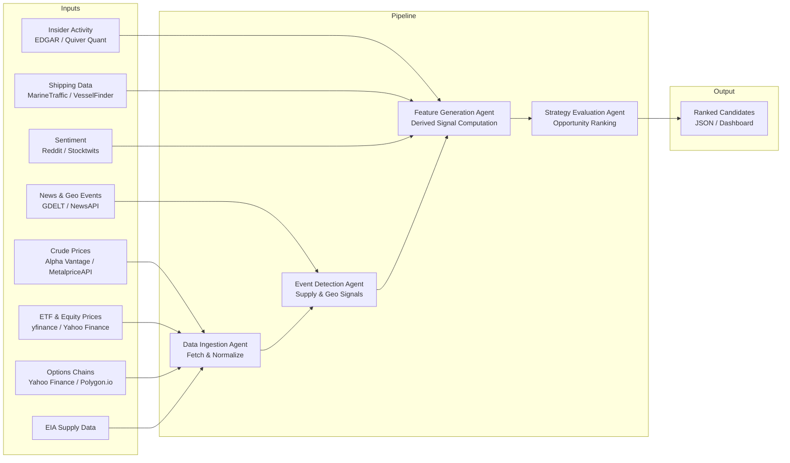
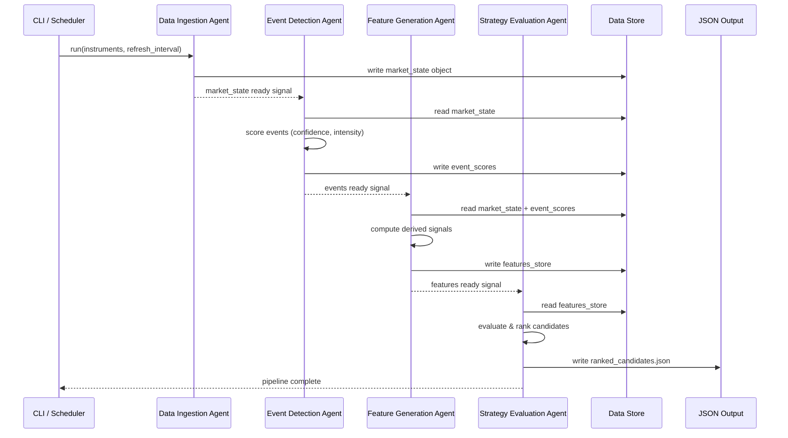

# Energy Options Opportunity Agent — User Guide

> **Version 1.0 · March 2026**
> This guide walks you through installing, configuring, and running the full four-agent pipeline from a clean environment to a ranked list of options trading opportunities.

---

## Table of Contents

1. [Overview](#overview)
2. [Prerequisites](#prerequisites)
3. [Setup & Configuration](#setup--configuration)
4. [Running the Pipeline](#running-the-pipeline)
5. [Interpreting the Output](#interpreting-the-output)
6. [Troubleshooting](#troubleshooting)

---

## Overview

The **Energy Options Opportunity Agent** is a modular Python pipeline that detects volatility mispricing in oil-related instruments and ranks candidate options strategies by a computed **edge score**. It is advisory only — no trades are placed automatically.

### Pipeline Architecture

The system is composed of four loosely coupled agents that pass data through a shared **market state object** and a **derived features store**. Data flows in one direction only.



### In-Scope Instruments

| Category | Instruments |
|---|---|
| Crude Futures | Brent Crude, WTI (`CL=F`) |
| ETFs | USO, XLE |
| Energy Equities | Exxon Mobil (XOM), Chevron (CVX) |

### In-Scope Option Structures (MVP)

| Structure | Enum Value |
|---|---|
| Long Straddle | `long_straddle` |
| Call Spread | `call_spread` |
| Put Spread | `put_spread` |
| Calendar Spread | `calendar_spread` |

> **Out of scope for MVP:** exotic/multi-legged strategies, regional refined product pricing (OPIS), and automated trade execution.

---

## Prerequisites

### System Requirements

| Requirement | Minimum |
|---|---|
| Python | 3.10 or later |
| OS | Linux, macOS, or Windows (WSL2 recommended) |
| RAM | 2 GB |
| Disk | 5 GB free (for 6–12 months of historical data) |
| Network | Outbound HTTPS access to all data source APIs |

### Required Accounts & API Keys

Register for free-tier accounts at each provider before proceeding. All sources listed below have a free or free-limited tier sufficient for MVP operation.

| Provider | Used By | Sign-up URL | Notes |
|---|---|---|---|
| Alpha Vantage or MetalpriceAPI | Data Ingestion | https://www.alphavantage.co / https://metalpriceapi.com | WTI & Brent spot/futures |
| Polygon.io | Data Ingestion | https://polygon.io | Options chains; free tier is limited |
| EIA Open Data | Data Ingestion | https://www.eia.gov/opendata | Inventory & refinery data |
| NewsAPI | Event Detection | https://newsapi.org | Energy headlines |
| GDELT | Event Detection | https://www.gdeltproject.org | Geopolitical events; no key required |
| SEC EDGAR | Feature Generation | https://www.sec.gov/developer | Insider activity; no key required |
| Quiver Quant | Feature Generation | https://www.quiverquant.com | Insider conviction; free tier available |
| MarineTraffic or VesselFinder | Feature Generation | https://www.marinetraffic.com | Tanker flows; free tier |
| Reddit (PRAW) | Feature Generation | https://www.reddit.com/prefs/apps | Narrative/sentiment velocity |

### Python Dependencies

Install dependencies into a virtual environment:

```bash
python -m venv .venv
source .venv/bin/activate        # Windows: .venv\Scripts\activate
pip install --upgrade pip
pip install -r requirements.txt
```

A minimal `requirements.txt` should include:

```text
yfinance>=0.2
requests>=2.31
pandas>=2.0
numpy>=1.26
praw>=7.7
python-dotenv>=1.0
```

---

## Setup & Configuration

### 1. Clone the Repository

```bash
git clone https://github.com/your-org/energy-options-agent.git
cd energy-options-agent
```

### 2. Create the Environment File

The pipeline reads all secrets and tuneable parameters from environment variables. Copy the provided template and fill in your values:

```bash
cp .env.example .env
```

Then open `.env` in your editor and populate each variable described in the table below.

### Environment Variables Reference

All variables are loaded at startup. Variables marked **Required** will cause the pipeline to exit immediately if absent. Variables marked **Optional** have defaults that are safe for MVP use.

#### Data Ingestion Agent

| Variable | Required | Default | Description |
|---|---|---|---|
| `ALPHA_VANTAGE_API_KEY` | Required* | — | API key for Alpha Vantage crude price feed |
| `METALPRICE_API_KEY` | Required* | — | API key for MetalpriceAPI crude feed |
| `POLYGON_API_KEY` | Optional | — | API key for Polygon.io options chains |
| `EIA_API_KEY` | Required | — | API key for EIA supply/inventory data |
| `PRICE_REFRESH_INTERVAL_SEC` | Optional | `60` | Market price polling cadence in seconds |
| `EIA_REFRESH_INTERVAL_SEC` | Optional | `86400` | EIA data polling cadence (default: daily) |
| `HISTORICAL_RETENTION_DAYS` | Optional | `365` | Days of raw history to retain on disk |

> \* Provide at least one of `ALPHA_VANTAGE_API_KEY` or `METALPRICE_API_KEY`.

#### Event Detection Agent

| Variable | Required | Default | Description |
|---|---|---|---|
| `NEWS_API_KEY` | Required | — | API key for NewsAPI energy headlines |
| `GDELT_ENABLED` | Optional | `true` | Enable GDELT geopolitical feed (no key needed) |
| `EVENT_CONFIDENCE_THRESHOLD` | Optional | `0.5` | Minimum confidence score to surface an event |
| `EVENT_INTENSITY_THRESHOLD` | Optional | `0.3` | Minimum intensity score to surface an event |

#### Feature Generation Agent

| Variable | Required | Default | Description |
|---|---|---|---|
| `QUIVER_API_KEY` | Optional | — | API key for Quiver Quant insider conviction data |
| `REDDIT_CLIENT_ID` | Optional | — | Reddit PRAW client ID for sentiment velocity |
| `REDDIT_CLIENT_SECRET` | Optional | — | Reddit PRAW client secret |
| `REDDIT_USER_AGENT` | Optional | `energy-agent/1.0` | Reddit PRAW user agent string |
| `MARINE_TRAFFIC_API_KEY` | Optional | — | API key for MarineTraffic tanker flow data |
| `VESSEL_FINDER_API_KEY` | Optional | — | Alternative tanker data source key |

#### Strategy Evaluation Agent

| Variable | Required | Default | Description |
|---|---|---|---|
| `MIN_EDGE_SCORE` | Optional | `0.30` | Minimum edge score for a candidate to appear in output |
| `MAX_CANDIDATES` | Optional | `20` | Maximum number of ranked candidates to emit per run |
| `DEFAULT_EXPIRATION_DAYS` | Optional | `30` | Default target expiration when not overridden by signal |

#### Output & Storage

| Variable | Required | Default | Description |
|---|---|---|---|
| `OUTPUT_DIR` | Optional | `./output` | Directory where JSON output files are written |
| `DATA_STORE_DIR` | Optional | `./data` | Directory for historical raw and derived data |
| `LOG_LEVEL` | Optional | `INFO` | Logging verbosity: `DEBUG`, `INFO`, `WARNING`, `ERROR` |

### 3. Verify Configuration

Run the built-in config check before your first full run:

```bash
python -m agent.cli check-config
```

Expected output when all required variables are present:

```
[OK] Data Ingestion Agent     — all required keys present
[OK] Event Detection Agent    — all required keys present
[OK] Feature Generation Agent — optional keys: QUIVER_API_KEY missing (non-fatal)
[OK] Strategy Evaluation Agent
[OK] Output directories       — ./output, ./data created
Configuration check passed.
```

Missing optional keys produce `[WARN]` lines and are non-fatal. Missing required keys produce `[FAIL]` and abort the check.

### 4. Initialize the Data Store

Create the on-disk historical store and run an initial backfill:

```bash
python -m agent.cli init-store --backfill-days 30
```

This fetches up to 30 days of historical price, options, and inventory data. Use `--backfill-days 365` to build a full year of history for backtesting purposes (takes longer and consumes more API quota).

---

## Running the Pipeline

### Pipeline Execution Flow



### Single Run (One-Shot)

Execute the full four-agent pipeline once and write results to `./output`:

```bash
python -m agent.cli run
```

To override the output directory for this run:

```bash
python -m agent.cli run --output-dir /tmp/eo-results
```

### Continuous Mode

Run the pipeline on a repeating cadence driven by `PRICE_REFRESH_INTERVAL_SEC`:

```bash
python -m agent.cli run --continuous
```

Press `Ctrl+C` to stop gracefully. The pipeline will finish the current cycle before exiting.

### Running Individual Agents

Each agent can be executed in isolation for development or debugging:

```bash
# Data Ingestion only
python -m agent.cli run --agent ingestion

# Event Detection only (reads existing market_state from store)
python -m agent.cli run --agent event-detection

# Feature Generation only
python -m agent.cli run --agent feature-generation

# Strategy Evaluation only
python -m agent.cli run --agent strategy-evaluation
```

### Selecting MVP Phase

The pipeline respects the phased rollout defined in the system design. Use `--phase` to limit which data sources and signals are active:

| Flag | Phase | What Is Active |
|---|---|---|
| `--phase 1` | Core Market Signals | Crude benchmarks, USO/XLE prices, IV surface, long straddles & spreads |
| `--phase 2` | Supply & Event Augmentation | Phase 1 + EIA data, GDELT/NewsAPI event detection, supply disruption index |
| `--phase 3` | Alternative / Contextual Signals | Phase 2 + EDGAR/Quiver insider data, Reddit/Stocktwits sentiment, shipping data |
| `--phase 4` | High-Fidelity Enhancements | Phase 3 + OPIS pricing, exotic structures (when implemented) |

```bash
# Run Phase 2 pipeline
python -m agent.cli run --phase 2
```

The default is `--phase 3` (all currently implemented signals).

### Scheduled Execution (cron example)

To run the pipeline every 5 minutes via cron:

```bash
crontab -e
```

Add the following line (adjust paths as needed):

```cron
*/5 * * * * /home/user/energy-options-agent/.venv/bin/python \
    -m agent.cli run \
    --output-dir /home/user/energy-options-agent/output \
    >> /home/user/energy-options-agent/logs/pipeline.log 2>&1
```

---

## Interpreting the Output

### Output File Location

Each pipeline run writes a timestamped JSON file to `OUTPUT_DIR`:

```
output/
└── ranked_candidates_20260315T142301Z.json
```

A symlink `output/latest.json` always points to the most recent file.

### Output Schema

Each element in the output array is a **strategy candidate**:

| Field | Type | Description |
|---|---|---|
| `instrument` | string | Target instrument, e.g. `USO`, `XLE`, `CL=F` |
| `structure` | enum string | One of: `long_straddle`, `call_spread`, `put_spread`, `calendar_spread` |
| `expiration` | integer (days) | Target expiration in calendar days from evaluation date |
| `edge_score` | float `[0.0–1.0]` | Composite opportunity score; higher = stronger signal confluence |
| `signals` | object | Map of contributing signals and their assessed levels |
| `generated_at` | ISO 8601 datetime | UTC timestamp of candidate generation |

### Example Output File

```json
{
  "generated_at": "2026-03-15T14:23:01Z",
  "phase": 3,
  "candidate_count": 4,
  "candidates": [
    {
      "instrument": "USO",
      "structure": "long_straddle",
      "expiration": 30,
      "edge_score": 0.72,
      "signals": {
        "tanker_disruption_index": "high",
        "volatility_gap": "positive",
        "narrative_velocity": "rising",
        "supply_shock_probability": "elevated"
      },
      "generated_at": "2026-03-15T14:23:01Z"
    },
    {
      "instrument": "XLE",
      "structure": "call_spread",
      "expiration": 21,
      "edge_score": 0.51,
      "signals": {
        "volatility_gap": "positive",
        "sector_dispersion": "high",
        "insider_conviction": "bullish"
      },
      "generated_at": "2026-03-15T14:23:01Z"
    },
    {
      "instrument": "CL=F",
      "structure": "put_spread",
      "expiration": 14,
      "edge_score": 0.44,
      "signals": {
        "futures_curve_steepness": "contango_widening",
        "eia_inventory_surprise": "bearish",
        "narrative_velocity": "stable"
      },
      "generated_at": "2026