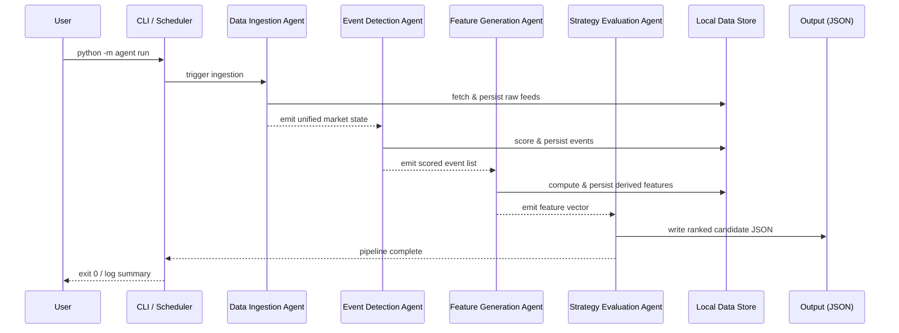

# Energy Options Opportunity Agent — User Guide

> **Version 1.0 · March 2026**
> This guide walks you through installing, configuring, and running the full pipeline end-to-end. It assumes you are comfortable with Python, virtual environments, and basic CLI usage.

---

## Table of Contents

1. [Overview](#overview)
2. [Prerequisites](#prerequisites)
3. [Setup & Configuration](#setup--configuration)
4. [Running the Pipeline](#running-the-pipeline)
5. [Interpreting the Output](#interpreting-the-output)
6. [Troubleshooting](#troubleshooting)

---

## Overview

The **Energy Options Opportunity Agent** is an autonomous, modular Python pipeline that surfaces options trading opportunities driven by oil market instability. It ingests market data, supply signals, geopolitical news, and alternative datasets, then produces structured, ranked candidate options strategies.

### What the pipeline does

```mermaid
flowchart LR
    subgraph Sources["External Data Sources"]
        A1[Alpha Vantage / MetalpriceAPI\nCrude Prices]
        A2[yfinance / Polygon.io\nETF & Equity Prices + Options]
        A3[EIA API\nInventory & Utilization]
        A4[GDELT / NewsAPI\nNews & Geo Events]
        A5[SEC EDGAR / Quiver Quant\nInsider Activity]
        A6[MarineTraffic / VesselFinder\nShipping & Tanker Flows]
        A7[Reddit / Stocktwits\nNarrative Sentiment]
    end

    subgraph Pipeline["Agent Pipeline"]
        B["① Data Ingestion Agent\nFetch & Normalize"]
        C["② Event Detection Agent\nSupply & Geo Signals"]
        D["③ Feature Generation Agent\nDerived Signal Computation"]
        E["④ Strategy Evaluation Agent\nOpportunity Ranking"]
    end

    subgraph Output["Output"]
        F[Ranked Candidate JSON\nEdge-scored Opportunities]
    end

    Sources --> B
    B -->|Unified Market State| C
    C -->|Scored Events| D
    D -->|Derived Features| E
    E --> F
```



### In-scope instruments and strategies

| Category | Items |
|---|---|
| **Crude futures** | Brent Crude, WTI (`CL=F`) |
| **ETFs** | USO, XLE |
| **Energy equities** | Exxon Mobil (XOM), Chevron (CVX) |
| **Option structures (MVP)** | Long straddles, call/put spreads, calendar spreads |

> **Advisory only.** The system generates recommendations but performs no automated trade execution.

---

## Prerequisites

### System requirements

| Requirement | Minimum |
|---|---|
| Python | 3.10 or later |
| Memory | 2 GB RAM |
| Disk | 10 GB free (for 6–12 months of historical data) |
| Network | Outbound HTTPS on port 443 |
| OS | Linux, macOS, or Windows (WSL2 recommended on Windows) |

### Required accounts and API keys

All sources are free or free-tier. Obtain credentials before proceeding.

| Service | Purpose | Sign-up URL |
|---|---|---|
| Alpha Vantage | Crude spot/futures prices | <https://www.alphavantage.co/support/#api-key> |
| MetalpriceAPI | Supplemental commodity prices | <https://metalpriceapi.com> |
| Polygon.io | Options chains (free tier) | <https://polygon.io> |
| EIA API | Inventory & refinery utilization | <https://www.eia.gov/opendata/> |
| NewsAPI | News & geopolitical events | <https://newsapi.org> |
| SEC EDGAR | Insider activity (no key required) | <https://efts.sec.gov/LATEST/search-index?q=%22form-type%22:%224%22> |
| Quiver Quant | Insider conviction scores (optional) | <https://www.quiverquant.com> |

> **Yahoo Finance / yfinance** and **GDELT** require no API key. **MarineTraffic** and **VesselFinder** offer free tiers; register at their respective sites if you want shipping signals in Phase 3.

### Python dependencies

Install dependencies from the project's `requirements.txt` after cloning (see [Setup & Configuration](#setup--configuration)).

---

## Setup & Configuration

### 1. Clone the repository

```bash
git clone https://github.com/your-org/energy-options-agent.git
cd energy-options-agent
```

### 2. Create and activate a virtual environment

```bash
python -m venv .venv

# Linux / macOS
source .venv/bin/activate

# Windows (PowerShell)
.venv\Scripts\Activate.ps1
```

### 3. Install dependencies

```bash
pip install --upgrade pip
pip install -r requirements.txt
```

### 4. Configure environment variables

Copy the provided template and populate your credentials:

```bash
cp .env.example .env
```

Open `.env` in your editor and fill in each value. The full set of recognised environment variables is listed below.

#### Environment variable reference

| Variable | Required | Default | Description |
|---|---|---|---|
| `ALPHA_VANTAGE_API_KEY` | ✅ | — | API key for Alpha Vantage crude price feed |
| `METALPRICE_API_KEY` | ✅ | — | API key for MetalpriceAPI commodity feed |
| `POLYGON_API_KEY` | ✅ | — | API key for Polygon.io options chain data |
| `EIA_API_KEY` | ✅ | — | API key for EIA inventory/refinery data |
| `NEWS_API_KEY` | ✅ | — | API key for NewsAPI news/geo event feed |
| `QUIVER_QUANT_API_KEY` | ⬜ | — | API key for Quiver Quant insider signals (Phase 3) |
| `MARINE_TRAFFIC_API_KEY` | ⬜ | — | API key for MarineTraffic tanker flow data (Phase 3) |
| `DATA_DIR` | ⬜ | `./data` | Local path for storing raw and derived historical data |
| `OUTPUT_DIR` | ⬜ | `./output` | Directory where ranked candidate JSON files are written |
| `LOG_LEVEL` | ⬜ | `INFO` | Logging verbosity: `DEBUG`, `INFO`, `WARNING`, `ERROR` |
| `MARKET_DATA_INTERVAL_MINUTES` | ⬜ | `5` | Polling cadence for minute-level market data feeds |
| `EIA_REFRESH_SCHEDULE` | ⬜ | `weekly` | Refresh schedule for EIA data (`daily` or `weekly`) |
| `EDGAR_REFRESH_SCHEDULE` | ⬜ | `daily` | Refresh schedule for SEC EDGAR insider filings |
| `HISTORY_RETENTION_DAYS` | ⬜ | `365` | Number of days of historical data to retain on disk |
| `PIPELINE_PHASE` | ⬜ | `1` | Active MVP phase (`1`–`4`); controls which agents are enabled |
| `INSTRUMENTS` | ⬜ | `USO,XLE,XOM,CVX,CL=F,BZ=F` | Comma-separated list of instruments to evaluate |
| `OPTION_STRUCTURES` | ⬜ | `long_straddle,call_spread,put_spread,calendar_spread` | Comma-separated list of eligible option structures |
| `EDGE_SCORE_THRESHOLD` | ⬜ | `0.30` | Minimum edge score `[0.0–1.0]` for a candidate to appear in output |

> **Tip:** Variables marked ⬜ are optional for Phase 1 but may be required by later phases. Leave optional keys blank or commented out if their Phase has not been activated.

#### Minimal `.env` for Phase 1

```dotenv
ALPHA_VANTAGE_API_KEY=your_alpha_vantage_key
METALPRICE_API_KEY=your_metalprice_key
POLYGON_API_KEY=your_polygon_key
EIA_API_KEY=your_eia_key
NEWS_API_KEY=your_newsapi_key

# Optional overrides
DATA_DIR=./data
OUTPUT_DIR=./output
LOG_LEVEL=INFO
PIPELINE_PHASE=1
EDGE_SCORE_THRESHOLD=0.30
```

### 5. Initialise local data storage

```bash
python -m agent init
```

This creates the directory structure under `DATA_DIR` and writes empty schema files for the historical store.

```
data/
├── raw/
│   ├── prices/
│   ├── options/
│   ├── eia/
│   ├── events/
│   ├── insider/
│   └── shipping/
└── derived/
    ├── features/
    └── market_state/
```

---

## Running the Pipeline

### Pipeline execution flow



### Running once (single-shot)

Execute a full pipeline run against current market data and exit:

```bash
python -m agent run
```

On success the process exits with code `0` and writes one or more candidate files to `OUTPUT_DIR`.

### Running with a specific phase

Override the active phase at the command line without changing `.env`:

```bash
python -m agent run --phase 2
```

### Running individual agents

Each agent can be executed in isolation for debugging or incremental development:

```bash
# Step 1 – ingest and normalize market data
python -m agent run --agent ingestion

# Step 2 – detect and score supply/geo events
python -m agent run --agent events

# Step 3 – compute derived features
python -m agent run --agent features

# Step 4 – evaluate and rank strategies
python -m agent run --agent strategy
```

> Agents consume inputs from the shared data store, so they can be run independently as long as upstream outputs are already present on disk.

### Scheduled / continuous operation

The pipeline is designed for a minutes-level market data cadence and slower daily/weekly cadences for EIA and EDGAR. Use `cron` (Linux/macOS) or Task Scheduler (Windows) to automate runs.

**Example cron entries:**

```cron
# Full pipeline every 5 minutes during trading hours (Mon–Fri, 09:00–17:00 ET)
*/5 9-17 * * 1-5 cd /path/to/energy-options-agent && .venv/bin/python -m agent run >> logs/pipeline.log 2>&1

# EIA and EDGAR refresh once daily at 06:00
0 6 * * 1-5 cd /path/to/energy-options-agent && .venv/bin/python -m agent run --agent ingestion --feeds eia,edgar >> logs/slow_feeds.log 2>&1
```

### Running inside Docker (optional)

```bash
docker build -t energy-options-agent .

docker run --rm \
  --env-file .env \
  -v "$(pwd)/data:/app/data" \
  -v "$(pwd)/output:/app/output" \
  energy-options-agent python -m agent run
```

---

## Interpreting the Output

### Output location

After each pipeline run, ranked candidates are written to `OUTPUT_DIR` (default `./output`) as timestamped JSON files:

```
output/
└── candidates_20260315T143002Z.json
```

### Output schema

Each file contains a JSON array of candidate objects. Every candidate exposes the following fields:

| Field | Type | Description |
|---|---|---|
| `instrument` | `string` | Target instrument, e.g. `USO`, `XLE`, `CL=F` |
| `structure` | `enum` | Options structure: `long_straddle` · `call_spread` · `put_spread` · `calendar_spread` |
| `expiration` | `integer` | Target expiration in calendar days from evaluation date |
| `edge_score` | `float [0.0–1.0]` | Composite opportunity score; higher = stronger signal confluence |
| `signals` | `object` | Map of contributing signals and their qualitative state |
| `generated_at` | `ISO 8601 datetime` | UTC timestamp of candidate generation |

### Example output

```json
[
  {
    "instrument": "USO",
    "structure": "long_straddle",
    "expiration": 30,
    "edge_score": 0.47,
    "signals": {
      "tanker_disruption_index": "high",
      "volatility_gap": "positive",
      "narrative_velocity": "rising"
    },
    "generated_at": "2026-03-15T14:30:02Z"
  },
  {
    "instrument": "XLE",
    "structure": "call_spread",
    "expiration": 21,
    "edge_score": 0.38,
    "signals": {
      "volatility_gap": "positive",
      "supply_shock_probability": "elevated",
      "sector_dispersion": "widening"
    },
    "generated_at": "2026-03-15T14:30:02Z"
  }
]
```

### Reading the edge score

| Edge Score | Interpretation |
|---|---|
| `0.70 – 1.00` | Strong signal confluence; high-conviction candidate |
| `0.50 – 0.69` | Moderate confluence; worth monitoring closely |
| `0.30 – 0.49` | Weak but non-trivial signal; treat as low-priority |
| `< 0.30` | Below threshold; filtered out by default (see `EDGE_SCORE_THRESHOLD`) |

### Understanding contributing signals

The `signals` object explains *why* a candidate was ranked. Common signal keys and their meanings:

| Signal Key | What it measures |
|---|---|
| `volatility_gap` | Realized vs. implied volatility divergence |
| `futures_curve_steepness` | Contango or backwardation in the crude curve |
| `sector_dispersion` | Spread between energy sub-sector returns |
| `insider_conviction` | Aggregated insider buying/selling intensity (EDGAR) |
| `narrative_velocity` | Acceleration of energy-related headlines or social mentions |
| `supply_shock_probability` | Composite probability of a near-term supply disruption |
| `tanker_disruption_index` | Shipping-flow anomalies at key chokepoints |

### Visualising output in thinkorswim

The JSON output is compatible with any JSON-capable dashboard. To load into thinkorswim:

1. Point a **thinkScript** custom scan or watchlist import at the `OUTPUT_DIR` path (or a local HTTP server serving the JSON files).
2. Map `instrument` to the symbol column and `edge_score` to a custom column for sorting.
3. Use the `signals` map fields as annotation columns for context.

---

## Troubleshooting

### Common errors and fixes

| Symptom | Likely Cause | Resolution |
|---|---|---|
| `KeyError: 'ALPHA_VANTAGE_API_KEY'` | Missing or unset environment variable | Confirm `.env` is populated and loaded; re-run `source .env` or verify your shell exports the variable |
| `HTTPError 429 Too Many Requests` | API rate limit exceeded | Increase `MARKET_DATA_INTERVAL_MINUTES`; check free-tier rate limits for the affected source |
|