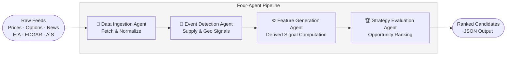
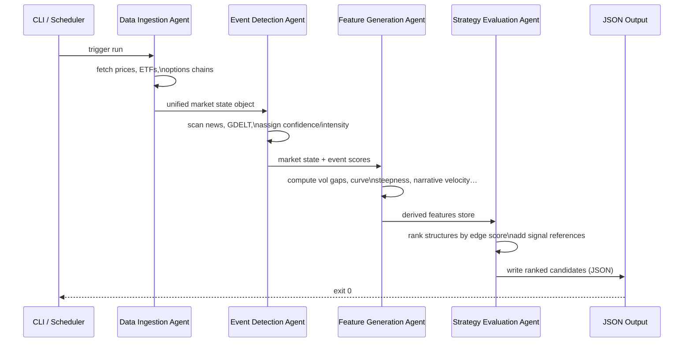

# Energy Options Opportunity Agent — User Guide

> **Version 1.0 · March 2026**
> This guide covers the full pipeline: setup, configuration, execution, output interpretation, and troubleshooting.

---

## Table of Contents

1. [Overview](#overview)
2. [Prerequisites](#prerequisites)
3. [Setup & Configuration](#setup--configuration)
4. [Running the Pipeline](#running-the-pipeline)
5. [Interpreting the Output](#interpreting-the-output)
6. [Troubleshooting](#troubleshooting)

---

## Overview

The **Energy Options Opportunity Agent** is a modular, four-agent Python pipeline that identifies options trading opportunities driven by oil market instability. It ingests market data, supply signals, news events, and alternative datasets, then surfaces volatility mispricing in oil-related instruments and ranks candidate strategies by a composite **edge score**.

### Pipeline Architecture



Data flows **unidirectionally**: raw feeds are ingested and normalized → events are detected and scored → features are derived → strategies are evaluated and ranked. Output is written to a JSON-compatible structure.

### In-Scope Instruments

| Category | Instruments |
|---|---|
| Crude futures | Brent Crude, WTI (`CL=F`) |
| ETFs | USO, XLE |
| Energy equities | Exxon Mobil (XOM), Chevron (CVX) |

### In-Scope Option Structures (MVP)

| Structure | Enum value |
|---|---|
| Long straddle | `long_straddle` |
| Call spread | `call_spread` |
| Put spread | `put_spread` |
| Calendar spread | `calendar_spread` |

> **Advisory only.** Automated trade execution is explicitly out of scope. The system produces recommendations; no orders are placed on your behalf.

---

## Prerequisites

### System Requirements

| Requirement | Minimum |
|---|---|
| Python | 3.10+ |
| OS | Linux, macOS, or Windows (WSL2 recommended) |
| RAM | 2 GB |
| Disk | 5 GB (for 6–12 months of historical data) |
| Network | Outbound HTTPS to API endpoints |

### Required External Accounts

All sources are free or low-cost. Obtain API keys before proceeding.

| Data Layer | Source | Cost | Sign-up URL |
|---|---|---|---|
| Crude prices | Alpha Vantage or MetalpriceAPI | Free | https://www.alphavantage.co |
| ETF/equity prices | yfinance (Yahoo Finance) | Free | No key required |
| Options data | Yahoo Finance / Polygon.io | Free / Limited | https://polygon.io |
| Supply & inventory | EIA API | Free | https://www.eia.gov/opendata |
| News & geo events | GDELT / NewsAPI | Free | https://newsapi.org |
| Insider activity | SEC EDGAR / Quiver Quant | Free / Limited | https://www.quiverquant.com |
| Shipping & logistics | MarineTraffic / VesselFinder | Free tier | https://www.marinetraffic.com |
| Narrative / sentiment | Reddit / Stocktwits | Free | https://www.reddit.com/dev/api |

### Python Dependencies

```bash
pip install -r requirements.txt
```

A minimal `requirements.txt` includes:

```text
yfinance>=0.2
requests>=2.31
pandas>=2.1
numpy>=1.26
pydantic>=2.5
python-dotenv>=1.0
schedule>=1.2
```

---

## Setup & Configuration

### 1. Clone the Repository

```bash
git clone https://github.com/your-org/energy-options-agent.git
cd energy-options-agent
```

### 2. Create a Virtual Environment

```bash
python -m venv .venv
source .venv/bin/activate        # macOS / Linux
# .venv\Scripts\activate          # Windows
pip install -r requirements.txt
```

### 3. Configure Environment Variables

Copy the template and populate your credentials:

```bash
cp .env.example .env
```

Then edit `.env`:

```dotenv
# ── Crude Prices ──────────────────────────────────────────────
ALPHA_VANTAGE_API_KEY=your_alpha_vantage_key

# ── Options Data ──────────────────────────────────────────────
POLYGON_API_KEY=your_polygon_key          # optional; yfinance used as fallback

# ── Supply & Inventory ────────────────────────────────────────
EIA_API_KEY=your_eia_key

# ── News & Geo Events ─────────────────────────────────────────
NEWSAPI_KEY=your_newsapi_key
GDELT_ENABLED=true                        # set false to disable GDELT polling

# ── Insider Activity ──────────────────────────────────────────
QUIVER_QUANT_API_KEY=your_quiver_key      # optional; EDGAR used as fallback

# ── Shipping & Logistics ──────────────────────────────────────
MARINETRAFFIC_API_KEY=your_mt_key         # optional; VesselFinder fallback

# ── Sentiment ─────────────────────────────────────────────────
REDDIT_CLIENT_ID=your_reddit_client_id
REDDIT_CLIENT_SECRET=your_reddit_client_secret
REDDIT_USER_AGENT=energy-options-agent/1.0

# ── Pipeline Behaviour ────────────────────────────────────────
MARKET_DATA_REFRESH_MINUTES=5             # cadence for price/options polling
SLOW_FEED_REFRESH_HOURS=24                # cadence for EIA, EDGAR
OUTPUT_DIR=./output                       # directory for JSON candidates
HISTORY_RETENTION_DAYS=365               # raw + derived data retention
LOG_LEVEL=INFO                            # DEBUG | INFO | WARNING | ERROR
```

#### Full Environment Variable Reference

| Variable | Required | Default | Description |
|---|---|---|---|
| `ALPHA_VANTAGE_API_KEY` | Yes | — | Crude spot/futures prices (WTI, Brent) |
| `POLYGON_API_KEY` | No | — | Options chain data; yfinance used if absent |
| `EIA_API_KEY` | Yes | — | Weekly inventory and refinery utilisation |
| `NEWSAPI_KEY` | Yes | — | News headline feed for event detection |
| `GDELT_ENABLED` | No | `true` | Toggle GDELT geopolitical event polling |
| `QUIVER_QUANT_API_KEY` | No | — | Insider activity; EDGAR used if absent |
| `MARINETRAFFIC_API_KEY` | No | — | Tanker flow data; VesselFinder used if absent |
| `REDDIT_CLIENT_ID` | No | — | Reddit OAuth client ID for sentiment |
| `REDDIT_CLIENT_SECRET` | No | — | Reddit OAuth secret |
| `REDDIT_USER_AGENT` | No | `energy-options-agent/1.0` | Reddit API user-agent string |
| `MARKET_DATA_REFRESH_MINUTES` | No | `5` | Polling cadence for prices and options |
| `SLOW_FEED_REFRESH_HOURS` | No | `24` | Polling cadence for EIA and EDGAR feeds |
| `OUTPUT_DIR` | No | `./output` | Directory where JSON candidates are written |
| `HISTORY_RETENTION_DAYS` | No | `365` | Days of raw and derived data to retain |
| `LOG_LEVEL` | No | `INFO` | Logging verbosity |

> **Tip:** Variables marked **No** under *Required* enable optional data layers introduced in Phases 2–3. The pipeline degrades gracefully if they are absent; it will log a warning and skip the corresponding signal rather than failing.

### 4. Initialise the Data Store

Run the one-time initialisation command to create the local SQLite database (or configure an alternate store) and seed the schema:

```bash
python -m agent init
```

Expected output:

```
[INFO] Initialising data store at ./data/market_state.db ...
[INFO] Schema applied. Historical retention set to 365 days.
[INFO] Ready.
```

---

## Running the Pipeline

### Pipeline Execution Flow



### Single Run (On-Demand)

Execute one full pipeline pass and write results to `OUTPUT_DIR`:

```bash
python -m agent run
```

To write output to a custom path for this invocation:

```bash
python -m agent run --output-dir /tmp/my-candidates
```

To run only specific agents (useful during development):

```bash
# Run ingestion and event detection only
python -m agent run --agents ingestion,event_detection

# Run feature generation and strategy evaluation against existing state
python -m agent run --agents feature_generation,strategy_evaluation
```

### Continuous / Scheduled Mode

The pipeline can self-schedule based on the cadences defined in `.env`:

```bash
python -m agent run --continuous
```

In continuous mode:
- **Price and options data** refresh every `MARKET_DATA_REFRESH_MINUTES` minutes.
- **Slow feeds** (EIA, EDGAR) refresh every `SLOW_FEED_REFRESH_HOURS` hours.
- A full strategy evaluation pass is triggered after each ingestion cycle.
- The process runs until interrupted with `Ctrl+C`.

### Running in a Container

A minimal `Dockerfile` is included. Build and run:

```bash
docker build -t energy-options-agent:1.0 .

docker run --rm \
  --env-file .env \
  -v "$(pwd)/output:/app/output" \
  -v "$(pwd)/data:/app/data" \
  energy-options-agent:1.0 \
  python -m agent run --continuous
```

### Running Individual Agents

Each agent can be invoked independently for testing or incremental enhancement:

```bash
python -m agent.ingestion          # Data Ingestion Agent only
python -m agent.event_detection    # Event Detection Agent only
python -m agent.feature_generation # Feature Generation Agent only
python -m agent.strategy_evaluation # Strategy Evaluation Agent only
```

---

## Interpreting the Output

### Output Location

Each pipeline run appends (or writes) a JSON file to `OUTPUT_DIR`:

```
output/
└── candidates_2026-03-15T14:30:00Z.json
```

### Output Schema

Each file contains an array of **strategy candidate objects**. Every field is described below.

| Field | Type | Description |
|---|---|---|
| `instrument` | `string` | Target instrument, e.g. `"USO"`, `"XLE"`, `"CL=F"` |
| `structure` | `enum` | One of `long_straddle`, `call_spread`, `put_spread`, `calendar_spread` |
| `expiration` | `integer` (days) | Target expiration in calendar days from evaluation date |
| `edge_score` | `float` [0.0–1.0] | Composite opportunity score; **higher = stronger signal confluence** |
| `signals` | `object` | Map of contributing signals and their assessed levels |
| `generated_at` | ISO 8601 datetime | UTC timestamp of candidate generation |

### Example Candidate

```json
{
  "instrument": "USO",
  "structure": "long_straddle",
  "expiration": 30,
  "edge_score": 0.47,
  "signals": {
    "tanker_disruption_index": "high",
    "volatility_gap": "positive",
    "narrative_velocity": "rising"
  },
  "generated_at": "2026-03-15T14:30:00Z"
}
```

### Reading an Edge Score

| Edge Score Range | Interpretation |
|---|---|
| `0.75 – 1.00` | Strong signal confluence; multiple independent signals agree |
| `0.50 – 0.74` | Moderate confluence; worth reviewing closely |
| `0.25 – 0.49` | Weak confluence; marginal opportunity |
| `0.00 – 0.24` | Noise level; low confidence, do not act without additional context |

> **Important:** The edge score is a heuristic composite, not a probability of profit. Always apply your own judgement and risk management before acting on any recommendation. The system is **advisory only**.

### Signal Map Reference

The `signals` object may contain any of the following keys, depending on which data layers are active:

| Signal Key | Source Agent | What It Measures |
|---|---|---|
| `volatility_gap` | Feature Generation | Realized vs. implied volatility divergence |
| `futures_curve_steepness` | Feature Generation | Contango / backwardation in the futures curve |
| `sector_dispersion` | Feature Generation | Return dispersion across energy equities |
| `insider_conviction_score` | Feature Generation | Intensity of recent insider buying/selling |
| `narrative_velocity` | Feature Generation | Acceleration of energy-related headline volume |
| `supply_shock_probability` | Feature Generation | Model probability of a near-term supply disruption |
| `tanker_disruption_index` | Event Detection | Shipping anomalies at key chokepoints |
| `refinery_outage_score` | Event Detection | Detected refinery outage intensity |
| `geopolitical_event_score` | Event Detection | Confidence-weighted geopolitical risk level |
| `eia_inventory_delta` | Data Ingestion | Week-over-week change in EIA crude inventories |

### Using Output with thinkorswim or Other Tools

The JSON output is compatible with any dashboard or tool that accepts JSON. To load into thinkorswim's thinkScript or a custom dashboard:

1. Point your tool at the latest file in `OUTPUT_DIR`.
2. Filter or sort by `edge_score` descending to prioritise candidates.
3. Use the `signals` map to understand *why* each candidate was surfaced before placing any trade.

---

## Troubleshooting

### Common Issues

| Symptom | Likely Cause | Resolution |
|---|---|---|
| `KeyError: ALPHA_VANTAGE_API_KEY` | Missing environment variable | Verify `.env` is populated and loaded (`python-dotenv` is installed) |
| Pipeline exits with `[WARNING] Skipping event_detection: NEWSAPI_KEY not set` | Optional key absent | Set the key in `.env` or accept that the layer will be skipped |
| `output/` directory is empty after a run | `OUTPUT_DIR` not writable, or all candidates below threshold | Check directory permissions; check `LOG_LEVEL=DEBUG` output |
| Edge scores are all `0.0` | Feeds returning stale or empty data | Run `python -m agent.ingestion` in isolation and inspect logs |
| `RateLimitError` from Alpha Vantage | Free-tier request cap hit | Increase `MARKET_DATA_REFRESH_MINUTES`; consider paid tier |
| `JSONDec