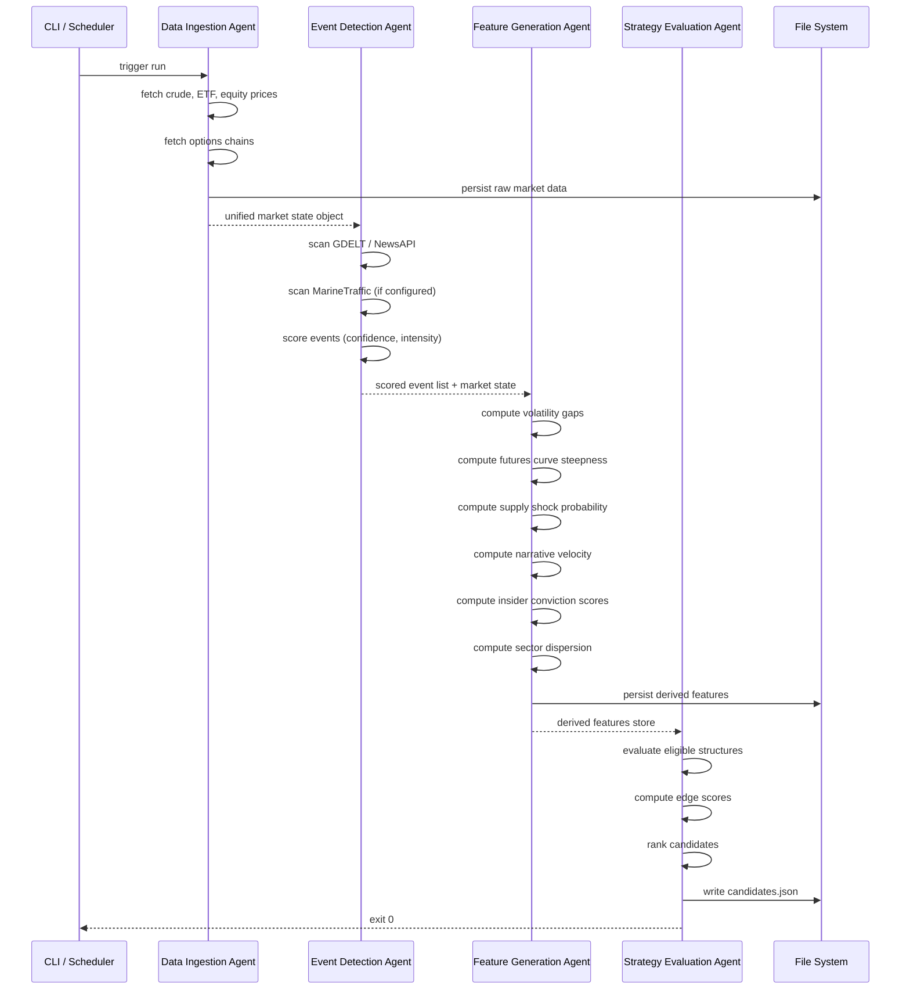

# Energy Options Opportunity Agent — User Guide

> **Version 1.0 • March 2026**
> This guide walks you through setting up, configuring, and running the full pipeline end-to-end. It assumes familiarity with Python and the command line.

---

## Table of Contents

1. [Overview](#overview)
2. [Prerequisites](#prerequisites)
3. [Setup & Configuration](#setup--configuration)
4. [Running the Pipeline](#running-the-pipeline)
5. [Interpreting the Output](#interpreting-the-output)
6. [Troubleshooting](#troubleshooting)

---

## Overview

The **Energy Options Opportunity Agent** is an autonomous, modular Python pipeline that surfaces options trading opportunities driven by oil market instability. It ingests market data, supply signals, geopolitical news, and alternative datasets to produce structured, ranked candidate options strategies.

### Pipeline Architecture

The system is composed of four loosely coupled agents that pass data through a shared **market state object** and a **derived features store**. Data flows strictly in one direction.

```mermaid
flowchart LR
    subgraph Ingestion["① Data Ingestion Agent"]
        A1[Crude Prices\nAlpha Vantage / MetalpriceAPI]
        A2[ETF & Equity Prices\nYahoo Finance / yfinance]
        A3[Options Chains\nYahoo Finance / Polygon.io]
        A4[Supply & Inventory\nEIA API]
    end

    subgraph Events["② Event Detection Agent"]
        B1[News & Geo Events\nGDELT / NewsAPI]
        B2[Shipping & Logistics\nMarineTraffic / VesselFinder]
        B3[Confidence & Intensity\nScoring]
    end

    subgraph Features["③ Feature Generation Agent"]
        C1[Volatility Gap\nRealised vs Implied]
        C2[Futures Curve\nSteepness]
        C3[Supply Shock\nProbability]
        C4[Narrative Velocity\nReddit / Stocktwits]
        C5[Insider Conviction\nEDGAR / Quiver Quant]
        C6[Sector Dispersion]
    end

    subgraph Strategy["④ Strategy Evaluation Agent"]
        D1[Eligible Structure\nEvaluation]
        D2[Edge Score\nComputation]
        D3[Ranked Candidates\nJSON Output]
    end

    RawFeeds[(Raw Feeds)] --> Ingestion
    Ingestion -->|Unified Market\nState Object| Events
    Events -->|Scored Events| Features
    Features -->|Derived Signals| Strategy
    Strategy -->|candidates.json| Output[(Output / Dashboard)]
```



### In-Scope Instruments & Structures

| Category | Items |
|---|---|
| **Crude Futures** | Brent Crude, WTI (`CL=F`) |
| **ETFs** | USO, XLE |
| **Energy Equities** | Exxon Mobil (XOM), Chevron (CVX) |
| **Option Structures (MVP)** | Long straddles, call/put spreads, calendar spreads |

> **Advisory only.** The pipeline does not execute trades. All output is for analytical and decision-support purposes.

---

## Prerequisites

### System Requirements

| Requirement | Minimum |
|---|---|
| Python | 3.10 or later |
| Operating System | Linux, macOS, or Windows (WSL recommended) |
| RAM | 2 GB |
| Disk | 10 GB free (for 6–12 months of historical data) |
| Deployment Target | Local machine, single VM, or Docker container |

### Required Python Packages

Install all dependencies from the project root:

```bash
pip install -r requirements.txt
```

Key packages include:

| Package | Purpose |
|---|---|
| `yfinance` | ETF, equity, and options chain data |
| `requests` | HTTP calls to EIA, Alpha Vantage, GDELT, EDGAR APIs |
| `pandas` | Market state normalization and feature computation |
| `numpy` | Numerical signal calculations |
| `pydantic` | Output schema validation |
| `schedule` | Cadence-based pipeline scheduling |
| `python-dotenv` | Environment variable management |

### API Accounts

Obtain free credentials for the following services before running the pipeline:

| Service | Used By | Registration URL |
|---|---|---|
| Alpha Vantage | Crude price feed | `https://www.alphavantage.co/support/#api-key` |
| Polygon.io | Options chain data (fallback) | `https://polygon.io/dashboard/signup` |
| EIA Open Data | Supply & inventory | `https://www.eia.gov/opendata/register.php` |
| NewsAPI | News & geo events | `https://newsapi.org/register` |
| GDELT | Geo events | No key required (public dataset) |
| SEC EDGAR | Insider activity | No key required (public API) |
| Quiver Quant | Insider conviction scores | `https://www.quiverquant.com/quiverapi/` |
| MarineTraffic | Tanker/shipping data | `https://www.marinetraffic.com/en/p/api-services` |

---

## Setup & Configuration

### 1. Clone the Repository

```bash
git clone https://github.com/your-org/energy-options-agent.git
cd energy-options-agent
```

### 2. Create a Virtual Environment

```bash
python -m venv .venv
source .venv/bin/activate        # Linux / macOS
# .venv\Scripts\activate         # Windows PowerShell
```

### 3. Install Dependencies

```bash
pip install -r requirements.txt
```

### 4. Configure Environment Variables

Copy the provided template and populate your credentials:

```bash
cp .env.example .env
```

Open `.env` in your editor and set each value. The full set of recognised environment variables is listed below.

#### Environment Variable Reference

| Variable | Required | Default | Description |
|---|---|---|---|
| `ALPHA_VANTAGE_API_KEY` | ✅ | — | API key for Alpha Vantage crude price feed |
| `POLYGON_API_KEY` | ⬜ | — | API key for Polygon.io options chain fallback |
| `EIA_API_KEY` | ✅ | — | API key for EIA supply & inventory data |
| `NEWS_API_KEY` | ✅ | — | API key for NewsAPI news & geo events |
| `QUIVER_QUANT_API_KEY` | ⬜ | — | API key for Quiver Quant insider conviction data |
| `MARINE_TRAFFIC_API_KEY` | ⬜ | — | API key for MarineTraffic tanker flow data |
| `DATA_DIR` | ⬜ | `./data` | Directory for persisted raw and derived data |
| `OUTPUT_DIR` | ⬜ | `./output` | Directory where `candidates.json` is written |
| `LOG_LEVEL` | ⬜ | `INFO` | Logging verbosity: `DEBUG`, `INFO`, `WARNING`, `ERROR` |
| `MARKET_DATA_INTERVAL_MINUTES` | ⬜ | `5` | Cadence for market data refresh (minutes-level) |
| `EIA_REFRESH_SCHEDULE` | ⬜ | `weekly` | Refresh cadence for EIA data: `daily` or `weekly` |
| `EDGAR_REFRESH_SCHEDULE` | ⬜ | `daily` | Refresh cadence for EDGAR insider data |
| `EDGE_SCORE_THRESHOLD` | ⬜ | `0.30` | Minimum edge score for a candidate to appear in output |
| `MAX_CANDIDATES` | ⬜ | `20` | Maximum number of ranked candidates to emit per run |
| `RETENTION_DAYS` | ⬜ | `365` | Days of historical data to retain for backtesting |

> **Tip:** Variables marked ⬜ are optional for the MVP (Phase 1 & 2). They become important as you add Phase 3 alternative signals. The pipeline tolerates missing optional credentials and skips the corresponding data source without failing.

#### Example `.env`

```dotenv
# --- Required ---
ALPHA_VANTAGE_API_KEY=YOUR_AV_KEY_HERE
EIA_API_KEY=YOUR_EIA_KEY_HERE
NEWS_API_KEY=YOUR_NEWSAPI_KEY_HERE

# --- Optional ---
POLYGON_API_KEY=
QUIVER_QUANT_API_KEY=
MARINE_TRAFFIC_API_KEY=

# --- Storage ---
DATA_DIR=./data
OUTPUT_DIR=./output
RETENTION_DAYS=365

# --- Pipeline tuning ---
LOG_LEVEL=INFO
MARKET_DATA_INTERVAL_MINUTES=5
EIA_REFRESH_SCHEDULE=weekly
EDGAR_REFRESH_SCHEDULE=daily
EDGE_SCORE_THRESHOLD=0.30
MAX_CANDIDATES=20
```

### 5. Initialise the Data Directory

Creates the local storage structure and verifies write permissions:

```bash
python -m agent init
```

Expected output:

```
[INFO] Data directory initialised at ./data
[INFO] Output directory initialised at ./output
[INFO] Configuration validated — 3/3 required API keys present
```

---

## Running the Pipeline

### Pipeline Execution Flow



### Single Run (One-Shot)

Execute the full four-agent pipeline once and exit:

```bash
python -m agent run
```

To override the output directory for this run:

```bash
python -m agent run --output-dir /tmp/results
```

To run in dry-run mode (fetches data and computes features but does not write output):

```bash
python -m agent run --dry-run
```

### Continuous Scheduled Run

Run the pipeline on the configured cadence (default: every 5 minutes for market data):

```bash
python -m agent schedule
```

Stop the scheduler with `Ctrl+C`. The scheduler respects the different refresh cadences per data source:

| Data Layer | Default Cadence | Environment Variable |
|---|---|---|
| Crude & ETF prices | Every 5 minutes | `MARKET_DATA_INTERVAL_MINUTES` |
| Options chains | Daily | — |
| EIA inventory | Weekly | `EIA_REFRESH_SCHEDULE` |
| EDGAR insider trades | Daily | `EDGAR_REFRESH_SCHEDULE` |
| News / GDELT | Continuous (each run) | — |

### Running Individual Agents

Each agent can be run in isolation for testing or incremental development:

```bash
# Run only the Data Ingestion Agent
python -m agent run --agent ingestion

# Run only the Event Detection Agent (requires existing market state)
python -m agent run --agent events

# Run only the Feature Generation Agent (requires market state + events)
python -m agent run --agent features

# Run only the Strategy Evaluation Agent (requires derived features)
python -m agent run --agent strategy
```

### Docker

A `Dockerfile` is included for containerised deployment on a single VM or cloud instance:

```bash
# Build the image
docker build -t energy-options-agent:latest .

# Run a one-shot pipeline execution
docker run --env-file .env \
  -v $(pwd)/data:/app/data \
  -v $(pwd)/output:/app/output \
  energy-options-agent:latest python -m agent run
```

---

## Interpreting the Output

### Output File Location

After each successful run the pipeline writes:

```
./output/candidates.json
```

The file is overwritten on each run. The pipeline also appends a timestamped snapshot to:

```
./output/history/candidates_<ISO8601_timestamp>.json
```

### Output Schema

Each element in the `candidates` array represents one ranked strategy opportunity:

| Field | Type | Description |
|---|---|---|
| `instrument` | `string` | Target instrument, e.g. `USO`, `XLE`, `CL=F` |
| `structure` | `enum` | Options structure: `long_straddle` \| `call_spread` \| `put_spread` \| `calendar_spread` |
| `expiration` | `integer` (days) | Target expiration in calendar days from the evaluation date |
| `edge_score` | `float` [0.0–1.0] | Composite opportunity score — higher values indicate stronger signal confluence |
| `signals` | `object` | Map of contributing signals and their observed states |
| `generated_at` | ISO 8601 datetime | UTC timestamp of candidate generation |

### Example Output

```json
{
  "generated_at": "2026-03-14T09:32:11Z",
  "candidate_count": 3,
  "candidates": [
    {
      "instrument": "USO",
      "structure": "long_straddle",
      "expiration": 30,
      "edge_score": 0.47,
      "signals": {
        "tanker_disruption_index": "high",
        "volatility_gap": "positive",
        "narrative_velocity": "rising"
      },
      "generated_at": "2026-03-14T09:32:11Z"
    },
    {
      "instrument": "XOM",
      "structure": "call_spread",
      "expiration": 21,
      "edge_score": 0.38,
      "signals": {
        "volatility_gap": "positive",
        "supply_shock_probability": "elevated",
        "insider_conviction": "high"
      },
      "generated_at": "2026-03-14T09:32:11Z"
    },
    {
      "instrument": "XLE",
      "structure": "calendar_spread",
      "expiration": 45,
      "edge_score": 0.31,
      "signals": {
        "futures_curve_steepness": "contango_widening",
        "sector_dispersion": "elevated"
      },
      "generated_at": "2026-03-14T09:32:11Z"
    }
  ]
}
```

### Reading the Edge Score

The `edge_score` is a composite float between `0.0` and `1.0` reflecting signal confluence across all active data layers. Use it to prioritise candidates for further manual review.

| Edge Score Range | Interpretation |
|---|---|
| `0.00 – 0.29` | Weak signal; filtered out by default (`EDGE_SCORE_THRESHOLD`) |
| `0.30 – 0.49` | Moderate confluence — worth monitoring |
| `0.50 – 0.69` | Strong confluence — high-priority candidate |
| `0.70 – 1.00` | Very strong confluence — review immediately |

> **Note:** The edge score is a heuristic computed from the available active signals. Candidates with fewer configured data sources (e.g., Phase 1 only) will naturally produce lower maximum scores. The score is not a probability of profit.

### Reading the Signals Map

Each key in the `signals` object corresponds to a derived feature computed by the Feature Generation Agent: