# Energy Options Opportunity Agent — User Guide

> **Version 1.0 · March 2026**
> Advisory only. The system surfaces ranked options candidates; it does not execute trades.

---

## Table of Contents

1. [Overview](#overview)
2. [Prerequisites](#prerequisites)
3. [Setup & Configuration](#setup--configuration)
4. [Running the Pipeline](#running-the-pipeline)
5. [Interpreting the Output](#interpreting-the-output)
6. [Troubleshooting](#troubleshooting)

---

## Overview

The **Energy Options Opportunity Agent** is a modular, four-agent Python pipeline that identifies options trading opportunities driven by oil market instability. It ingests market data, supply signals, news events, and alternative datasets, then produces structured, ranked candidate options strategies with full signal explainability.

### What the pipeline does

| Stage | Agent | Core job |
|---|---|---|
| 1 | **Data Ingestion Agent** | Fetches and normalises crude prices, ETF/equity data, and options chains into a unified market state object |
| 2 | **Event Detection Agent** | Monitors news and geopolitical feeds; scores supply disruptions, refinery outages, and tanker chokepoints |
| 3 | **Feature Generation Agent** | Derives volatility gaps, curve steepness, sector dispersion, insider conviction, narrative velocity, and supply shock probability |
| 4 | **Strategy Evaluation Agent** | Evaluates eligible option structures, assigns edge scores, and emits ranked candidates with contributing signals |

### In-scope instruments

| Category | Instruments |
|---|---|
| Crude futures | WTI (`CL=F`), Brent Crude |
| ETFs | USO, XLE |
| Energy equities | XOM, CVX |

### In-scope option structures (MVP)

- Long straddles
- Call / put spreads
- Calendar spreads

### Pipeline data flow

```mermaid
flowchart LR
    subgraph Sources
        A1[Alpha Vantage / MetalpriceAPI\nCrude Prices]
        A2[yfinance / Yahoo Finance\nETF & Equity Prices]
        A3[Yahoo Finance / Polygon.io\nOptions Chains]
        A4[EIA API\nInventory & Refinery Data]
        A5[GDELT / NewsAPI\nNews & Geo Events]
        A6[SEC EDGAR / Quiver Quant\nInsider Activity]
        A7[MarineTraffic / VesselFinder\nShipping & Logistics]
        A8[Reddit / Stocktwits\nNarrative & Sentiment]
    end

    subgraph Pipeline
        B1[Data Ingestion Agent\nFetch & Normalise]
        B2[Event Detection Agent\nSupply & Geo Signals]
        B3[Feature Generation Agent\nDerived Signal Computation]
        B4[Strategy Evaluation Agent\nOpportunity Ranking]
    end

    subgraph Output
        C1[Ranked JSON Candidates]
    end

    Sources --> B1
    B1 -->|Market State Object| B2
    B2 -->|Scored Events| B3
    B3 -->|Derived Features Store| B4
    B4 --> C1
```



---

## Prerequisites

### System requirements

| Requirement | Minimum |
|---|---|
| Python | 3.10 or later |
| Operating system | Linux, macOS, or Windows (WSL2 recommended) |
| RAM | 2 GB |
| Disk | 5 GB free (6–12 months of historical data storage) |
| Network | Outbound HTTPS on port 443 |

### Required Python knowledge

You should be comfortable with:
- Running Python scripts from the command line
- Managing virtual environments (`venv` or `conda`)
- Editing `.env` files or shell environment variables

### API accounts

Obtain free (or free-tier) credentials for each data source before running the pipeline. All sources in the MVP are free or low-cost.

| Source | Sign-up URL | Notes |
|---|---|---|
| Alpha Vantage | https://www.alphavantage.co/support/#api-key | Free tier; WTI/Brent |
| Yahoo Finance / yfinance | No key required | ETF, equity, options data |
| Polygon.io | https://polygon.io | Free tier for options data |
| EIA API | https://www.eia.gov/opendata/ | Free; weekly inventory data |
| NewsAPI | https://newsapi.org | Free developer tier |
| GDELT | No key required | Continuous/daily news events |
| SEC EDGAR | No key required | Insider activity filings |
| Quiver Quant | https://www.quiverquant.com | Free/limited tier |
| MarineTraffic | https://www.marinetraffic.com/en/p/api-services | Free tier for vessel data |
| VesselFinder | https://www.vesselfinder.com | Free tier alternative |
| Reddit (PRAW) | https://www.reddit.com/prefs/apps | Free; narrative/sentiment |
| Stocktwits | https://api.stocktwits.com | Free |

---

## Setup & Configuration

### 1. Clone the repository

```bash
git clone https://github.com/your-org/energy-options-agent.git
cd energy-options-agent
```

### 2. Create and activate a virtual environment

```bash
python -m venv .venv

# macOS / Linux
source .venv/bin/activate

# Windows (PowerShell)
.venv\Scripts\Activate.ps1
```

### 3. Install dependencies

```bash
pip install --upgrade pip
pip install -r requirements.txt
```

### 4. Configure environment variables

Copy the provided template and fill in your credentials:

```bash
cp .env.example .env
```

Open `.env` in your editor and populate each value. The full set of supported variables is described in the table below.

#### Environment variable reference

| Variable | Required | Default | Description |
|---|---|---|---|
| `ALPHA_VANTAGE_API_KEY` | Yes | — | API key for Alpha Vantage crude price feed |
| `METALS_PRICE_API_KEY` | No | — | API key for MetalpriceAPI (fallback crude source) |
| `POLYGON_API_KEY` | No | — | Polygon.io API key for options chain data |
| `EIA_API_KEY` | Yes | — | EIA Open Data API key for inventory/refinery feeds |
| `NEWS_API_KEY` | Yes | — | NewsAPI key for news and geopolitical event feeds |
| `REDDIT_CLIENT_ID` | No | — | Reddit PRAW application client ID |
| `REDDIT_CLIENT_SECRET` | No | — | Reddit PRAW application client secret |
| `REDDIT_USER_AGENT` | No | `energy-agent/1.0` | Reddit PRAW user-agent string |
| `QUIVER_QUANT_API_KEY` | No | — | Quiver Quant API key for insider conviction data |
| `MARINE_TRAFFIC_API_KEY` | No | — | MarineTraffic API key for tanker flow data |
| `DATA_DIR` | No | `./data` | Directory for raw and derived historical data storage |
| `OUTPUT_DIR` | No | `./output` | Directory where ranked JSON candidates are written |
| `LOG_LEVEL` | No | `INFO` | Logging verbosity: `DEBUG`, `INFO`, `WARNING`, `ERROR` |
| `MARKET_DATA_INTERVAL_MINUTES` | No | `5` | Polling cadence for minute-level market data feeds |
| `HISTORICAL_RETENTION_DAYS` | No | `365` | Days of historical data to retain (180–365 recommended) |
| `EDGE_SCORE_THRESHOLD` | No | `0.0` | Minimum edge score to include a candidate in output |
| `MAX_CANDIDATES` | No | `20` | Maximum number of ranked candidates emitted per run |

> **Note on optional variables:** Agents tolerate missing credentials for optional sources. If a key is absent, the corresponding data source is skipped and the pipeline continues. A warning is logged for each disabled source. See [Troubleshooting](#troubleshooting) for details.

### 5. Initialise the data store

Run the one-time initialisation command to create the local data directories and database schema:

```bash
python -m agent init
```

Expected output:

```
[INFO] Data directory created: ./data
[INFO] Output directory created: ./output
[INFO] Historical store initialised (retention: 365 days)
[INFO] Initialisation complete.
```

---

## Running the Pipeline

### Pipeline execution modes

| Mode | Command | Description |
|---|---|---|
| **Full pipeline** | `python -m agent run` | Runs all four agents end-to-end once |
| **Scheduled loop** | `python -m agent run --loop` | Repeats the full pipeline at the configured `MARKET_DATA_INTERVAL_MINUTES` cadence |
| **Single agent** | `python -m agent run --agent <name>` | Runs one agent in isolation (see agent names below) |
| **Dry run** | `python -m agent run --dry-run` | Executes the full pipeline but writes no output files |

Valid `--agent` values: `ingestion`, `event_detection`, `feature_generation`, `strategy_evaluation`.

### Running the full pipeline once

```bash
python -m agent run
```

The four agents execute sequentially. Console output follows this pattern:

```
[INFO] === Energy Options Opportunity Agent ===
[INFO] [1/4] Data Ingestion Agent — starting
[INFO]   Fetching crude prices (WTI, Brent) ...  OK
[INFO]   Fetching ETF/equity prices (USO, XLE, XOM, CVX) ... OK
[INFO]   Fetching options chains ... OK
[INFO]   Market state object written to ./data/market_state.json
[INFO] [1/4] Data Ingestion Agent — complete (4.2 s)

[INFO] [2/4] Event Detection Agent — starting
[INFO]   Processing GDELT feed ... OK
[INFO]   Processing NewsAPI feed ... OK
[INFO]   3 events detected (confidence threshold met)
[INFO] [2/4] Event Detection Agent — complete (2.8 s)

[INFO] [3/4] Feature Generation Agent — starting
[INFO]   Computing volatility gap (realized vs. implied) ... OK
[INFO]   Computing futures curve steepness ... OK
[INFO]   Computing sector dispersion, narrative velocity, supply shock probability ... OK
[INFO]   Derived features written to ./data/features.json
[INFO] [3/4] Feature Generation Agent — complete (1.1 s)

[INFO] [4/4] Strategy Evaluation Agent — starting
[INFO]   Evaluating long_straddle candidates ... OK
[INFO]   Evaluating call_spread / put_spread candidates ... OK
[INFO]   Evaluating calendar_spread candidates ... OK
[INFO]   7 candidates ranked; top edge_score: 0.71
[INFO]   Output written to ./output/candidates_2026-03-15T14:32:00Z.json
[INFO] [4/4] Strategy Evaluation Agent — complete (0.5 s)

[INFO] Pipeline complete. Total elapsed: 8.6 s
```

### Running the pipeline on a schedule

```bash
python -m agent run --loop
```

The loop uses the `MARKET_DATA_INTERVAL_MINUTES` value from `.env`. Press `Ctrl+C` to stop.

```
[INFO] Scheduler started. Interval: 5 minutes. Press Ctrl+C to stop.
[INFO] Run #1 starting at 2026-03-15T14:32:00Z ...
...
[INFO] Run #1 complete. Next run at 2026-03-15T14:37:00Z.
```

### Running a single agent

Use this during development or when debugging a specific stage:

```bash
# Re-run only the strategy evaluation stage against existing features
python -m agent run --agent strategy_evaluation
```

> **Dependency note:** Running a downstream agent in isolation requires that the upstream agents have already produced their output files (`market_state.json`, `features.json`). If those files are absent or stale, the agent logs a warning and uses the most recent available data.

### Passing runtime overrides

Any `.env` variable can be overridden at the command line with `--set`:

```bash
python -m agent run --set EDGE_SCORE_THRESHOLD=0.3 --set MAX_CANDIDATES=10
```

---

## Interpreting the Output

### Output file location

Each run writes a timestamped JSON file to `OUTPUT_DIR`:

```
./output/candidates_2026-03-15T14:32:00Z.json
```

A symlink `./output/latest.json` always points to the most recent file.

### Output schema

Each file contains a top-level array of candidate objects. Every candidate has the following fields:

| Field | Type | Description |
|---|---|---|
| `instrument` | string | Target instrument, e.g. `USO`, `XLE`, `CL=F` |
| `structure` | enum string | `long_straddle` \| `call_spread` \| `put_spread` \| `calendar_spread` |
| `expiration` | integer (days) | Target expiration in calendar days from the evaluation date |
| `edge_score` | float [0.0–1.0] | Composite opportunity score; higher = stronger signal confluence |
| `signals` | object | Map of contributing signals and their qualitative levels |
| `generated_at` | ISO 8601 datetime | UTC timestamp of candidate generation |

### Example output

```json
[
  {
    "instrument": "USO",
    "structure": "long_straddle",
    "expiration": 30,
    "edge_score": 0.71,
    "signals": {
      "tanker_disruption_index": "high",
      "volatility_gap": "positive",
      "narrative_velocity": "rising",
      "supply_shock_probability": "elevated"
    },
    "generated_at": "2026-03-15T14:32:00Z"
  },
  {
    "instrument": "XLE",
    "structure": "call_spread",
    "expiration": 45,
    "edge_score": 0.47,
    "signals": {
      "volatility_gap": "positive",
      "sector_dispersion": "widening",
      "eia_inventory_surprise": "draw"
    },
    "generated_at": "2026-03-15T14:32:00Z"
  }
]
```

### Reading edge scores

| Edge score range | Interpretation |
|---|---|
| 0.70 – 1.00 | Strong signal confluence; multiple independent signals aligned |
| 0.40 – 0.69 | Moderate confluence; worth monitoring or further analysis |
| 0.10 – 0.39 | Weak signal; limited corroborating evidence |
| 0.00 – 0.09 | Minimal signal; typically filtered out by `EDGE_SCORE_THRESHOLD` |

### Reading the signals map

Each key in the `signals` object corresponds to a derived feature computed by the Feature Generation Agent. Common keys and their qualitative values:

| Signal key | Possible values | What it means |
|---|---|---|
| `volatility_gap` | `positive`, `negative`, `neutral` | Realized vol exceeds (`positive`) or trails (`negative`) implied vol |
| `narrative_velocity` | `rising`, `stable`, `falling` | Acceleration of energy-related headlines and social sentiment |
| `tanker_disruption_index` | `high`, `moderate`, `low` | Degree of detected disruption in tanker shipping routes |
| `supply_shock_probability` | `elevated`, `moderate`, `low` | Probability estimate of a near-term supply shock |
| `futures_curve_steepness` | `steep_contango`, `flat`, `backwardation` | Shape of the WTI/Brent futures curve |
| `sector_dispersion` | `widening`, `stable`, `narrowing` | Cross-sector correlation divergence in energy equities |
| `insider_conviction` | `high`, `moderate`, `low` | Aggregated conviction score from EDGAR insider trade filings |
| `eia_inventory_surprise` | `draw`, `build`, `inline` | Whether the latest EIA inventory report was a draw, build, or in-line |

### Visualising output

The JSON output is compatible with any JSON-capable dashboard. To load it