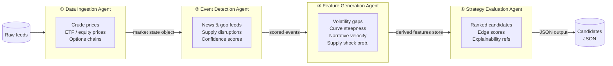

# Energy Options Opportunity Agent — User Guide

> **Version 1.0 · March 2026**
> This guide covers the full pipeline: setup through output interpretation. It is written for developers who are comfortable with Python and CLI tools but are new to this project.

---

## Table of Contents

1. [Overview](#overview)
2. [Prerequisites](#prerequisites)
3. [Setup & Configuration](#setup--configuration)
4. [Running the Pipeline](#running-the-pipeline)
5. [Interpreting the Output](#interpreting-the-output)
6. [Troubleshooting](#troubleshooting)

---

## Overview

The **Energy Options Opportunity Agent** is a modular, four-agent Python pipeline that identifies options trading opportunities driven by oil market instability. It ingests market data, supply signals, news events, and alternative datasets, then produces structured, ranked candidate options strategies with full explainability.

### In-scope instruments

| Category | Instruments |
|---|---|
| Crude futures | Brent Crude, WTI (`CL=F`) |
| ETFs | USO, XLE |
| Energy equities | Exxon Mobil (XOM), Chevron (CVX) |

### In-scope option structures (MVP)

| Structure | Enum value |
|---|---|
| Long straddle | `long_straddle` |
| Call spread | `call_spread` |
| Put spread | `put_spread` |
| Calendar spread | `calendar_spread` |

> **Advisory only.** Automated trade execution is explicitly out of scope. All output is for informational purposes.

### Pipeline architecture

The four agents communicate via a shared market state object and a derived features store. Data flows strictly left to right — no agent writes back upstream.



---

## Prerequisites

### System requirements

| Requirement | Minimum |
|---|---|
| Python | 3.10 or later |
| Memory | 2 GB RAM |
| Disk | 10 GB (6–12 months of historical data) |
| OS | Linux, macOS, or Windows (WSL2 recommended) |
| Deployment target | Local machine, single VM, or container |

### Python dependencies

Install all dependencies from the project root:

```bash
pip install -r requirements.txt
```

Key packages the pipeline relies on include:

| Package | Purpose |
|---|---|
| `yfinance` | ETF, equity, and options data via Yahoo Finance |
| `requests` | HTTP calls to Alpha Vantage, EIA, GDELT, NewsAPI |
| `pandas` / `numpy` | Data normalisation and feature computation |
| `pydantic` | Market state object and output schema validation |
| `apscheduler` | Scheduled cadence runs |
| `python-dotenv` | Loading environment variables from `.env` |

### API accounts

All required data sources are free or have a free tier. Register and obtain API keys before running the pipeline.

| Service | URL | Cost | Used by |
|---|---|---|---|
| Alpha Vantage | https://www.alphavantage.co | Free | Crude spot/futures prices |
| EIA API | https://www.eia.gov/opendata | Free | Inventory & refinery utilisation |
| NewsAPI | https://newsapi.org | Free tier | News and geopolitical events |
| GDELT | https://www.gdeltproject.org | Free | Geopolitical event stream |
| Polygon.io | https://polygon.io | Free/Limited | Options chains |
| SEC EDGAR | https://efts.sec.gov/LATEST/search-index | Free | Insider activity |
| MarineTraffic | https://www.marinetraffic.com | Free tier | Tanker / shipping flows |

> `yfinance`, Reddit (`praw`), and Stocktwits do not require API keys for basic free-tier access.

---

## Setup & Configuration

### 1. Clone the repository

```bash
git clone https://github.com/your-org/energy-options-agent.git
cd energy-options-agent
```

### 2. Create and activate a virtual environment

```bash
python -m venv .venv
# Linux / macOS
source .venv/bin/activate
# Windows (PowerShell)
.venv\Scripts\Activate.ps1
```

### 3. Install dependencies

```bash
pip install -r requirements.txt
```

### 4. Create the environment file

Copy the provided template and populate your keys:

```bash
cp .env.example .env
```

Then open `.env` in your editor and fill in the values described in the table below.

### Environment variables reference

All pipeline behaviour is controlled through environment variables. Variables marked **Required** must be set before the pipeline will start. Variables marked **Optional** have defaults and are only needed for Phase 2 or Phase 3 features.

| Variable | Required | Default | Description |
|---|---|---|---|
| `ALPHA_VANTAGE_API_KEY` | ✅ Required | — | API key for crude price feed (WTI, Brent) |
| `EIA_API_KEY` | ✅ Required | — | API key for EIA inventory and refinery utilisation data |
| `NEWS_API_KEY` | ✅ Required | — | API key for NewsAPI geopolitical/energy news feed |
| `POLYGON_API_KEY` | Optional | — | API key for Polygon.io options chains; falls back to yfinance if unset |
| `GDELT_ENABLED` | Optional | `true` | Set to `false` to disable GDELT event ingestion |
| `EDGAR_ENABLED` | Optional | `true` | Set to `false` to disable SEC EDGAR insider activity fetch |
| `MARINE_TRAFFIC_API_KEY` | Optional | — | API key for MarineTraffic tanker flow data; feature disabled if unset |
| `REDDIT_CLIENT_ID` | Optional | — | Reddit app client ID for narrative velocity signal |
| `REDDIT_CLIENT_SECRET` | Optional | — | Reddit app client secret |
| `REDDIT_USER_AGENT` | Optional | `energy-options-agent/1.0` | Reddit API user-agent string |
| `STOCKTWITS_ENABLED` | Optional | `true` | Set to `false` to disable Stocktwits sentiment ingestion |
| `DATA_DIR` | Optional | `./data` | Root directory for raw and derived historical data storage |
| `OUTPUT_DIR` | Optional | `./output` | Directory where JSON candidate files are written |
| `HISTORY_DAYS` | Optional | `365` | Days of historical data to retain (minimum `180` for backtesting) |
| `MARKET_DATA_INTERVAL_MINUTES` | Optional | `5` | Polling cadence for market price feeds |
| `SLOW_FEED_INTERVAL_HOURS` | Optional | `24` | Polling cadence for EIA, EDGAR, and similar daily/weekly feeds |
| `LOG_LEVEL` | Optional | `INFO` | Python logging level: `DEBUG`, `INFO`, `WARNING`, `ERROR` |
| `OUTPUT_FORMAT` | Optional | `json` | Output format: `json` (further formats planned in Phase 4) |

A minimal `.env` for Phase 1 looks like this:

```dotenv
ALPHA_VANTAGE_API_KEY=your_alpha_vantage_key
EIA_API_KEY=your_eia_key
NEWS_API_KEY=your_newsapi_key
DATA_DIR=./data
OUTPUT_DIR=./output
LOG_LEVEL=INFO
```

### 5. Initialise the data directory

The following command creates the required directory structure and seeds the historical data store with the configured `HISTORY_DAYS` of market data. Expect this to take several minutes on first run.

```bash
python -m agent init
```

Expected output:

```
[INFO] Initialising data store at ./data
[INFO] Fetching 365 days of crude price history (WTI, Brent)...
[INFO] Fetching 365 days of ETF/equity history (USO, XLE, XOM, CVX)...
[INFO] Fetching options chains snapshot...
[INFO] Data store initialised successfully.
```

---

## Running the Pipeline

### Pipeline execution modes

The pipeline supports three execution modes:

| Mode | Command | Use case |
|---|---|---|
| **Single run** | `python -m agent run` | Run all four agents once and exit |
| **Scheduled (daemon)** | `python -m agent start` | Run continuously on configured cadence |
| **Agent-specific** | `python -m agent run --agent <name>` | Run one agent in isolation for debugging |

---

### Single run

Executes all four agents in sequence and writes output to `OUTPUT_DIR`.

```bash
python -m agent run
```

Sample console output:

```
[INFO] ── Phase 1: Data Ingestion Agent ──────────────────────────────
[INFO]   Fetched WTI spot: 81.42 | Brent spot: 84.17
[INFO]   Fetched options chains for USO, XLE, XOM, CVX, CL=F
[INFO]   Market state object written to data/market_state.json

[INFO] ── Phase 2: Event Detection Agent ─────────────────────────────
[INFO]   GDELT: 3 energy-related events detected
[INFO]   NewsAPI: 7 articles matched supply/disruption keywords
[INFO]   Events scored and written to data/events.json

[INFO] ── Phase 3: Feature Generation Agent ──────────────────────────
[INFO]   Volatility gap (USO): +0.12 (realised < implied)
[INFO]   Futures curve steepness: contango +0.034
[INFO]   Narrative velocity: rising (score: 0.71)
[INFO]   Derived features written to data/features.json

[INFO] ── Phase 4: Strategy Evaluation Agent ─────────────────────────
[INFO]   Evaluated 18 candidate structures across 6 instruments
[INFO]   4 candidates above edge score threshold (0.40)
[INFO]   Output written to output/candidates_2026-03-15T14:32:00Z.json

[INFO] Pipeline completed in 43.2 s
```

---

### Scheduled (daemon) mode

Runs the pipeline continuously. Market price agents refresh at `MARKET_DATA_INTERVAL_MINUTES`; slower feeds (EIA, EDGAR) refresh at `SLOW_FEED_INTERVAL_HOURS`.

```bash
python -m agent start
```

To run as a background process on Linux:

```bash
nohup python -m agent start > logs/agent.log 2>&1 &
echo $! > agent.pid
```

To stop the daemon:

```bash
kill $(cat agent.pid)
```

---

### Running a single agent

Useful when developing or debugging one layer without running the full pipeline. Each agent reads its inputs from the data store written by the previous agent.

```bash
# Valid agent names: ingestion | events | features | strategy
python -m agent run --agent ingestion
python -m agent run --agent events
python -m agent run --agent features
python -m agent run --agent strategy
```

---

### MVP phase flags

Each phase can be toggled independently. This is useful when onboarding incrementally or when an upstream data source is unavailable.

```bash
# Run only Phase 1 (core market signals)
python -m agent run --phases 1

# Run Phases 1 and 2 (add supply/event augmentation)
python -m agent run --phases 1,2

# Run all phases (default)
python -m agent run --phases 1,2,3
```

> Phase 4 enhancements (OPIS pricing, exotic structures, automated execution) are not available in the current MVP release.

---

## Interpreting the Output

### Output file location

Each pipeline run writes a timestamped JSON file to `OUTPUT_DIR`:

```
output/
└── candidates_2026-03-15T14:32:00Z.json
```

### Output schema

Each element of the `candidates` array represents a single ranked opportunity.

| Field | Type | Description |
|---|---|---|
| `instrument` | `string` | Target instrument, e.g. `USO`, `XLE`, `CL=F` |
| `structure` | `enum` | Option structure: `long_straddle` \| `call_spread` \| `put_spread` \| `calendar_spread` |
| `expiration` | `integer` | Target expiration in calendar days from evaluation date |
| `edge_score` | `float [0.0–1.0]` | Composite opportunity score — higher means stronger signal confluence |
| `signals` | `object` | Map of contributing signals and their qualitative values |
| `generated_at` | ISO 8601 datetime | UTC timestamp of candidate generation |

### Example output file

```json
{
  "generated_at": "2026-03-15T14:32:00Z",
  "candidate_count": 4,
  "candidates": [
    {
      "instrument": "USO",
      "structure": "long_straddle",
      "expiration": 30,
      "edge_score": 0.47,
      "signals": {
        "tanker_disruption_index": "high",
        "volatility_gap": "positive",
        "narrative_velocity": "rising"
      },
      "generated_at": "2026-03-15T14:32:00Z"
    },
    {
      "instrument": "XLE",
      "structure": "call_spread",
      "expiration": 21,
      "edge_score": 0.43,
      "signals": {
        "supply_shock_probability": "elevated",
        "futures_curve_steepness": "steep_contango",
        "sector_dispersion": "high"
      },
      "generated_at": "2026-03-15T14:32:00Z"
    }
  ]
}
```

### Reading the edge score

The `edge_score` is a composite float in the range `[0.0, 1.0]` that reflects the confluence of contributing signals. It is not a probability of profit; it is a relative ranking signal.

| Edge score range | Interpretation |
|---|---|
| `0.70 – 1.0` | Strong signal confluence — multiple independent signals aligned |
| `0.50 – 0.69` | Moderate confluence — worth closer review |
| `0.40 – 0.49` | Weak-to-moderate — threshold for inclusion in default output |
| `< 0.40` | Below default threshold — filtered from output by default |

> You can lower the default threshold by passing `--edge-threshold 0.30` to any `run` command.

### Reading the signals map

Each key in the `signals` object identifies a derived feature that contributed to the edge score. The value is a qualitative label assigned by the Feature Generation Agent.

| Signal key | What it measures |
|---|---|
| `volatility_gap` | Difference between realised and implied volatility — `positive` means IV is elevated relative to realised vol |
| `futures_curve_steepness` | Shape of the WTI/Brent futures curve — `steep_contango` or `backwardation` |
| `supply_shock_probability` | Computed likelihood of near-term supply disruption |
| `tanker_disruption_index` | Shipping/logistics signal derived from MarineTraffic data |
| `narrative_velocity` | Rate of change in energy-related social/news sentiment |
| `sector_dispersion` | Cross-sector correlation divergence among energy equities |
| `insider_conviction_score` | Aggregated insider trade directionality from EDGAR |

### Consuming output in thinkorswim or a custom dashboard

The JSON output is compatible with any tool that