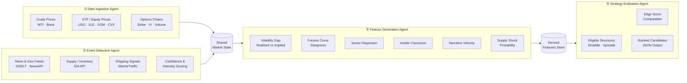

# Energy Options Opportunity Agent — User Guide

> **Version 1.0 • March 2026**
> Advisory only. The system produces ranked strategy candidates; it does **not** execute trades.

---

## Table of Contents

1. [Overview](#overview)
2. [Prerequisites](#prerequisites)
3. [Setup & Configuration](#setup--configuration)
4. [Running the Pipeline](#running-the-pipeline)
5. [Interpreting the Output](#interpreting-the-output)
6. [Troubleshooting](#troubleshooting)

---

## Overview

The **Energy Options Opportunity Agent** is a four-stage Python pipeline that identifies options trading opportunities driven by oil market instability. It ingests market data, supply signals, news events, and alternative datasets, then surfaces volatility mispricing in oil-related instruments and ranks candidate strategies by a computed **edge score**.

### Pipeline at a Glance



### In-Scope Instruments & Structures (MVP)

| Category | Items |
|---|---|
| **Crude Futures** | Brent Crude, WTI |
| **ETFs** | USO, XLE |
| **Energy Equities** | Exxon Mobil (XOM), Chevron (CVX) |
| **Option Structures** | Long straddles, call / put spreads, calendar spreads |

Automated execution, exotic multi-legged strategies, and regional refined product pricing (OPIS) are **out of scope** for the current release.

---

## Prerequisites

### System Requirements

| Requirement | Minimum |
|---|---|
| **Python** | 3.10+ |
| **Operating System** | Linux, macOS, or Windows (WSL recommended) |
| **RAM** | 2 GB |
| **Disk** | 5 GB (12-month data retention target) |
| **Network** | Outbound HTTPS to public APIs |

### Required Tools

```bash
# Verify Python version
python --version   # must be >= 3.10

# Verify pip
pip --version

# Optional but recommended: virtual environment tooling
python -m venv --help
```

### External API Accounts

Register for free-tier access at each provider before configuring the pipeline:

| Data Layer | Provider | Free Tier? | Sign-up URL |
|---|---|---|---|
| Crude Prices | Alpha Vantage | ✅ Free | https://www.alphavantage.co/support/#api-key |
| ETF / Equity Prices | yfinance (Yahoo Finance) | ✅ Free | No registration required |
| Options Data | Polygon.io | ✅ Free / Limited | https://polygon.io/dashboard/signup |
| Supply & Inventory | EIA API | ✅ Free | https://www.eia.gov/opendata/register.php |
| News & Geo Events | NewsAPI | ✅ Free | https://newsapi.org/register |
| News & Geo Events | GDELT | ✅ Free | No registration required |
| Insider Activity | SEC EDGAR | ✅ Free | No registration required |
| Insider Activity | Quiver Quant | ⚠️ Free / Limited | https://www.quiverquant.com/signup |
| Shipping / Logistics | MarineTraffic | ✅ Free tier | https://www.marinetraffic.com/en/register |
| Narrative / Sentiment | Reddit API | ✅ Free | https://www.reddit.com/wiki/api |

---

## Setup & Configuration

### 1. Clone the Repository

```bash
git clone https://github.com/your-org/energy-options-agent.git
cd energy-options-agent
```

### 2. Create and Activate a Virtual Environment

```bash
python -m venv .venv

# Linux / macOS
source .venv/bin/activate

# Windows (PowerShell)
.\.venv\Scripts\Activate.ps1
```

### 3. Install Dependencies

```bash
pip install --upgrade pip
pip install -r requirements.txt
```

### 4. Configure Environment Variables

Copy the provided template and populate your API keys:

```bash
cp .env.example .env
```

Open `.env` in your editor and fill in each value. The full set of recognised variables is documented in the table below.

#### Environment Variable Reference

| Variable | Required | Default | Description |
|---|---|---|---|
| `ALPHA_VANTAGE_API_KEY` | ✅ | — | API key for crude price feeds (WTI, Brent spot/futures) |
| `POLYGON_API_KEY` | ✅ | — | API key for options chain data (strike, expiry, IV, volume) |
| `EIA_API_KEY` | ✅ | — | API key for EIA inventory and refinery utilisation data |
| `NEWSAPI_KEY` | ✅ | — | API key for energy news and geopolitical event headlines |
| `REDDIT_CLIENT_ID` | ⚠️ Phase 3 | — | Reddit OAuth client ID for sentiment / narrative velocity |
| `REDDIT_CLIENT_SECRET` | ⚠️ Phase 3 | — | Reddit OAuth client secret |
| `REDDIT_USER_AGENT` | ⚠️ Phase 3 | `energy-agent/1.0` | Reddit API user-agent string |
| `QUIVER_API_KEY` | ⚠️ Phase 3 | — | Quiver Quant key for insider conviction scores |
| `MARINETRAFFIC_API_KEY` | ⚠️ Phase 3 | — | MarineTraffic key for tanker flow signals |
| `DATA_DIR` | ❌ | `./data` | Root directory for persisted raw and derived data |
| `OUTPUT_DIR` | ❌ | `./output` | Directory where ranked candidate JSON files are written |
| `LOG_LEVEL` | ❌ | `INFO` | Logging verbosity: `DEBUG`, `INFO`, `WARNING`, `ERROR` |
| `MARKET_DATA_INTERVAL_MINUTES` | ❌ | `5` | Polling cadence for minute-level market data feeds |
| `HISTORY_RETENTION_DAYS` | ❌ | `365` | Days of historical data to retain for backtesting |
| `EDGE_SCORE_THRESHOLD` | ❌ | `0.30` | Minimum edge score for a candidate to appear in output |
| `MAX_CANDIDATES` | ❌ | `20` | Maximum number of ranked candidates written per run |

> **Tip — Variables marked ⚠️ Phase 3** are only needed once you enable Phase 3 alternative signals. The pipeline runs without them in Phases 1 and 2.

#### Example `.env`

```dotenv
# === Core API Keys ===
ALPHA_VANTAGE_API_KEY=your_alpha_vantage_key_here
POLYGON_API_KEY=your_polygon_key_here
EIA_API_KEY=your_eia_key_here
NEWSAPI_KEY=your_newsapi_key_here

# === Phase 3 (Alternative Signals) ===
REDDIT_CLIENT_ID=your_reddit_client_id
REDDIT_CLIENT_SECRET=your_reddit_client_secret
REDDIT_USER_AGENT=energy-agent/1.0
QUIVER_API_KEY=your_quiver_key_here
MARINETRAFFIC_API_KEY=your_marinetraffic_key_here

# === Storage & Output ===
DATA_DIR=./data
OUTPUT_DIR=./output
HISTORY_RETENTION_DAYS=365

# === Pipeline Behaviour ===
LOG_LEVEL=INFO
MARKET_DATA_INTERVAL_MINUTES=5
EDGE_SCORE_THRESHOLD=0.30
MAX_CANDIDATES=20
```

### 5. Initialise Storage

Create the local data and output directories and seed the historical data store:

```bash
python -m agent init
```

Expected output:

```
[INFO] Creating data directory at ./data
[INFO] Creating output directory at ./output
[INFO] Storage initialised successfully.
```

---

## Running the Pipeline

### Pipeline Phases

The system ships with four progressive phases. Activate only the phases for which you have configured the required data sources.

| Phase | Name | Key Data Sources Added |
|---|---|---|
| **1** | Core Market Signals & Options | Alpha Vantage, yfinance, Polygon.io |
| **2** | Supply & Event Augmentation | EIA API, GDELT, NewsAPI |
| **3** | Alternative / Contextual Signals | EDGAR, Quiver, MarineTraffic, Reddit |
| **4** | High-Fidelity Enhancements | OPIS (paid), exotic structures, execution API |

### Single Run (Ad-hoc)

Execute a full pipeline pass and write results to `OUTPUT_DIR`:

```bash
python -m agent run
```

To restrict to a specific phase:

```bash
# Phase 1 only (market data + options surface)
python -m agent run --phase 1

# Phases 1 and 2 (adds supply & event signals)
python -m agent run --phase 2
```

To override the edge score threshold for a single run:

```bash
python -m agent run --edge-threshold 0.25
```

### Scheduled / Continuous Mode

Run the pipeline on its configured polling cadence (default: every 5 minutes for market data; daily for EIA/EDGAR):

```bash
python -m agent start
```

Stop the scheduler gracefully:

```bash
python -m agent stop
```

### Dry Run (No Output Written)

Validate configuration and data source connectivity without persisting any results:

```bash
python -m agent run --dry-run
```

### Individual Agent Execution

Each agent can be invoked independently for development or debugging:

```bash
# Data Ingestion Agent only
python -m agent.ingestion

# Event Detection Agent only
python -m agent.events

# Feature Generation Agent only
python -m agent.features

# Strategy Evaluation Agent only
python -m agent.strategy
```

### Confirming a Successful Run

A successful full-pipeline run produces console output similar to:

```
[INFO] [ingestion]  Market state refreshed — 6 instruments, 4 options chains loaded.
[INFO] [events]     3 events detected (max intensity: high, avg confidence: 0.71).
[INFO] [features]   Derived 6 signal dimensions across 6 instruments.
[INFO] [strategy]   12 candidates evaluated; 5 above edge threshold (0.30).
[INFO] [output]     Results written to ./output/candidates_2026-03-15T14:32:00Z.json
```

---

## Interpreting the Output

### Output File Location

Each run writes a timestamped JSON file to `OUTPUT_DIR`:

```
./output/
└── candidates_2026-03-15T14:32:00Z.json
```

### Output Schema

Each ranked candidate is a JSON object with the following fields:

| Field | Type | Description |
|---|---|---|
| `instrument` | `string` | Target instrument — e.g. `USO`, `XLE`, `CL=F` |
| `structure` | `enum` | Option structure: `long_straddle` \| `call_spread` \| `put_spread` \| `calendar_spread` |
| `expiration` | `integer` | Target expiration in **calendar days** from evaluation date |
| `edge_score` | `float [0.0–1.0]` | Composite opportunity score; **higher = stronger signal confluence** |
| `signals` | `object` | Map of contributing signals and their qualitative states |
| `generated_at` | `ISO 8601 datetime` | UTC timestamp of candidate generation |

### Example Output File

```json
{
  "generated_at": "2026-03-15T14:32:00Z",
  "candidates": [
    {
      "instrument": "USO",
      "structure": "long_straddle",
      "expiration": 30,
      "edge_score": 0.47,
      "signals": {
        "tanker_disruption_index": "high",
        "volatility_gap": "positive",
        "narrative_velocity": "rising"
      },
      "generated_at": "2026-03-15T14:32:00Z"
    },
    {
      "instrument": "XLE",
      "structure": "call_spread",
      "expiration": 21,
      "edge_score": 0.38,
      "signals": {
        "supply_shock_probability": "elevated",
        "volatility_gap": "positive",
        "sector_dispersion": "high"
      },
      "generated_at": "2026-03-15T14:32:00Z"
    }
  ]
}
```

### Reading the Edge Score

| Edge Score Range | Interpretation | Suggested Action |
|---|---|---|
| `0.00 – 0.29` | Weak or noisy signal confluence | Below default threshold; not emitted unless threshold is lowered |
| `0.30 – 0.49` | Moderate opportunity; signals partially aligned | Review contributing signals before acting |
| `0.50 – 0.74` | Strong confluence across multiple signal layers | High-priority review candidate |
| `0.75 – 1.00` | Very strong confluence; rare under normal conditions | Immediate review warranted |

### Signal Reference

The `signals` object contains zero or more of the following keys:

| Signal Key | Source Agent | What It Measures |
|---|---|---|
| `volatility_gap` | Feature Generation | Divergence between realised and implied volatility |
| `futures_curve_steepness` | Feature Generation | Degree of contango or backwardation in the futures curve |
| `sector_dispersion` | Feature Generation | Cross-sector price divergence within energy equities |
| `insider_conviction_score` | Feature Generation | Aggregated executive trade activity (EDGAR / Quiver) |
| `narrative_velocity` | Feature Generation | Acceleration of energy-related headlines and social sentiment |
| `supply_shock_probability` | Feature Generation | Composite probability of near-term supply disruption |
| `tanker_disruption_index` | Event Detection | Shipping flow anomalies at key tanker chokepoints |
| `refinery_outage_signal` | Event Detection | Detected refinery capacity reduction events |
| `geopolitical_event_score` | Event Detection | Confidence-weighted intensity of geopolitical events |
| `eia_inventory_delta` | Data Ingestion | Week-on-week EIA crude inventory change |

### Downstream Consumption

The JSON output is compatible with:

- **thinkorswim** — import via the platform's scripting or watchlist JSON import.
- **Any JSON-capable dashboard** — pipe the output file directly into Grafana, Streamlit, or a custom web view.
- **Backtesting harness** — retained historical output files (up to 12 months) can be replayed against realised price moves to validate edge