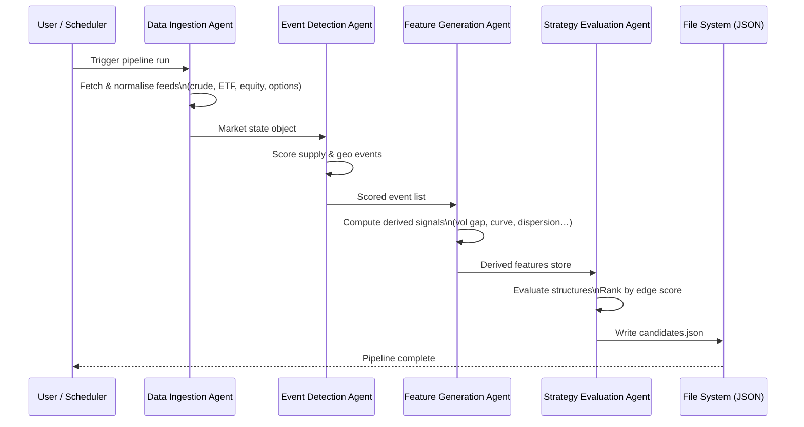

# Energy Options Opportunity Agent — User Guide

> **Version 1.0 · March 2026**
> This guide covers the full pipeline: setup, configuration, execution, output interpretation, and troubleshooting. It assumes you are comfortable with Python and the command line but are new to this project.

---

## Table of Contents

1. [Overview](#overview)
2. [Prerequisites](#prerequisites)
3. [Setup & Configuration](#setup--configuration)
4. [Running the Pipeline](#running-the-pipeline)
5. [Interpreting the Output](#interpreting-the-output)
6. [Troubleshooting](#troubleshooting)

---

## Overview

The **Energy Options Opportunity Agent** is a modular, autonomous Python pipeline that detects volatility mispricing in oil-related instruments and surfaces ranked options trading opportunities.

The pipeline is composed of **four loosely coupled agents** that execute in a fixed data-flow order:

```mermaid
flowchart LR
    subgraph Ingestion["① Data Ingestion Agent"]
        direction TB
        I1[Crude prices\nWTI · Brent]
        I2[ETF & Equity\nUSO · XLE · XOM · CVX]
        I3[Options chains\nStrike · Expiry · IV]
    end

    subgraph Event["② Event Detection Agent"]
        direction TB
        E1[News & Geo feeds\nGDELT · NewsAPI]
        E2[Supply disruptions\nRefinery · Tanker]
        E3[Confidence &\nintensity scores]
    end

    subgraph Feature["③ Feature Generation Agent"]
        direction TB
        F1[Volatility gap\nRealised vs Implied]
        F2[Futures curve\nsteepness]
        F3[Supply shock\nprobability]
        F4[Narrative velocity\nInsider conviction]
    end

    subgraph Strategy["④ Strategy Evaluation Agent"]
        direction TB
        S1[Evaluate structures\nStraddle · Spread · Calendar]
        S2[Compute edge scores]
        S3[Ranked JSON output]
    end

    Ingestion -->|Market state object| Event
    Event -->|Scored events| Feature
    Feature -->|Derived features store| Strategy
    Strategy -->|Candidate opportunities| Output[(JSON / Dashboard)]
```



### In-scope instruments

| Category | Instruments |
|---|---|
| Crude futures | Brent Crude, WTI (`CL=F`) |
| ETFs | USO, XLE |
| Energy equities | Exxon Mobil (XOM), Chevron (CVX) |

### In-scope option structures (MVP)

- Long straddles
- Call / put spreads
- Calendar spreads

> **Advisory only.** Automated trade execution is explicitly out of scope. The pipeline produces recommendations; all order entry is manual.

---

## Prerequisites

### System requirements

| Requirement | Minimum |
|---|---|
| Python | 3.10 or later |
| Operating system | Linux, macOS, or Windows (WSL2 recommended) |
| RAM | 2 GB |
| Disk | 10 GB free (for 6–12 months of historical data) |
| Network | Outbound HTTPS on port 443 |

### Required Python packages

Install dependencies from the project root:

```bash
pip install -r requirements.txt
```

The key runtime dependencies include:

| Package | Purpose |
|---|---|
| `yfinance` | ETF, equity, and options data |
| `requests` | REST API calls (EIA, GDELT, NewsAPI, etc.) |
| `pandas` | Data normalisation and storage |
| `apscheduler` | Scheduled cadence execution |
| `python-dotenv` | Environment variable loading |
| `pydantic` | Output schema validation |

### API access

All data sources used in the MVP are **free or free-tier**. Obtain API keys before running the pipeline:

| Source | Sign-up URL | Key needed? |
|---|---|---|
| Alpha Vantage | <https://www.alphavantage.co/support/#api-key> | Yes |
| EIA Open Data | <https://www.eia.gov/opendata/register.php> | Yes |
| NewsAPI | <https://newsapi.org/register> | Yes |
| Polygon.io | <https://polygon.io> | Yes (free tier) |
| SEC EDGAR | No sign-up required | No |
| GDELT | No sign-up required | No |
| yfinance / Yahoo Finance | No sign-up required | No |
| MarineTraffic / VesselFinder | <https://www.marinetraffic.com/en/online-services/plans> | Free tier |
| Quiver Quant | <https://www.quiverquant.com> | Yes (free tier) |

---

## Setup & Configuration

### 1. Clone the repository

```bash
git clone https://github.com/your-org/energy-options-agent.git
cd energy-options-agent
```

### 2. Create and activate a virtual environment

```bash
python -m venv .venv
source .venv/bin/activate        # Linux / macOS
# .venv\Scripts\activate         # Windows PowerShell
```

### 3. Install dependencies

```bash
pip install -r requirements.txt
```

### 4. Configure environment variables

Copy the provided template and populate it with your credentials:

```bash
cp .env.example .env
```

Open `.env` in your editor and fill in each value:

```dotenv
# ── Data Sources ────────────────────────────────────────────────────────────
ALPHA_VANTAGE_API_KEY=your_alpha_vantage_key
EIA_API_KEY=your_eia_key
NEWS_API_KEY=your_newsapi_key
POLYGON_API_KEY=your_polygon_key
QUIVER_QUANT_API_KEY=your_quiver_key          # optional; enables insider signals

# ── Pipeline Cadence ─────────────────────────────────────────────────────────
MARKET_DATA_INTERVAL_MINUTES=5                # how often market data refreshes
SLOW_FEED_INTERVAL_HOURS=24                   # EIA, EDGAR cadence (daily)
NEWS_FEED_INTERVAL_MINUTES=30                 # news/geo event polling cadence

# ── Storage ──────────────────────────────────────────────────────────────────
HISTORICAL_DATA_PATH=./data/historical        # raw and derived data store
OUTPUT_PATH=./data/output                     # where JSON candidates are written
RETENTION_DAYS=365                            # 6–12 months; 365 = 12 months

# ── Strategy Evaluation ───────────────────────────────────────────────────────
EDGE_SCORE_THRESHOLD=0.30                     # minimum edge score to emit a candidate
MAX_CANDIDATES_PER_RUN=20                     # cap on ranked output per pipeline run

# ── Logging ───────────────────────────────────────────────────────────────────
LOG_LEVEL=INFO                                # DEBUG | INFO | WARNING | ERROR
LOG_PATH=./logs/agent.log
```

### Environment variable reference

| Variable | Required | Default | Description |
|---|---|---|---|
| `ALPHA_VANTAGE_API_KEY` | Yes | — | WTI and Brent spot/futures prices |
| `EIA_API_KEY` | Yes | — | Weekly inventory and refinery utilisation |
| `NEWS_API_KEY` | Yes | — | Energy news and geopolitical event headlines |
| `POLYGON_API_KEY` | Yes | — | Options chain data (strike, expiry, IV, volume) |
| `QUIVER_QUANT_API_KEY` | No | — | Insider conviction signals; omit to skip this layer |
| `MARKET_DATA_INTERVAL_MINUTES` | No | `5` | Polling cadence for crude, ETF, and equity prices |
| `SLOW_FEED_INTERVAL_HOURS` | No | `24` | Cadence for EIA and SEC EDGAR feeds |
| `NEWS_FEED_INTERVAL_MINUTES` | No | `30` | Cadence for GDELT / NewsAPI polling |
| `HISTORICAL_DATA_PATH` | No | `./data/historical` | Root directory for raw and derived data |
| `OUTPUT_PATH` | No | `./data/output` | Directory for ranked candidate JSON files |
| `RETENTION_DAYS` | No | `365` | Days of historical data to retain on disk |
| `EDGE_SCORE_THRESHOLD` | No | `0.30` | Candidates below this score are suppressed |
| `MAX_CANDIDATES_PER_RUN` | No | `20` | Maximum candidates written per pipeline cycle |
| `LOG_LEVEL` | No | `INFO` | Python logging level |
| `LOG_PATH` | No | `./logs/agent.log` | Log file location |

### 5. Initialise storage directories

```bash
python scripts/init_storage.py
```

This creates `./data/historical`, `./data/output`, and `./logs` if they do not exist, and validates that the environment is correctly configured before the first run.

---

## Running the Pipeline

### Pipeline execution sequence



### Single run (manual)

Execute the full pipeline once and exit:

```bash
python -m agent.pipeline run
```

Example output to the console:

```
[INFO] 2026-03-15T09:00:00Z  Data Ingestion Agent started
[INFO] 2026-03-15T09:00:04Z  Market state object built — 6 instruments
[INFO] 2026-03-15T09:00:05Z  Event Detection Agent started
[INFO] 2026-03-15T09:00:07Z  3 events detected (confidence ≥ 0.6)
[INFO] 2026-03-15T09:00:08Z  Feature Generation Agent started
[INFO] 2026-03-15T09:00:09Z  6 derived signals computed
[INFO] 2026-03-15T09:00:10Z  Strategy Evaluation Agent started
[INFO] 2026-03-15T09:00:11Z  12 candidates evaluated; 7 above threshold
[INFO] 2026-03-15T09:00:11Z  Output written → ./data/output/candidates_20260315T090011Z.json
```

### Continuous scheduled mode

Run the pipeline on the configured cadence using the built-in scheduler:

```bash
python -m agent.pipeline schedule
```

The scheduler respects `MARKET_DATA_INTERVAL_MINUTES` for market-data-driven agents and `SLOW_FEED_INTERVAL_HOURS` for EIA and EDGAR feeds. Press `Ctrl+C` to stop.

### Running individual agents

Each agent can be invoked independently for testing or incremental updates:

```bash
# Data Ingestion only
python -m agent.ingestion run

# Event Detection only (reads existing market state from disk)
python -m agent.events run

# Feature Generation only
python -m agent.features run

# Strategy Evaluation only
python -m agent.strategy run
```

> **Note:** When running agents individually, each agent reads its inputs from the files written by the preceding agent. Ensure the upstream agent has completed at least one successful run first.

### Command-line flags

| Flag | Description |
|---|---|
| `--dry-run` | Execute all agents but suppress file output |
| `--log-level DEBUG` | Override `LOG_LEVEL` for this run |
| `--output-path PATH` | Override `OUTPUT_PATH` for this run |
| `--threshold FLOAT` | Override `EDGE_SCORE_THRESHOLD` for this run |
| `--phase {1,2,3}` | Restrict signals to a specific MVP phase |

Example — debug run with a lower threshold:

```bash
python -m agent.pipeline run --log-level DEBUG --threshold 0.20
```

### Docker (optional)

A single-container deployment is supported for low-cost cloud or local use:

```bash
docker build -t energy-options-agent .
docker run --env-file .env \
           -v $(pwd)/data:/app/data \
           -v $(pwd)/logs:/app/logs \
           energy-options-agent schedule
```

---

## Interpreting the Output

### Output file location

Each pipeline run writes a timestamped JSON file to `OUTPUT_PATH`:

```
./data/output/candidates_20260315T090011Z.json
```

A symlink `candidates_latest.json` always points to the most recent file.

### Output schema

Each element of the output array represents one ranked candidate opportunity:

| Field | Type | Description |
|---|---|---|
| `instrument` | `string` | Target instrument, e.g. `USO`, `XLE`, `CL=F` |
| `structure` | `enum` | `long_straddle` · `call_spread` · `put_spread` · `calendar_spread` |
| `expiration` | `integer` (days) | Calendar days from evaluation date to target expiration |
| `edge_score` | `float` [0.0–1.0] | Composite opportunity score; higher = stronger signal confluence |
| `signals` | `object` | Map of contributing signal names to their qualitative level |
| `generated_at` | ISO 8601 UTC | Timestamp of candidate generation |

### Example output file

```json
[
  {
    "instrument": "USO",
    "structure": "long_straddle",
    "expiration": 30,
    "edge_score": 0.47,
    "signals": {
      "tanker_disruption_index": "high",
      "volatility_gap": "positive",
      "narrative_velocity": "rising"
    },
    "generated_at": "2026-03-15T09:00:11Z"
  },
  {
    "instrument": "XLE",
    "structure": "call_spread",
    "expiration": 21,
    "edge_score": 0.38,
    "signals": {
      "volatility_gap": "positive",
      "supply_shock_probability": "elevated",
      "sector_dispersion": "widening"
    },
    "generated_at": "2026-03-15T09:00:11Z"
  }
]
```

Candidates are ordered highest `edge_score` first. The file is valid JSON and can be loaded into any JSON-capable dashboard or thinkorswim scan tool.

### Reading the edge score

| Edge score range | Interpretation |
|---|---|
| `0.70 – 1.00` | Strong confluence across multiple signal layers — highest-priority candidates |
| `0.50 – 0.69` | Moderate confluence — worth manual review |
| `0.30 – 0.49` | Weak but non-trivial signal — monitor for development |
| `< 0.30` | Below threshold; suppressed by default |

### Reading the signals map

Each key in the `signals` object maps to a contributing feature computed by the Feature Generation Agent:

| Signal key | Source agent | What it measures |
|---|---|---|
| `volatility_gap` | Feature Generation | Realised IV minus implied IV; `positive` = IV underpriced |
| `futures_curve_steepness` | Feature Generation | Contango / backwardation magnitude |
| `sector_dispersion` | Feature Generation | Spread between energy sector constituents |
| `insider_conviction_score` | Feature Generation | Aggregated executive buying/selling signal from EDGAR |
| `narrative_velocity` | Feature Generation | Rate of headline acceleration (Reddit, Stocktwits, NewsAPI) |
| `supply_shock_probability` | Feature