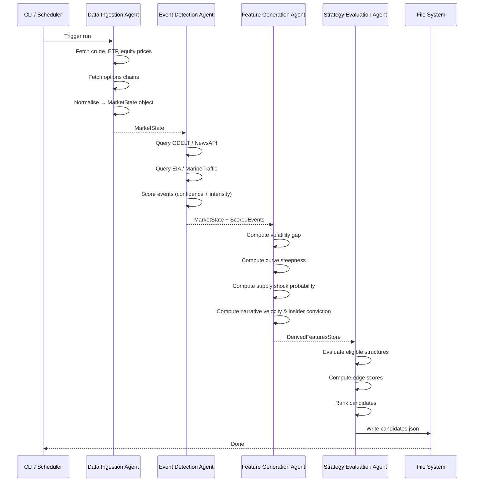

# Energy Options Opportunity Agent — User Guide

> **Version 1.0 · March 2026**
> This guide walks you through setting up, configuring, and running the full pipeline end-to-end, and explains how to interpret and act on its output.

---

## Table of Contents

1. [Overview](#overview)
2. [Prerequisites](#prerequisites)
3. [Setup & Configuration](#setup--configuration)
4. [Running the Pipeline](#running-the-pipeline)
5. [Interpreting the Output](#interpreting-the-output)
6. [Troubleshooting](#troubleshooting)

---

## Overview

The **Energy Options Opportunity Agent** is a four-agent Python pipeline that identifies options trading opportunities driven by oil market instability. It ingests market data, supply signals, news events, and alternative datasets, then surfaces volatility mispricing in oil-related instruments and ranks candidate strategies by a computed **edge score**.

### Pipeline at a Glance

```mermaid
flowchart LR
    subgraph Ingestion ["① Data Ingestion Agent"]
        A1[Crude Prices\nWTI · Brent]
        A2[ETF / Equity Prices\nUSO · XLE · XOM · CVX]
        A3[Options Chains\nStrike · IV · Volume]
    end

    subgraph Event ["② Event Detection Agent"]
        B1[News & Geo Feeds\nGDELT · NewsAPI]
        B2[Supply Signals\nEIA · Shipping]
        B3[Confidence &\nIntensity Scores]
    end

    subgraph Features ["③ Feature Generation Agent"]
        C1[Volatility Gap\nRealised vs Implied]
        C2[Futures Curve\nSteepness]
        C3[Supply Shock\nProbability]
        C4[Narrative Velocity\nInsider Conviction]
    end

    subgraph Strategy ["④ Strategy Evaluation Agent"]
        D1[Eligible Structures\nStraddles · Spreads]
        D2[Edge Score\nComputation]
        D3[Ranked Candidates\nJSON Output]
    end

    Ingestion -->|Unified Market\nState Object| Event
    Event -->|Scored Events| Features
    Features -->|Derived Signal\nStore| Strategy
    Strategy -->|candidates.json| Output[(Output)]
```



### In-Scope Instruments

| Category | Instruments |
|---|---|
| Crude Futures | Brent Crude, WTI (`CL=F`) |
| ETFs | USO, XLE |
| Energy Equities | Exxon Mobil (XOM), Chevron (CVX) |

### In-Scope Option Structures (MVP)

| Structure | Enum Value |
|---|---|
| Long Straddle | `long_straddle` |
| Call Spread | `call_spread` |
| Put Spread | `put_spread` |
| Calendar Spread | `calendar_spread` |

> **Advisory only.** The system produces ranked recommendations. No automated trade execution occurs.

---

## Prerequisites

### System Requirements

| Requirement | Minimum |
|---|---|
| Python | 3.10+ |
| RAM | 2 GB |
| Disk | 10 GB (for 6–12 months of historical data) |
| OS | Linux, macOS, or Windows (WSL2 recommended) |
| Deployment target | Local machine, single VM, or container |

### Python Dependencies

Install all dependencies from the project root:

```bash
pip install -r requirements.txt
```

Key packages used by the pipeline:

| Package | Purpose |
|---|---|
| `yfinance` | ETF / equity price fetching |
| `requests` | REST API calls (EIA, Alpha Vantage, GDELT, etc.) |
| `pandas` | Data normalisation and feature computation |
| `numpy` | Numerical signal calculations |
| `schedule` | Cadence-based job scheduling |
| `python-dotenv` | Loading environment variables from `.env` |

### External API Accounts

All required data sources are **free or low-cost**. Register for API keys before running the pipeline:

| Source | Used By | Sign-up URL |
|---|---|---|
| Alpha Vantage | Data Ingestion | https://www.alphavantage.co/support/#api-key |
| Polygon.io | Data Ingestion (options) | https://polygon.io |
| EIA Open Data | Event Detection | https://www.eia.gov/opendata/ |
| NewsAPI | Event Detection | https://newsapi.org |
| GDELT | Event Detection | No key required (public) |
| SEC EDGAR | Feature Generation | No key required (public) |
| Quiver Quant | Feature Generation | https://www.quiverquant.com |
| MarineTraffic | Feature Generation | https://www.marinetraffic.com/en/p/api-services |

> **Tip:** The pipeline is designed to tolerate missing or delayed data without failing. If you skip optional sources (e.g., MarineTraffic, Quiver Quant), the corresponding signals will be absent from edge score computation but the pipeline will still run.

---

## Setup & Configuration

### 1. Clone the Repository

```bash
git clone https://github.com/your-org/energy-options-agent.git
cd energy-options-agent
```

### 2. Create a Virtual Environment

```bash
python -m venv .venv
source .venv/bin/activate        # Linux / macOS
# .venv\Scripts\activate         # Windows PowerShell
```

### 3. Install Dependencies

```bash
pip install -r requirements.txt
```

### 4. Configure Environment Variables

Copy the provided template and fill in your credentials:

```bash
cp .env.example .env
```

Open `.env` in your editor and populate every value. The full set of supported variables is described in the table below.

#### Environment Variable Reference

| Variable | Required | Default | Description |
|---|---|---|---|
| `ALPHA_VANTAGE_API_KEY` | ✅ | — | API key for crude price feeds (WTI, Brent) |
| `POLYGON_API_KEY` | ⚠️ Optional | — | API key for options chain data (strike, expiry, IV, volume) |
| `EIA_API_KEY` | ✅ | — | API key for EIA inventory and refinery utilization data |
| `NEWS_API_KEY` | ✅ | — | API key for NewsAPI energy event headlines |
| `QUIVER_QUANT_API_KEY` | ⚠️ Optional | — | API key for insider conviction signal (EDGAR fallback used if absent) |
| `MARINETRAFFIC_API_KEY` | ⚠️ Optional | — | API key for tanker flow / shipping logistics data |
| `OUTPUT_DIR` | ✅ | `./output` | Directory where `candidates.json` and logs are written |
| `HISTORICAL_DATA_DIR` | ✅ | `./data/historical` | Directory for persisted raw and derived data |
| `RETENTION_DAYS` | ⚠️ Optional | `365` | Days of historical data to retain (minimum 180 recommended) |
| `MARKET_DATA_INTERVAL_MINUTES` | ⚠️ Optional | `5` | Polling cadence for minute-level market data feeds |
| `LOG_LEVEL` | ⚠️ Optional | `INFO` | Logging verbosity: `DEBUG`, `INFO`, `WARNING`, `ERROR` |
| `EDGE_SCORE_THRESHOLD` | ⚠️ Optional | `0.30` | Minimum edge score for a candidate to appear in output |
| `MAX_CANDIDATES` | ⚠️ Optional | `20` | Maximum number of ranked candidates emitted per run |

A minimal `.env` for getting started looks like this:

```dotenv
ALPHA_VANTAGE_API_KEY=your_alpha_vantage_key
EIA_API_KEY=your_eia_key
NEWS_API_KEY=your_newsapi_key
OUTPUT_DIR=./output
HISTORICAL_DATA_DIR=./data/historical
```

### 5. Initialise the Data Store

Run the initialisation script to create the required directory structure and seed the historical data store:

```bash
python scripts/init_store.py
```

Expected output:

```
[INFO] Created directory: ./output
[INFO] Created directory: ./data/historical
[INFO] Historical data store initialised successfully.
```

---

## Running the Pipeline

The pipeline can be executed in two modes: **single-shot** (run once and exit) and **scheduled** (run continuously on a defined cadence).

### Pipeline Execution Flow



### Single-Shot Run

Use this mode for on-demand analysis or debugging:

```bash
python -m agent.pipeline --mode once
```

To override the output directory for a single run:

```bash
python -m agent.pipeline --mode once --output-dir ./output/run_20260315
```

To set the minimum edge score threshold at runtime:

```bash
python -m agent.pipeline --mode once --edge-threshold 0.40
```

### Scheduled / Continuous Run

Use this mode to keep the pipeline running on the configured cadence:

```bash
python -m agent.pipeline --mode scheduled
```

The scheduler respects the `MARKET_DATA_INTERVAL_MINUTES` environment variable for market data refreshes. Slower feeds (EIA, EDGAR) are polled on their own daily or weekly schedules regardless of this setting.

### Running Individual Agents

Each agent can be run independently for testing or incremental development:

```bash
# Run only the Data Ingestion Agent
python -m agent.ingestion

# Run only the Event Detection Agent
python -m agent.event_detection

# Run only the Feature Generation Agent
python -m agent.feature_generation

# Run only the Strategy Evaluation Agent
python -m agent.strategy_evaluation
```

> **Note:** Running an agent in isolation requires that the upstream artefacts (MarketState object, scored events, derived features store) are already present in `HISTORICAL_DATA_DIR` from a prior run.

### Running in a Container

A `Dockerfile` is provided for containerised deployment:

```bash
docker build -t energy-options-agent:latest .

docker run --env-file .env \
  -v $(pwd)/output:/app/output \
  -v $(pwd)/data:/app/data \
  energy-options-agent:latest \
  python -m agent.pipeline --mode scheduled
```

---

## Interpreting the Output

### Output File Location

After each successful run, the pipeline writes a JSON file to `OUTPUT_DIR`:

```
./output/
└── candidates.json          # Latest ranked candidates
└── candidates_20260315T143000Z.json   # Timestamped archive copy
```

### Output Schema

Each element in the `candidates` array has the following structure:

| Field | Type | Description |
|---|---|---|
| `instrument` | `string` | Target instrument, e.g. `USO`, `XLE`, `CL=F` |
| `structure` | `enum` | Options structure: `long_straddle` \| `call_spread` \| `put_spread` \| `calendar_spread` |
| `expiration` | `integer` (days) | Target expiration in calendar days from evaluation date |
| `edge_score` | `float` [0.0–1.0] | Composite opportunity score; higher = stronger signal confluence |
| `signals` | `object` | Map of contributing signals and their qualitative values |
| `generated_at` | ISO 8601 datetime | UTC timestamp of candidate generation |

### Example `candidates.json`

```json
{
  "generated_at": "2026-03-15T14:30:00Z",
  "candidates": [
    {
      "instrument": "USO",
      "structure": "long_straddle",
      "expiration": 30,
      "edge_score": 0.47,
      "signals": {
        "tanker_disruption_index": "high",
        "volatility_gap": "positive",
        "narrative_velocity": "rising"
      },
      "generated_at": "2026-03-15T14:30:00Z"
    },
    {
      "instrument": "XLE",
      "structure": "call_spread",
      "expiration": 21,
      "edge_score": 0.38,
      "signals": {
        "supply_shock_probability": "elevated",
        "volatility_gap": "positive",
        "futures_curve_steepness": "steep"
      },
      "generated_at": "2026-03-15T14:30:00Z"
    }
  ]
}
```

### Understanding the Edge Score

The `edge_score` is a composite float in the range **0.0–1.0** that reflects the degree of signal confluence supporting a given candidate. A higher score means more contributing signals are aligned in the same directional thesis.

| Edge Score Range | Interpretation |
|---|---|
| `0.00 – 0.29` | Weak or insufficient signal confluence; filtered out by default threshold |
| `0.30 – 0.44` | Moderate confluence; worth monitoring |
| `0.45 – 0.64` | Strong confluence; primary review candidates |
| `0.65 – 1.00` | High conviction; strongest signal alignment |

> Candidates below `EDGE_SCORE_THRESHOLD` (default `0.30`) are excluded from output. Adjust this variable in `.env` to widen or narrow the result set.

### Understanding the Signals Map

The `signals` object shows which derived features contributed to the edge score and their qualitative state at the time of evaluation.

| Signal Key | Source Agent | What It Measures |
|---|---|---|
| `volatility_gap` | Feature Generation | Gap between realised and implied volatility |
| `futures_curve_steepness` | Feature Generation | Contango / backwardation degree of the futures curve |
| `supply_shock_probability` | Feature Generation | Probability of a near-term supply disruption |
| `narrative_velocity` | Feature Generation | Acceleration of energy-related headline volume |
| `insider_conviction` | Feature Generation | Strength of recent executive insider trading signals |
| `tanker_disruption_index` | Event Detection | Severity of tanker chokepoint or shipping disruptions |
| `sector_dispersion` | Feature Generation | Cross-sector correlation divergence within energy equities |

### Viewing Output in thinkorswim or a Dashboard

The output JSON is compatible with any JSON-capable dashboard. For thinkorswim:

1. Set `OUTPUT_DIR` to a path accessible by your local machine.
2. Load `candidates.json` via a thinkorswim **thinkScript** watchlist or use the **Scan** tab with a custom script that reads from the file.
3. Use `edge_score` as the primary sort key and `expiration` to filter by desired time horizon.

---

## Troubleshooting

### Common Issues

| Symptom | Likely Cause | Resolution |
|---|---|---|
| `KeyError: ALPHA_VANTAGE_API_KEY` | `.env` file not loaded or variable missing | Confirm `.env` exists in the project root; check `python-dotenv` is installed |
| `candidates.json` is empty