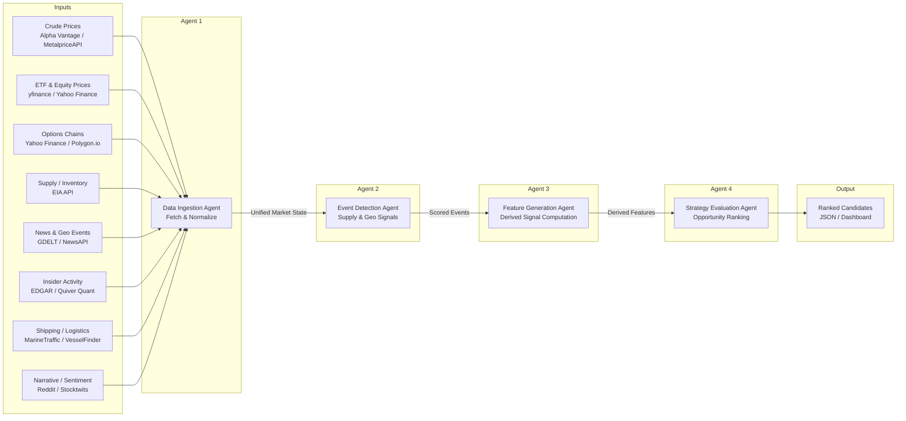

# Energy Options Opportunity Agent — User Guide

> **Version 1.0 · March 2026**
> Advisory only. This system surfaces ranked options candidates; it does **not** execute trades automatically.

---

## Table of Contents

1. [Overview](#overview)
2. [Prerequisites](#prerequisites)
3. [Setup & Configuration](#setup--configuration)
4. [Running the Pipeline](#running-the-pipeline)
5. [Interpreting the Output](#interpreting-the-output)
6. [Troubleshooting](#troubleshooting)

---

## Overview

The **Energy Options Opportunity Agent** is a modular, four-agent Python pipeline that identifies options trading opportunities driven by oil market instability. It ingests market data, supply signals, news events, and alternative datasets, then produces structured, ranked candidate options strategies with full signal explainability.

### Pipeline Architecture



### In-Scope Instruments & Structures

| Category | Items |
|---|---|
| **Crude futures** | Brent Crude, WTI (`CL=F`) |
| **ETFs** | USO, XLE |
| **Energy equities** | XOM (ExxonMobil), CVX (Chevron) |
| **Option structures (MVP)** | Long straddles, call/put spreads, calendar spreads |

> **Out of scope (initially):** exotic/multi-legged strategies, regional refined product pricing (OPIS), automated trade execution.

---

## Prerequisites

### System Requirements

| Requirement | Minimum |
|---|---|
| Python | 3.10+ |
| OS | Linux, macOS, or Windows (WSL recommended) |
| RAM | 2 GB |
| Disk | 5 GB free (for 6–12 months of historical data) |
| Network | Outbound HTTPS to data provider APIs |

### Python Dependencies

Install all dependencies from the project root:

```bash
pip install -r requirements.txt
```

Key packages include:

| Package | Purpose |
|---|---|
| `yfinance` | ETF, equity, and options chain data |
| `requests` | REST calls to EIA, Alpha Vantage, NewsAPI, GDELT |
| `pandas` / `numpy` | Data normalization and feature computation |
| `schedule` | Cadenced pipeline execution |
| `pydantic` | Output schema validation |
| `python-dotenv` | Environment variable management |

### API Accounts

Register for free-tier access to the following services before configuring the pipeline:

| Service | Sign-up URL | Cost |
|---|---|---|
| Alpha Vantage | https://www.alphavantage.co/support/#api-key | Free |
| EIA API | https://www.eia.gov/opendata/ | Free |
| NewsAPI | https://newsapi.org/register | Free tier |
| Polygon.io | https://polygon.io/ | Free / Limited |
| Quiver Quant | https://www.quiverquant.com/ | Free / Limited |
| GDELT | https://www.gdeltproject.org/ | Free (no key required) |
| MarineTraffic | https://www.marinetraffic.com/en/ais-api-services | Free tier |

---

## Setup & Configuration

### 1. Clone the Repository

```bash
git clone https://github.com/your-org/energy-options-agent.git
cd energy-options-agent
```

### 2. Create a Virtual Environment

```bash
python -m venv .venv
source .venv/bin/activate        # Linux / macOS
# .venv\Scripts\activate         # Windows
pip install -r requirements.txt
```

### 3. Configure Environment Variables

Copy the example environment file and populate your API keys:

```bash
cp .env.example .env
```

Open `.env` in your editor and fill in each value. The full set of supported variables is listed below.

#### Environment Variable Reference

| Variable | Required | Description | Example |
|---|---|---|---|
| `ALPHA_VANTAGE_API_KEY` | Yes | API key for crude price feeds (WTI, Brent) | `ABCD1234` |
| `EIA_API_KEY` | Yes | API key for EIA inventory and refinery utilization data | `abcd1234efgh` |
| `NEWS_API_KEY` | Yes | API key for NewsAPI energy headline feeds | `abc123xyz` |
| `POLYGON_API_KEY` | Recommended | API key for Polygon.io options chain data | `pqr456` |
| `QUIVER_API_KEY` | Optional | API key for Quiver Quant insider trade data | `quiver_xyz` |
| `MARINETRAFFIC_API_KEY` | Optional | API key for MarineTraffic tanker flow data | `mt_abc789` |
| `DATA_DIR` | Yes | Absolute path for persisted raw and derived data | `/data/energy-agent` |
| `OUTPUT_DIR` | Yes | Directory where JSON candidate files are written | `/data/energy-agent/output` |
| `LOG_LEVEL` | No | Logging verbosity: `DEBUG`, `INFO`, `WARNING`, `ERROR` | `INFO` |
| `MARKET_REFRESH_INTERVAL_SECONDS` | No | Cadence for market data refresh (minutes-level). Default: `300` | `300` |
| `EIA_REFRESH_INTERVAL_HOURS` | No | Cadence for EIA/EDGAR slow feeds. Default: `24` | `24` |
| `HISTORY_RETENTION_DAYS` | No | Days of historical data to retain. Minimum recommended: `180` | `365` |
| `MIN_EDGE_SCORE` | No | Minimum edge score threshold for emitting candidates. Default: `0.0` | `0.20` |

#### Example `.env`

```dotenv
ALPHA_VANTAGE_API_KEY=YOUR_KEY_HERE
EIA_API_KEY=YOUR_KEY_HERE
NEWS_API_KEY=YOUR_KEY_HERE
POLYGON_API_KEY=YOUR_KEY_HERE
QUIVER_API_KEY=YOUR_KEY_HERE
MARINETRAFFIC_API_KEY=YOUR_KEY_HERE

DATA_DIR=/data/energy-agent
OUTPUT_DIR=/data/energy-agent/output

LOG_LEVEL=INFO
MARKET_REFRESH_INTERVAL_SECONDS=300
EIA_REFRESH_INTERVAL_HOURS=24
HISTORY_RETENTION_DAYS=365
MIN_EDGE_SCORE=0.20
```

### 4. Initialize the Data Directories

```bash
python -m agent.cli init
```

This creates `DATA_DIR` and `OUTPUT_DIR` if they do not exist and validates that required environment variables are set.

---

## Running the Pipeline

### Pipeline Execution Modes

The pipeline supports two execution modes:

| Mode | Command | Use Case |
|---|---|---|
| **One-shot** | `python -m agent.cli run` | Run all four agents once and exit |
| **Scheduled / continuous** | `python -m agent.cli run --watch` | Run on cadence defined by `MARKET_REFRESH_INTERVAL_SECONDS` |

### One-Shot Run

Executes all four agents in sequence and writes results to `OUTPUT_DIR`:

```bash
python -m agent.cli run
```

Expected console output:

```
[INFO] 2026-03-15T09:00:00Z  Data Ingestion Agent   started
[INFO] 2026-03-15T09:00:04Z  Data Ingestion Agent   completed  (instruments=6, options_chains=4)
[INFO] 2026-03-15T09:00:04Z  Event Detection Agent  started
[INFO] 2026-03-15T09:00:06Z  Event Detection Agent  completed  (events_detected=3)
[INFO] 2026-03-15T09:00:06Z  Feature Generation Agent  started
[INFO] 2026-03-15T09:00:07Z  Feature Generation Agent  completed  (features_computed=6)
[INFO] 2026-03-15T09:00:07Z  Strategy Evaluation Agent started
[INFO] 2026-03-15T09:00:08Z  Strategy Evaluation Agent completed  (candidates=5)
[INFO] 2026-03-15T09:00:08Z  Output written → /data/energy-agent/output/candidates_20260315T090008Z.json
```

### Scheduled / Continuous Run

Runs the pipeline on the cadence set by `MARKET_REFRESH_INTERVAL_SECONDS` (default: every 5 minutes for market data; slow feeds refresh per `EIA_REFRESH_INTERVAL_HOURS`):

```bash
python -m agent.cli run --watch
```

Stop with `Ctrl+C`.

### Running Individual Agents

Each agent can be invoked independently for development or debugging:

```bash
# Agent 1 — Data Ingestion only
python -m agent.cli run --agent ingestion

# Agent 2 — Event Detection only (requires market state from a prior ingestion run)
python -m agent.cli run --agent events

# Agent 3 — Feature Generation only
python -m agent.cli run --agent features

# Agent 4 — Strategy Evaluation only
python -m agent.cli run --agent strategy
```

### Deploying with Docker (Optional)

A single-container deployment is supported for low-cost cloud or local VM use:

```bash
# Build the image
docker build -t energy-options-agent:latest .

# Run with your .env file mounted
docker run --env-file .env \
  -v /data/energy-agent:/data/energy-agent \
  energy-options-agent:latest \
  python -m agent.cli run --watch
```

---

## Interpreting the Output

### Output Location

Each pipeline run writes a timestamped JSON file to `OUTPUT_DIR`:

```
/data/energy-agent/output/candidates_20260315T090008Z.json
```

### Output Schema

Each file contains a JSON array of strategy candidate objects:

| Field | Type | Description |
|---|---|---|
| `instrument` | `string` | Target instrument: `USO`, `XLE`, `CL=F`, `XOM`, `CVX` |
| `structure` | `enum` | `long_straddle` \| `call_spread` \| `put_spread` \| `calendar_spread` |
| `expiration` | `integer` | Target expiration in **calendar days** from the evaluation date |
| `edge_score` | `float [0.0–1.0]` | Composite opportunity score — higher values indicate stronger signal confluence |
| `signals` | `object` | Map of contributing signals and their qualitative levels |
| `generated_at` | `ISO 8601 datetime` | UTC timestamp of candidate generation |

### Example Candidate Object

```json
{
  "instrument": "USO",
  "structure": "long_straddle",
  "expiration": 30,
  "edge_score": 0.47,
  "signals": {
    "tanker_disruption_index": "high",
    "volatility_gap": "positive",
    "narrative_velocity": "rising"
  },
  "generated_at": "2026-03-15T09:00:08Z"
}
```

### Understanding `edge_score`

The `edge_score` is a composite float between `0.0` and `1.0` that reflects the degree of signal confluence supporting a candidate strategy. It is **not** a probability of profit.

| Range | Interpretation |
|---|---|
| `0.00 – 0.19` | Weak signal; little confluence across data layers |
| `0.20 – 0.39` | Moderate signal; one or two layers aligned |
| `0.40 – 0.59` | Meaningful signal; multiple independent signals converging |
| `0.60 – 0.79` | Strong signal; broad cross-layer agreement |
| `0.80 – 1.00` | Very strong signal; near-maximum confluence |

Use `MIN_EDGE_SCORE` in `.env` to filter out low-confidence candidates before they are written to output.

### Understanding `signals`

Each key in the `signals` object names the contributing derived feature. Common signal keys and their meaning:

| Signal Key | Source Agent | Meaning |
|---|---|---|
| `volatility_gap` | Feature Generation | Difference between realized and implied volatility; `positive` means IV is elevated relative to realized |
| `futures_curve_steepness` | Feature Generation | Degree of contango or backwardation in the crude futures curve |
| `sector_dispersion` | Feature Generation | Cross-asset spread within energy equities |
| `insider_conviction_score` | Feature Generation | Aggregated strength of recent executive trade filings |
| `narrative_velocity` | Feature Generation | Rate of change in energy-related headline volume (Reddit, Stocktwits, NewsAPI) |
| `supply_shock_probability` | Feature Generation | Modeled probability of a supply disruption based on EIA, event, and shipping data |
| `tanker_disruption_index` | Event Detection | Intensity of detected tanker chokepoint or rerouting events |
| `geopolitical_event_score` | Event Detection | Confidence-weighted intensity of detected geopolitical supply risk |

### Consuming Output in thinkorswim or Other Tools

The JSON output is compatible with any dashboard or tool that can consume JSON. To load the latest candidate file in Python:

```python
import json
import glob
import os

output_dir = "/data/energy-agent/output"
latest = max(glob.glob(os.path.join(output_dir, "candidates_*.json")))

with open(latest) as f:
    candidates = json.load(f)

# Sort by edge_score descending
ranked = sorted(candidates, key=lambda c: c["edge_score"], reverse=True)
for c in ranked:
    print(f"{c['edge_score']:.2f}  {c['instrument']:6s}  {c['structure']:16s}  exp={c['expiration']}d")
```

---

## Troubleshooting

### Common Issues

#### Pipeline fails immediately on startup

**Symptom:** `EnvironmentError: Missing required variable: EIA_API_KEY`

**Fix:** Ensure all required variables are set in `.env` and that you have run `source .venv/bin/activate` before invoking the CLI.

```bash
python -m agent.cli validate-config    # Checks all required env vars
```

---

#### No candidates written to output

**Symptom:** Pipeline completes successfully but the output JSON is an empty array `[]`.

**Causes and fixes:**

| Cause | Fix |
|---|---|
| `MIN_EDGE_SCORE` is set too high | Lower the value in `.env` (try `0.0` to see all candidates) |
| Options chain data returned empty | Check `POLYGON_API_KEY` validity; the free tier has rate limits — fall back to Yahoo Finance |
| Insufficient historical data for volatility calculations | Wait for at least one full trading day of ingestion runs, or lower the minimum lookback period in `config.yaml` |

---

#### Stale or missing data for a specific