# Energy Options Opportunity Agent — User Guide

> **Version 1.0 • March 2026**
> This guide walks a developer through setting up, configuring, and running the full four-agent pipeline from a clean environment to ranked options candidates.

---

## Table of Contents

1. [Overview](#overview)
2. [Prerequisites](#prerequisites)
3. [Setup & Configuration](#setup--configuration)
4. [Running the Pipeline](#running-the-pipeline)
5. [Interpreting the Output](#interpreting-the-output)
6. [Troubleshooting](#troubleshooting)

---

## Overview

The **Energy Options Opportunity Agent** is a modular Python pipeline that identifies options trading opportunities driven by oil market instability. Four loosely coupled agents execute in sequence, sharing data through a central market state object and a derived features store.

```mermaid
flowchart LR
    subgraph Inputs
        A1[Crude Prices\nAlpha Vantage / MetalpriceAPI]
        A2[ETF & Equity Prices\nyfinance / Yahoo Finance]
        A3[Options Chains\nYahoo Finance / Polygon.io]
        A4[Supply & Inventory\nEIA API]
        A5[News & Geo Events\nGDELT / NewsAPI]
        A6[Insider Activity\nEDGAR / Quiver Quant]
        A7[Shipping / Logistics\nMarineTraffic / VesselFinder]
        A8[Narrative & Sentiment\nReddit / Stocktwits]
    end

    subgraph Pipeline
        direction TB
        P1["① Data Ingestion Agent\nFetch & Normalize"]
        P2["② Event Detection Agent\nSupply & Geo Signals"]
        P3["③ Feature Generation Agent\nDerived Signal Computation"]
        P4["④ Strategy Evaluation Agent\nOpportunity Ranking"]
    end

    subgraph Output
        O1[Ranked Candidates\nJSON / Dashboard]
    end

    Inputs --> P1
    P1 -->|market state object| P2
    P2 -->|scored events| P3
    P3 -->|derived features store| P4
    P4 --> O1
```



### What each agent does

| # | Agent | Role | Key outputs |
|---|-------|------|-------------|
| 1 | **Data Ingestion Agent** | Fetch & Normalize | Unified market state object; historical price/vol store |
| 2 | **Event Detection Agent** | Supply & Geo Signals | Events with confidence and intensity scores |
| 3 | **Feature Generation Agent** | Derived Signal Computation | Volatility gaps, curve steepness, supply shock probability, narrative velocity, etc. |
| 4 | **Strategy Evaluation Agent** | Opportunity Ranking | Ranked candidate list with edge scores and signal attribution |

Data flows **unidirectionally**; no agent writes back to an upstream stage. Output is a JSON-compatible structure suitable for thinkorswim or any JSON-capable dashboard.

> **Advisory only.** The system produces ranked recommendations. No automated trade execution is performed.

---

## Prerequisites

### System requirements

| Requirement | Minimum |
|-------------|---------|
| OS | Linux, macOS, or Windows (WSL2 recommended) |
| Python | 3.10 or later |
| RAM | 2 GB free |
| Disk | 5 GB free (6–12 months of historical data storage) |
| Network | Outbound HTTPS to external data sources |

### Python dependencies

The project uses a standard `requirements.txt`. Install into a virtual environment:

```bash
# Create and activate a virtual environment
python3 -m venv .venv
source .venv/bin/activate          # Windows: .venv\Scripts\activate

# Install dependencies
pip install --upgrade pip
pip install -r requirements.txt
```

### API accounts

All required data sources are free or offer a free tier. Register and obtain API keys before running the pipeline.

| Data source | Sign-up URL | Free tier notes |
|-------------|-------------|-----------------|
| Alpha Vantage | https://www.alphavantage.co/support/#api-key | Free; rate-limited |
| MetalpriceAPI | https://metalpriceapi.com/ | Free tier available |
| Polygon.io | https://polygon.io/ | Free tier; options data limited |
| EIA API | https://www.eia.gov/opendata/ | Fully free |
| NewsAPI | https://newsapi.org/ | Free developer plan |
| GDELT | https://www.gdeltproject.org/ | No key required |
| SEC EDGAR | https://efts.sec.gov/LATEST/search-index | No key required |
| Quiver Quant | https://www.quiverquant.com/ | Free/limited tier |
| MarineTraffic | https://www.marinetraffic.com/en/p/api-services | Free tier available |
| Reddit API (PRAW) | https://www.reddit.com/prefs/apps | Free; OAuth required |
| Stocktwits | https://api.stocktwits.com/developers | Free public stream |

> **Tip:** Keys for GDELT and SEC EDGAR are not required, but the remaining sources each require at least one registered key.

---

## Setup & Configuration

### 1 — Clone the repository

```bash
git clone https://github.com/your-org/energy-options-agent.git
cd energy-options-agent
```

### 2 — Create the environment file

Copy the provided template and populate it with your credentials:

```bash
cp .env.example .env
```

Open `.env` in your editor and fill in every variable listed in the table below.

### Environment variables reference

All runtime behaviour is controlled through environment variables. No values are hard-coded.

| Variable | Required | Default | Description |
|----------|----------|---------|-------------|
| `ALPHA_VANTAGE_API_KEY` | ✅ | — | API key for Alpha Vantage crude price feed |
| `METALPRICE_API_KEY` | ✅ | — | API key for MetalpriceAPI crude benchmarks |
| `POLYGON_API_KEY` | ✅ | — | API key for Polygon.io options chain data |
| `EIA_API_KEY` | ✅ | — | API key for EIA supply/inventory feed |
| `NEWS_API_KEY` | ✅ | — | API key for NewsAPI geopolitical/energy headlines |
| `QUIVER_QUANT_API_KEY` | ⬜ | — | API key for Quiver Quant insider activity (Phase 3) |
| `MARINETRAFFIC_API_KEY` | ⬜ | — | API key for MarineTraffic tanker/shipping data (Phase 3) |
| `REDDIT_CLIENT_ID` | ⬜ | — | Reddit OAuth client ID for sentiment feed (Phase 3) |
| `REDDIT_CLIENT_SECRET` | ⬜ | — | Reddit OAuth client secret (Phase 3) |
| `REDDIT_USER_AGENT` | ⬜ | `energy-agent/1.0` | User-agent string for Reddit PRAW client |
| `STOCKTWITS_ACCESS_TOKEN` | ⬜ | — | Optional Stocktwits OAuth token (Phase 3) |
| `DATA_REFRESH_INTERVAL_MINUTES` | ⬜ | `5` | How often the ingestion agent refreshes market data |
| `EIA_REFRESH_INTERVAL_HOURS` | ⬜ | `24` | How often the EIA inventory feed is polled |
| `HISTORICAL_RETENTION_DAYS` | ⬜ | `365` | Days of raw and derived data to retain on disk |
| `OUTPUT_PATH` | ⬜ | `./output/candidates.json` | Path where the ranked candidate JSON is written |
| `LOG_LEVEL` | ⬜ | `INFO` | Logging verbosity: `DEBUG`, `INFO`, `WARNING`, `ERROR` |
| `PIPELINE_PHASE` | ⬜ | `2` | Active feature phase: `1`, `2`, or `3` (see [MVP Phasing](#mvp-phasing)) |

> **Security:** Never commit `.env` to version control. The repository's `.gitignore` excludes it by default.

### 3 — Initialise the local data store

Run the initialisation script to create the SQLite database and directory structure used for historical storage:

```bash
python scripts/init_db.py
```

Expected output:

```
[INFO] Creating data directory: ./data
[INFO] Initialising historical store: ./data/market_history.db
[INFO] Schema applied. Retention policy set to 365 days.
[INFO] Initialisation complete.
```

### MVP Phasing

Set `PIPELINE_PHASE` to control which data layers and signals are active. Start with Phase 1 or 2 until all required API keys are available.

| `PIPELINE_PHASE` | Active capabilities |
|-----------------|---------------------|
| `1` | WTI & Brent prices, USO/XLE/XOM/CVX, options surface (IV, strikes), long straddles and call/put spreads |
| `2` | Phase 1 **+** EIA inventory & refinery utilisation, GDELT/NewsAPI event detection, supply disruption scoring |
| `3` | Phase 2 **+** EDGAR/Quiver insider activity, Reddit/Stocktwits narrative velocity, MarineTraffic shipping flows, calendar spreads, full edge scoring |

---

## Running the Pipeline

### Single run (one-shot)

Execute all four agents in sequence and write results to the configured output path:

```bash
python run_pipeline.py
```

Typical console output:

```
[INFO] Pipeline start — phase=2
[INFO] [1/4] DataIngestionAgent   — fetching market state ...  done (4.2 s)
[INFO] [2/4] EventDetectionAgent  — scanning news & supply feeds ... done (2.8 s)
[INFO] [3/4] FeatureGenerationAgent — computing derived signals ... done (1.1 s)
[INFO] [4/4] StrategyEvaluationAgent — ranking candidates ... done (0.4 s)
[INFO] 7 candidates written → ./output/candidates.json
[INFO] Pipeline complete in 8.5 s
```

### Scheduled continuous run

For a minutes-cadence refresh, use the built-in scheduler:

```bash
python run_pipeline.py --schedule
```

The scheduler honours `DATA_REFRESH_INTERVAL_MINUTES` for market data and `EIA_REFRESH_INTERVAL_HOURS` for slower feeds. Press `Ctrl+C` to stop.

### Running individual agents

Each agent can be invoked independently for testing or debugging:

```bash
# Run only the Data Ingestion Agent
python -m agents.data_ingestion

# Run only the Event Detection Agent (requires a valid market state on disk)
python -m agents.event_detection

# Run only the Feature Generation Agent
python -m agents.feature_generation

# Run only the Strategy Evaluation Agent
python -m agents.strategy_evaluation
```

### Docker (optional)

A `Dockerfile` and `docker-compose.yml` are provided for containerised deployment on a single VM:

```bash
# Build the image
docker build -t energy-options-agent:latest .

# Run with your .env file
docker run --env-file .env \
           -v $(pwd)/data:/app/data \
           -v $(pwd)/output:/app/output \
           energy-options-agent:latest
```

For scheduled continuous operation inside the container, pass the `--schedule` flag:

```bash
docker run --env-file .env \
           -v $(pwd)/data:/app/data \
           -v $(pwd)/output:/app/output \
           energy-options-agent:latest python run_pipeline.py --schedule
```

### CLI flags summary

| Flag | Description |
|------|-------------|
| `--schedule` | Run on the configured refresh cadence instead of exiting after one pass |
| `--phase N` | Override `PIPELINE_PHASE` env var for this run only |
| `--output PATH` | Override `OUTPUT_PATH` env var for this run only |
| `--log-level LEVEL` | Override `LOG_LEVEL` env var for this run only |
| `--dry-run` | Execute ingestion and feature generation but skip writing output |

---

## Interpreting the Output

### Output file location

By default, ranked candidates are written to:

```
./output/candidates.json
```

The file contains a JSON array; each element is one strategy candidate.

### Candidate schema

| Field | Type | Description |
|-------|------|-------------|
| `instrument` | `string` | Target instrument symbol, e.g. `"USO"`, `"XLE"`, `"CL=F"` |
| `structure` | `enum` | Options structure: `long_straddle` \| `call_spread` \| `put_spread` \| `calendar_spread` |
| `expiration` | `integer` | Target expiration in calendar days from evaluation date |
| `edge_score` | `float [0.0–1.0]` | Composite opportunity score; **higher = stronger signal confluence** |
| `signals` | `object` | Map of contributing signals and their qualitative state |
| `generated_at` | `ISO 8601` | UTC timestamp of candidate generation |

### Example output

```json
[
  {
    "instrument": "USO",
    "structure": "long_straddle",
    "expiration": 30,
    "edge_score": 0.47,
    "signals": {
      "tanker_disruption_index": "high",
      "volatility_gap": "positive",
      "narrative_velocity": "rising"
    },
    "generated_at": "2026-03-15T14:32:00Z"
  },
  {
    "instrument": "XLE",
    "structure": "call_spread",
    "expiration": 21,
    "edge_score": 0.31,
    "signals": {
      "volatility_gap": "positive",
      "supply_shock_probability": "elevated",
      "sector_dispersion": "widening"
    },
    "generated_at": "2026-03-15T14:32:00Z"
  }
]
```

### Reading the edge score

| `edge_score` range | Interpretation |
|-------------------|----------------|
| `0.70 – 1.00` | Strong signal confluence; high-priority candidate |
| `0.45 – 0.69` | Moderate confluence; warrants further review |
| `0.20 – 0.44` | Weak or early signal; monitor but low urgency |
| `0.00 – 0.19` | Minimal evidence; candidate included for completeness |

### Reading the signals map

The `signals` object provides the explainability layer. Each key is a derived feature; each value is a qualitative state.

| Signal key | What it measures | Typical states |
|------------|-----------------|----------------|
| `volatility_gap` | Realized vs. implied volatility delta | `positive`, `negative`, `neutral` |
| `futures_curve_steepness` | Contango / backwardation steepness | `steep_contango`, `flat`, `backwardation` |
| `sector_dispersion` | Spread between energy sub-sector returns | `widening`, `stable`, `narrowing` |
| `insider_conviction_score` | Net direction of executive trades | `bullish`, `bearish`, `neutral` |
| `narrative_velocity` | Rate of headline acceleration | `rising`, `stable`, `falling` |
| `supply_shock_probability` | Probability of near-term supply disruption | `elevated`, `moderate`, `low` |
| `tanker_disruption_index` | Tanker chokepoint or routing anomalies | `high`, `medium`, `low` |

### Visualising results in thinkorswim

The JSON output is compatible with any thinkorswim thinkScript watchlist or external study that accepts a JSON file feed. Point the import path at `./output/candidates.json` and filter by `edge_score` to surface top-ranked candidates.

---

## Troubleshooting

### Diagnostic checklist

Run the built-in health check before filing a bug:

```bash
python scripts/health_check.py
```

This validates API connectivity for every configured key and reports which data sources are reachable.

### Common issues

#### Pipeline exits with `MissingAPIKeyError`

```
agents.data_ingestion.Missing