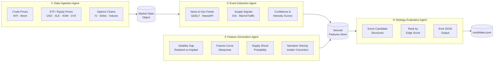
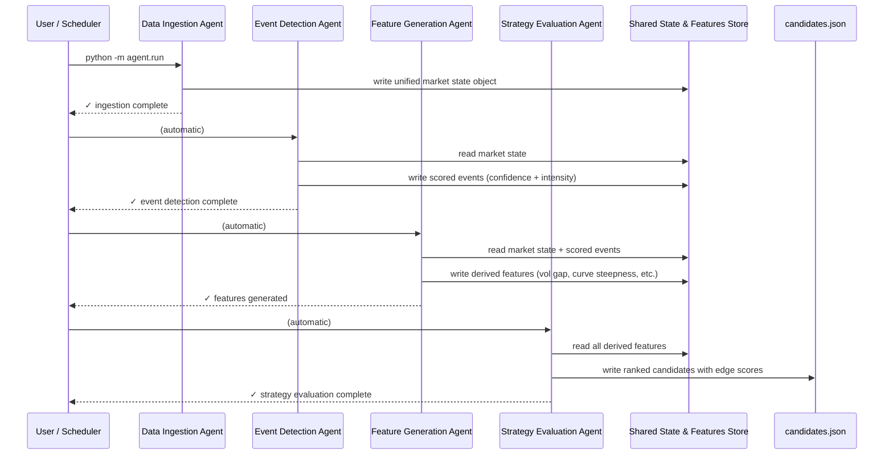

# Energy Options Opportunity Agent — User Guide

> **Version 1.0 • March 2026**
> This guide walks you through installing, configuring, and running the full Energy Options Opportunity Agent pipeline. It assumes familiarity with Python (3.10+) and standard CLI tooling.

---

## Table of Contents

1. [Overview](#overview)
2. [Prerequisites](#prerequisites)
3. [Setup & Configuration](#setup--configuration)
4. [Running the Pipeline](#running-the-pipeline)
5. [Interpreting the Output](#interpreting-the-output)
6. [Troubleshooting](#troubleshooting)

---

## Overview

The Energy Options Opportunity Agent is an autonomous, modular pipeline that identifies options trading opportunities driven by oil market instability. It ingests market data, supply signals, news events, and alternative datasets to produce structured, ranked candidate options strategies.

The pipeline is composed of **four loosely coupled agents** that execute in a fixed sequence, each writing results to a shared state store consumed by the next stage.



### Key design properties

| Property | Description |
|---|---|
| **Advisory only** | No automated trade execution — all output is informational. |
| **Explainable** | Every ranked candidate includes contributing signal references. |
| **Resilient** | Tolerates delayed or missing data without pipeline failure. |
| **Lightweight** | Runs on local hardware or a single low-cost VM / container. |
| **Modular** | Each agent is independently deployable and updatable. |

### In-scope instruments (MVP)

| Type | Instruments |
|---|---|
| Crude futures | WTI (`CL=F`), Brent (`BZ=F`) |
| ETFs | USO, XLE |
| Energy equities | XOM (Exxon Mobil), CVX (Chevron) |

### In-scope option structures (MVP)

`long_straddle` · `call_spread` · `put_spread` · `calendar_spread`

---

## Prerequisites

### System requirements

| Requirement | Minimum |
|---|---|
| Python | 3.10 or later |
| RAM | 2 GB |
| Disk (data retention) | 10 GB (supports 6–12 months of historical data) |
| OS | Linux, macOS, or Windows (WSL2 recommended) |

### External accounts & API keys

All required data sources are free or free-tier. Register for the following before proceeding:

| Service | Purpose | Sign-up URL |
|---|---|---|
| Alpha Vantage | WTI / Brent crude prices | <https://www.alphavantage.co/support/#api-key> |
| Polygon.io | Options chains (supplementary) | <https://polygon.io/> |
| EIA Open Data | Inventory & refinery utilization | <https://www.eia.gov/opendata/> |
| NewsAPI | News & geopolitical headlines | <https://newsapi.org/register> |
| SEC EDGAR | Insider activity (EDGAR full-text) | No key required — public API |
| MarineTraffic | Tanker / shipping flows (free tier) | <https://www.marinetraffic.com/en/p/api-services> |

> **Note:** `yfinance` and GDELT require no API key. Reddit / Stocktwits public endpoints are unauthenticated at free-tier usage volumes.

### Python dependencies

```bash
pip install -r requirements.txt
```

A minimal `requirements.txt` includes:

```text
yfinance>=0.2
requests>=2.31
pandas>=2.0
numpy>=1.26
python-dotenv>=1.0
```

---

## Setup & Configuration

### 1. Clone the repository

```bash
git clone https://github.com/your-org/energy-options-agent.git
cd energy-options-agent
```

### 2. Create and activate a virtual environment

```bash
python -m venv .venv
source .venv/bin/activate        # macOS / Linux
# .venv\Scripts\activate         # Windows (PowerShell)
```

### 3. Install dependencies

```bash
pip install -r requirements.txt
```

### 4. Configure environment variables

Copy the provided template and populate your credentials:

```bash
cp .env.example .env
```

Open `.env` in your editor and fill in each value:

```dotenv
# --- Data Ingestion ---
ALPHA_VANTAGE_API_KEY=your_alpha_vantage_key
POLYGON_API_KEY=your_polygon_key
EIA_API_KEY=your_eia_key

# --- Event Detection ---
NEWS_API_KEY=your_newsapi_key
GDELT_ENABLED=true                  # set false to disable GDELT polling

# --- Alternative Signals ---
MARINE_TRAFFIC_API_KEY=your_mt_key
REDDIT_CLIENT_ID=your_reddit_client_id
REDDIT_CLIENT_SECRET=your_reddit_client_secret
REDDIT_USER_AGENT=energy-agent/1.0

# --- Storage ---
DATA_DIR=./data                     # root directory for raw and derived data
RETENTION_DAYS=365                  # 6–12 months; 180–365 recommended

# --- Pipeline Behaviour ---
MARKET_DATA_INTERVAL_MINUTES=5      # cadence for minute-level market data refresh
LOG_LEVEL=INFO                      # DEBUG | INFO | WARNING | ERROR
OUTPUT_PATH=./output/candidates.json
```

#### Full environment variable reference

| Variable | Required | Default | Description |
|---|---|---|---|
| `ALPHA_VANTAGE_API_KEY` | Yes | — | Crude price feed (WTI, Brent) |
| `POLYGON_API_KEY` | Recommended | — | Options chain data (strike, expiry, IV, volume) |
| `EIA_API_KEY` | Yes (Phase 2+) | — | Weekly inventory & refinery utilization |
| `NEWS_API_KEY` | Yes (Phase 2+) | — | Energy news headlines |
| `GDELT_ENABLED` | No | `true` | Toggle GDELT geopolitical feed |
| `MARINE_TRAFFIC_API_KEY` | No (Phase 3+) | — | Tanker flow data |
| `REDDIT_CLIENT_ID` | No (Phase 3+) | — | Reddit API OAuth client ID |
| `REDDIT_CLIENT_SECRET` | No (Phase 3+) | — | Reddit API OAuth client secret |
| `REDDIT_USER_AGENT` | No (Phase 3+) | `energy-agent/1.0` | Reddit API user-agent string |
| `DATA_DIR` | No | `./data` | Root path for raw and derived data storage |
| `RETENTION_DAYS` | No | `365` | Days of historical data to retain |
| `MARKET_DATA_INTERVAL_MINUTES` | No | `5` | Polling cadence for market price feeds |
| `LOG_LEVEL` | No | `INFO` | Logging verbosity |
| `OUTPUT_PATH` | No | `./output/candidates.json` | File path for JSON candidate output |

> **Security:** Never commit `.env` to version control. The repository's `.gitignore` excludes it by default.

### 5. Initialise the data directory

```bash
python -m agent.init_storage
```

This creates the subdirectory structure under `DATA_DIR`:

```
data/
├── raw/          # unprocessed feed snapshots
├── derived/      # computed features and scored events
└── archive/      # data older than RETENTION_DAYS (pruned on each run)
```

---

## Running the Pipeline

### Pipeline sequence

Each run executes all four agents in order. The diagram below shows the sequence for a single pipeline invocation:



### Run once (manual)

```bash
python -m agent.run
```

On success you will see console output similar to:

```
[INFO]  2026-03-15T09:00:01Z  Data Ingestion Agent    — complete (4 instruments, 3 chains fetched)
[INFO]  2026-03-15T09:00:04Z  Event Detection Agent   — complete (2 events scored)
[INFO]  2026-03-15T09:00:06Z  Feature Generation Agent — complete (6 signals computed)
[INFO]  2026-03-15T09:00:09Z  Strategy Evaluation Agent — complete (5 candidates ranked)
[INFO]  2026-03-15T09:00:09Z  Output written to ./output/candidates.json
```

### Run a single agent in isolation

Each agent exposes its own entry point, useful during development or when re-running a single stage after a data update:

```bash
python -m agent.ingest          # Data Ingestion Agent only
python -m agent.detect_events   # Event Detection Agent only
python -m agent.generate_features  # Feature Generation Agent only
python -m agent.evaluate_strategies  # Strategy Evaluation Agent only
```

> **Dependency note:** Each agent reads from the shared state written by the prior stage. Running an agent in isolation without a populated store from the preceding stage will log a warning and fall back to the most recent persisted snapshot.

### Schedule recurring runs

For continuous operation, use `cron` (Linux/macOS) or Task Scheduler (Windows).

**Example: run every 5 minutes during market hours (cron)**

```cron
*/5 9-16 * * 1-5  cd /path/to/energy-options-agent && .venv/bin/python -m agent.run >> logs/pipeline.log 2>&1
```

**Example: run with Docker**

```bash
docker build -t energy-options-agent .
docker run --env-file .env -v $(pwd)/data:/app/data -v $(pwd)/output:/app/output \
  energy-options-agent python -m agent.run
```

### Phased feature flags

The pipeline respects MVP phasing via environment flags. Features from later phases are no-ops unless the relevant keys and flags are present:

| Phase | Activated by |
|---|---|
| Phase 1 — Core market signals | `ALPHA_VANTAGE_API_KEY` + `POLYGON_API_KEY` present |
| Phase 2 — Supply & event augmentation | `EIA_API_KEY` + `NEWS_API_KEY` present |
| Phase 3 — Alternative / contextual signals | `MARINE_TRAFFIC_API_KEY` and/or Reddit credentials present |
| Phase 4 — High-fidelity enhancements | Not included in MVP; see [Future Considerations](#future-considerations) |

---

## Interpreting the Output

### Output file

The pipeline writes results to the path specified by `OUTPUT_PATH` (default `./output/candidates.json`). The file contains a JSON array of candidate objects, sorted by `edge_score` descending.

### Output schema

| Field | Type | Description |
|---|---|---|
| `instrument` | string | Target instrument, e.g. `USO`, `XLE`, `CL=F` |
| `structure` | enum | `long_straddle` · `call_spread` · `put_spread` · `calendar_spread` |
| `expiration` | integer (days) | Calendar days from evaluation date to target expiration |
| `edge_score` | float `[0.0–1.0]` | Composite opportunity score; higher = stronger signal confluence |
| `signals` | object | Map of contributing signals and their current state |
| `generated_at` | ISO 8601 datetime | UTC timestamp of candidate generation |

### Example candidate

```json
{
  "instrument": "USO",
  "structure": "long_straddle",
  "expiration": 30,
  "edge_score": 0.47,
  "signals": {
    "tanker_disruption_index": "high",
    "volatility_gap": "positive",
    "narrative_velocity": "rising"
  },
  "generated_at": "2026-03-15T09:00:09Z"
}
```

### Reading the edge score

| Range | Interpretation |
|---|---|
| `0.70 – 1.00` | Strong signal confluence — high priority for review |
| `0.40 – 0.69` | Moderate confluence — worth monitoring |
| `0.20 – 0.39` | Weak signal — low confidence, informational only |
| `0.00 – 0.19` | Negligible edge — typically filtered from default output |

### Signal map keys

| Signal key | Source agent | What it measures |
|---|---|---|
| `volatility_gap` | Feature Generation | Realised vs. implied volatility difference |
| `futures_curve_steepness` | Feature Generation | Contango / backwardation of crude futures curve |
| `sector_dispersion` | Feature Generation | Cross-sector price dispersion in energy equities |
| `insider_conviction_score` | Feature Generation | Aggregated insider trade activity (EDGAR / Quiver) |
| `narrative_velocity` | Feature Generation | Headline acceleration across news and social feeds |
| `supply_shock_probability` | Feature Generation | Probability score from EIA + shipping + event signals |
| `tanker_disruption_index` | Event Detection | Severity of tanker chokepoint disruptions |
| `refinery_outage_index` | Event Detection | Confidence-weighted refinery outage signal |
| `geopolitical_intensity` | Event Detection | Geopolitical event intensity from GDELT / NewsAPI |

### Consuming output in thinkorswim

Export the `candidates.json` file and use thinkorswim's **thinkScript** `LoadStudy` or the **Studies → Import** workflow to load the JSON as a watchlist or alert source. Any JSON-capable charting or dashboard tool (e.g., Grafana with a JSON datasource plugin) is also compatible.

---

## Troubleshooting

### Common errors and fixes

| Symptom | Likely cause | Fix |
|---|---|---|
| `KeyError: 'ALPHA_VANTAGE_API_KEY'` | `.env` not loaded or key missing | Confirm `.env` exists, is populated, and