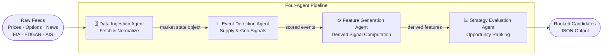
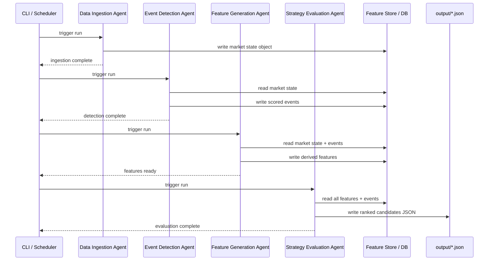

# Energy Options Opportunity Agent — User Guide

> **Version 1.0 • March 2026**
> This guide walks you through installing, configuring, and running the full pipeline end-to-end.

---

## Table of Contents

1. [Overview](#overview)
2. [Prerequisites](#prerequisites)
3. [Setup & Configuration](#setup--configuration)
4. [Running the Pipeline](#running-the-pipeline)
5. [Interpreting the Output](#interpreting-the-output)
6. [Troubleshooting](#troubleshooting)

---

## Overview

The **Energy Options Opportunity Agent** is an autonomous, modular Python pipeline that identifies options trading opportunities driven by oil market instability. It ingests market data, supply signals, news events, and alternative datasets, then produces structured, ranked candidate options strategies.

### What the pipeline does



Data flows **unidirectionally** through four loosely coupled agents that share a market state object and a derived features store:

| Agent | Role | Key Outputs |
|---|---|---|
| **Data Ingestion** | Fetch & normalize | Unified market state object |
| **Event Detection** | Supply & geo signals | Confidence/intensity-scored events |
| **Feature Generation** | Derived signal computation | Volatility gaps, curve steepness, supply shock probability, etc. |
| **Strategy Evaluation** | Opportunity ranking | Ranked candidates with edge scores |

> **Advisory only.** The pipeline recommends strategies but does **not** execute trades automatically.

---

## Prerequisites

### System requirements

| Requirement | Minimum |
|---|---|
| Python | 3.10+ |
| RAM | 2 GB |
| Disk | 10 GB (for 6–12 months of historical data) |
| OS | Linux, macOS, or Windows (WSL2 recommended) |
| Deployment target | Local machine, single VM, or container |

### Required accounts & API keys

All sources listed below are free or have a usable free tier. Obtain credentials before proceeding.

| Source | Used by | Sign-up URL |
|---|---|---|
| Alpha Vantage **or** MetalpriceAPI | Crude prices (WTI, Brent) | https://www.alphavantage.co / https://metalpriceapi.com |
| Yahoo Finance / yfinance | ETF & equity prices (USO, XLE, XOM, CVX) | No key required (public API) |
| Polygon.io | Options chains (strike, expiry, IV, volume) | https://polygon.io |
| EIA Open Data API | Supply/inventory data | https://www.eia.gov/opendata |
| GDELT / NewsAPI | News & geopolitical events | https://www.gdeltproject.org / https://newsapi.org |
| SEC EDGAR / Quiver Quant | Insider activity | https://www.sec.gov/cgi-bin/browse-edgar / https://www.quiverquant.com |
| MarineTraffic / VesselFinder | Shipping & tanker flows | https://www.marinetraffic.com / https://www.vesselfinderapi.com |
| Reddit / Stocktwits | Narrative & sentiment velocity | https://www.reddit.com/prefs/apps / https://stocktwits.com/developers |

### Python dependencies

Install all dependencies from the project root:

```bash
pip install -r requirements.txt
```

Core packages include:

```text
yfinance>=0.2
requests>=2.31
pandas>=2.0
numpy>=1.26
pydantic>=2.0
python-dotenv>=1.0
schedule>=1.2
```

---

## Setup & Configuration

### 1. Clone the repository

```bash
git clone https://github.com/your-org/energy-options-agent.git
cd energy-options-agent
```

### 2. Create and activate a virtual environment

```bash
python -m venv .venv
source .venv/bin/activate        # macOS / Linux
# .venv\Scripts\activate         # Windows (PowerShell)
```

### 3. Install dependencies

```bash
pip install -r requirements.txt
```

### 4. Create the environment file

Copy the provided template and fill in your credentials:

```bash
cp .env.example .env
```

Then open `.env` in your editor and supply values for every variable described in the table below.

### Environment variables reference

All pipeline configuration is managed through environment variables. The `.env` file is loaded automatically at startup via `python-dotenv`.

#### Market data

| Variable | Required | Default | Description |
|---|---|---|---|
| `ALPHA_VANTAGE_API_KEY` | Yes* | — | API key for Alpha Vantage crude price feed |
| `METALPRICE_API_KEY` | Yes* | — | API key for MetalpriceAPI (alternative to Alpha Vantage) |
| `POLYGON_API_KEY` | Yes | — | Polygon.io key for options chain data |
| `USE_YAHOO_OPTIONS` | No | `false` | Set to `true` to fall back to Yahoo Finance for options data |

> \* Provide **one** of `ALPHA_VANTAGE_API_KEY` or `METALPRICE_API_KEY`.

#### Supply & inventory

| Variable | Required | Default | Description |
|---|---|---|---|
| `EIA_API_KEY` | Yes | — | EIA Open Data API key for inventory and refinery utilization |

#### News & geopolitical events

| Variable | Required | Default | Description |
|---|---|---|---|
| `NEWSAPI_KEY` | Yes | — | NewsAPI key for headline ingestion |
| `GDELT_ENABLED` | No | `true` | Set to `false` to disable GDELT (no key required) |

#### Alternative signals

| Variable | Required | Default | Description |
|---|---|---|---|
| `QUIVER_API_KEY` | No | — | Quiver Quant API key for insider activity (Phase 3) |
| `MARINETRAFFIC_API_KEY` | No | — | MarineTraffic API key for tanker flow data (Phase 3) |
| `REDDIT_CLIENT_ID` | No | — | Reddit app client ID for sentiment feeds (Phase 3) |
| `REDDIT_CLIENT_SECRET` | No | — | Reddit app client secret (Phase 3) |
| `STOCKTWITS_ENABLED` | No | `false` | Set to `true` to enable Stocktwits sentiment (Phase 3) |

#### Pipeline behaviour

| Variable | Required | Default | Description |
|---|---|---|---|
| `PIPELINE_CADENCE_MINUTES` | No | `5` | How often the market data refresh cycle runs |
| `SLOW_FEED_CADENCE_HOURS` | No | `24` | Refresh interval for EIA and EDGAR feeds |
| `EDGE_SCORE_THRESHOLD` | No | `0.30` | Minimum edge score for a candidate to appear in output |
| `HISTORICAL_RETENTION_DAYS` | No | `365` | Days of raw and derived data to retain on disk |
| `OUTPUT_DIR` | No | `./output` | Directory where JSON output files are written |
| `LOG_LEVEL` | No | `INFO` | Logging verbosity (`DEBUG`, `INFO`, `WARNING`, `ERROR`) |
| `TZ` | No | `UTC` | Timezone for all timestamps; keep as `UTC` unless you have a specific reason |

### 5. Verify configuration

Run the built-in configuration check before starting the full pipeline:

```bash
python -m agent.cli check-config
```

Expected output (all required keys present):

```
[OK] ALPHA_VANTAGE_API_KEY
[OK] POLYGON_API_KEY
[OK] EIA_API_KEY
[OK] NEWSAPI_KEY
[OK] GDELT_ENABLED = true
[--] QUIVER_API_KEY      (optional — Phase 3 signals disabled)
[--] MARINETRAFFIC_API_KEY (optional — Phase 3 signals disabled)
Configuration check passed. Ready to run.
```

If a required variable is missing, the check prints an error and exits with code `1`:

```
[FAIL] EIA_API_KEY is not set. Export the variable or add it to .env.
```

### 6. Initialise the data store

Create the local SQLite database and seed the schema:

```bash
python -m agent.cli init-db
```

This sets up tables for raw ingested data, derived features, detected events, and strategy candidates. Historical data is retained for the period defined by `HISTORICAL_RETENTION_DAYS`.

---

## Running the Pipeline

### Pipeline execution sequence



### Running a single full pipeline pass

Execute all four agents once in sequence:

```bash
python -m agent.cli run --once
```

You should see per-agent log lines followed by a summary:

```
2026-03-15T09:00:01Z [INFO] DataIngestionAgent  — fetched WTI=82.41, Brent=85.17
2026-03-15T09:00:03Z [INFO] DataIngestionAgent  — options chains loaded for USO, XLE, XOM, CVX
2026-03-15T09:00:04Z [INFO] EventDetectionAgent — 3 events detected (max intensity: 0.74)
2026-03-15T09:00:05Z [INFO] FeatureGenerationAgent — volatility_gap=positive, curve_steepness=contango
2026-03-15T09:00:06Z [INFO] StrategyEvaluationAgent — 5 candidates generated, top edge_score=0.71
2026-03-15T09:00:06Z [INFO] Output written → ./output/candidates_20260315T090006Z.json
```

### Running the pipeline continuously (scheduled mode)

Start the scheduler to refresh market data every `PIPELINE_CADENCE_MINUTES` minutes:

```bash
python -m agent.cli run --continuous
```

The scheduler runs the fast data cycle (prices, options) at the configured minutes-level cadence and the slow cycle (EIA, EDGAR) once every `SLOW_FEED_CADENCE_HOURS` hours. Press `Ctrl+C` to stop.

### Running individual agents

You can run any single agent in isolation for debugging or incremental testing:

```bash
# Data Ingestion only
python -m agent.cli run-agent ingestion

# Event Detection only (reads existing market state)
python -m agent.cli run-agent event-detection

# Feature Generation only (reads existing market state + events)
python -m agent.cli run-agent features

# Strategy Evaluation only (reads existing features)
python -m agent.cli run-agent strategy
```

### Running with Docker

A `Dockerfile` and `docker-compose.yml` are provided for container deployment:

```bash
# Build the image
docker build -t energy-options-agent:latest .

# Run with your .env file mounted
docker run --rm \
  --env-file .env \
  -v "$(pwd)/output:/app/output" \
  -v "$(pwd)/data:/app/data" \
  energy-options-agent:latest \
  python -m agent.cli run --continuous
```

Or use Compose:

```bash
docker compose up
```

### Phased activation

The pipeline supports four development phases. Enable phases progressively by setting the `PIPELINE_PHASE` variable:

```bash
# .env
PIPELINE_PHASE=2   # 1 | 2 | 3 | 4
```

| Phase | Name | Activated signals |
|---|---|---|
| `1` | Core Market Signals & Options | WTI/Brent prices, USO/XLE options surface, IV, long straddles, call/put spreads |
| `2` | Supply & Event Augmentation | + EIA inventory/refinery utilization, GDELT/NewsAPI event detection, supply disruption index |
| `3` | Alternative / Contextual Signals | + Insider trades (EDGAR/Quiver), narrative velocity (Reddit/Stocktwits), shipping data (MarineTraffic), cross-sector correlation |
| `4` | High-Fidelity Enhancements | + OPIS/regional pricing, exotic multi-legged structures *(deferred; see future roadmap)* |

---

## Interpreting the Output

### Output location

Each pipeline run writes a timestamped JSON file to `OUTPUT_DIR` (default `./output`):

```
output/
└── candidates_20260315T090006Z.json
```

The file contains an array of ranked strategy candidates sorted by `edge_score` descending.

### Output schema

| Field | Type | Description |
|---|---|---|
| `instrument` | string | Target instrument (e.g. `USO`, `XLE`, `CL=F`) |
| `structure` | enum | Options structure: `long_straddle` · `call_spread` · `put_spread` · `calendar_spread` |
| `expiration` | integer (days) | Target expiration in calendar days from the evaluation date |
| `edge_score` | float [0.0–1.0] | Composite opportunity score — higher = stronger signal confluence |
| `signals` | object | Map of contributing signals and their assessed values |
| `generated_at` | ISO 8601 datetime | UTC timestamp of candidate generation |

### Example output file

```json
[
  {
    "instrument": "USO",
    "structure": "long_straddle",
    "expiration": 30,
    "edge_score": 0.71,
    "signals": {
      "tanker_disruption_index": "high",
      "volatility_gap": "positive",
      "narrative_velocity": "rising",
      "supply_shock_probability": "elevated"
    },
    "generated_at": "2026-03-15T09:00:06Z"
  },
  {
    "instrument": "XLE",
    "structure": "call_spread",
    "expiration": 45,
    "edge_score": 0.47,
    "signals": {
      "volatility_gap": "positive",
      "sector_dispersion": "high",
      "narrative_velocity": "stable"
    },
    "generated_at": "2026-03-15T09:00:06Z"
  }
]
```

### Understanding the edge score

The `edge_score` is a composite float on the `[0.0, 1.0]` scale. It reflects the **confluence of contributing signals** — no single signal drives the score in isolation.

| Score range | Interpretation |
|---|---|
| `0.00 – 0.29` | Weak — below default threshold; not emitted unless threshold lowered |
| `0.30 – 0.49` | Moderate — some signal alignment; worth monitoring |
| `0.50 – 0.69` | Strong — meaningful signal confluence; higher-priority candidate |
| `0.70 – 1.00` | Very strong — high signal confluence; top-priority candidate |

>