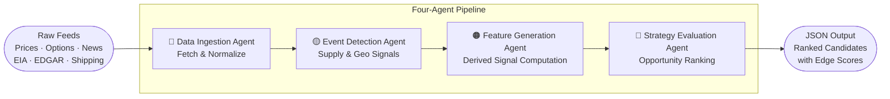
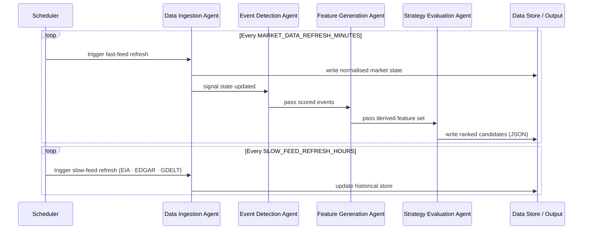

# Energy Options Opportunity Agent — User Guide

> **Version 1.0 • March 2026**
> This guide walks you through installing, configuring, and running the full pipeline end-to-end. It assumes you are comfortable with Python (3.10+) and standard CLI tooling but are new to this project.

---

## Table of Contents

1. [Overview](#overview)
2. [Prerequisites](#prerequisites)
3. [Setup & Configuration](#setup--configuration)
4. [Running the Pipeline](#running-the-pipeline)
5. [Interpreting the Output](#interpreting-the-output)
6. [Troubleshooting](#troubleshooting)

---

## Overview

The **Energy Options Opportunity Agent** is an autonomous, modular Python pipeline that detects options trading opportunities driven by oil market instability. It ingests market data, supply signals, news events, and alternative datasets, then produces structured, ranked candidate options strategies.

### What the pipeline does



Data flows **unidirectionally** through four loosely coupled agents that communicate via a shared market state object and a derived features store:

| Agent | Role | Key Outputs |
|---|---|---|
| **Data Ingestion** | Fetch & Normalize | Unified market state object; historical store |
| **Event Detection** | Supply & Geo Signals | Scored supply/geo events with confidence & intensity |
| **Feature Generation** | Derived Signal Computation | Volatility gaps, curve steepness, narrative velocity, etc. |
| **Strategy Evaluation** | Opportunity Ranking | Ranked candidate strategies with edge scores |

### In-scope instruments and structures (MVP)

| Category | Items |
|---|---|
| Crude futures | Brent Crude, WTI (`CL=F`) |
| ETFs | USO, XLE |
| Energy equities | XOM, CVX |
| Option structures | Long straddles, call/put spreads, calendar spreads |

> **Advisory only.** Automated trade execution is explicitly out of scope. All output is informational.

---

## Prerequisites

### System requirements

| Requirement | Minimum |
|---|---|
| OS | Linux, macOS, or Windows (WSL2 recommended) |
| Python | 3.10 or later |
| RAM | 2 GB (4 GB recommended for local data store) |
| Disk | 5 GB free (6–12 months of historical data) |
| Network | Outbound HTTPS to API endpoints |

### Required tools

```bash
# Verify versions before proceeding
python --version      # 3.10+
pip --version
git --version
```

### API accounts

The pipeline uses free or low-cost data sources. Obtain credentials for each before configuring the environment.

| Source | Used For | Cost | Sign-up URL |
|---|---|---|---|
| Alpha Vantage or MetalpriceAPI | WTI / Brent spot & futures prices | Free | [alphavantage.co](https://www.alphavantage.co) |
| Yahoo Finance / yfinance | ETF & equity prices, options chains | Free | No key required |
| Polygon.io | Options chains (fallback) | Free tier | [polygon.io](https://polygon.io) |
| EIA API | Inventory & refinery utilization | Free | [eia.gov/opendata](https://www.eia.gov/opendata/) |
| GDELT | News & geopolitical events | Free | No key required |
| NewsAPI | News headlines | Free | [newsapi.org](https://newsapi.org) |
| SEC EDGAR | Insider activity | Free | No key required |
| Quiver Quant | Insider activity (enriched) | Free tier | [quiverquant.com](https://www.quiverquant.com) |
| MarineTraffic or VesselFinder | Tanker / shipping flows | Free tier | [marinetraffic.com](https://www.marinetraffic.com) |
| Reddit API | Narrative / sentiment | Free | [reddit.com/dev](https://www.reddit.com/dev/api/) |
| Stocktwits | Narrative / sentiment | Free | [api.stocktwits.com](https://api.stocktwits.com) |

---

## Setup & Configuration

### 1 — Clone the repository

```bash
git clone https://github.com/your-org/energy-options-agent.git
cd energy-options-agent
```

### 2 — Create and activate a virtual environment

```bash
python -m venv .venv

# Linux / macOS
source .venv/bin/activate

# Windows (PowerShell)
.venv\Scripts\Activate.ps1
```

### 3 — Install dependencies

```bash
pip install --upgrade pip
pip install -r requirements.txt
```

### 4 — Configure environment variables

Copy the provided template and populate every value:

```bash
cp .env.example .env
```

Open `.env` in your editor and fill in the values described in the table below.

#### Environment variable reference

| Variable | Required | Default | Description |
|---|---|---|---|
| `ALPHA_VANTAGE_API_KEY` | Yes* | — | API key for Alpha Vantage crude price feed. *Required unless `METALPRICE_API_KEY` is set. |
| `METALPRICE_API_KEY` | Yes* | — | API key for MetalpriceAPI. *Required unless `ALPHA_VANTAGE_API_KEY` is set. |
| `POLYGON_API_KEY` | Optional | — | Polygon.io key for options chain fallback. |
| `EIA_API_KEY` | Yes | — | EIA Open Data API key for inventory and refinery data. |
| `NEWSAPI_KEY` | Yes | — | NewsAPI key for headline ingestion. |
| `QUIVER_QUANT_API_KEY` | Optional | — | Quiver Quant key for enriched insider activity. |
| `MARINETRAFFIC_API_KEY` | Optional | — | MarineTraffic free-tier key for tanker flow data. |
| `REDDIT_CLIENT_ID` | Optional | — | Reddit app client ID for sentiment feeds. |
| `REDDIT_CLIENT_SECRET` | Optional | — | Reddit app client secret. |
| `REDDIT_USER_AGENT` | Optional | `energy-agent/1.0` | User-agent string for Reddit API requests. |
| `STOCKTWITS_API_KEY` | Optional | — | Stocktwits API key for sentiment velocity. |
| `DATA_DIR` | No | `./data` | Path to local historical data store (raw + derived). |
| `OUTPUT_DIR` | No | `./output` | Directory where JSON candidate files are written. |
| `LOG_LEVEL` | No | `INFO` | Logging verbosity: `DEBUG`, `INFO`, `WARNING`, `ERROR`. |
| `MARKET_DATA_REFRESH_MINUTES` | No | `5` | Polling interval (minutes) for price and options feeds. |
| `SLOW_FEED_REFRESH_HOURS` | No | `24` | Polling interval (hours) for EIA, EDGAR, and GDELT feeds. |
| `HISTORY_RETENTION_DAYS` | No | `365` | Number of days of raw and derived data to retain on disk. |
| `EDGE_SCORE_THRESHOLD` | No | `0.0` | Minimum edge score `[0.0–1.0]` for a candidate to appear in output. |

> **Tip:** Variables marked *Optional* activate additional signal layers. Omitting them will not crash the pipeline — the corresponding agent will log a warning and skip that data source. See the [Phase rollout](#phase-rollout-and-optional-signals) note below.

### 5 — Initialise the data directory

```bash
python scripts/init_store.py
```

This creates the directory structure under `DATA_DIR` and validates that the configured API keys are reachable before the first run.

```
data/
├── raw/
│   ├── prices/
│   ├── options/
│   ├── eia/
│   ├── events/
│   ├── insider/
│   ├── shipping/
│   └── sentiment/
└── derived/
    ├── features/
    └── candidates/
```

### Phase rollout and optional signals

The pipeline is phased. You can run a subset of agents by enabling only the relevant API keys:

| Phase | Minimum keys needed | Activated capabilities |
|---|---|---|
| **Phase 1** — Core market signals | `ALPHA_VANTAGE_API_KEY` or `METALPRICE_API_KEY` | Crude + ETF prices; options surface; long straddles & spreads |
| **Phase 2** — Supply & event augmentation | Phase 1 + `EIA_API_KEY` + `NEWSAPI_KEY` | EIA inventory; GDELT/NewsAPI event detection; supply disruption index |
| **Phase 3** — Alternative signals | Phase 2 + `QUIVER_QUANT_API_KEY` + `MARINETRAFFIC_API_KEY` + Reddit + Stocktwits keys | Insider conviction; narrative velocity; shipping flows; cross-sector correlation |
| **Phase 4** | Deferred — see [Future Considerations](#future-considerations) | Exotic structures; automated execution |

---

## Running the Pipeline

### Single full run

Execute all four agents in sequence for one evaluation cycle:

```bash
python -m agent.pipeline run
```

The pipeline will:

1. **Data Ingestion Agent** — fetch and normalise prices, ETF/equity data, and options chains into the market state object.
2. **Event Detection Agent** — scan news and geopolitical feeds; score detected supply disruptions, refinery outages, and tanker chokepoints.
3. **Feature Generation Agent** — compute derived signals (volatility gaps, curve steepness, sector dispersion, insider conviction, narrative velocity, supply shock probability).
4. **Strategy Evaluation Agent** — evaluate eligible option structures, compute edge scores, and write ranked candidates to `OUTPUT_DIR`.

### Continuous (scheduled) mode

To run the pipeline on its configured refresh cadence:

```bash
python -m agent.pipeline run --continuous
```

In continuous mode the scheduler honours `MARKET_DATA_REFRESH_MINUTES` for fast feeds and `SLOW_FEED_REFRESH_HOURS` for slower feeds (EIA, EDGAR, GDELT), keeping the two cycles independent.



### Running individual agents

Each agent can be invoked independently for development or debugging:

```bash
# Data Ingestion only
python -m agent.ingestion run

# Event Detection only (reads existing market state from store)
python -m agent.events run

# Feature Generation only
python -m agent.features run

# Strategy Evaluation only
python -m agent.strategy run
```

### Filtering output by edge score

To suppress low-confidence candidates at runtime without changing `.env`:

```bash
python -m agent.pipeline run --edge-threshold 0.35
```

Only candidates with `edge_score >= 0.35` will be written to the output file.

### Dry run (no writes)

Validate the pipeline and configuration without writing any output:

```bash
python -m agent.pipeline run --dry-run
```

---

## Interpreting the Output

### Output location

After each evaluation cycle, a timestamped JSON file is written to `OUTPUT_DIR`:

```
output/
└── candidates_20260315T143000Z.json
```

A symlink `output/latest.json` always points to the most recent file.

### Output schema

Each file contains a JSON array of candidate objects. Every candidate has the following fields:

| Field | Type | Description |
|---|---|---|
| `instrument` | string | Target instrument — e.g. `"USO"`, `"XLE"`, `"CL=F"` |
| `structure` | enum string | `long_straddle` \| `call_spread` \| `put_spread` \| `calendar_spread` |
| `expiration` | integer (days) | Target expiration in calendar days from evaluation date |
| `edge_score` | float `[0.0–1.0]` | Composite opportunity score; higher = stronger signal confluence |
| `signals` | object | Map of contributing signals and their qualitative values |
| `generated_at` | ISO 8601 datetime | UTC timestamp of candidate generation |

### Example candidate

```json
{
  "instrument": "USO",
  "structure": "long_straddle",
  "expiration": 30,
  "edge_score": 0.47,
  "signals": {
    "tanker_disruption_index": "high",
    "volatility_gap": "positive",
    "narrative_velocity": "rising"
  },
  "generated_at": "2026-03-15T14:30:00Z"
}
```

### Reading the edge score

| Edge Score Range | Interpretation | Suggested Action |
|---|---|---|
| `0.70 – 1.00` | Strong signal confluence across multiple layers | Prioritise for manual review |
| `0.40 – 0.69` | Moderate confluence; at least two corroborating signals | Review in context of market conditions |
| `0.20 – 0.39` | Weak confluence; single or low-confidence signal | Monitor; do not act without additional confirmation |
| `0.00 – 0.19` | Noise threshold; sparse or contradictory signals | Typically filtered out by `EDGE_SCORE_THRESHOLD` |

### Reading the signals map

The `signals` object contains key–value pairs that explain **why** a candidate was generated. Common signal keys and their possible values are listed below:

| Signal Key | Possible Values | Source Agent |
|---|---|---|
| `volatility_gap` | `positive`, `negative`, `neutral` | Feature Generation |
| `futures_curve_steepness` | `steep_contango`, `backwardation`, `flat` | Feature Generation |
| `sector_dispersion` | `high`, `moderate`, `low` | Feature Generation |
| `insider_conviction_score` | `high`, `moderate`, `low` | Feature Generation |
| `narrative_velocity` | `rising`, `stable`, `falling` | Feature Generation |
| `supply_shock_probability` | `high`, `moderate`, `low` | Feature Generation |
| `tanker_disruption_index` | `high`, `moderate`, `low` | Event Detection |
| `refinery_outage_detected` | `true`, `false` | Event Detection |
| `geopolitical_event_score` | `high`, `moderate`, `low` | Event Detection |

### Visualising output

The JSON output is compatible with any JSON-capable dashboard, including **thinkorswim**. To load it:

1. In thinkorswim, open **Studies → Edit Studies → Load from file**.
2. Point to `output/latest.json`.
3. Map the `edge_score` field to the chart overlay of your choice.

Alternatively, pipe the output to any tool that accepts newline-delimited JSON:

```bash
# Pretty-print the top 5 candidates by edge score (requires jq)
jq 'sort_by(-.edge_score) | .[0:5]' output/latest.json
```

---

## Troubleshooting

### Pipeline