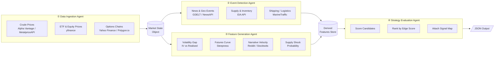
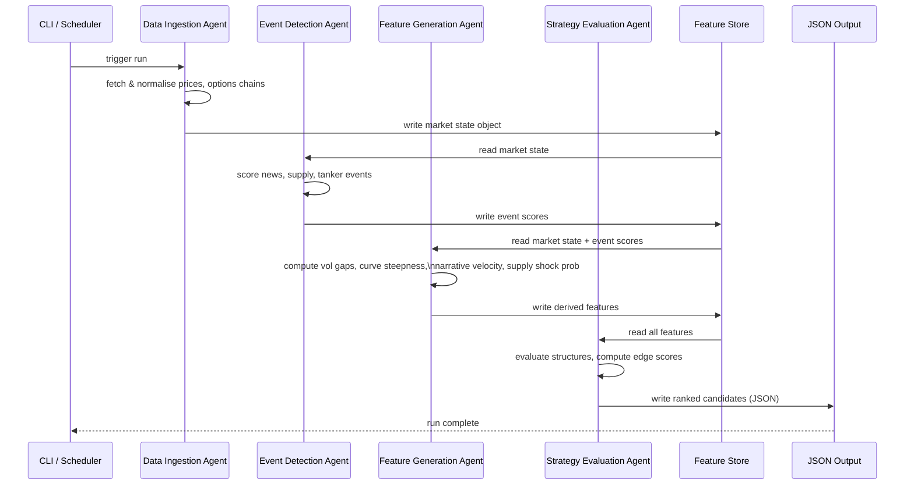

# Energy Options Opportunity Agent — User Guide

> **Version 1.0 • March 2026**
> This guide walks you through installing, configuring, and running the full pipeline end-to-end. It assumes you are comfortable with Python and the command line but are new to this project.

---

## Table of Contents

1. [Overview](#overview)
2. [Prerequisites](#prerequisites)
3. [Setup & Configuration](#setup--configuration)
4. [Running the Pipeline](#running-the-pipeline)
5. [Interpreting the Output](#interpreting-the-output)
6. [Troubleshooting](#troubleshooting)

---

## Overview

The **Energy Options Opportunity Agent** is a modular, four-agent Python pipeline that identifies options trading opportunities driven by oil market instability. It ingests market data, supply signals, news events, and alternative datasets, then produces ranked candidate options strategies with full explainability.

### Pipeline Architecture



Data flows **unidirectionally**: raw feeds → normalized market state → event scoring → derived features → ranked strategy candidates.

### In-Scope Instruments

| Category | Instruments |
|---|---|
| Crude Futures | Brent Crude, WTI (`CL=F`) |
| ETFs | USO, XLE |
| Energy Equities | Exxon Mobil (XOM), Chevron (CVX) |

### In-Scope Option Structures (MVP)

| Structure | Enum Value |
|---|---|
| Long Straddle | `long_straddle` |
| Call Spread | `call_spread` |
| Put Spread | `put_spread` |
| Calendar Spread | `calendar_spread` |

> **Note:** Automated trade execution is **out of scope**. The pipeline is advisory only.

---

## Prerequisites

### System Requirements

| Requirement | Minimum |
|---|---|
| Python | 3.10 or later |
| OS | Linux, macOS, or Windows (WSL2 recommended) |
| RAM | 2 GB |
| Disk | 5 GB free (for 6–12 months of historical data) |
| Network | Outbound HTTPS to third-party data APIs |

### Required Accounts & API Keys

All data sources used in the MVP are free or have a free tier. Obtain credentials before proceeding.

| Source | Sign-up URL | Key / Token Name |
|---|---|---|
| Alpha Vantage | https://www.alphavantage.co/support/#api-key | `ALPHA_VANTAGE_API_KEY` |
| Polygon.io | https://polygon.io/dashboard/signup | `POLYGON_API_KEY` |
| EIA | https://www.eia.gov/opendata/register.php | `EIA_API_KEY` |
| NewsAPI | https://newsapi.org/register | `NEWS_API_KEY` |
| GDELT | No key required | — |
| SEC EDGAR | No key required | — |
| yfinance / Yahoo Finance | No key required | — |
| MarineTraffic (free tier) | https://www.marinetraffic.com/en/online-services/plans | `MARINE_TRAFFIC_API_KEY` |
| Reddit API | https://www.reddit.com/prefs/apps | `REDDIT_CLIENT_ID`, `REDDIT_CLIENT_SECRET` |

### Python Dependencies

Install dependencies into a virtual environment:

```bash
python -m venv .venv
source .venv/bin/activate          # Windows: .venv\Scripts\activate
pip install --upgrade pip
pip install -r requirements.txt
```

A minimal `requirements.txt` is included in the repository root.

---

## Setup & Configuration

### 1. Clone the Repository

```bash
git clone https://github.com/your-org/energy-options-agent.git
cd energy-options-agent
```

### 2. Create the Environment File

Copy the provided template and populate it with your credentials:

```bash
cp .env.example .env
```

Open `.env` in your editor and fill in every value. The full set of environment variables is documented below.

### Environment Variables Reference

#### API Credentials

| Variable | Required | Description |
|---|---|---|
| `ALPHA_VANTAGE_API_KEY` | Yes | Alpha Vantage free API key for crude price feeds |
| `POLYGON_API_KEY` | Yes | Polygon.io key for options chain data |
| `EIA_API_KEY` | Yes | U.S. Energy Information Administration open-data key |
| `NEWS_API_KEY` | Yes | NewsAPI.org key for headline ingestion |
| `MARINE_TRAFFIC_API_KEY` | Yes | MarineTraffic free-tier key for tanker flow data |
| `REDDIT_CLIENT_ID` | Yes | Reddit OAuth2 app client ID |
| `REDDIT_CLIENT_SECRET` | Yes | Reddit OAuth2 app client secret |
| `REDDIT_USER_AGENT` | Yes | Descriptive string, e.g. `energy-agent/1.0` |

#### Pipeline Behaviour

| Variable | Default | Description |
|---|---|---|
| `PIPELINE_ENV` | `production` | `production` or `development`. In `development`, external API calls may be stubbed. |
| `LOG_LEVEL` | `INFO` | Python logging level: `DEBUG`, `INFO`, `WARNING`, `ERROR` |
| `OUTPUT_DIR` | `./output` | Directory where JSON candidate files are written |
| `HISTORICAL_DATA_DIR` | `./data/historical` | Root path for persisted raw and derived data |
| `RETENTION_DAYS` | `365` | Number of days of historical data to retain (minimum 180) |

#### Cadence & Scheduling

| Variable | Default | Description |
|---|---|---|
| `MARKET_DATA_INTERVAL_MINUTES` | `5` | Polling interval for minute-level price feeds (crude, ETF, equity) |
| `OPTIONS_DATA_INTERVAL_HOURS` | `24` | Refresh interval for options chain data |
| `EIA_DATA_INTERVAL_HOURS` | `168` | Refresh interval for EIA inventory data (weekly = 168 h) |
| `NEWS_DATA_INTERVAL_MINUTES` | `30` | Polling interval for news and geopolitical event feeds |
| `SENTIMENT_DATA_INTERVAL_MINUTES` | `30` | Polling interval for Reddit / Stocktwits sentiment feeds |

#### Strategy Evaluation

| Variable | Default | Description |
|---|---|---|
| `EDGE_SCORE_THRESHOLD` | `0.30` | Minimum edge score `[0.0–1.0]` for a candidate to appear in output |
| `MAX_CANDIDATES` | `20` | Maximum number of ranked candidates written per pipeline run |
| `EXPIRATION_MIN_DAYS` | `7` | Minimum calendar days to expiration for eligible options |
| `EXPIRATION_MAX_DAYS` | `90` | Maximum calendar days to expiration for eligible options |

### 3. Verify the Configuration

Run the built-in configuration check before your first full pipeline run:

```bash
python -m agent check-config
```

Expected output on success:

```
[OK] Environment variables loaded
[OK] Alpha Vantage API reachable
[OK] Polygon.io API reachable
[OK] EIA API reachable
[OK] NewsAPI reachable
[OK] MarineTraffic API reachable
[OK] Reddit API reachable
[OK] Output directory writable: ./output
[OK] Historical data directory writable: ./data/historical
Configuration check passed.
```

Any `[FAIL]` line includes the specific variable name and a suggested fix.

### 4. Initialise the Historical Data Store

On first run, prime the local data store with the configured retention window:

```bash
python -m agent init-history --days 180
```

This performs a one-time backfill for prices, options surfaces, and EIA inventory data. Expect this to take 5–15 minutes depending on API rate limits.

---

## Running the Pipeline

### Pipeline Stage Summary



### Single Run (Manual)

Execute the full four-agent pipeline once:

```bash
python -m agent run
```

The pipeline runs each agent in sequence, writes intermediate state to the feature store, and emits ranked candidates to `$OUTPUT_DIR`.

#### Optional Flags

| Flag | Description |
|---|---|
| `--dry-run` | Execute all agents but skip writing output files; useful for validation |
| `--log-level DEBUG` | Override `LOG_LEVEL` for this run only |
| `--output-dir <path>` | Override `OUTPUT_DIR` for this run only |
| `--threshold <float>` | Override `EDGE_SCORE_THRESHOLD` for this run only |

Example with overrides:

```bash
python -m agent run --dry-run --log-level DEBUG --threshold 0.25
```

### Running Individual Agents

Each agent can be invoked independently for debugging or incremental updates:

```bash
# Stage 1 — fetch and normalise market data
python -m agent run --agent ingestion

# Stage 2 — detect and score events
python -m agent run --agent event-detection

# Stage 3 — compute derived features
python -m agent run --agent feature-generation

# Stage 4 — evaluate and rank strategies
python -m agent run --agent strategy-evaluation
```

> **Tip:** When running individual agents, upstream feature store data from the previous full run is used as input. Ensure the store is current before running a downstream agent in isolation.

### Continuous / Scheduled Operation

For production use, schedule the pipeline at a cadence that matches your fastest data source (minutes-level price feeds). The pipeline is designed to tolerate delayed or missing data without failure.

#### Using `cron` (Linux / macOS)

```bash
crontab -e
```

Add the following line to run the full pipeline every five minutes:

```cron
*/5 * * * * /path/to/.venv/bin/python -m agent run >> /var/log/energy-agent.log 2>&1
```

#### Using a systemd timer

Create `/etc/systemd/system/energy-agent.timer`:

```ini
[Unit]
Description=Energy Options Agent — 5-minute pipeline trigger

[Timer]
OnBootSec=60
OnUnitActiveSec=5min

[Install]
WantedBy=timers.target
```

Create `/etc/systemd/system/energy-agent.service`:

```ini
[Unit]
Description=Energy Options Agent pipeline run

[Service]
Type=oneshot
WorkingDirectory=/path/to/energy-options-agent
ExecStart=/path/to/.venv/bin/python -m agent run
EnvironmentFile=/path/to/energy-options-agent/.env
```

Enable and start the timer:

```bash
sudo systemctl daemon-reload
sudo systemctl enable --now energy-agent.timer
sudo systemctl list-timers energy-agent.timer
```

#### Using Docker (single container)

```bash
docker build -t energy-options-agent:1.0 .
docker run -d \
  --name energy-agent \
  --env-file .env \
  -v $(pwd)/output:/app/output \
  -v $(pwd)/data:/app/data \
  energy-options-agent:1.0
```

The container's default `CMD` runs the pipeline on the interval defined by `MARKET_DATA_INTERVAL_MINUTES`.

---

## Interpreting the Output

### Output Location

Each pipeline run appends a timestamped JSON file to `$OUTPUT_DIR`:

```
output/
└── candidates_2026-03-15T14:05:00Z.json
```

### Output Schema

Every file contains a JSON array of candidate objects, sorted by `edge_score` descending.

| Field | Type | Description |
|---|---|---|
| `instrument` | string | Target instrument, e.g. `USO`, `XLE`, `CL=F` |
| `structure` | enum string | `long_straddle` \| `call_spread` \| `put_spread` \| `calendar_spread` |
| `expiration` | integer (days) | Calendar days from evaluation date to target expiration |
| `edge_score` | float `[0.0–1.0]` | Composite opportunity score; higher = stronger signal confluence |
| `signals` | object | Map of contributing signals and their qualitative states |
| `generated_at` | ISO 8601 datetime | UTC timestamp of candidate generation |

### Example Output File

```json
[
  {
    "instrument": "USO",
    "structure": "long_straddle",
    "expiration": 30,
    "edge_score": 0.47,
    "signals": {
      "tanker_disruption_index": "high",
      "volatility_gap": "positive",
      "narrative_velocity": "rising"
    },
    "generated_at": "2026-03-15T14:05:00Z"
  },
  {
    "instrument": "XOM",
    "structure": "call_spread",
    "expiration": 21,
    "edge_score": 0.34,
    "signals": {
      "supply_shock_probability": "elevated",
      "volatility_gap": "positive",
      "insider_conviction_score": "high"
    },
    "generated_at": "2026-03-15T14:05:00Z"
  }
]
```

### Signal Reference

The `signals` object uses the keys and qualitative values below. Not all signals appear in every candidate; only signals that contributed to the edge score are included.

| Signal Key | Possible Values | Source Agent |
|---|---|---|
| `volatility_gap` | `positive`, `negative`, `neutral` | Feature Generation |
| `futures_curve_steepness` | `contango`, `backwardation`, `flat` | Feature Generation |
| `sector_dispersion` | `high`, `moderate`, `low` | Feature Generation |
| `insider_conviction_score` | `high`, `moderate`, `low` | Feature Generation |
| `narrative_velocity` | `rising`, `stable`, `falling` | Feature Generation |
| `supply_shock_