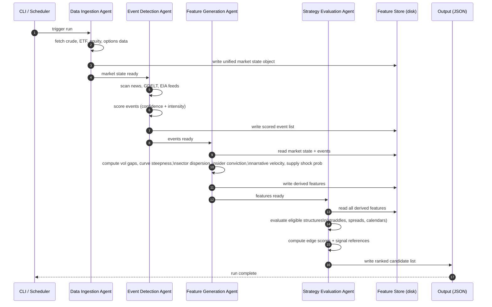

# Energy Options Opportunity Agent — User Guide

> **Version 1.0 · March 2026**
> This guide walks a developer through setting up, configuring, and running the full four-agent pipeline end-to-end.

---

## Table of Contents

1. [Overview](#overview)
2. [Prerequisites](#prerequisites)
3. [Setup & Configuration](#setup--configuration)
4. [Running the Pipeline](#running-the-pipeline)
5. [Interpreting the Output](#interpreting-the-output)
6. [Troubleshooting](#troubleshooting)

---

## Overview

The **Energy Options Opportunity Agent** is an autonomous, modular Python pipeline that identifies options trading opportunities driven by oil market instability. It ingests market data, supply signals, news events, and alternative datasets to produce structured, ranked candidate options strategies.

### What the pipeline does


```mermaid
flowchart LR
    subgraph Inputs
        A1[Crude Prices\nAlpha Vantage / MetalpriceAPI]
        A2[ETF & Equity Prices\nyfinance / Yahoo Finance]
        A3[Options Chains\nYahoo Finance / Polygon.io]
        A4[Supply & Inventory\nEIA API]
        A5[News & Geo Events\nGDELT / NewsAPI]
        A6[Insider Activity\nEDGAR / Quiver Quant]
        A7[Shipping & Logistics\nMarineTraffic / VesselFinder]
        A8[Narrative & Sentiment\nReddit / Stocktwits]
    end

    subgraph Pipeline["Four-Agent Pipeline"]
        direction TB
        P1["① Data Ingestion Agent\nFetch & Normalize"]
        P2["② Event Detection Agent\nSupply & Geo Signals"]
        P3["③ Feature Generation Agent\nDerived Signal Computation"]
        P4["④ Strategy Evaluation Agent\nOpportunity Ranking"]
    end

    subgraph Output
        O1[Ranked Candidate JSON\nedge_score · signals · structure]
    end

    Inputs --> P1
    P1 -->|Unified market state object| P2
    P2 -->|Scored events| P3
    P3 -->|Derived features store| P4
    P4 --> O1
```

### Agents at a glance

| # | Agent | Role | Key outputs |
|---|-------|------|-------------|
| 1 | **Data Ingestion Agent** | Fetch & Normalize | Unified market state object; historical price/vol store |
| 2 | **Event Detection Agent** | Supply & Geo Signals | Confidence-scored disruption events |
| 3 | **Feature Generation Agent** | Derived Signal Computation | Vol gaps, curve steepness, sector dispersion, narrative velocity, supply shock probability, insider conviction |
| 4 | **Strategy Evaluation Agent** | Opportunity Ranking | Ranked candidate list with edge scores and explainability references |

### In-scope instruments & structures (MVP)

| Category | Items |
|----------|-------|
| Crude futures | Brent Crude, WTI |
| ETFs | USO, XLE |
| Energy equities | XOM, CVX |
| Option structures | Long straddles, call/put spreads, calendar spreads |

> **Advisory only.** The system produces recommendations; it does **not** execute trades automatically.

---

## Prerequisites

### System requirements

| Requirement | Minimum |
|-------------|---------|
| Python | 3.10+ |
| RAM | 4 GB |
| Disk | 10 GB free (6–12 months historical data) |
| OS | Linux, macOS, or Windows (WSL2 recommended) |
| Deployment target | Local machine, single VM, or single container |

### External accounts & API keys

All required data sources are free or freemium. Obtain credentials before proceeding.

| Source | Sign-up URL | Notes |
|--------|-------------|-------|
| Alpha Vantage | https://www.alphavantage.co/support/#api-key | Free tier; WTI/Brent spot & futures |
| MetalpriceAPI | https://metalpriceapi.com | Fallback crude price feed |
| Polygon.io | https://polygon.io | Free tier for options chain data |
| EIA Open Data | https://www.eia.gov/opendata/ | Free; weekly inventory & refinery utilization |
| NewsAPI | https://newsapi.org | Free developer tier |
| GDELT | https://www.gdeltproject.org | No key required; public dataset |
| SEC EDGAR | https://efts.sec.gov/LATEST/search-index | No key required; free |
| Quiver Quant | https://www.quiverquant.com/home/api | Free limited tier for insider data |
| MarineTraffic | https://www.marinetraffic.com/en/ais-api-services | Free tier for vessel data |
| Reddit (PRAW) | https://www.reddit.com/prefs/apps | Free; create a "script" app |
| Stocktwits | https://api.stocktwits.com/developers/apps/new | Free public API |

### Python dependencies

```bash
pip install -r requirements.txt
```

A representative `requirements.txt` includes:

```text
requests>=2.31
yfinance>=0.2
pandas>=2.0
numpy>=1.26
praw>=7.7          # Reddit
pydantic>=2.0      # output schema validation
apscheduler>=3.10  # scheduled pipeline runs
python-dotenv>=1.0
```

---

## Setup & Configuration

### 1. Clone the repository

```bash
git clone https://github.com/your-org/energy-options-agent.git
cd energy-options-agent
```

### 2. Create and activate a virtual environment

```bash
python -m venv .venv
source .venv/bin/activate      # Linux / macOS
# .venv\Scripts\activate       # Windows PowerShell
```

### 3. Install dependencies

```bash
pip install --upgrade pip
pip install -r requirements.txt
```

### 4. Configure environment variables

Copy the provided template and populate every value before running the pipeline.

```bash
cp .env.example .env
```

Open `.env` in your editor and fill in your credentials:

```dotenv
# ── Data Ingestion ──────────────────────────────────────────────
ALPHA_VANTAGE_API_KEY=your_alpha_vantage_key
METALPRICE_API_KEY=your_metalprice_key
POLYGON_API_KEY=your_polygon_key
EIA_API_KEY=your_eia_key
NEWS_API_KEY=your_newsapi_key
QUIVER_QUANT_API_KEY=your_quiver_key
MARINETRAFFIC_API_KEY=your_marinetraffic_key

# ── Reddit (PRAW) ────────────────────────────────────────────────
REDDIT_CLIENT_ID=your_reddit_client_id
REDDIT_CLIENT_SECRET=your_reddit_client_secret
REDDIT_USER_AGENT=energy-options-agent/1.0

# ── Pipeline Behaviour ───────────────────────────────────────────
MARKET_DATA_REFRESH_MINUTES=5
EIA_REFRESH_HOURS=24
HISTORY_RETENTION_DAYS=365

# ── Output ───────────────────────────────────────────────────────
OUTPUT_DIR=./output
OUTPUT_FORMAT=json           # json | stdout
LOG_LEVEL=INFO               # DEBUG | INFO | WARNING | ERROR
```

#### Full environment variable reference

| Variable | Required | Default | Description |
|----------|----------|---------|-------------|
| `ALPHA_VANTAGE_API_KEY` | Yes | — | API key for WTI/Brent spot & futures prices |
| `METALPRICE_API_KEY` | No | — | Fallback crude price feed |
| `POLYGON_API_KEY` | No | — | Options chain data (strike, expiry, IV, volume) |
| `EIA_API_KEY` | Yes | — | Weekly supply inventory & refinery utilization |
| `NEWS_API_KEY` | Yes | — | Continuous news feed for event detection |
| `QUIVER_QUANT_API_KEY` | No | — | Insider trade data; pipeline degrades gracefully without it |
| `MARINETRAFFIC_API_KEY` | No | — | Tanker flow data for shipping/logistics signals |
| `REDDIT_CLIENT_ID` | No | — | PRAW OAuth client ID for narrative sentiment |
| `REDDIT_CLIENT_SECRET` | No | — | PRAW OAuth client secret |
| `REDDIT_USER_AGENT` | No | `energy-options-agent/1.0` | PRAW user-agent string |
| `MARKET_DATA_REFRESH_MINUTES` | No | `5` | Cadence for price & options chain refresh |
| `EIA_REFRESH_HOURS` | No | `24` | Cadence for EIA inventory refresh |
| `HISTORY_RETENTION_DAYS` | No | `365` | Days of historical data to retain on disk |
| `OUTPUT_DIR` | No | `./output` | Directory for JSON output files |
| `OUTPUT_FORMAT` | No | `json` | `json` writes files; `stdout` prints to console |
| `LOG_LEVEL` | No | `INFO` | Python logging level |

> **Missing optional keys.** The pipeline is designed to tolerate missing or delayed data without failing. Agents that depend on an unconfigured source log a warning and continue with reduced signal coverage. Edge scores will reflect the reduced signal set.

### 5. Verify configuration

```bash
python -m agent.cli check-config
```

Expected output:

```
[✓] ALPHA_VANTAGE_API_KEY     set
[✓] EIA_API_KEY               set
[✓] NEWS_API_KEY              set
[⚠] POLYGON_API_KEY           not set — options chain data will use Yahoo Finance fallback
[⚠] QUIVER_QUANT_API_KEY      not set — insider conviction signal disabled
[⚠] MARINETRAFFIC_API_KEY     not set — tanker flow signal disabled
[✓] Configuration check complete. Pipeline can start.
```

---

## Running the Pipeline

### Pipeline execution flow


```mermaid
sequenceDiagram
    autonumber
    participant CLI as CLI / Scheduler
    participant DIA as Data Ingestion Agent
    participant EDA as Event Detection Agent
    participant FGA as Feature Generation Agent
    participant SEA as Strategy Evaluation Agent
    participant FS  as Feature Store (disk)
    participant OUT as Output (JSON)

    CLI->>DIA: trigger run
    DIA->>DIA: fetch crude, ETF, equity, options data
    DIA->>FS: write unified market state object
    DIA->>EDA: market state ready
    EDA->>EDA: scan news, GDELT, EIA feeds
    EDA->>EDA: score events (confidence + intensity)
    EDA->>FS: write scored event list
    EDA->>FGA: events ready
    FGA->>FS: read market state + events
    FGA->>FGA: compute vol gaps, curve steepness,\nsector dispersion, insider conviction,\nnarrative velocity, supply shock prob
    FGA->>FS: write derived features
    FGA->>SEA: features ready
    SEA->>FS: read all derived features
    SEA->>SEA: evaluate eligible structures\n(straddles, spreads, calendars)
    SEA->>SEA: compute edge scores + signal references
    SEA->>OUT: write ranked candidate list
    OUT-->>CLI: run complete
```

### Run a single pipeline pass

```bash
python -m agent.cli run
```

This executes all four agents sequentially for one evaluation cycle and writes results to `OUTPUT_DIR`.

### Run with a specific MVP phase

Each phase enables an incremental set of signals. Pass `--phase` to limit the active signal set:

```bash
# Phase 1 — Core market signals & options only (default)
python -m agent.cli run --phase 1

# Phase 2 — Adds EIA supply data and event detection
python -m agent.cli run --phase 2

# Phase 3 — Adds insider, narrative, and shipping signals
python -m agent.cli run --phase 3
```

| Phase | Signals active |
|-------|----------------|
| 1 | WTI/Brent prices, USO/XLE/XOM/CVX, options surface (IV, strike distribution) |
| 2 | Phase 1 + EIA inventory, refinery utilization, GDELT/NewsAPI event scoring |
| 3 | Phase 2 + EDGAR/Quiver insider conviction, Reddit/Stocktwits narrative velocity, MarineTraffic tanker flows |

### Run on a schedule (continuous mode)

```bash
python -m agent.cli run --schedule
```

The scheduler uses `MARKET_DATA_REFRESH_MINUTES` for market data and `EIA_REFRESH_HOURS` for slower feeds. Logs are written to `./logs/agent.log`.

### Run a single agent in isolation

Each agent can be invoked independently for debugging or incremental development:

```bash
python -m agent.cli run-agent ingestion
python -m agent.cli run-agent event-detection
python -m agent.cli run-agent feature-generation
python -m agent.cli run-agent strategy-evaluation
```

> **Note:** Running agents out of order requires the upstream feature store artifacts to already exist on disk. Use `run` (full pipeline) for normal operation.

### Run inside Docker (optional)

```bash
docker build -t energy-options-agent:1.0 .
docker run --env-file .env -v $(pwd)/output:/app/output energy-options-agent:1.0
```

---

## Interpreting the Output

### Output location

Each pipeline run writes a timestamped JSON file to `OUTPUT_DIR`:

```
output/
└── candidates_2026-03-15T14:32:00Z.json
```

### Output schema

Each element in the output array represents one ranked strategy candidate.

| Field | Type | Description |
|-------|------|-------------|
| `instrument` | `string` | Target instrument: `USO`, `XLE`, `CL=F`, `XOM`, `CVX` |
| `structure` | `enum` | `long_straddle` \| `call_spread` \| `put_spread` \| `calendar_spread` |
| `expiration` | `integer` | Calendar days from evaluation date to target expiration |
| `edge_score` | `float [0.0–1.0]` | Composite opportunity score; higher = stronger signal confluence |
| `signals` | `object` | Map of contributing signals and their current state |
| `generated_at` | `ISO 8601 datetime` | UTC timestamp of candidate generation |

### Example output

```json
[
  {
    "instrument": "USO",
    "structure": "long_straddle",
    "expiration": 30,
    "edge_score": 0.47,
    "signals": {
      "tanker_disruption_index": "high",
      "volatility_gap": "positive",
      "narrative_velocity": "rising"
    },
    "generated_at": "2026-03-15T14:32:00Z"
  },
  {
    "instrument": "XLE",
    "structure": "call_spread",
    "expiration": 45,
    "edge_score": 0.31,
    "signals": {
      "volatility_gap": "positive",
      "eia_inventory_draw": "large",
      "sector_dispersion": "elevated"
    },
    "generated_at": "2026-03-15T14:32:00Z"
  }
]
```

### Reading the edge score

| `edge_score` range | Interpretation |
|--------------------|----------------|
| 0.70 – 1.00 | Strong signal confluence; highest-priority candidates |
| 0.45 – 0.69 | Moderate confluence; review contributing signals before acting |
| 0.20 – 0.44 | Weak or sparse signal support; use as background context only |
| 0.00 – 0.19 | Negligible edge; typically filtered from display |

### Reading the signals map

Signal values indicate the current state of each contributing indicator at the time of generation.

| Signal key | Possible values | Meaning |
|------------|-----------------|