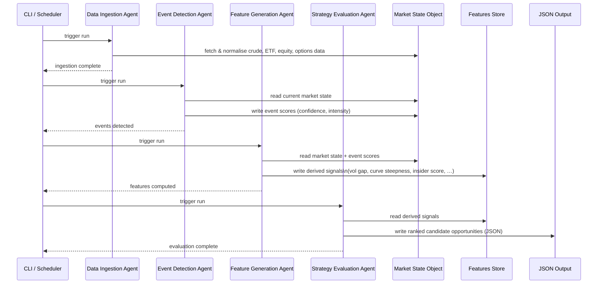

# Energy Options Opportunity Agent — User Guide

> **Version 1.0 · March 2026**
> Advisory-only system. No trade execution is performed automatically.

---

## Table of Contents

1. [Overview](#1-overview)
2. [Prerequisites](#2-prerequisites)
3. [Setup & Configuration](#3-setup--configuration)
4. [Running the Pipeline](#4-running-the-pipeline)
5. [Interpreting the Output](#5-interpreting-the-output)
6. [Troubleshooting](#6-troubleshooting)

---

## 1. Overview

The **Energy Options Opportunity Agent** is a modular Python pipeline that identifies options trading opportunities driven by oil market instability. It ingests market data, supply signals, news events, and alternative datasets, then produces structured, ranked candidate options strategies.

### What the pipeline does


```mermaid
flowchart LR
    subgraph Ingestion["① Data Ingestion Agent"]
        A1[Crude prices\nWTI · Brent]
        A2[ETF / Equity prices\nUSO · XLE · XOM · CVX]
        A3[Options chains\nIV · strike · expiry]
    end

    subgraph Event["② Event Detection Agent"]
        B1[News & geopolitical feeds\nGDELT · NewsAPI]
        B2[Supply disruption scoring\nconfidence · intensity]
    end

    subgraph Feature["③ Feature Generation Agent"]
        C1[Volatility gap\nrealized vs. implied]
        C2[Futures curve steepness]
        C3[Sector dispersion]
        C4[Insider conviction]
        C5[Narrative velocity]
        C6[Supply shock probability]
    end

    subgraph Strategy["④ Strategy Evaluation Agent"]
        D1[Evaluate eligible structures\nstraddles · spreads]
        D2[Rank by edge score]
        D3[Attach contributing signals]
    end

    MS[(Market State\nObject)]
    FS[(Derived\nFeatures Store)]
    OUT[📄 JSON Output\nRanked Candidates]

    Ingestion --> MS
    MS --> Event
    Event --> MS
    MS --> Feature
    Feature --> FS
    FS --> Strategy
    Strategy --> OUT
```

### In-scope instruments & structures

| Category | Items |
|---|---|
| **Crude futures** | Brent Crude, WTI |
| **ETFs** | USO, XLE |
| **Energy equities** | Exxon Mobil (XOM), Chevron (CVX) |
| **Option structures (MVP)** | Long straddles, call/put spreads, calendar spreads |

> **Out of scope for MVP:** exotic/multi-legged strategies, regional refined product pricing (OPIS), and automated trade execution.

---

## 2. Prerequisites

### Software requirements

| Requirement | Minimum version | Notes |
|---|---|---|
| Python | 3.10 | 3.11+ recommended |
| pip | 22.0 | or use `pipenv` / `poetry` |
| Git | 2.x | to clone the repository |

### System resources

The pipeline is designed to run on a **single local machine or low-cost cloud VM/container**. No GPU or high-memory instance is required for the MVP.

| Resource | Minimum |
|---|---|
| RAM | 2 GB |
| Disk (data retention) | 10 GB (supports 6–12 months of historical data) |
| Network | Outbound HTTPS to external APIs |

### API accounts

The following free or low-cost accounts are required before running the pipeline. Register and obtain API keys from each provider.

| Data layer | Provider | Cost | Sign-up URL |
|---|---|---|---|
| Crude prices | Alpha Vantage or MetalpriceAPI | Free | https://www.alphavantage.co |
| ETF / equity prices | Yahoo Finance (`yfinance`) | Free | No key required |
| Options chains | Yahoo Finance / Polygon.io | Free / Limited | https://polygon.io |
| Supply & inventory | EIA API | Free | https://www.eia.gov/opendata |
| News & geopolitical | GDELT / NewsAPI | Free / Free tier | https://newsapi.org |
| Insider activity | SEC EDGAR / Quiver Quant | Free / Limited | https://www.quiverquant.com |
| Shipping & logistics | MarineTraffic / VesselFinder | Free tier | https://www.marinetraffic.com |
| Narrative / sentiment | Reddit / Stocktwits | Free | No key required for public endpoints |

---

## 3. Setup & Configuration

### 3.1 Clone the repository

```bash
git clone https://github.com/your-org/energy-options-agent.git
cd energy-options-agent
```

### 3.2 Create and activate a virtual environment

```bash
python -m venv .venv
source .venv/bin/activate        # macOS / Linux
.venv\Scripts\activate           # Windows PowerShell
```

### 3.3 Install dependencies

```bash
pip install -r requirements.txt
```

### 3.4 Configure environment variables

Copy the provided template and populate each value with your API credentials:

```bash
cp .env.example .env
```

Open `.env` in your editor and fill in each variable. All variables are described in the table below.

#### Environment variable reference

| Variable | Required | Description | Example value |
|---|---|---|---|
| `ALPHA_VANTAGE_API_KEY` | Yes* | API key for Alpha Vantage crude price feed | `ABCDEF123456` |
| `METALPRICE_API_KEY` | Yes* | API key for MetalpriceAPI (alternative crude feed) | `xyz789` |
| `POLYGON_API_KEY` | Optional | API key for Polygon.io options chain data | `pqr456` |
| `EIA_API_KEY` | Yes | API key for EIA supply/inventory data | `eia_abc123` |
| `NEWSAPI_KEY` | Yes | API key for NewsAPI geopolitical feed | `newskey789` |
| `QUIVER_QUANT_API_KEY` | Optional | API key for Quiver Quant insider activity | `qv_abc` |
| `MARINETRAFFIC_API_KEY` | Optional | API key for MarineTraffic tanker data | `mt_xyz` |
| `OUTPUT_DIR` | Yes | Directory where JSON output files are written | `./output` |
| `HISTORICAL_DATA_DIR` | Yes | Directory for persisted raw and derived data | `./data` |
| `RETENTION_DAYS` | No | Days of historical data to retain (default: `180`) | `365` |
| `MARKET_DATA_INTERVAL_MINUTES` | No | Refresh cadence for market data (default: `5`) | `5` |
| `LOG_LEVEL` | No | Logging verbosity: `DEBUG`, `INFO`, `WARNING`, `ERROR` | `INFO` |
| `PIPELINE_PHASE` | No | Limits active agents to a specific MVP phase: `1`, `2`, `3` | `2` |

> \* Provide **either** `ALPHA_VANTAGE_API_KEY` **or** `METALPRICE_API_KEY`. Both can be set; the pipeline uses Alpha Vantage as primary and MetalpriceAPI as fallback.

#### Example `.env` file

```dotenv
# Crude prices
ALPHA_VANTAGE_API_KEY=ABCDEF123456
METALPRICE_API_KEY=xyz789

# Options chains (optional upgrade)
POLYGON_API_KEY=pqr456

# Supply & inventory
EIA_API_KEY=eia_abc123

# News & geopolitical events
NEWSAPI_KEY=newskey789

# Alternative signals (optional)
QUIVER_QUANT_API_KEY=qv_abc
MARINETRAFFIC_API_KEY=mt_xyz

# Pipeline behaviour
OUTPUT_DIR=./output
HISTORICAL_DATA_DIR=./data
RETENTION_DAYS=180
MARKET_DATA_INTERVAL_MINUTES=5
LOG_LEVEL=INFO
PIPELINE_PHASE=2
```

### 3.5 Initialise the data directories

```bash
python -m agent.init_storage
```

This creates the `OUTPUT_DIR` and `HISTORICAL_DATA_DIR` directories and writes the initial schema files required by the agents.

---

## 4. Running the Pipeline

### 4.1 Pipeline phases

The pipeline supports incremental activation of agents, aligned with the four MVP phases defined in the system design. Use `PIPELINE_PHASE` to control which agents are active.

| Phase | Name | Active agents | Key additions |
|---|---|---|---|
| `1` | Core Market Signals & Options | Ingestion, Strategy Evaluation | WTI/Brent/USO/XLE prices; IV surface; long straddles and call/put spreads |
| `2` | Supply & Event Augmentation | + Event Detection | EIA inventory; GDELT/NewsAPI events; supply disruption indices |
| `3` | Alternative / Contextual Signals | + Full Feature Generation | Insider trades; narrative velocity; shipping data; cross-sector correlation |
| `4` | High-Fidelity Enhancements | All + extended structures | OPIS pricing; exotic structures; execution integration (future) |

### 4.2 Single pipeline run

Run all active agents once and write output to `OUTPUT_DIR`:

```bash
python -m agent.pipeline run
```

To override the phase without editing `.env`:

```bash
PIPELINE_PHASE=1 python -m agent.pipeline run
```

### 4.3 Continuous (scheduled) run

Run the pipeline on the configured `MARKET_DATA_INTERVAL_MINUTES` cadence:

```bash
python -m agent.pipeline run --loop
```

Stop the loop with `Ctrl+C`. The pipeline handles `SIGTERM` gracefully and flushes pending output before exiting.

### 4.4 Running individual agents

Each agent can be invoked independently, which is useful for development and debugging:

```bash
# Step 1 — fetch and normalise market data
python -m agent.ingestion

# Step 2 — detect and score geopolitical/supply events
python -m agent.event_detection

# Step 3 — compute derived features
python -m agent.feature_generation

# Step 4 — evaluate and rank strategies
python -m agent.strategy_evaluation
```

### 4.5 Pipeline execution flow


```mermaid
sequenceDiagram
    participant CLI as CLI / Scheduler
    participant IA as Data Ingestion Agent
    participant EA as Event Detection Agent
    participant FA as Feature Generation Agent
    participant SA as Strategy Evaluation Agent
    participant MS as Market State Object
    participant FS as Features Store
    participant OUT as JSON Output

    CLI->>IA: trigger run
    IA->>MS: fetch & normalise crude, ETF, equity, options data
    IA-->>CLI: ingestion complete

    CLI->>EA: trigger run
    EA->>MS: read current market state
    EA->>MS: write event scores (confidence, intensity)
    EA-->>CLI: events detected

    CLI->>FA: trigger run
    FA->>MS: read market state + event scores
    FA->>FS: write derived signals\n(vol gap, curve steepness, insider score, …)
    FA-->>CLI: features computed

    CLI->>SA: trigger run
    SA->>FS: read derived signals
    SA->>OUT: write ranked candidate opportunities (JSON)
    SA-->>CLI: evaluation complete
```

### 4.6 Dry run (no output written)

Validate data connectivity and feature computation without writing output files:

```bash
python -m agent.pipeline run --dry-run
```

---

## 5. Interpreting the Output

### 5.1 Output location

Each pipeline run appends a timestamped file to `OUTPUT_DIR`:

```
output/
└── candidates_2026-03-15T14-30-00Z.json
```

A symlink `output/latest.json` always points to the most recent file.

### 5.2 Output schema

Each file contains a JSON array of candidate objects. One object per ranked strategy:

| Field | Type | Description |
|---|---|---|
| `instrument` | `string` | Target instrument, e.g. `USO`, `XLE`, `CL=F` |
| `structure` | `enum` | `long_straddle` · `call_spread` · `put_spread` · `calendar_spread` |
| `expiration` | `integer` | Calendar days from evaluation date to target expiration |
| `edge_score` | `float [0.0–1.0]` | Composite opportunity score — higher = stronger signal confluence |
| `signals` | `object` | Map of contributing signals and their qualitative levels |
| `generated_at` | `ISO 8601 datetime` | UTC timestamp of candidate generation |

### 5.3 Example output

```json
[
  {
    "instrument": "USO",
    "structure": "long_straddle",
    "expiration": 30,
    "edge_score": 0.47,
    "signals": {
      "tanker_disruption_index": "high",
      "volatility_gap": "positive",
      "narrative_velocity": "rising"
    },
    "generated_at": "2026-03-15T14:30:00Z"
  },
  {
    "instrument": "XLE",
    "structure": "call_spread",
    "expiration": 21,
    "edge_score": 0.31,
    "signals": {
      "volatility_gap": "positive",
      "supply_shock_probability": "elevated",
      "sector_dispersion": "widening"
    },
    "generated_at": "2026-03-15T14:30:00Z"
  }
]
```

### 5.4 Reading the edge score

| `edge_score` range | Interpretation | Suggested action |
|---|---|---|
| `0.70 – 1.00` | Strong signal confluence | High-priority candidate for review |
| `0.45 – 0.69` | Moderate confluence | Worth monitoring; validate manually |
| `0.20 – 0.44` | Weak confluence | Low priority; informational only |
| `0.00 – 0.19` | Minimal signal | Typically filtered from dashboard view |

### 5.5 Reading the signals map

Each key in the `signals` object corresponds to a derived feature. Common values:

| Signal key | Possible values | Meaning |
|---|---|---|
| `volatility_gap` | `positive`, `neutral`, `negative` | Realized vol exceeds (`positive`) or trails implied vol |
| `tanker_disruption_index` | `low`, `moderate`, `high` | Level of detected shipping / chokepoint disruption |
| `narrative_velocity` | `stable`, `rising`, `accelerating` | Rate of change in energy-related news headline volume |
| `supply_shock_probability` | `low`, `elevated`, `high` | Probability of near-term supply disruption from all signals |
| `sector_dispersion` | `narrowing`, `stable`, `widening` | Divergence in returns across energy sub-sectors |
| `insider_conviction` | `low`, `moderate`, `high` | Aggregated insider trade signal strength (EDGAR/Quiver) |
| `futures_curve_steepness` | `flat`, `contango`, `backwardation` | Shape of the WTI/Brent futures curve |

### 5.6 Using the output with thinkorswim or other tools

The output JSON is directly consumable by any JSON-capable dashboard. For thinkorswim, import `latest.json` via the platform's script/watchlist import feature, or build a simple wrapper that reads the file and surfaces top candidates by `edge_score`.

---

## 6. Troubleshooting

### 6.1 Common errors and fixes

| Symptom | Likely cause | Fix |
|---|---|---|
| `KeyError: 'ALPHA_VANTAGE_API_KEY'` | `.env` not loaded or key missing | Confirm `.env` exists in the project root and the variable is set |
| `HTTPError 429` from any data source | API rate limit exceeded | Increase `MARKET_DATA_INTERVAL_MINUTES`; check your API tier limits |
| `Pipeline completed with 0 candidates` | All edge scores below threshold, or data missing | Run with `LOG_LEVEL=DEBUG` and inspect feature values; check data source connectivity |
| `FileNotFoundError