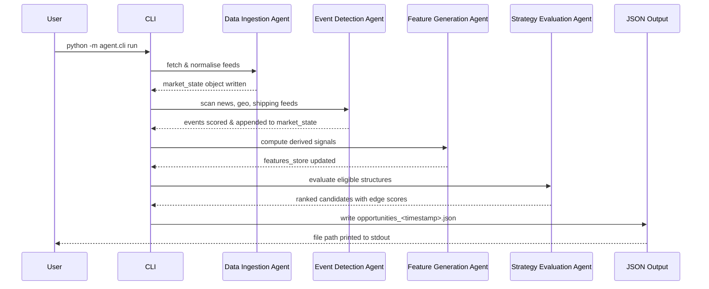

# Energy Options Opportunity Agent — User Guide

> **Version 1.0 · March 2026**
> This guide walks you through setting up, configuring, and running the full Energy Options Opportunity Agent pipeline from a single workstation or low-cost cloud instance.

---

## Table of Contents

1. [Overview](#overview)
2. [Prerequisites](#prerequisites)
3. [Setup & Configuration](#setup--configuration)
4. [Running the Pipeline](#running-the-pipeline)
5. [Interpreting the Output](#interpreting-the-output)
6. [Troubleshooting](#troubleshooting)

---

## Overview

The **Energy Options Opportunity Agent** is a four-stage autonomous pipeline that identifies options trading opportunities driven by oil market instability. It ingests market prices, supply signals, geopolitical news, and alternative datasets, then produces a ranked list of candidate options strategies with a transparent, signal-based edge score.

### Pipeline Architecture


```mermaid
flowchart LR
    subgraph Ingestion["① Data Ingestion Agent"]
        A1[Crude Prices\nAlpha Vantage / MetalpriceAPI]
        A2[ETF & Equity Prices\nyfinance / Yahoo Finance]
        A3[Options Chains\nYahoo Finance / Polygon.io]
        A4[Supply & Inventory\nEIA API]
    end

    subgraph Event["② Event Detection Agent"]
        B1[News & Geo Events\nGDELT / NewsAPI]
        B2[Shipping & Tanker Flows\nMarineTraffic / VesselFinder]
        B3[Confidence & Intensity Scoring]
    end

    subgraph Feature["③ Feature Generation Agent"]
        C1[Volatility Gap\nRealized vs. Implied]
        C2[Futures Curve Steepness]
        C3[Sector Dispersion]
        C4[Insider Conviction Score\nEDGAR / Quiver Quant]
        C5[Narrative Velocity\nReddit / Stocktwits]
        C6[Supply Shock Probability]
    end

    subgraph Strategy["④ Strategy Evaluation Agent"]
        D1[Evaluate Eligible Structures]
        D2[Compute Edge Scores]
        D3[Ranked Candidates + Signals]
    end

    MS[(Market State\nObject)]
    FS[(Derived Features\nStore)]
    OUT[📄 JSON Output]

    Ingestion --> MS
    MS --> Event
    Event --> MS
    MS --> Feature
    Feature --> FS
    FS --> Strategy
    Strategy --> OUT
```

### In-Scope Instruments & Structures

| Category | Items |
|---|---|
| **Crude Futures** | Brent Crude, WTI (`CL=F`) |
| **ETFs** | USO, XLE |
| **Energy Equities** | Exxon Mobil (XOM), Chevron (CVX) |
| **Option Structures (MVP)** | Long straddles, call/put spreads, calendar spreads |

> **Advisory only.** The system surfaces opportunities and explains its reasoning — it does **not** execute trades.

---

## Prerequisites

### System Requirements

| Requirement | Minimum |
|---|---|
| **OS** | Linux, macOS, or Windows (WSL2 recommended) |
| **Python** | 3.10 or later |
| **RAM** | 2 GB (4 GB recommended) |
| **Disk** | 10 GB free (for 6–12 months of historical data) |
| **Network** | Outbound HTTPS to data provider APIs |

### Required Accounts & API Keys

All data sources are free or low-cost. Obtain credentials before proceeding.

| Source | Purpose | Sign-up URL | Free Tier |
|---|---|---|---|
| Alpha Vantage | WTI / Brent spot prices | https://www.alphavantage.co | Yes |
| EIA API | Inventory & refinery data | https://www.eia.gov/opendata | Yes |
| GDELT | Geopolitical event feeds | https://www.gdeltproject.org | Yes (no key) |
| NewsAPI | Energy news headlines | https://newsapi.org | Yes |
| Polygon.io | Options chain data | https://polygon.io | Limited free |
| SEC EDGAR | Insider trades | https://efts.sec.gov/LATEST/search-index | Yes (no key) |
| MarineTraffic | Tanker flow data | https://www.marinetraffic.com/en/ais-api | Free tier |
| Reddit API | Narrative / sentiment | https://www.reddit.com/prefs/apps | Yes |

> Yahoo Finance (`yfinance`) requires no API key; it is accessed via the open endpoint.

---

## Setup & Configuration

### 1. Clone the Repository

```bash
git clone https://github.com/your-org/energy-options-agent.git
cd energy-options-agent
```

### 2. Create a Virtual Environment

```bash
python -m venv .venv
source .venv/bin/activate        # Linux / macOS
# .venv\Scripts\activate         # Windows PowerShell
```

### 3. Install Dependencies

```bash
pip install --upgrade pip
pip install -r requirements.txt
```

### 4. Configure Environment Variables

Copy the example environment file and populate it with your credentials:

```bash
cp .env.example .env
```

Open `.env` in your editor and set each value. The full set of recognised variables is described below.

#### Environment Variable Reference

| Variable | Required | Default | Description |
|---|---|---|---|
| `ALPHA_VANTAGE_API_KEY` | ✅ | — | API key for crude price feeds (WTI, Brent) |
| `EIA_API_KEY` | ✅ | — | API key for EIA inventory and refinery data |
| `NEWS_API_KEY` | ✅ | — | API key for NewsAPI energy headlines |
| `POLYGON_API_KEY` | ⚠️ Optional | — | API key for Polygon.io options chains (falls back to Yahoo Finance) |
| `MARINE_TRAFFIC_API_KEY` | ⚠️ Optional | — | API key for MarineTraffic tanker data (Phase 3) |
| `REDDIT_CLIENT_ID` | ⚠️ Optional | — | Reddit app client ID for sentiment feeds (Phase 3) |
| `REDDIT_CLIENT_SECRET` | ⚠️ Optional | — | Reddit app client secret |
| `REDDIT_USER_AGENT` | ⚠️ Optional | `energy-agent/1.0` | Reddit API user-agent string |
| `QUIVER_API_KEY` | ⚠️ Optional | — | Quiver Quant API key for insider conviction scores (Phase 3) |
| `DATA_DIR` | ✅ | `./data` | Local directory for persisted market state and historical data |
| `OUTPUT_DIR` | ✅ | `./output` | Directory where JSON opportunity files are written |
| `LOG_LEVEL` | ❌ | `INFO` | Logging verbosity: `DEBUG`, `INFO`, `WARNING`, `ERROR` |
| `PRICE_REFRESH_INTERVAL_SECONDS` | ❌ | `60` | Cadence for market price polling (minutes-level) |
| `EIA_REFRESH_INTERVAL_HOURS` | ❌ | `24` | Cadence for EIA inventory refresh (daily) |
| `HISTORICAL_RETENTION_DAYS` | ❌ | `365` | Days of raw and derived data to retain for backtesting |
| `MIN_EDGE_SCORE` | ❌ | `0.20` | Minimum edge score threshold; candidates below this are suppressed |

> Variables marked ⚠️ Optional are required only for the pipeline phases that use them (see [MVP Phasing](#mvp-phasing--which-agents-are-active)).

### 5. Initialise the Data Store

The following command creates the directory structure and seeds schema files for the market state object and derived features store:

```bash
python -m agent.cli init
```

Expected output:

```
[INFO] Data directory created: ./data
[INFO] Output directory created: ./output
[INFO] Schema initialised for market_state and features_store.
[INFO] Initialisation complete.
```

---

## Running the Pipeline

### Pipeline Flow


```mermaid
sequenceDiagram
    participant User
    participant CLI
    participant Ingestion as Data Ingestion Agent
    participant Event as Event Detection Agent
    participant Feature as Feature Generation Agent
    participant Strategy as Strategy Evaluation Agent
    participant Output as JSON Output

    User->>CLI: python -m agent.cli run
    CLI->>Ingestion: fetch & normalise feeds
    Ingestion-->>CLI: market_state object written
    CLI->>Event: scan news, geo, shipping feeds
    Event-->>CLI: events scored & appended to market_state
    CLI->>Feature: compute derived signals
    Feature-->>CLI: features_store updated
    CLI->>Strategy: evaluate eligible structures
    Strategy-->>CLI: ranked candidates with edge scores
    CLI->>Output: write opportunities_<timestamp>.json
    Output-->>User: file path printed to stdout
```

### Single Run (One-Shot)

Execute all four agents sequentially for one evaluation cycle:

```bash
python -m agent.cli run
```

The pipeline tolerates missing or delayed feeds gracefully — a failed data source is logged and skipped without halting downstream agents.

### Continuous Mode (Polling)

Run the pipeline on a repeating schedule, respecting the cadence set by `PRICE_REFRESH_INTERVAL_SECONDS`:

```bash
python -m agent.cli run --continuous
```

Press `Ctrl+C` to stop. The process writes a candidate file after each completed cycle.

### Running Individual Agents

Each agent can be executed independently, which is useful during development or when debugging a single stage:

```bash
# Stage 1 — fetch and normalise all feeds
python -m agent.cli run --agent ingestion

# Stage 2 — detect and score events
python -m agent.cli run --agent event

# Stage 3 — compute derived features
python -m agent.cli run --agent feature

# Stage 4 — evaluate and rank strategies
python -m agent.cli run --agent strategy
```

> **Dependency note:** Each agent reads from the outputs of the preceding stage. Running `event`, `feature`, or `strategy` in isolation requires that upstream outputs already exist in `DATA_DIR`.

### MVP Phasing — Which Agents Are Active

The system ships in phases. Use the `--phase` flag to limit agent activity to the signals available for your current phase:

```bash
python -m agent.cli run --phase 1   # Core market signals + straddles/spreads
python -m agent.cli run --phase 2   # + EIA supply data + event detection
python -m agent.cli run --phase 3   # + insider, narrative, shipping signals
```

| Phase | Name | Active Agents & Signals |
|---|---|---|
| **1** | Core Market Signals & Options | Crude prices, ETF/equity prices, options surface (IV, strike distribution), long straddles, call/put spreads |
| **2** | Supply & Event Augmentation | Phase 1 + EIA inventory, refinery utilisation, GDELT/NewsAPI event detection, supply disruption indices |
| **3** | Alternative / Contextual Signals | Phase 2 + insider trades (EDGAR/Quiver), narrative velocity (Reddit/Stocktwits), tanker flows (MarineTraffic), calendar spreads |
| **4** | High-Fidelity Enhancements | Not automated; see [Future Considerations](#future-considerations) |

---

## Interpreting the Output

### Output File Location

Each pipeline run writes a timestamped JSON file to `OUTPUT_DIR`:

```
./output/opportunities_2026-03-15T14:32:00Z.json
```

### Output Schema

Each element in the output array represents one ranked candidate opportunity:

| Field | Type | Description |
|---|---|---|
| `instrument` | `string` | Target instrument, e.g. `USO`, `XLE`, `CL=F` |
| `structure` | `enum` | `long_straddle` \| `call_spread` \| `put_spread` \| `calendar_spread` |
| `expiration` | `integer` (days) | Calendar days from evaluation date to target expiry |
| `edge_score` | `float` [0.0–1.0] | Composite opportunity score; higher = stronger signal confluence |
| `signals` | `object` | Map of contributing signals and their qualitative levels |
| `generated_at` | ISO 8601 datetime | UTC timestamp of candidate generation |

### Example Output

```json
[
  {
    "instrument": "USO",
    "structure": "long_straddle",
    "expiration": 30,
    "edge_score": 0.47,
    "signals": {
      "tanker_disruption_index": "high",
      "volatility_gap": "positive",
      "narrative_velocity": "rising"
    },
    "generated_at": "2026-03-15T14:32:00Z"
  },
  {
    "instrument": "XOM",
    "structure": "call_spread",
    "expiration": 21,
    "edge_score": 0.31,
    "signals": {
      "volatility_gap": "positive",
      "supply_shock_probability": "elevated",
      "sector_dispersion": "widening"
    },
    "generated_at": "2026-03-15T14:32:00Z"
  }
]
```

### Reading the Edge Score

| Edge Score Range | Interpretation |
|---|---|
| **0.70 – 1.00** | Strong signal confluence; high-conviction candidate |
| **0.50 – 0.69** | Moderate confluence; worth monitoring or sizing conservatively |
| **0.20 – 0.49** | Weak or early-stage signal; low priority |
| **< 0.20** | Below threshold; suppressed by default (`MIN_EDGE_SCORE`) |

### Reading the Signals Map

Each key in `signals` corresponds to a feature computed by the Feature Generation Agent. Qualitative levels indicate the direction or magnitude of the signal:

| Signal Key | Possible Values | What It Means |
|---|---|---|
| `volatility_gap` | `positive`, `neutral`, `negative` | Implied volatility is above (`positive`) or below (`negative`) realised vol |
| `futures_curve_steepness` | `contango`, `flat`, `backwardation` | Shape of the WTI/Brent futures curve |
| `sector_dispersion` | `widening`, `stable`, `narrowing` | Divergence between energy equity returns |
| `insider_conviction_score` | `high`, `moderate`, `low` | Aggregated insider buying/selling signal |
| `narrative_velocity` | `rising`, `stable`, `falling` | Rate of change in energy-related headline volume |
| `supply_shock_probability` | `elevated`, `moderate`, `low` | Probability of a near-term supply disruption |
| `tanker_disruption_index` | `high`, `moderate`, `low` | Anomalies in global tanker routing or volume |

### Visualising Output

The JSON output is compatible with any JSON-capable dashboard. To import into **thinkorswim**, load the file via the platform's custom scripting or watchlist import feature. Alternatively, pipe the output into any BI tool (Grafana, Streamlit, Jupyter) that accepts JSON data.

---

## Troubleshooting

### Common Errors

| Symptom | Likely Cause | Resolution |
|---|---|---|
| `KeyError: 'ALPHA_VANTAGE_API_KEY'` | Missing environment variable | Confirm `.env` is populated and loaded (`source .env` or use `python-dotenv`) |
| `ConnectionError` on data fetch | Network issue or rate limit | Check internet access; reduce `PRICE_REFRESH_INTERVAL_SECONDS`; inspect provider status page |
| Empty `opportunities_*.json` | All candidates below `MIN_EDGE_SCORE` | Lower `MIN_EDGE_SCORE` in `.env` temporarily to inspect suppressed candidates |
| Agent skips a feed silently | Feed returned no data or timed out | Set `LOG_LEVEL=DEBUG` and re-run; look for `[WARNING] Feed unavailable` entries |
| `FileNotFoundError: ./data/market_state.json` | `init` not run, or `DATA_DIR` misconfigured | Run