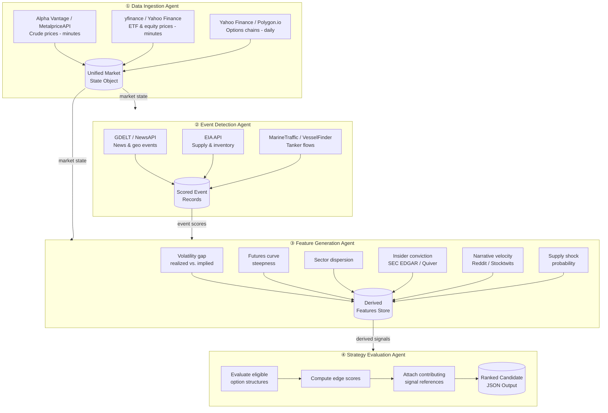

# Energy Options Opportunity Agent — User Guide

> **Version 1.0 · March 2026**
> This guide walks a developer through setting up, configuring, and running the full Energy Options Opportunity Agent pipeline from a local machine or single cloud VM.

---

## Table of Contents

1. [Overview](#overview)
2. [Prerequisites](#prerequisites)
3. [Setup & Configuration](#setup--configuration)
4. [Running the Pipeline](#running-the-pipeline)
5. [Interpreting the Output](#interpreting-the-output)
6. [Troubleshooting](#troubleshooting)

---

## Overview

The Energy Options Opportunity Agent is a four-stage autonomous pipeline that identifies options trading opportunities driven by oil market instability. It ingests market data, supply signals, news events, and alternative datasets, then surfaces volatility mispricing in oil-related instruments and ranks candidate options strategies by a computed **edge score**.

### In-scope instruments

| Category | Instruments |
|---|---|
| Crude futures | Brent Crude, WTI (`CL=F`) |
| ETFs | USO, XLE |
| Energy equities | XOM (ExxonMobil), CVX (Chevron) |

### In-scope option structures (MVP)

| Structure | Enum value |
|---|---|
| Long straddle | `long_straddle` |
| Call spread | `call_spread` |
| Put spread | `put_spread` |
| Calendar spread | `calendar_spread` |

> **Advisory only.** The system does not execute trades. All output is for informational and analytical purposes.

---

### Pipeline architecture


```mermaid
flowchart TD
    subgraph Ingestion["① Data Ingestion Agent"]
        A1[Alpha Vantage / MetalpriceAPI\nCrude prices - minutes]
        A2[yfinance / Yahoo Finance\nETF & equity prices - minutes]
        A3[Yahoo Finance / Polygon.io\nOptions chains - daily]
        A4[(Unified Market\nState Object)]
        A1 & A2 & A3 --> A4
    end

    subgraph Event["② Event Detection Agent"]
        B1[GDELT / NewsAPI\nNews & geo events]
        B2[EIA API\nSupply & inventory]
        B3[MarineTraffic / VesselFinder\nTanker flows]
        B4[(Scored Event\nRecords)]
        B1 & B2 & B3 --> B4
    end

    subgraph Features["③ Feature Generation Agent"]
        C1[Volatility gap\nrealized vs. implied]
        C2[Futures curve\nsteepness]
        C3[Sector dispersion]
        C4[Insider conviction\nSEC EDGAR / Quiver]
        C5[Narrative velocity\nReddit / Stocktwits]
        C6[Supply shock\nprobability]
        C7[(Derived\nFeatures Store)]
        C1 & C2 & C3 & C4 & C5 & C6 --> C7
    end

    subgraph Strategy["④ Strategy Evaluation Agent"]
        D1[Evaluate eligible\noption structures]
        D2[Compute edge scores]
        D3[Attach contributing\nsignal references]
        D4[(Ranked Candidate\nJSON Output)]
        D1 --> D2 --> D3 --> D4
    end

    A4 -->|market state| Event
    A4 -->|market state| Features
    B4 -->|event scores| Features
    C7 -->|derived signals| Strategy
```

Data flows strictly left-to-right / top-to-bottom. Each agent is independently deployable, so you can update or redeploy any single stage without disrupting the rest of the pipeline.

---

## Prerequisites

### System requirements

| Requirement | Minimum |
|---|---|
| Python | 3.10 or later |
| RAM | 2 GB |
| Disk | 10 GB (for 6–12 months of historical data) |
| OS | Linux, macOS, or Windows (WSL recommended) |
| Deployment target | Local machine, single VM, or container |

### Software dependencies

```bash
# Verify Python version
python --version   # must be 3.10+

# Recommended: create and activate a virtual environment
python -m venv .venv
source .venv/bin/activate        # macOS / Linux
.venv\Scripts\activate.bat       # Windows cmd
```

Install project dependencies:

```bash
pip install -r requirements.txt
```

### API accounts

Obtain free-tier credentials for each data source before configuration. All sources listed below have a free or free-limited tier.

| Data layer | Source | Sign-up URL | Notes |
|---|---|---|---|
| Crude prices | Alpha Vantage | `https://www.alphavantage.co/support/#api-key` | Free key, minutes cadence |
| Crude prices (alt) | MetalpriceAPI | `https://metalpriceapi.com/` | Free tier available |
| ETF / equity prices | yfinance | *(no key required)* | Library wraps Yahoo Finance |
| Options chains | Polygon.io | `https://polygon.io/dashboard/signup` | Free / limited tier |
| Supply & inventory | EIA API | `https://www.eia.gov/opendata/register.php` | Fully free |
| News & geo events | NewsAPI | `https://newsapi.org/register` | Free developer tier |
| News & geo events (alt) | GDELT | *(no key required)* | Open dataset |
| Insider activity | Quiver Quant | `https://www.quiverquant.com/quiverapi/` | Free / limited tier |
| Shipping / logistics | MarineTraffic | `https://www.marinetraffic.com/en/p/api-services` | Free tier for basic vessel data |
| Narrative / sentiment | Reddit API | `https://www.reddit.com/prefs/apps` | Free; create a "script" app |

---

## Setup & Configuration

### 1. Clone the repository

```bash
git clone https://github.com/your-org/energy-options-agent.git
cd energy-options-agent
```

### 2. Copy the example environment file

```bash
cp .env.example .env
```

### 3. Set environment variables

Open `.env` in your editor and populate every variable. The table below is the authoritative reference for all supported variables.

| Variable | Required | Description | Example value |
|---|---|---|---|
| `ALPHA_VANTAGE_API_KEY` | Yes | API key for Alpha Vantage crude price feed | `ABCDE12345` |
| `METALPRICE_API_KEY` | No | API key for MetalpriceAPI (fallback crude feed) | `xyz98765` |
| `POLYGON_API_KEY` | Yes | API key for Polygon.io options chain data | `pqr11111` |
| `EIA_API_KEY` | Yes | API key for EIA supply & inventory data | `eia_abc123` |
| `NEWSAPI_KEY` | Yes | API key for NewsAPI geopolitical feed | `news_abc123` |
| `QUIVER_API_KEY` | No | API key for Quiver Quant insider activity | `qv_xyz999` |
| `MARINETRAFFIC_API_KEY` | No | API key for MarineTraffic tanker data | `mt_abc456` |
| `REDDIT_CLIENT_ID` | No | Reddit API client ID for sentiment feed | `reddit_id_abc` |
| `REDDIT_CLIENT_SECRET` | No | Reddit API client secret | `reddit_secret_xyz` |
| `REDDIT_USER_AGENT` | No | Reddit API user-agent string | `energy-agent/1.0` |
| `DATA_DIR` | Yes | Absolute path to local historical data store | `/var/data/energy-agent` |
| `OUTPUT_DIR` | Yes | Directory where JSON output files are written | `/var/output/energy-agent` |
| `LOG_LEVEL` | No | Logging verbosity (`DEBUG`, `INFO`, `WARNING`) | `INFO` |
| `MARKET_REFRESH_INTERVAL_SECONDS` | No | Cadence for market data polling (minutes-level) | `300` |
| `HISTORICAL_RETENTION_DAYS` | No | Days of history to retain for backtesting | `365` |

> **Tip:** Variables marked *No* are optional for MVP. The pipeline tolerates missing or delayed data without failing (see [Troubleshooting](#troubleshooting)), but signals that depend on optional sources will be absent from edge score computation.

### 4. Initialise the data directory

```bash
python -m agent init
```

This creates the directory structure under `DATA_DIR`:

```
$DATA_DIR/
├── raw/
│   ├── crude/
│   ├── etf_equity/
│   ├── options/
│   ├── supply/
│   ├── events/
│   ├── insider/
│   ├── shipping/
│   └── sentiment/
└── derived/
    └── features/
```

### 5. Verify connectivity

Run the built-in connectivity check to confirm each configured data source is reachable before running the full pipeline:

```bash
python -m agent check-sources
```

Expected output (sources omitted if key not configured):

```
[OK]   Alpha Vantage        — crude prices reachable
[OK]   Polygon.io           — options chain reachable
[OK]   EIA API              — supply data reachable
[OK]   NewsAPI              — news feed reachable
[SKIP] Quiver Quant         — QUIVER_API_KEY not set
[SKIP] MarineTraffic        — MARINETRAFFIC_API_KEY not set
[SKIP] Reddit               — REDDIT_CLIENT_ID not set
```

---

## Running the Pipeline

### Full pipeline (single execution)

Runs all four agents sequentially for a single evaluation cycle and writes ranked candidates to `OUTPUT_DIR`.

```bash
python -m agent run
```

### Full pipeline (continuous polling)

Runs the pipeline on the cadence defined by `MARKET_REFRESH_INTERVAL_SECONDS`. Press `Ctrl+C` to stop.

```bash
python -m agent run --loop
```

### Run a single agent

Each agent can be executed in isolation for development or debugging purposes.

```bash
# Stage 1: ingest and normalise market data
python -m agent run --stage ingest

# Stage 2: detect and score events
python -m agent run --stage events

# Stage 3: compute derived features
python -m agent run --stage features

# Stage 4: evaluate strategies and rank candidates
python -m agent run --stage strategy
```

> **Note:** Stages 2–4 depend on the output of earlier stages. If you run a later stage in isolation, ensure the shared state from prior stages is already present in `DATA_DIR`.

### Phased rollout flags

If you are onboarding incrementally per the MVP phasing plan, use the `--phase` flag to restrict which data sources and signals are active.

| Flag | Activates |
|---|---|
| `--phase 1` | Core market signals (crude, ETF/equity, options surface, straddles, spreads) |
| `--phase 2` | Phase 1 + EIA supply data and GDELT/NewsAPI event detection |
| `--phase 3` | Phase 2 + insider, sentiment, and shipping signals |

```bash
python -m agent run --phase 1
python -m agent run --phase 2
python -m agent run --phase 3
```

Omitting `--phase` runs the full configured pipeline.

### Logging

Logs are written to `stdout` and to `$DATA_DIR/logs/agent.log`. Adjust verbosity with `LOG_LEVEL` in `.env` or via the flag:

```bash
python -m agent run --log-level DEBUG
```

---

## Interpreting the Output

### Output location and format

Each pipeline run writes a JSON file to `OUTPUT_DIR` named by UTC timestamp:

```
$OUTPUT_DIR/
└── candidates_2026-03-15T14:32:00Z.json
```

The file contains an array of **strategy candidate objects**. The schema is defined below.

### Output schema

| Field | Type | Description |
|---|---|---|
| `instrument` | `string` | Target instrument — e.g. `USO`, `XLE`, `CL=F` |
| `structure` | `enum` | Option structure: `long_straddle` \| `call_spread` \| `put_spread` \| `calendar_spread` |
| `expiration` | `integer` (days) | Target expiration in calendar days from evaluation date |
| `edge_score` | `float [0.0–1.0]` | Composite opportunity score; higher = stronger signal confluence |
| `signals` | `object` | Map of contributing signals and their current values |
| `generated_at` | ISO 8601 datetime | UTC timestamp of candidate generation |

### Example candidate

```json
{
  "instrument": "USO",
  "structure": "long_straddle",
  "expiration": 30,
  "edge_score": 0.47,
  "signals": {
    "tanker_disruption_index": "high",
    "volatility_gap": "positive",
    "narrative_velocity": "rising"
  },
  "generated_at": "2026-03-15T14:32:00Z"
}
```

### Reading edge scores

| Edge score range | Interpretation |
|---|---|
| `0.75 – 1.00` | Strong signal confluence — high-priority candidate |
| `0.50 – 0.74` | Moderate confluence — worth monitoring |
| `0.25 – 0.49` | Weak confluence — low priority |
| `0.00 – 0.24` | Minimal signal — consider filtering from view |

### Reading signal values

The `signals` object explains *why* a candidate received its edge score. Common signal keys and their value vocabulary are listed below.

| Signal key | Possible values | Source layer |
|---|---|---|
| `volatility_gap` | `positive`, `negative`, `neutral` | Feature Generation (IV vs. realized vol) |
| `futures_curve_steepness` | `contango`, `backwardation`, `flat` | Feature Generation |
| `tanker_disruption_index` | `high`, `moderate`, `low` | Event Detection (MarineTraffic) |
| `supply_shock_probability` | `high`, `moderate`, `low` | Feature Generation (EIA + events) |
| `narrative_velocity` | `rising`, `stable`, `falling` | Feature Generation (Reddit / Stocktwits) |
| `insider_conviction` | `strong`, `moderate`, `weak` | Feature Generation (EDGAR / Quiver) |
| `sector_dispersion` | `elevated`, `normal`, `compressed` | Feature Generation |

### Consuming output in thinkorswim or a dashboard

The JSON output is compatible with any JSON-capable dashboard. For thinkorswim, import the output file using the platform's **thinkScript** data import or any custom watchlist loader that accepts JSON. Alternatively, pipe the output through `jq` for quick inspection:

```bash
# Show all candidates with edge_score above 0.50, sorted descending
jq '[.[] | select(.edge_score >= 0.50)] | sort_by(-.edge_score)' \
  "$OUTPUT_DIR/candidates_2026-03-15T14:32:00Z.json"
```

---

## Troubleshooting

### General diagnostic command

```bash
python -m agent doctor
```

Prints a summary of environment variables, data source connectivity, disk usage under `DATA_DIR`, and the timestamp of the most recent successful run.

---

### Common issues

| Symptom | Likely cause | Resolution |
|---|---|---|
| `check-sources` shows `[FAIL]` for a required source | Missing or invalid API key | Verify the key in `.env`; check provider dashboard for quota exhaustion |
| Pipeline exits with `MarketStateError: no price data` | Alpha Vantage / yfinance unreachable or rate-limited | Wait for rate-limit window to reset; set `METALPRICE_API_KEY` as fallback crude feed |
| `OUTPUT_DIR` is empty after a run | Strategy Evaluation Agent found no candidates above threshold | Normal during low-volatility periods; lower the edge score filter in your dashboard or check that features are being computed (`--stage features`) |
| Stale data warnings in logs | A feed is returning data older than expected | The pipeline