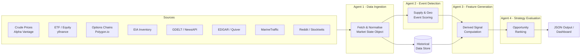

# Energy Options Opportunity Agent — User Guide

> **Version 1.0 · March 2026**
> Advisory system only. No automated trade execution is performed at any stage of the pipeline.

---

## Table of Contents

1. [Overview](#overview)
2. [Prerequisites](#prerequisites)
3. [Setup & Configuration](#setup--configuration)
4. [Running the Pipeline](#running-the-pipeline)
5. [Interpreting the Output](#interpreting-the-output)
6. [Troubleshooting](#troubleshooting)

---

## Overview

The **Energy Options Opportunity Agent** is a modular, four-agent Python pipeline that identifies options trading opportunities driven by oil market instability. It ingests market data, supply signals, news events, and alternative datasets, then surfaces volatility mispricing in oil-related instruments as ranked, explainable strategy candidates.

### What the pipeline does

| Stage | Agent | Core job |
|---|---|---|
| 1 | **Data Ingestion Agent** | Fetches and normalises crude prices, ETF/equity data, and options chains into a unified market state object |
| 2 | **Event Detection Agent** | Monitors news and geopolitical feeds; scores supply disruptions, refinery outages, and tanker chokepoints |
| 3 | **Feature Generation Agent** | Computes derived signals: volatility gaps, curve steepness, sector dispersion, insider conviction, narrative velocity, supply shock probability |
| 4 | **Strategy Evaluation Agent** | Ranks eligible option structures by a composite edge score and emits structured candidate records |

### Pipeline data flow


```mermaid
flowchart LR
    subgraph Sources
        A1[Crude Prices\nAlpha Vantage]
        A2[ETF / Equity\nyfinance]
        A3[Options Chains\nPolygon.io]
        A4[EIA Inventory]
        A5[GDELT / NewsAPI]
        A6[EDGAR / Quiver]
        A7[MarineTraffic]
        A8[Reddit / Stocktwits]
    end

    subgraph Agent 1 - Data Ingestion
        B[Fetch & Normalise\nMarket State Object]
    end

    subgraph Agent 2 - Event Detection
        C[Supply & Geo\nEvent Scoring]
    end

    subgraph Agent 3 - Feature Generation
        D[Derived Signal\nComputation]
    end

    subgraph Agent 4 - Strategy Evaluation
        E[Opportunity\nRanking]
    end

    F[(Historical\nData Store)]
    G[JSON Output /\nDashboard]

    Sources --> B
    B --> F
    B --> C
    C --> D
    D --> E
    E --> G
    F --> D
```

### In-scope instruments (MVP)

| Category | Instruments |
|---|---|
| Crude futures | Brent Crude, WTI (`CL=F`) |
| ETFs | USO, XLE |
| Energy equities | Exxon Mobil (XOM), Chevron (CVX) |

### In-scope option structures (MVP)

- Long straddles
- Call / put spreads
- Calendar spreads

> **Out of scope for MVP:** exotic or multi-legged strategies, regional refined product pricing (OPIS), and automated trade execution.

---

## Prerequisites

### System requirements

| Requirement | Minimum |
|---|---|
| Python | 3.10+ |
| RAM | 2 GB |
| Disk | 10 GB (for 6–12 months of historical data) |
| Deployment target | Local machine, single VM, or container |

### Required accounts and API keys

Obtain credentials for each data source before proceeding. All sources are free or free-tier unless noted.

| Source | What it provides | Sign-up URL | Cost |
|---|---|---|---|
| Alpha Vantage | WTI / Brent spot and futures prices | https://www.alphavantage.co | Free |
| yfinance (Yahoo Finance) | ETF/equity prices (USO, XLE, XOM, CVX) | No key required | Free |
| Polygon.io | Options chains (strike, expiry, IV, volume) | https://polygon.io | Free / Limited |
| EIA API | Weekly inventory and refinery utilisation | https://www.eia.gov/opendata | Free |
| GDELT | Geopolitical and energy disruption events | No key required | Free |
| NewsAPI | Energy news headlines | https://newsapi.org | Free |
| SEC EDGAR | Insider activity filings | No key required | Free |
| Quiver Quant | Parsed insider trade data | https://www.quiverquant.com | Free / Limited |
| MarineTraffic | Tanker flow data | https://www.marinetraffic.com | Free tier |
| Reddit API | Retail sentiment (r/wallstreetbets, r/energy) | https://www.reddit.com/prefs/apps | Free |
| Stocktwits | Retail sentiment velocity | https://api.stocktwits.com | Free |

### Python dependencies

```bash
pip install -r requirements.txt
```

A minimal `requirements.txt` includes:

```text
requests
yfinance
pandas
numpy
python-dotenv
schedule
```

Install any additional connector libraries as instructed by each agent module's own `README`.

---

## Setup & Configuration

### 1 — Clone the repository

```bash
git clone https://github.com/your-org/energy-options-agent.git
cd energy-options-agent
```

### 2 — Create a virtual environment

```bash
python -m venv .venv
source .venv/bin/activate        # macOS / Linux
.venv\Scripts\activate           # Windows
```

### 3 — Install dependencies

```bash
pip install -r requirements.txt
```

### 4 — Configure environment variables

Copy the example environment file and populate it with your credentials:

```bash
cp .env.example .env
```

Open `.env` in your editor and fill in every required value before running the pipeline.

#### Full environment variable reference

| Variable | Required | Description | Example value |
|---|---|---|---|
| `ALPHA_VANTAGE_API_KEY` | ✅ | API key for crude price feed | `AV_XXXXXXXXXXXX` |
| `POLYGON_API_KEY` | ✅ | API key for options chain data | `PG_XXXXXXXXXXXX` |
| `EIA_API_KEY` | ✅ | API key for EIA inventory data | `EIA_XXXXXXXXXX` |
| `NEWSAPI_KEY` | ✅ | API key for NewsAPI headlines | `na_XXXXXXXXXXXX` |
| `QUIVER_API_KEY` | ⚠️ optional | API key for Quiver Quant insider data | `QQ_XXXXXXXXXXXX` |
| `MARINETRAFFIC_API_KEY` | ⚠️ optional | API key for tanker flow data | `MT_XXXXXXXXXXXX` |
| `REDDIT_CLIENT_ID` | ⚠️ optional | Reddit OAuth client ID | `rdt_XXXXXXXXXX` |
| `REDDIT_CLIENT_SECRET` | ⚠️ optional | Reddit OAuth client secret | `rdt_secret_XXX` |
| `REDDIT_USER_AGENT` | ⚠️ optional | Reddit API user-agent string | `energy-agent/1.0` |
| `STOCKTWITS_TOKEN` | ⚠️ optional | Stocktwits bearer token | `st_XXXXXXXXXXXX` |
| `OUTPUT_DIR` | ✅ | Directory where JSON output is written | `./output` |
| `HISTORICAL_DATA_DIR` | ✅ | Root path for persisted raw and derived data | `./data` |
| `RETENTION_DAYS` | ✅ | Days of historical data to retain (180–365) | `365` |
| `MARKET_DATA_INTERVAL_MINUTES` | ✅ | Polling cadence for market price feeds | `5` |
| `LOG_LEVEL` | ✅ | Python logging level | `INFO` |
| `PIPELINE_PHASE` | ✅ | MVP phase to activate (`1`, `2`, `3`, or `4`) | `1` |

> **Optional keys:** Variables marked ⚠️ optional are only required for the phase in which their data source is first used. See [MVP phasing](#mvp-phasing-and-pipeline_phase) below.

### 5 — Initialise the data store

Create the directory structure the pipeline expects:

```bash
python scripts/init_store.py
```

This creates `$HISTORICAL_DATA_DIR/{raw,derived,events,strategies}` and verifies write permissions.

### MVP phasing and `PIPELINE_PHASE`

Set `PIPELINE_PHASE` in `.env` to control which agents and data sources are active.

| `PIPELINE_PHASE` | Agents active | Additional sources enabled |
|---|---|---|
| `1` | Data Ingestion, Strategy Evaluation | Crude benchmarks (WTI, Brent), USO/XLE prices, options surface |
| `2` | All Phase 1 + Event Detection | EIA API, GDELT, NewsAPI |
| `3` | All Phase 2 + full Feature Generation | EDGAR/Quiver, MarineTraffic, Reddit/Stocktwits |
| `4` | All Phase 3 + high-fidelity enhancements | OPIS pricing (paid), exotic structures (deferred) |

Start with `PIPELINE_PHASE=1` and advance phases once each layer is validated.

---

## Running the Pipeline

### Run the full pipeline once

Execute all active agents in sequence for a single evaluation cycle:

```bash
python -m agent.pipeline run
```

The pipeline will:
1. Fetch and normalise market data (Data Ingestion Agent).
2. Scan and score supply/geo events (Event Detection Agent — Phase 2+).
3. Compute derived features (Feature Generation Agent — Phase 2+).
4. Rank strategy candidates and write output (Strategy Evaluation Agent).

### Run the pipeline on a schedule

To poll at the configured `MARKET_DATA_INTERVAL_MINUTES` cadence continuously:

```bash
python -m agent.pipeline schedule
```

Stop with `Ctrl+C`. The scheduler respects the slower cadence of feeds such as EIA (weekly) and EDGAR (daily) automatically — faster feeds (crude prices, ETFs) are refreshed at the configured minute-level interval.

### Run a single agent in isolation

Each agent is independently deployable and can be invoked on its own for testing or debugging:

```bash
# Data Ingestion Agent only
python -m agent.ingestion run

# Event Detection Agent only (Phase 2+)
python -m agent.events run

# Feature Generation Agent only (Phase 2+)
python -m agent.features run

# Strategy Evaluation Agent only
python -m agent.strategy run
```

### Typical first-run sequence

```bash
# 1. Activate environment
source .venv/bin/activate

# 2. Verify configuration
python -m agent.pipeline check-config

# 3. Bootstrap historical data (fetches up to RETENTION_DAYS of history)
python -m agent.pipeline bootstrap

# 4. Run a single pipeline cycle
python -m agent.pipeline run

# 5. Inspect output
cat output/candidates_latest.json | python -m json.tool
```

### Command reference

| Command | Description |
|---|---|
| `pipeline run` | Single end-to-end pipeline execution |
| `pipeline schedule` | Continuous scheduled execution |
| `pipeline bootstrap` | Backfill historical data up to `RETENTION_DAYS` |
| `pipeline check-config` | Validate all required environment variables and API connectivity |
| `ingestion run` | Data Ingestion Agent only |
| `events run` | Event Detection Agent only |
| `features run` | Feature Generation Agent only |
| `strategy run` | Strategy Evaluation Agent only |

---

## Interpreting the Output

### Output location

Each pipeline cycle writes one or more JSON files to `$OUTPUT_DIR`:

```
output/
├── candidates_latest.json      # Most recent ranked candidates
└── candidates_2026-03-15T14:32:00Z.json   # Timestamped archive
```

### Output schema

Each candidate object in the output array contains the following fields:

| Field | Type | Description |
|---|---|---|
| `instrument` | `string` | Target instrument, e.g. `"USO"`, `"XLE"`, `"CL=F"` |
| `structure` | `enum` | Option structure: `long_straddle` \| `call_spread` \| `put_spread` \| `calendar_spread` |
| `expiration` | `integer` | Target expiration in calendar days from evaluation date |
| `edge_score` | `float` [0.0–1.0] | Composite opportunity score — higher = stronger signal confluence |
| `signals` | `object` | Map of contributing signals and their state values |
| `generated_at` | ISO 8601 datetime | UTC timestamp of candidate generation |

### Example candidate record

```json
{
  "instrument": "USO",
  "structure": "long_straddle",
  "expiration": 30,
  "edge_score": 0.47,
  "signals": {
    "tanker_disruption_index": "high",
    "volatility_gap": "positive",
    "narrative_velocity": "rising"
  },
  "generated_at": "2026-03-15T14:32:00Z"
}
```

### Reading the edge score

| `edge_score` range | Interpretation |
|---|---|
| 0.00 – 0.25 | Weak signal confluence; limited opportunity |
| 0.26 – 0.50 | Moderate confluence; worth monitoring |
| 0.51 – 0.75 | Strong confluence; candidate warrants review |
| 0.76 – 1.00 | Very strong confluence; highest-priority candidate |

> The edge score is a heuristic composite. It reflects signal agreement, not a probability of profit. Always apply independent judgement before acting on any candidate.

### Signal keys and their meanings

The `signals` object contains one or more of the following keys, depending on the active phase:

| Signal key | Phases active | What it measures |
|---|---|---|
| `volatility_gap` | 1+ | Realised vs. implied volatility divergence. `positive` = IV underprices realised vol |
| `futures_curve_steepness` | 1+ | Contango / backwardation degree of the crude curve |
| `sector_dispersion` | 1+ | Divergence in returns across energy sector names |
| `supply_disruption_index` | 2+ | EIA-derived inventory and refinery utilisation signal |
| `tanker_disruption_index` | 2+ | Geopolitical event scoring affecting tanker chokepoints |
| `narrative_velocity` | 3+ | Acceleration of energy-related headline and social volume |
| `insider_conviction` | 3+ | Aggregated EDGAR/Quiver insider trade signal |
| `supply_shock_probability` | 3+ | Composite probability of an imminent supply shock |

Common signal state values: `low`, `moderate`, `high`, `positive`, `negative`, `rising`, `falling`, `stable`.

### Using the output with thinkorswim

The JSON output is designed to be consumed by any JSON-capable dashboard or loaded directly into thinkorswim via its scripting interface. Import `candidates_latest.json` into your preferred visualisation tool or write a thin adapter script to push candidates into thinkorswim watchlists.

---

## Troubleshooting

### `check-config` fails for a specific API key

```
[ERROR] POLYGON_API_KEY connectivity check failed: 403 Forbidden
```

**Action:** Verify the key value in `.env` is correct and that your Polygon.io account tier supports the options chain endpoint. Free-tier accounts may have endpoint restrictions.

---

### Pipeline exits with `MissingDataError` mid-run

The pipeline is designed to **tolerate delayed or missing data without failing**. If a non-critical feed (e.g., MarineTraffic, Stocktwits) is unavailable, the agent logs a warning and continues with reduced signal coverage.

```
[WARNING] MarineTraffic feed unavailable — tanker_disruption_index will be absent from this cycle
```

If the pipeline exits rather than warns, check:

1. Whether the failing source is classified as **required** for your active `PIPELINE_PHASE`.
2. Network connectivity to the upstream API.
3. Whether the API rate limit has