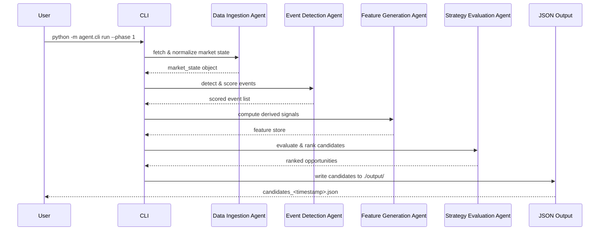

# Energy Options Opportunity Agent — User Guide

> **Version 1.0 · March 2026**
> Advisory only — no automated trade execution is performed by this system.

---

## Table of Contents

1. [Overview](#overview)
2. [Prerequisites](#prerequisites)
3. [Setup & Configuration](#setup--configuration)
4. [Running the Pipeline](#running-the-pipeline)
5. [Interpreting the Output](#interpreting-the-output)
6. [Troubleshooting](#troubleshooting)

---

## Overview

The **Energy Options Opportunity Agent** is an autonomous, modular Python pipeline that identifies options trading opportunities driven by oil market instability. It ingests market data, supply signals, news events, and alternative datasets, then surfaces volatility mispricing in oil-related instruments and ranks candidate options strategies by a computed **edge score**.

### Pipeline Architecture

Four loosely coupled agents communicate through a shared market state object and a derived features store. Data flows strictly left-to-right; no agent writes back to an upstream stage.


```mermaid
flowchart LR
    subgraph Ingestion["① Data Ingestion Agent"]
        A1[Crude Prices\nWTI · Brent]
        A2[ETF & Equity Prices\nUSO · XLE · XOM · CVX]
        A3[Options Chains\nStrike · Expiry · IV]
    end

    subgraph Events["② Event Detection Agent"]
        B1[News & Geo Feeds\nGDELT · NewsAPI]
        B2[Supply Signals\nEIA · Shipping]
        B3[Confidence &\nIntensity Scores]
    end

    subgraph Features["③ Feature Generation Agent"]
        C1[Volatility Gap\nRealised vs Implied]
        C2[Futures Curve\nSteepness]
        C3[Sector Dispersion\nInsider Conviction]
        C4[Narrative Velocity\nSupply Shock Prob.]
    end

    subgraph Strategy["④ Strategy Evaluation Agent"]
        D1[Long Straddle]
        D2[Call / Put Spread]
        D3[Calendar Spread]
        D4[Ranked Candidates\nwith Edge Scores]
    end

    RAW[(Market\nState Object)] --> Ingestion
    Ingestion -->|normalized state| Events
    Events -->|scored events| Features
    Features -->|derived signals| Strategy
    Strategy -->|JSON output| OUT[(Candidates\nJSON)]
```

### In-Scope Instruments

| Category | Instruments |
|---|---|
| Crude futures | Brent Crude, WTI (`CL=F`) |
| ETFs | USO, XLE |
| Energy equities | Exxon Mobil (XOM), Chevron (CVX) |

### In-Scope Option Structures (MVP)

- Long straddles
- Call / put spreads
- Calendar spreads

> **Out of scope for MVP:** exotic/multi-legged strategies, regional refined product pricing (OPIS), and automated trade execution.

---

## Prerequisites

### System Requirements

| Requirement | Minimum |
|---|---|
| Python | 3.10 or later |
| Operating system | Linux, macOS, or Windows (WSL2 recommended) |
| RAM | 2 GB |
| Disk | 5 GB free (grows with 6–12 months of historical data) |
| Network | Outbound HTTPS on port 443 |

### External Accounts & API Keys

Register for the following free (or free-tier) services before proceeding. All are required unless marked optional.

| Service | Used for | Tier needed | Sign-up URL |
|---|---|---|---|
| Alpha Vantage | WTI / Brent spot & futures prices | Free | <https://www.alphavantage.co/support/#api-key> |
| Yahoo Finance (`yfinance`) | ETF, equity & options data | Free (no key) | n/a |
| Polygon.io | Options chains (fallback) | Free / Starter | <https://polygon.io/dashboard/signup> |
| EIA Open Data | Inventory & refinery utilization | Free | <https://www.eia.gov/opendata/register.php> |
| GDELT Project | Geopolitical & news events | Free (no key) | n/a |
| NewsAPI | Headline acceleration | Free | <https://newsapi.org/register> |
| SEC EDGAR | Insider activity | Free (no key) | n/a |
| Quiver Quant | Insider conviction scores | Free / Limited | <https://www.quiverquant.com/> |
| MarineTraffic | Tanker flow signals | Free tier | <https://www.marinetraffic.com/en/users/login> |
| Reddit API | Narrative / retail sentiment | Free | <https://www.reddit.com/prefs/apps> |
| Stocktwits | Narrative / retail sentiment | Free (no key) | n/a |

> **Tip:** For Phase 1 evaluation you only need Alpha Vantage and `yfinance`. Additional keys become necessary in Phase 2 and Phase 3.

### Python Dependencies

```bash
pip install -r requirements.txt
```

Key packages (see `requirements.txt` for pinned versions):

```
yfinance
requests
pandas
numpy
pydantic
python-dotenv
schedule
```

---

## Setup & Configuration

### 1. Clone the Repository

```bash
git clone https://github.com/your-org/energy-options-agent.git
cd energy-options-agent
```

### 2. Create a Virtual Environment

```bash
python -m venv .venv
source .venv/bin/activate        # Linux / macOS
# .venv\Scripts\activate         # Windows PowerShell
pip install --upgrade pip
pip install -r requirements.txt
```

### 3. Configure Environment Variables

Copy the example environment file and populate it with your credentials:

```bash
cp .env.example .env
```

Open `.env` in your editor and fill in each value:

```dotenv
# ── Data Ingestion ─────────────────────────────────────────────────────────
ALPHA_VANTAGE_API_KEY=YOUR_KEY_HERE
POLYGON_API_KEY=YOUR_KEY_HERE

# ── Supply & Inventory ─────────────────────────────────────────────────────
EIA_API_KEY=YOUR_KEY_HERE

# ── News & Geopolitical Events ─────────────────────────────────────────────
NEWS_API_KEY=YOUR_KEY_HERE

# ── Insider Activity ───────────────────────────────────────────────────────
QUIVER_QUANT_API_KEY=YOUR_KEY_HERE

# ── Shipping & Logistics ───────────────────────────────────────────────────
MARINE_TRAFFIC_API_KEY=YOUR_KEY_HERE

# ── Narrative / Sentiment ──────────────────────────────────────────────────
REDDIT_CLIENT_ID=YOUR_KEY_HERE
REDDIT_CLIENT_SECRET=YOUR_KEY_HERE
REDDIT_USER_AGENT=energy-options-agent/1.0

# ── Pipeline Behaviour ─────────────────────────────────────────────────────
MARKET_DATA_REFRESH_MINUTES=5
SLOW_FEED_REFRESH_HOURS=24
DATA_RETENTION_DAYS=365
LOG_LEVEL=INFO

# ── Output ─────────────────────────────────────────────────────────────────
OUTPUT_DIR=./output
OUTPUT_FORMAT=json
```

#### Full Environment Variable Reference

| Variable | Required | Default | Description |
|---|---|---|---|
| `ALPHA_VANTAGE_API_KEY` | Phase 1+ | — | Crude price feed (WTI, Brent) |
| `POLYGON_API_KEY` | Phase 1+ | — | Options chain fallback data |
| `EIA_API_KEY` | Phase 2+ | — | Inventory & refinery utilization |
| `NEWS_API_KEY` | Phase 2+ | — | Headline acceleration / news events |
| `QUIVER_QUANT_API_KEY` | Phase 3+ | — | Insider conviction scores |
| `MARINE_TRAFFIC_API_KEY` | Phase 3+ | — | Tanker flow & chokepoint signals |
| `REDDIT_CLIENT_ID` | Phase 3+ | — | Reddit OAuth app ID |
| `REDDIT_CLIENT_SECRET` | Phase 3+ | — | Reddit OAuth secret |
| `REDDIT_USER_AGENT` | Phase 3+ | `energy-options-agent/1.0` | Reddit API user-agent string |
| `MARKET_DATA_REFRESH_MINUTES` | No | `5` | Polling cadence for price & options feeds |
| `SLOW_FEED_REFRESH_HOURS` | No | `24` | Polling cadence for EIA, EDGAR, Quiver |
| `DATA_RETENTION_DAYS` | No | `365` | Days of raw & derived data to retain |
| `LOG_LEVEL` | No | `INFO` | Python logging level (`DEBUG`, `INFO`, `WARNING`, `ERROR`) |
| `OUTPUT_DIR` | No | `./output` | Directory where JSON candidate files are written |
| `OUTPUT_FORMAT` | No | `json` | Output format (`json` is the only supported value in MVP) |

> **Security:** Never commit `.env` to version control. It is listed in `.gitignore` by default.

### 4. Verify Configuration

```bash
python -m agent.cli check-config
```

Expected output:

```
[✓] ALPHA_VANTAGE_API_KEY   present
[✓] POLYGON_API_KEY         present
[✓] EIA_API_KEY             present
[✓] NEWS_API_KEY            present
[!] QUIVER_QUANT_API_KEY    missing  (required for Phase 3)
[!] MARINE_TRAFFIC_API_KEY  missing  (required for Phase 3)
[✓] Output directory        ./output (writable)
Configuration check complete.
```

Missing Phase 3 keys produce warnings, not errors, when running Phase 1 or Phase 2 scopes.

---

## Running the Pipeline

### Pipeline Execution Flow


```mermaid
sequenceDiagram
    participant User
    participant CLI
    participant Ingestion as Data Ingestion Agent
    participant Events as Event Detection Agent
    participant Features as Feature Generation Agent
    participant Strategy as Strategy Evaluation Agent
    participant Output as JSON Output

    User->>CLI: python -m agent.cli run --phase 1
    CLI->>Ingestion: fetch & normalize market state
    Ingestion-->>CLI: market_state object
    CLI->>Events: detect & score events
    Events-->>CLI: scored event list
    CLI->>Features: compute derived signals
    Features-->>CLI: feature store
    CLI->>Strategy: evaluate & rank candidates
    Strategy-->>CLI: ranked opportunities
    CLI->>Output: write candidates to ./output/
    Output-->>User: candidates_<timestamp>.json
```

### Single Run (One-Shot)

Execute the full pipeline once and write results to `OUTPUT_DIR`:

```bash
python -m agent.cli run
```

To restrict execution to a specific MVP phase:

```bash
# Phase 1 — Core market signals & options only
python -m agent.cli run --phase 1

# Phase 2 — Adds EIA inventory and event detection
python -m agent.cli run --phase 2

# Phase 3 — Adds insider, narrative, and shipping signals
python -m agent.cli run --phase 3
```

### Continuous / Scheduled Mode

Run the pipeline on its configured refresh cadence (market feeds every `MARKET_DATA_REFRESH_MINUTES`, slow feeds every `SLOW_FEED_REFRESH_HOURS`):

```bash
python -m agent.cli run --continuous
```

Stop with `Ctrl+C`. The scheduler performs a clean shutdown after the current cycle completes.

### Running Individual Agents

Each agent can be invoked independently for testing or incremental development:

```bash
# Data Ingestion Agent only
python -m agent.ingestion.run

# Event Detection Agent only (reads an existing market state from disk)
python -m agent.events.run --state ./output/market_state_latest.json

# Feature Generation Agent only
python -m agent.features.run --state ./output/market_state_latest.json \
                              --events ./output/events_latest.json

# Strategy Evaluation Agent only
python -m agent.strategy.run --features ./output/features_latest.json
```

### Command Reference

| Command | Description |
|---|---|
| `python -m agent.cli check-config` | Validate environment variables and output directory |
| `python -m agent.cli run` | One-shot full pipeline (all configured phases) |
| `python -m agent.cli run --phase N` | One-shot limited to Phase N scope |
| `python -m agent.cli run --continuous` | Scheduled continuous execution |
| `python -m agent.cli run --dry-run` | Validate pipeline without writing output |
| `python -m agent.cli version` | Print agent version |

---

## Interpreting the Output

### Output Location

Each pipeline run writes a timestamped JSON file to `OUTPUT_DIR`:

```
./output/
└── candidates_2026-03-15T14:32:00Z.json
```

`market_state_latest.json`, `events_latest.json`, and `features_latest.json` are also written as intermediate artefacts and overwritten on each run.

### Output Schema

Each entry in the candidates array represents one ranked options opportunity:

| Field | Type | Description |
|---|---|---|
| `instrument` | `string` | Target instrument, e.g. `"USO"`, `"XLE"`, `"CL=F"` |
| `structure` | `enum` | `long_straddle` · `call_spread` · `put_spread` · `calendar_spread` |
| `expiration` | `integer` (days) | Calendar days to target expiration from evaluation date |
| `edge_score` | `float` [0.0–1.0] | Composite opportunity score; higher = stronger signal confluence |
| `signals` | `object` | Map of contributing signals and their qualitative values |
| `generated_at` | ISO 8601 datetime | UTC timestamp of candidate generation |

### Example Output

```json
[
  {
    "instrument": "USO",
    "structure": "long_straddle",
    "expiration": 30,
    "edge_score": 0.47,
    "signals": {
      "tanker_disruption_index": "high",
      "volatility_gap": "positive",
      "narrative_velocity": "rising"
    },
    "generated_at": "2026-03-15T14:32:00Z"
  },
  {
    "instrument": "XLE",
    "structure": "call_spread",
    "expiration": 45,
    "edge_score": 0.31,
    "signals": {
      "volatility_gap": "positive",
      "supply_shock_probability": "elevated",
      "sector_dispersion": "widening"
    },
    "generated_at": "2026-03-15T14:32:00Z"
  }
]
```

### Reading Edge Scores

| `edge_score` Range | Interpretation |
|---|---|
| 0.70 – 1.00 | Strong signal confluence — high-priority candidate |
| 0.45 – 0.69 | Moderate confluence — worth further manual review |
| 0.20 – 0.44 | Weak confluence — monitor for improving conditions |
| 0.00 – 0.19 | Insufficient signal — typically filtered from output |

> **Important:** Edge scores are computed heuristics, not probability estimates. They express relative signal strength within the current run, not absolute return expectations. The system is **advisory only**; no trades are placed automatically.

### Signal Keys Reference

| Signal Key | Derived from | Interpretation |
|---|---|---|
| `volatility_gap` | Realised IV vs implied IV | `positive` = implied IV appears underpriced |
| `futures_curve_steepness` | WTI / Brent futures curve | `steep_contango` or `backwardation` |
| `sector_dispersion` | XOM / CVX vs XLE correlation | `widening` = divergence increasing |
| `insider_conviction_score` | EDGAR / Quiver Quant | `high` = significant insider buying detected |
| `narrative_velocity` | Reddit / Stocktwits / News