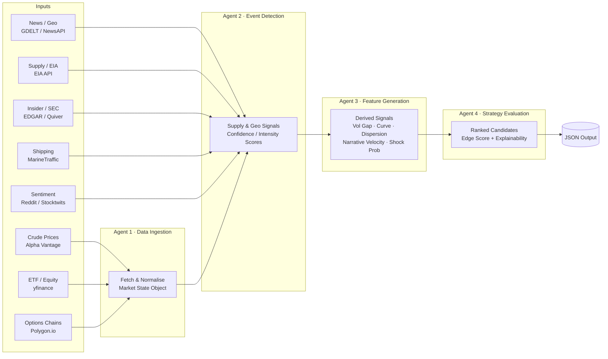
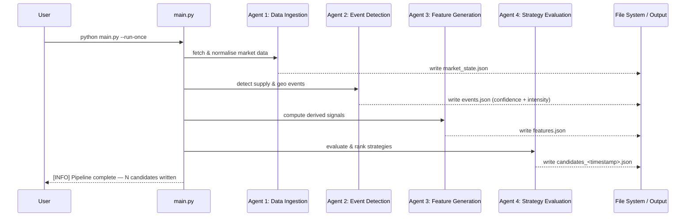

# Energy Options Opportunity Agent — User Guide

> **Version 1.0 · March 2026**
> Advisory only. The system does not execute trades automatically.

---

## Table of Contents

1. [Overview](#overview)
2. [Prerequisites](#prerequisites)
3. [Setup & Configuration](#setup--configuration)
4. [Running the Pipeline](#running-the-pipeline)
5. [Interpreting the Output](#interpreting-the-output)
6. [Troubleshooting](#troubleshooting)

---

## Overview

The **Energy Options Opportunity Agent** is a modular Python pipeline that identifies options trading opportunities driven by oil market instability. It ingests market data, supply signals, geopolitical news, and alternative datasets, then surfaces volatility mispricing in oil-related instruments and ranks candidate strategies by a computed **edge score**.

### Pipeline Architecture

The system is composed of four loosely coupled agents. Data flows strictly left to right — each agent consumes the output of its predecessor and contributes to a shared state that the next agent reads.


```mermaid
flowchart LR
    subgraph Inputs
        A1[Crude Prices\nAlpha Vantage]
        A2[ETF / Equity\nyfinance]
        A3[Options Chains\nPolygon.io]
        A4[News / Geo\nGDELT / NewsAPI]
        A5[Supply / EIA\nEIA API]
        A6[Insider / SEC\nEDGAR / Quiver]
        A7[Shipping\nMarineTraffic]
        A8[Sentiment\nReddit / Stocktwits]
    end

    subgraph Agent_1 [" Agent 1 · Data Ingestion "]
        B[Fetch & Normalise\nMarket State Object]
    end

    subgraph Agent_2 [" Agent 2 · Event Detection "]
        C[Supply & Geo Signals\nConfidence / Intensity Scores]
    end

    subgraph Agent_3 [" Agent 3 · Feature Generation "]
        D[Derived Signals\nVol Gap · Curve · Dispersion\nNarrative Velocity · Shock Prob]
    end

    subgraph Agent_4 [" Agent 4 · Strategy Evaluation "]
        E[Ranked Candidates\nEdge Score + Explainability]
    end

    F[(JSON Output)]

    A1 & A2 & A3 --> B
    A4 & A5 --> C
    A6 & A7 & A8 --> C
    B --> C --> D --> E --> F
```

### In-Scope Instruments

| Category | Instruments |
|---|---|
| Crude Futures | Brent Crude, WTI (`CL=F`) |
| ETFs | USO, XLE |
| Energy Equities | Exxon Mobil (XOM), Chevron (CVX) |

### In-Scope Option Structures (MVP)

| Structure | Enum Value |
|---|---|
| Long Straddle | `long_straddle` |
| Call Spread | `call_spread` |
| Put Spread | `put_spread` |
| Calendar Spread | `calendar_spread` |

> **Out of scope for MVP:** exotic/multi-legged strategies, regional refined product pricing (OPIS), and automated trade execution.

---

## Prerequisites

### System Requirements

| Requirement | Minimum |
|---|---|
| Python | 3.10+ |
| OS | Linux, macOS, or Windows (WSL2 recommended) |
| RAM | 2 GB |
| Disk | 5 GB (for 6–12 months of historical data) |
| Deployment target | Local machine, single VM, or container |

### Required Python Packages

Install all dependencies from the project root:

```bash
pip install -r requirements.txt
```

The key packages the pipeline depends on include:

| Package | Purpose |
|---|---|
| `yfinance` | ETF / equity price feeds |
| `requests` | REST calls to Alpha Vantage, EIA, GDELT, etc. |
| `pandas` | Data normalisation and historical storage |
| `polygon-api-client` | Options chain data |
| `praw` | Reddit sentiment feed |
| `schedule` (or `APScheduler`) | Cadence-based refresh scheduling |

### API Accounts

Register for the following free or low-cost services before running the pipeline:

| Service | URL | Cost | Used For |
|---|---|---|---|
| Alpha Vantage | https://www.alphavantage.co | Free | WTI / Brent spot prices |
| Polygon.io | https://polygon.io | Free / Limited | Options chains |
| EIA Open Data | https://www.eia.gov/opendata | Free | Inventory & refinery data |
| NewsAPI | https://newsapi.org | Free tier | Energy news headlines |
| GDELT Project | https://www.gdeltproject.org | Free | Geopolitical event feed |
| SEC EDGAR | https://efts.sec.gov/LATEST/search-index | Free | Insider activity |
| Quiver Quant | https://www.quiverquant.com | Free / Limited | Insider trade signals |
| MarineTraffic | https://www.marinetraffic.com | Free tier | Tanker / shipping data |
| Reddit (PRAW) | https://www.reddit.com/prefs/apps | Free | Retail sentiment |
| Stocktwits | https://api.stocktwits.com | Free | Narrative velocity |

---

## Setup & Configuration

### 1. Clone the Repository

```bash
git clone https://github.com/your-org/energy-options-agent.git
cd energy-options-agent
```

### 2. Create a Virtual Environment

```bash
python -m venv .venv
source .venv/bin/activate        # macOS / Linux
# .venv\Scripts\activate         # Windows
pip install -r requirements.txt
```

### 3. Configure Environment Variables

Copy the provided template and populate your credentials:

```bash
cp .env.example .env
```

Open `.env` in your editor and fill in every value. The table below describes every supported variable.

#### Environment Variable Reference

| Variable | Required | Description | Example Value |
|---|---|---|---|
| `ALPHA_VANTAGE_API_KEY` | ✅ | API key for crude price feeds | `AV_XXXXXXXXXXXXXXXX` |
| `POLYGON_API_KEY` | ✅ | API key for options chain data | `pg_XXXXXXXXXXXXXXXX` |
| `EIA_API_KEY` | ✅ | API key for EIA supply / inventory data | `eia_XXXXXXXXXXXXXXXX` |
| `NEWSAPI_KEY` | ✅ | API key for NewsAPI headline feed | `na_XXXXXXXXXXXXXXXX` |
| `REDDIT_CLIENT_ID` | ✅ | Reddit application client ID (PRAW) | `abc123` |
| `REDDIT_CLIENT_SECRET` | ✅ | Reddit application client secret | `secret_xyz` |
| `REDDIT_USER_AGENT` | ✅ | PRAW user-agent string | `energy-agent/1.0` |
| `QUIVER_API_KEY` | ⬜ | Quiver Quant key for insider trades | `qv_XXXXXXXXXXXXXXXX` |
| `MARINE_TRAFFIC_API_KEY` | ⬜ | MarineTraffic free-tier key | `mt_XXXXXXXXXXXXXXXX` |
| `STOCKTWITS_API_KEY` | ⬜ | Stocktwits API key | `st_XXXXXXXXXXXXXXXX` |
| `DATA_DIR` | ✅ | Absolute path for persisted historical data | `/data/energy-agent` |
| `OUTPUT_DIR` | ✅ | Absolute path where JSON output is written | `/output/energy-agent` |
| `LOG_LEVEL` | ⬜ | Logging verbosity (`DEBUG`, `INFO`, `WARNING`) | `INFO` |
| `MARKET_REFRESH_INTERVAL_SECONDS` | ⬜ | Cadence for market data refresh | `60` |
| `HISTORY_RETENTION_DAYS` | ⬜ | Days of raw + derived data to retain | `180` |
| `EDGE_SCORE_THRESHOLD` | ⬜ | Minimum edge score to include in output | `0.3` |

> ⬜ = Optional. The pipeline tolerates missing optional credentials — the corresponding data layer will be skipped without causing a pipeline failure.

### 4. Initialise the Data Directory

Create the directories specified in `DATA_DIR` and `OUTPUT_DIR`:

```bash
mkdir -p /data/energy-agent
mkdir -p /output/energy-agent
```

Then run the initialisation script to set up the historical data store:

```bash
python scripts/init_store.py
```

Expected output:

```
[INFO] Data store initialised at /data/energy-agent
[INFO] Schema version: 1.0
[INFO] Retention policy set to 180 days
```

---

## Running the Pipeline

### Pipeline Execution Modes

The agent supports two execution modes:

| Mode | Command | When to Use |
|---|---|---|
| **Single run** | `python main.py --run-once` | Manual / ad-hoc evaluation |
| **Continuous (scheduled)** | `python main.py` | Ongoing operation at configured cadence |

### Single Run

Executes all four agents once and writes a JSON output file, then exits.

```bash
python main.py --run-once
```

Optional flags:

```bash
python main.py --run-once \
    --instruments USO XLE CL=F \
    --structures long_straddle call_spread \
    --min-edge-score 0.35 \
    --output /output/energy-agent/candidates_$(date +%Y%m%d).json
```

| Flag | Description | Default |
|---|---|---|
| `--instruments` | Space-separated list of instruments to evaluate | All in-scope instruments |
| `--structures` | Option structures to consider | All in-scope structures |
| `--min-edge-score` | Override `EDGE_SCORE_THRESHOLD` for this run | Value from `.env` |
| `--output` | Override output file path | `OUTPUT_DIR/candidates_<timestamp>.json` |
| `--log-level` | Override `LOG_LEVEL` for this run | Value from `.env` |

### Continuous (Scheduled) Mode

Runs the pipeline on a recurring cadence driven by `MARKET_REFRESH_INTERVAL_SECONDS`. Slower feeds (EIA, EDGAR) are refreshed on their own daily/weekly sub-schedules automatically.

```bash
python main.py
```

To run as a background process:

```bash
nohup python main.py > logs/agent.log 2>&1 &
```

Or with Docker:

```bash
docker build -t energy-options-agent .
docker run -d \
    --env-file .env \
    -v /data/energy-agent:/data/energy-agent \
    -v /output/energy-agent:/output/energy-agent \
    energy-options-agent
```

### Per-Agent Execution

Each agent can be run independently for debugging or incremental enhancement:

```bash
# Agent 1 — Data Ingestion only
python -m agents.data_ingestion

# Agent 2 — Event Detection (reads existing market state from DATA_DIR)
python -m agents.event_detection

# Agent 3 — Feature Generation
python -m agents.feature_generation

# Agent 4 — Strategy Evaluation
python -m agents.strategy_evaluation
```

### Typical Startup Sequence


```mermaid
sequenceDiagram
    participant User
    participant CLI as main.py
    participant DI as Agent 1: Data Ingestion
    participant ED as Agent 2: Event Detection
    participant FG as Agent 3: Feature Generation
    participant SE as Agent 4: Strategy Evaluation
    participant FS as File System / Output

    User->>CLI: python main.py --run-once
    CLI->>DI: fetch & normalise market data
    DI-->>FS: write market_state.json
    CLI->>ED: detect supply & geo events
    ED-->>FS: write events.json (confidence + intensity)
    CLI->>FG: compute derived signals
    FG-->>FS: write features.json
    CLI->>SE: evaluate & rank strategies
    SE-->>FS: write candidates_<timestamp>.json
    CLI-->>User: [INFO] Pipeline complete — N candidates written
```

---

## Interpreting the Output

### Output File Location

Each pipeline run writes a JSON file to `OUTPUT_DIR`:

```
/output/energy-agent/
└── candidates_20260315T143012Z.json
```

### Output Schema

Each candidate object in the JSON array contains the following fields:

| Field | Type | Description |
|---|---|---|
| `instrument` | `string` | Target instrument, e.g. `USO`, `XLE`, `CL=F` |
| `structure` | `enum` | One of `long_straddle`, `call_spread`, `put_spread`, `calendar_spread` |
| `expiration` | `integer` (days) | Target expiration in calendar days from evaluation date |
| `edge_score` | `float [0.0–1.0]` | Composite opportunity score — higher means stronger signal confluence |
| `signals` | `object` | Map of contributing signals and their states |
| `generated_at` | ISO 8601 datetime | UTC timestamp of candidate generation |

### Example Output

```json
[
  {
    "instrument": "USO",
    "structure": "long_straddle",
    "expiration": 30,
    "edge_score": 0.47,
    "signals": {
      "tanker_disruption_index": "high",
      "volatility_gap": "positive",
      "narrative_velocity": "rising"
    },
    "generated_at": "2026-03-15T14:30:12Z"
  },
  {
    "instrument": "XLE",
    "structure": "call_spread",
    "expiration": 45,
    "edge_score": 0.61,
    "signals": {
      "volatility_gap": "positive",
      "supply_shock_probability": "elevated",
      "sector_dispersion": "high",
      "narrative_velocity": "rising"
    },
    "generated_at": "2026-03-15T14:30:12Z"
  }
]
```

### Reading the Edge Score

| Edge Score Range | Interpretation | Suggested Action |
|---|---|---|
| `0.0 – 0.29` | Weak — few signals align | Generally filtered out (below default threshold) |
| `0.30 – 0.49` | Moderate — some confluence | Review contributing signals before acting |
| `0.50 – 0.74` | Strong — meaningful signal alignment | High-priority candidates for further analysis |
| `0.75 – 1.00` | Very strong — broad signal confluence | Strongest candidates; validate independently |

> **Important:** Edge score is an advisory signal, not a guarantee of profitability. Always validate candidates against your own risk management framework.

### Contributing Signal Reference

The `signals` object may contain any subset of the following keys, depending on which data layers are active:

| Signal Key | Description |
|---|---|
| `volatility_gap` | Relationship between realised and implied volatility (`positive` = IV underpriced) |
| `futures_curve_steepness` | Contango / backwardation degree of the futures curve |
| `sector_dispersion` | Cross-sector correlation breakdown within energy |
| `insider_conviction_score` | Aggregated insider trade activity signal |
| `narrative_velocity` | Rate of change in energy-related news / social media volume |
| `supply_shock_probability` | Model-derived probability of a near-term supply disruption |
| `tanker_disruption_index` | Shipping / logistics stress indicator from vessel data |

### Consuming Output in thinkorswim

The JSON output is compatible with any JSON-capable dashboard. To load into thinkorswim:

1. Export the `candidates_*.json` file from `OUTPUT_DIR`.
2. Use thinkorswim's **thinkScript** or external data import to map `instrument`, `structure`, and `expiration` to your watchlist and options chain view.
3. Sort candidates by `edge_score` descending to prioritise review.

---

## Troubleshooting

### Pipeline