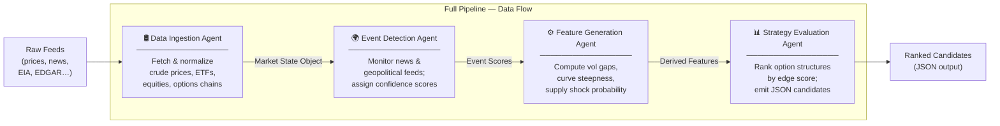
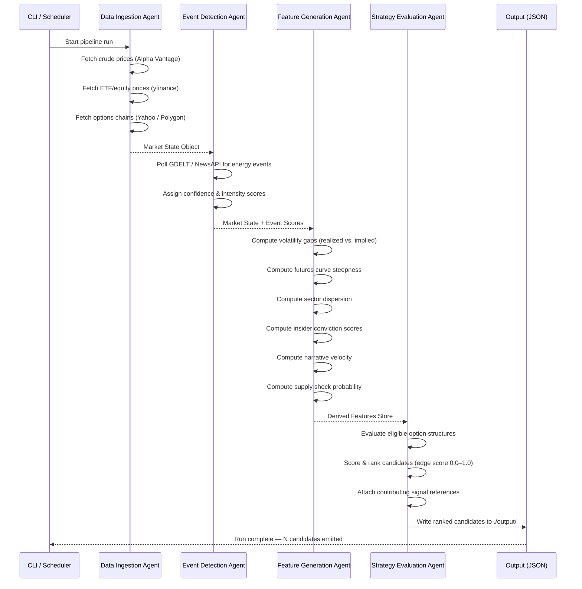

# Energy Options Opportunity Agent — User Guide

> **Version 1.0 · March 2026**
> This guide walks a developer through setting up, configuring, and running the full Energy Options Opportunity Agent pipeline from scratch.

---

## Table of Contents

1. [Overview](#overview)
2. [Prerequisites](#prerequisites)
3. [Setup & Configuration](#setup--configuration)
4. [Running the Pipeline](#running-the-pipeline)
5. [Interpreting the Output](#interpreting-the-output)
6. [Troubleshooting](#troubleshooting)

---

## Overview

The **Energy Options Opportunity Agent** is an autonomous, modular Python pipeline that identifies options trading opportunities driven by oil market instability. It is designed for a single contributor running on local hardware or a low-cost cloud VM, with a deliberate emphasis on free or low-cost data feeds.

The pipeline is composed of **four loosely coupled agents** that execute in a fixed sequence, sharing data through a central market state object and a derived features store:


```mermaid
flowchart LR
    subgraph Pipeline["Full Pipeline — Data Flow"]
        direction LR
        A["🛢️ Data Ingestion Agent\n─────────────────\nFetch & normalize\ncrude prices, ETFs,\nequities, options chains"]
        B["🌍 Event Detection Agent\n─────────────────\nMonitor news &\ngeopolitical feeds;\nassign confidence scores"]
        C["⚙️ Feature Generation Agent\n─────────────────\nCompute vol gaps,\ncurve steepness,\nsupply shock probability"]
        D["📊 Strategy Evaluation Agent\n─────────────────\nRank option structures\nby edge score;\nemit JSON candidates"]

        A -->|"Market State Object"| B
        B -->|"Event Scores"| C
        C -->|"Derived Features"| D
    end

    RAW["Raw Feeds\n(prices, news,\nEIA, EDGAR…)"] --> A
    D --> OUT["Ranked Candidates\n(JSON output)"]
```

### What the pipeline produces

Each pipeline run emits a set of **ranked candidate options strategies**, one JSON object per candidate, covering the following in-scope instruments and structures:

| Category | Items |
|---|---|
| **Crude futures** | WTI (`CL=F`), Brent |
| **ETFs** | USO, XLE |
| **Energy equities** | Exxon Mobil (XOM), Chevron (CVX) |
| **Option structures (MVP)** | Long straddles, call/put spreads, calendar spreads |

> **Advisory only.** The system surfaces opportunities; it does **not** execute trades automatically.

---

## Prerequisites

### System requirements

| Requirement | Minimum |
|---|---|
| Operating system | Linux, macOS, or Windows (WSL2 recommended) |
| Python | 3.11 or later |
| RAM | 2 GB |
| Disk | 10 GB free (for 6–12 months of historical data) |
| Network | Outbound HTTPS access to all data-source APIs |

### Software dependencies

Ensure the following are installed before proceeding:

```bash
# Verify Python version
python --version   # must be 3.11+

# Verify pip
pip --version

# Verify git
git --version
```

### API accounts

The pipeline relies on the following external services. Obtain free-tier credentials before configuration:

| Service | Purpose | Registration URL |
|---|---|---|
| Alpha Vantage | WTI / Brent spot & futures prices | https://www.alphavantage.co |
| Yahoo Finance / `yfinance` | ETF & equity prices, options chains | No key required (library-level access) |
| Polygon.io | Options data (fallback / supplemental) | https://polygon.io |
| EIA API | Weekly inventory & refinery utilization | https://www.eia.gov/opendata |
| GDELT | Geopolitical & energy news events | No key required (public dataset) |
| NewsAPI | News headlines & event detection | https://newsapi.org |
| SEC EDGAR | Insider trading filings | No key required (public dataset) |
| Quiver Quant | Parsed insider data (optional enrichment) | https://www.quiverquant.com |
| MarineTraffic | Tanker flow data (free tier) | https://www.marinetraffic.com |
| VesselFinder | Shipping / logistics (fallback) | https://www.vesselfinder.com |
| Reddit API | Retail sentiment & narrative velocity | https://www.reddit.com/prefs/apps |
| Stocktwits | Social sentiment | https://api.stocktwits.com |

> Keys marked *No key required* rely on public HTTP endpoints or Python libraries and need no registration.

---

## Setup & Configuration

### 1. Clone the repository

```bash
git clone https://github.com/your-org/energy-options-agent.git
cd energy-options-agent
```

### 2. Create and activate a virtual environment

```bash
python -m venv .venv

# macOS / Linux
source .venv/bin/activate

# Windows (PowerShell)
.venv\Scripts\Activate.ps1
```

### 3. Install dependencies

```bash
pip install --upgrade pip
pip install -r requirements.txt
```

### 4. Configure environment variables

All runtime configuration is injected through environment variables. Copy the provided template and populate your credentials:

```bash
cp .env.example .env
```

Then edit `.env` with your values:

```bash
# .env — Energy Options Opportunity Agent configuration
# -------------------------------------------------------

# ── Data Ingestion ──────────────────────────────────────
ALPHA_VANTAGE_API_KEY=your_alpha_vantage_key
POLYGON_API_KEY=your_polygon_key

# ── Supply & Inventory ──────────────────────────────────
EIA_API_KEY=your_eia_key

# ── News & Geopolitical Events ──────────────────────────
NEWS_API_KEY=your_newsapi_key
# GDELT requires no key; set the base URL if self-hosting
GDELT_BASE_URL=http://api.gdeltproject.org/api/v2

# ── Insider Activity ────────────────────────────────────
QUIVER_QUANT_API_KEY=your_quiver_key   # optional

# ── Shipping / Logistics ────────────────────────────────
MARINE_TRAFFIC_API_KEY=your_marinetraffic_key

# ── Sentiment / Narrative ───────────────────────────────
REDDIT_CLIENT_ID=your_reddit_client_id
REDDIT_CLIENT_SECRET=your_reddit_client_secret
REDDIT_USER_AGENT=energy-options-agent/1.0

# ── Pipeline Behaviour ──────────────────────────────────
PIPELINE_RUN_MODE=full           # full | ingest_only | eval_only
OUTPUT_FORMAT=json               # json | jsonl
OUTPUT_DIR=./output
LOG_LEVEL=INFO                   # DEBUG | INFO | WARNING | ERROR

# ── Data Retention ──────────────────────────────────────
HISTORY_RETENTION_DAYS=180       # 180–365 recommended for backtesting

# ── Scheduling (if running as a daemon) ─────────────────
MARKET_DATA_REFRESH_MINUTES=5
SLOW_FEED_REFRESH_HOURS=24       # EIA, EDGAR cadence
```

#### Full environment variable reference

| Variable | Required | Default | Description |
|---|---|---|---|
| `ALPHA_VANTAGE_API_KEY` | Yes | — | Crude price feed (WTI, Brent) |
| `POLYGON_API_KEY` | Yes | — | Options chain data (fallback) |
| `EIA_API_KEY` | Yes | — | Weekly inventory & refinery utilization |
| `NEWS_API_KEY` | Yes | — | News headline feed for event detection |
| `GDELT_BASE_URL` | No | Public endpoint | GDELT API base URL |
| `QUIVER_QUANT_API_KEY` | No | — | Enriched insider filing data |
| `MARINE_TRAFFIC_API_KEY` | No | — | Tanker flow signals |
| `REDDIT_CLIENT_ID` | No | — | Reddit OAuth client ID |
| `REDDIT_CLIENT_SECRET` | No | — | Reddit OAuth client secret |
| `REDDIT_USER_AGENT` | No | `energy-options-agent/1.0` | Reddit API user-agent string |
| `PIPELINE_RUN_MODE` | No | `full` | Which agents to execute (`full`, `ingest_only`, `eval_only`) |
| `OUTPUT_FORMAT` | No | `json` | Output serialization format |
| `OUTPUT_DIR` | No | `./output` | Directory for candidate output files |
| `LOG_LEVEL` | No | `INFO` | Python logging level |
| `HISTORY_RETENTION_DAYS` | No | `180` | Days of historical data to retain |
| `MARKET_DATA_REFRESH_MINUTES` | No | `5` | Price feed refresh cadence (minutes) |
| `SLOW_FEED_REFRESH_HOURS` | No | `24` | EIA / EDGAR refresh cadence (hours) |

### 5. Initialise the data store

Run the one-time initialisation command to create the local database schema and output directories:

```bash
python -m agent init
```

Expected output:

```
[INFO] Initialising data store at ./data/market_state.db
[INFO] Creating historical data tables (retention: 180 days)
[INFO] Output directory ready: ./output
[INFO] Initialisation complete.
```

---

## Running the Pipeline

### Pipeline execution sequence


```mermaid
sequenceDiagram
    participant CLI as CLI / Scheduler
    participant DIA as Data Ingestion Agent
    participant EDA as Event Detection Agent
    participant FGA as Feature Generation Agent
    participant SEA as Strategy Evaluation Agent
    participant OUT as Output (JSON)

    CLI->>DIA: Start pipeline run
    DIA->>DIA: Fetch crude prices (Alpha Vantage)
    DIA->>DIA: Fetch ETF/equity prices (yfinance)
    DIA->>DIA: Fetch options chains (Yahoo / Polygon)
    DIA-->>EDA: Market State Object

    EDA->>EDA: Poll GDELT / NewsAPI for energy events
    EDA->>EDA: Assign confidence & intensity scores
    EDA-->>FGA: Market State + Event Scores

    FGA->>FGA: Compute volatility gaps (realized vs. implied)
    FGA->>FGA: Compute futures curve steepness
    FGA->>FGA: Compute sector dispersion
    FGA->>FGA: Compute insider conviction scores
    FGA->>FGA: Compute narrative velocity
    FGA->>FGA: Compute supply shock probability
    FGA-->>SEA: Derived Features Store

    SEA->>SEA: Evaluate eligible option structures
    SEA->>SEA: Score & rank candidates (edge score 0.0–1.0)
    SEA->>SEA: Attach contributing signal references
    SEA-->>OUT: Write ranked candidates to ./output/
    OUT-->>CLI: Run complete — N candidates emitted
```

### Single run (foreground)

Execute the full four-agent pipeline once and exit:

```bash
python -m agent run
```

To limit execution to specific agents, use `PIPELINE_RUN_MODE` or pass `--mode`:

```bash
# Ingest and normalize data only (skip evaluation)
python -m agent run --mode ingest_only

# Re-run evaluation against the most recent stored features
python -m agent run --mode eval_only
```

### Continuous mode (daemon)

Run the pipeline on a recurring schedule defined by the environment variables:

```bash
python -m agent run --daemon
```

In daemon mode the pipeline observes two cadences:

| Feed type | Controlled by | Default |
|---|---|---|
| Market prices (crude, ETFs, options) | `MARKET_DATA_REFRESH_MINUTES` | 5 minutes |
| Slow feeds (EIA inventory, EDGAR filings) | `SLOW_FEED_REFRESH_HOURS` | 24 hours |

Stop the daemon with `Ctrl-C` or by sending `SIGTERM` to the process.

### Running as a scheduled job (cron example)

```cron
# Run once every 5 minutes during market hours (Mon–Fri, 09:00–17:00 ET)
*/5 9-17 * * 1-5 /path/to/.venv/bin/python -m agent run >> /var/log/energy-agent.log 2>&1
```

### Running in a container

```bash
# Build the image
docker build -t energy-options-agent:latest .

# Run with environment variables from .env
docker run --rm \
  --env-file .env \
  -v "$(pwd)/output:/app/output" \
  -v "$(pwd)/data:/app/data" \
  energy-options-agent:latest \
  python -m agent run
```

### Useful CLI flags

```
python -m agent run [OPTIONS]

Options:
  --mode      TEXT    Pipeline run mode: full | ingest_only | eval_only
                      [default: full]
  --daemon            Run continuously on the configured refresh schedule
  --dry-run           Execute all agents but suppress output file writes
  --log-level TEXT    Override LOG_LEVEL for this run
  --help              Show this message and exit
```

---

## Interpreting the Output

### Output location

On each successful run, the pipeline writes one file to `OUTPUT_DIR`:

```
output/
└── candidates_2026-03-15T14:32:00Z.json
```

In `jsonl` mode, each candidate is written as a newline-delimited record to `candidates.jsonl`.

### Output schema

Each candidate is a JSON object with the following fields:

| Field | Type | Description |
|---|---|---|
| `instrument` | `string` | Target instrument — e.g. `"USO"`, `"XLE"`, `"CL=F"` |
| `structure` | `enum` | Option structure: `long_straddle` \| `call_spread` \| `put_spread` \| `calendar_spread` |
| `expiration` | `integer` | Target expiration in **calendar days** from evaluation date |
| `edge_score` | `float [0.0–1.0]` | Composite opportunity score; **higher = stronger signal confluence** |
| `signals` | `object` | Map of contributing signals and their observed levels |
| `generated_at` | `ISO 8601 datetime` | UTC timestamp of candidate generation |

### Example output

```json
{
  "instrument": "USO",
  "structure": "long_straddle",
  "expiration": 30,
  "edge_score": 0.47,
  "signals": {
    "tanker_disruption_index": "high",
    "volatility_gap": "positive",
    "narrative_velocity": "rising"
  },
  "generated_at": "2026-03-15T14:32:00Z"
}
```

### Understanding the edge score

The `edge_score` is a composite value in `[0.0, 1.0]` computed by the Strategy Evaluation Agent from the signals produced by the Feature Generation Agent. Use it to prioritise review, not as a definitive trade signal.

| Edge Score Range | Suggested Interpretation |
|---|---|
| `0.70 – 1.00` | Strong signal confluence — high-priority candidate for manual review |
| `0.40 – 0.69` | Moderate confluence — worth monitoring; validate with additional context |
| `0.00 – 0.39` | Weak or noisy signals — low priority; may reflect data gaps |

> Scores are heuristic in the MVP. Complexity and ML-based weighting are planned for future phases.

### Understanding the signals map

Each key in the `signals` object corresponds to one of the derived features computed in Phase 1–3:

| Signal Key | Source Agent | What it measures |
|---|---|---|
| `volatility_gap` | Feature Generation | Realized IV minus implied IV — positive means IV is cheap |
| `futures_curve_steepness` | Feature Generation | Contango / backwardation of crude futures curve |
| `sector_dispersion` | Feature Generation | Divergence between energy sub-sector performances |
| `insider_conviction