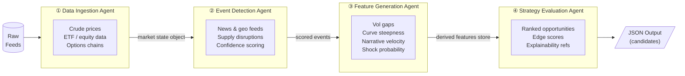
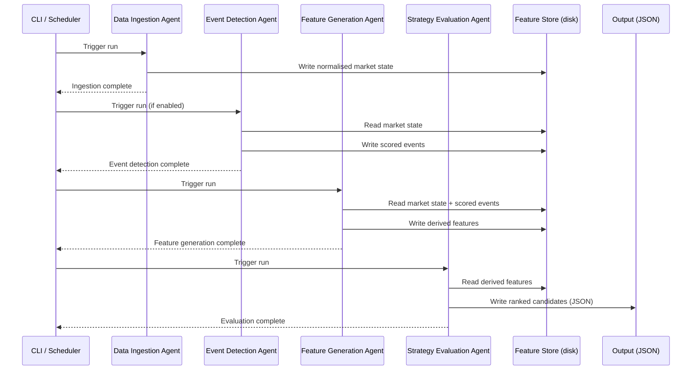

# Energy Options Opportunity Agent — User Guide

> **Version 1.0 · March 2026**
> This guide walks a developer through setting up, configuring, and running the full four-agent pipeline end-to-end.

---

## Table of Contents

1. [Overview](#overview)
2. [Prerequisites](#prerequisites)
3. [Setup & Configuration](#setup--configuration)
4. [Running the Pipeline](#running-the-pipeline)
5. [Interpreting the Output](#interpreting-the-output)
6. [Troubleshooting](#troubleshooting)

---

## Overview

The **Energy Options Opportunity Agent** is an autonomous, modular Python pipeline that identifies options trading opportunities driven by oil market instability. It ingests market data, supply signals, news events, and alternative datasets to produce structured, ranked candidate options strategies.

The system is composed of four loosely coupled agents that communicate through a shared **market state object** and a **derived features store**:


```mermaid
flowchart LR
    subgraph Ingestion ["① Data Ingestion Agent"]
        A1["Crude prices\nETF / equity data\nOptions chains"]
    end

    subgraph Event ["② Event Detection Agent"]
        B1["News & geo feeds\nSupply disruptions\nConfidence scoring"]
    end

    subgraph Feature ["③ Feature Generation Agent"]
        C1["Vol gaps\nCurve steepness\nNarrative velocity\nShock probability"]
    end

    subgraph Strategy ["④ Strategy Evaluation Agent"]
        D1["Ranked opportunities\nEdge scores\nExplainability refs"]
    end

    RAW[("Raw\nFeeds")] --> Ingestion
    Ingestion -->|market state object| Event
    Event -->|scored events| Feature
    Feature -->|derived features store| Strategy
    Strategy --> OUT[/"JSON Output\n(candidates)"/]
```

**Key properties:**

| Property | Detail |
|---|---|
| Instruments | Brent Crude, WTI, USO, XLE, XOM, CVX |
| Option structures (MVP) | Long straddles, call/put spreads, calendar spreads |
| Output format | JSON-compatible structured candidates |
| Execution model | Advisory only — no automated trade execution |
| Deployment target | Single VM, container, or local hardware |

Data flows **unidirectionally**: raw feeds → normalized state → scored events → derived features → ranked strategies. Each agent is independently deployable and can be updated without disrupting the rest of the pipeline.

---

## Prerequisites

### System Requirements

| Requirement | Minimum |
|---|---|
| Python | 3.10 or later |
| Operating system | Linux, macOS, or Windows (WSL2 recommended) |
| RAM | 2 GB available |
| Disk | 5 GB free (grows with 6–12 month historical store) |
| Network | Outbound HTTPS to external data APIs |

### Python Knowledge Assumed

- Virtual environments (`venv` or `conda`)
- Installing packages with `pip`
- Editing `.env` files
- Running scripts from the CLI

### External API Accounts

Register free (or free-tier) accounts for each data source before proceeding. All sources used in the MVP are free or low-cost.

| Source | Used For | Sign-up URL |
|---|---|---|
| Alpha Vantage | WTI / Brent crude prices | <https://www.alphavantage.co/support/#api-key> |
| Yahoo Finance (`yfinance`) | ETF / equity prices, options chains | No key required |
| Polygon.io | Options chains (optional supplement) | <https://polygon.io/dashboard/signup> |
| EIA API | Inventory & refinery utilization | <https://www.eia.gov/opendata/register.php> |
| GDELT | News & geopolitical events | No key required (public dataset) |
| NewsAPI | Energy news headlines | <https://newsapi.org/register> |
| SEC EDGAR | Insider activity filings | No key required |
| Quiver Quant | Insider activity (supplemental) | <https://www.quiverquant.com/> |
| MarineTraffic | Tanker / shipping flows | <https://www.marinetraffic.com/en/users/login> |
| Reddit API | Narrative / retail sentiment | <https://www.reddit.com/prefs/apps> |
| Stocktwits | Narrative / retail sentiment | <https://api.stocktwits.com/developers/apps/new> |

> **Note:** Phase 1 requires only Alpha Vantage, `yfinance`, and optionally Polygon.io. Additional keys become necessary as you activate later MVP phases. See [MVP Phasing](#mvp-phasing-reference) in the Troubleshooting section.

---

## Setup & Configuration

### 1. Clone the Repository

```bash
git clone https://github.com/your-org/energy-options-agent.git
cd energy-options-agent
```

### 2. Create and Activate a Virtual Environment

```bash
python3 -m venv .venv
source .venv/bin/activate        # Linux / macOS
# .venv\Scripts\activate.bat     # Windows CMD
# .venv\Scripts\Activate.ps1     # Windows PowerShell
```

### 3. Install Dependencies

```bash
pip install --upgrade pip
pip install -r requirements.txt
```

### 4. Configure Environment Variables

Copy the provided template and populate it with your API keys and runtime settings:

```bash
cp .env.example .env
```

Open `.env` in your editor and fill in each value. The full set of supported environment variables is documented in the table below.

#### Environment Variable Reference

| Variable | Required | Default | Description |
|---|---|---|---|
| `ALPHA_VANTAGE_API_KEY` | Phase 1 | — | API key for crude price feed (WTI, Brent) |
| `POLYGON_API_KEY` | Optional | — | API key for supplemental options chain data |
| `EIA_API_KEY` | Phase 2 | — | API key for EIA inventory and refinery data |
| `NEWS_API_KEY` | Phase 2 | — | API key for NewsAPI energy headline feed |
| `QUIVER_QUANT_API_KEY` | Phase 3 | — | API key for Quiver Quant insider activity |
| `MARINE_TRAFFIC_API_KEY` | Phase 3 | — | API key for MarineTraffic tanker data |
| `REDDIT_CLIENT_ID` | Phase 3 | — | Reddit app client ID for sentiment feed |
| `REDDIT_CLIENT_SECRET` | Phase 3 | — | Reddit app client secret |
| `REDDIT_USER_AGENT` | Phase 3 | `energy-agent/1.0` | Reddit API user-agent string |
| `STOCKTWITS_API_KEY` | Phase 3 | — | Stocktwits API key for sentiment feed |
| `DATA_DIR` | No | `./data` | Root path for historical raw and derived data |
| `OUTPUT_DIR` | No | `./output` | Directory where JSON candidate files are written |
| `LOG_LEVEL` | No | `INFO` | Logging verbosity: `DEBUG`, `INFO`, `WARNING`, `ERROR` |
| `MARKET_DATA_INTERVAL_MINUTES` | No | `5` | Polling cadence for minute-level market data feeds |
| `SLOW_FEED_INTERVAL_HOURS` | No | `24` | Polling cadence for EIA / EDGAR daily/weekly feeds |
| `HISTORY_RETENTION_DAYS` | No | `180` | Days of raw and derived history to retain (180–365 recommended) |
| `ENABLE_EVENT_AGENT` | No | `true` | Set to `false` to skip Event Detection Agent (Phase 1 only runs) |
| `ENABLE_ALTERNATIVE_SIGNALS` | No | `false` | Set to `true` to activate Phase 3 alternative signal agents |
| `OUTPUT_FORMAT` | No | `json` | Output format for candidates: `json` (only supported value in MVP) |

**Example `.env` (Phase 1 minimum):**

```dotenv
ALPHA_VANTAGE_API_KEY=your_alpha_vantage_key_here
DATA_DIR=./data
OUTPUT_DIR=./output
LOG_LEVEL=INFO
MARKET_DATA_INTERVAL_MINUTES=5
HISTORY_RETENTION_DAYS=180
ENABLE_EVENT_AGENT=false
ENABLE_ALTERNATIVE_SIGNALS=false
```

**Example `.env` (Phase 2, full event detection):**

```dotenv
ALPHA_VANTAGE_API_KEY=your_alpha_vantage_key_here
EIA_API_KEY=your_eia_key_here
NEWS_API_KEY=your_newsapi_key_here
DATA_DIR=./data
OUTPUT_DIR=./output
LOG_LEVEL=INFO
MARKET_DATA_INTERVAL_MINUTES=5
SLOW_FEED_INTERVAL_HOURS=24
HISTORY_RETENTION_DAYS=365
ENABLE_EVENT_AGENT=true
ENABLE_ALTERNATIVE_SIGNALS=false
```

### 5. Initialise the Data Directory

Run the initialisation script to create the required directory structure and verify API connectivity before the first full pipeline run:

```bash
python scripts/init_data_store.py
```

Expected output:

```
[INFO] Creating data directories under ./data ...
[INFO] Verifying Alpha Vantage connectivity ... OK
[INFO] Verifying yfinance connectivity ... OK
[INFO] EIA API key not set — Event Detection Agent will be skipped.
[INFO] Data store initialised successfully.
```

> If any `WARN` or `ERROR` lines appear, resolve them before proceeding. The pipeline tolerates delayed or missing data at runtime, but missing **required** API keys for your active phase will prevent that agent from producing output.

---

## Running the Pipeline

### Pipeline Architecture — Sequence View


```mermaid
sequenceDiagram
    participant CLI as CLI / Scheduler
    participant DIA as Data Ingestion Agent
    participant EDA as Event Detection Agent
    participant FGA as Feature Generation Agent
    participant SEA as Strategy Evaluation Agent
    participant FS as Feature Store (disk)
    participant OUT as Output (JSON)

    CLI->>DIA: Trigger run
    DIA->>FS: Write normalised market state
    DIA-->>CLI: Ingestion complete

    CLI->>EDA: Trigger run (if enabled)
    EDA->>FS: Read market state
    EDA->>FS: Write scored events
    EDA-->>CLI: Event detection complete

    CLI->>FGA: Trigger run
    FGA->>FS: Read market state + scored events
    FGA->>FS: Write derived features
    FGA-->>CLI: Feature generation complete

    CLI->>SEA: Trigger run
    SEA->>FS: Read derived features
    SEA->>OUT: Write ranked candidates (JSON)
    SEA-->>CLI: Evaluation complete
```

### Running the Full Pipeline (Single Pass)

To execute all four agents sequentially in a single blocking run:

```bash
python -m agent run --all
```

This is equivalent to running each agent in order:

```bash
python -m agent run --agent ingestion
python -m agent run --agent event_detection
python -m agent run --agent feature_generation
python -m agent run --agent strategy_evaluation
```

### Running Individual Agents

Each agent can be invoked independently, which is useful for testing or updating a single layer without re-running the full pipeline:

```bash
# Data Ingestion Agent only
python -m agent run --agent ingestion

# Event Detection Agent only
python -m agent run --agent event_detection

# Feature Generation Agent only
python -m agent run --agent feature_generation

# Strategy Evaluation Agent only
python -m agent run --agent strategy_evaluation
```

### Running on a Schedule

The pipeline is designed to run on a cadence: market data refreshes on a minutes-level schedule, while slower feeds (EIA, EDGAR) run daily or weekly. Use `cron` (Linux/macOS) or Task Scheduler (Windows) to automate execution.

**Example `cron` entries:**

```cron
# Full pipeline every 5 minutes during market hours (Mon–Fri, 09:00–16:30 ET)
*/5 9-16 * * 1-5 cd /path/to/energy-options-agent && .venv/bin/python -m agent run --all >> logs/pipeline.log 2>&1

# Slow feed refresh (EIA, EDGAR) once daily at 06:00
0 6 * * * cd /path/to/energy-options-agent && .venv/bin/python -m agent run --agent ingestion --slow-feeds-only >> logs/slow_feeds.log 2>&1
```

### Useful CLI Flags

| Flag | Description |
|---|---|
| `--all` | Run all agents in sequence |
| `--agent <name>` | Run a single named agent |
| `--dry-run` | Execute ingestion and feature steps but do not write output candidates |
| `--slow-feeds-only` | Restrict ingestion to EIA / EDGAR / other daily feeds |
| `--log-level <level>` | Override `LOG_LEVEL` from `.env` for this run |
| `--output-dir <path>` | Override `OUTPUT_DIR` from `.env` for this run |

---

## Interpreting the Output

### Output Location

After each pipeline run, ranked strategy candidates are written to:

```
{OUTPUT_DIR}/candidates_<ISO8601_timestamp>.json
```

For example:

```
./output/candidates_2026-03-15T14_30_00Z.json
```

A symlink `./output/latest.json` always points to the most recently generated file.

### Output Schema

Each file contains a JSON array of candidate objects. Every candidate has the following fields:

| Field | Type | Description |
|---|---|---|
| `instrument` | string | Target instrument, e.g. `"USO"`, `"XLE"`, `"CL=F"` |
| `structure` | enum string | Options structure: `long_straddle` \| `call_spread` \| `put_spread` \| `calendar_spread` |
| `expiration` | integer (days) | Target expiration in calendar days from the evaluation date |
| `edge_score` | float [0.0–1.0] | Composite opportunity score — higher values indicate stronger signal confluence |
| `signals` | object | Map of contributing signals and their current reading |
| `generated_at` | ISO 8601 datetime | UTC timestamp of candidate generation |

### Example Output

```json
[
  {
    "instrument": "USO",
    "structure": "long_straddle",
    "expiration": 30,
    "edge_score": 0.47,
    "signals": {
      "tanker_disruption_index": "high",
      "volatility_gap": "positive",
      "narrative_velocity": "rising"
    },
    "generated_at": "2026-03-15T14:30:00Z"
  },
  {
    "instrument": "XLE",
    "structure": "call_spread",
    "expiration": 21,
    "edge_score": 0.31,
    "signals": {
      "volatility_gap": "positive",
      "supply_shock_probability": "elevated",
      "sector_dispersion": "widening"
    },
    "generated_at": "2026-03-15T14:30:00Z"
  }
]
```

### Reading the Edge Score

The `edge_score` is a composite \[0.0–1.0\] value representing signal confluence. Use it as a **relative ranking** across candidates in the same run, not as an absolute probability.

| Edge Score Range | Interpretation |
|---|---|
| 0.70 – 1.00 | Strong confluence — multiple high-conviction signals aligned |
| 0.40 – 0.69 | Moderate confluence — worth further manual review |
| 0.20 – 0.39 | Weak confluence — marginal signal, treat with caution |
| 0.00 – 0.19 | Minimal confluence — likely noise; do not act without additional confirmation |

### Understanding the Signals Map

The `signals` object provides the explainability layer — it identifies exactly which derived features contributed to the edge score for that candidate. Reference these when doing further due diligence.

| Signal Key | Source Agent | What It Measures |
|---|---|---|
| `volatility_gap` | Feature Generation | Realized vs. implied volatility spread (positive = IV underpriced) |
| `futures_curve_