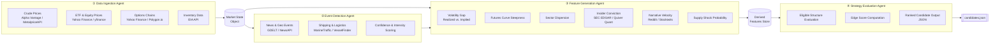

# Energy Options Opportunity Agent — User Guide

> **Version 1.0 · March 2026**
> This guide walks a developer through setting up, configuring, and running the full Energy Options Opportunity Agent pipeline from a fresh clone to ranked strategy output.

---

## Table of Contents

1. [Overview](#overview)
2. [Prerequisites](#prerequisites)
3. [Setup & Configuration](#setup--configuration)
4. [Running the Pipeline](#running-the-pipeline)
5. [Interpreting the Output](#interpreting-the-output)
6. [Troubleshooting](#troubleshooting)

---

## Overview

The **Energy Options Opportunity Agent** is an autonomous, modular Python pipeline that identifies options trading opportunities driven by oil market instability. It ingests market data, supply signals, news events, and alternative datasets, then produces structured, ranked candidate options strategies with full signal explainability.

The pipeline is composed of **four loosely coupled agents** that communicate via a shared market state object and a derived features store:


```mermaid
flowchart LR
    subgraph Ingestion["① Data Ingestion Agent"]
        direction TB
        I1[Crude Prices\nAlpha Vantage / MetalpriceAPI]
        I2[ETF & Equity Prices\nYahoo Finance / yfinance]
        I3[Options Chains\nYahoo Finance / Polygon.io]
        I4[Inventory Data\nEIA API]
    end

    subgraph Event["② Event Detection Agent"]
        direction TB
        E1[News & Geo Events\nGDELT / NewsAPI]
        E2[Shipping & Logistics\nMarineTraffic / VesselFinder]
        E3[Confidence & Intensity Scoring]
    end

    subgraph Feature["③ Feature Generation Agent"]
        direction TB
        F1[Volatility Gap\nRealized vs. Implied]
        F2[Futures Curve Steepness]
        F3[Sector Dispersion]
        F4[Insider Conviction\nSEC EDGAR / Quiver Quant]
        F5[Narrative Velocity\nReddit / Stocktwits]
        F6[Supply Shock Probability]
    end

    subgraph Strategy["④ Strategy Evaluation Agent"]
        direction TB
        S1[Eligible Structure Evaluation]
        S2[Edge Score Computation]
        S3[Ranked Candidate Output\nJSON]
    end

    RAW[(Market State\nObject)] --> Event
    Ingestion --> RAW
    RAW --> Feature
    Event --> Feature
    Feature --> FEAT[(Derived\nFeatures Store)]
    FEAT --> Strategy
    Strategy --> OUT[[candidates.json]]
```

### In-Scope Instruments

| Category | Instruments |
|---|---|
| Crude Futures | Brent Crude, WTI (`CL=F`) |
| ETFs | USO, XLE |
| Energy Equities | Exxon Mobil (XOM), Chevron (CVX) |

### In-Scope Option Structures (MVP)

| Structure | Enum Value |
|---|---|
| Long Straddle | `long_straddle` |
| Call Spread | `call_spread` |
| Put Spread | `put_spread` |
| Calendar Spread | `calendar_spread` |

> **Advisory only.** The system does not execute trades. All output is for informational and analytical purposes.

---

## Prerequisites

### System Requirements

| Requirement | Minimum |
|---|---|
| Operating System | Linux, macOS, or Windows (WSL2 recommended) |
| Python | 3.10 or later |
| RAM | 2 GB available |
| Disk | 5 GB free (for 6–12 months of historical data) |
| Network | Outbound HTTPS access to data provider APIs |

### Required Python Knowledge

- Running scripts from the command line
- Working with virtual environments (`venv` or `conda`)
- Reading and editing `.env` files

### API Accounts

Register for free-tier credentials at each provider before proceeding. All sources listed below offer free or limited-free tiers.

| Data Layer | Provider | Sign-Up URL |
|---|---|---|
| Crude Prices | Alpha Vantage | https://www.alphavantage.co/support/#api-key |
| Crude Prices (alt) | MetalpriceAPI | https://metalpriceapi.com |
| ETF / Equity Prices | Yahoo Finance via `yfinance` | No key required |
| Options Data | Polygon.io (optional upgrade) | https://polygon.io |
| Supply & Inventory | EIA API | https://www.eia.gov/opendata/ |
| News & Geo Events | GDELT | No key required (public dataset) |
| News & Geo Events | NewsAPI | https://newsapi.org/register |
| Insider Activity | SEC EDGAR | No key required (public dataset) |
| Insider Activity (alt) | Quiver Quant | https://www.quiverquant.com |
| Shipping / Logistics | MarineTraffic | https://www.marinetraffic.com/en/online-services/plans |
| Narrative / Sentiment | Reddit API (PRAW) | https://www.reddit.com/wiki/api |
| Narrative / Sentiment | Stocktwits | https://api.stocktwits.com/developers |

---

## Setup & Configuration

### 1. Clone the Repository

```bash
git clone https://github.com/your-org/energy-options-agent.git
cd energy-options-agent
```

### 2. Create and Activate a Virtual Environment

```bash
python -m venv .venv

# Linux / macOS
source .venv/bin/activate

# Windows (PowerShell)
.venv\Scripts\Activate.ps1
```

### 3. Install Dependencies

```bash
pip install --upgrade pip
pip install -r requirements.txt
```

### 4. Configure Environment Variables

Copy the provided template and populate it with your credentials:

```bash
cp .env.example .env
```

Open `.env` in your editor and fill in each value. The full set of recognised environment variables is documented below.

#### Environment Variable Reference

| Variable | Required | Default | Description |
|---|---|---|---|
| `ALPHA_VANTAGE_API_KEY` | Yes | — | API key for Alpha Vantage crude price feed |
| `METALPRICE_API_KEY` | No | — | Fallback key for MetalpriceAPI crude prices |
| `POLYGON_API_KEY` | No | — | Polygon.io key for enhanced options chain data |
| `EIA_API_KEY` | Yes | — | Key for EIA supply and inventory data |
| `NEWSAPI_KEY` | Yes | — | NewsAPI key for headline event detection |
| `QUIVER_QUANT_API_KEY` | No | — | Quiver Quant key for insider activity (alternative to raw EDGAR) |
| `REDDIT_CLIENT_ID` | No | — | Reddit PRAW application client ID |
| `REDDIT_CLIENT_SECRET` | No | — | Reddit PRAW application client secret |
| `REDDIT_USER_AGENT` | No | `energy-agent/1.0` | PRAW user agent string |
| `STOCKTWITS_ACCESS_TOKEN` | No | — | Stocktwits API access token |
| `MARINETRAFFIC_API_KEY` | No | — | MarineTraffic free-tier key for tanker flow data |
| `DATA_DIR` | No | `./data` | Root directory for raw and derived data storage |
| `OUTPUT_DIR` | No | `./output` | Directory where `candidates.json` is written |
| `LOG_LEVEL` | No | `INFO` | Logging verbosity (`DEBUG`, `INFO`, `WARNING`, `ERROR`) |
| `MARKET_REFRESH_INTERVAL_SECONDS` | No | `60` | Cadence for minute-level market data polling |
| `HISTORY_RETENTION_DAYS` | No | `365` | Days of historical data retained for backtesting |
| `EDGE_SCORE_THRESHOLD` | No | `0.0` | Minimum edge score for a candidate to appear in output (0.0 = all candidates) |

> **Tip:** Variables marked **Required** must be set before any agent will run. Optional variables enable additional data layers corresponding to Phase 2 and Phase 3 features. The pipeline tolerates missing optional credentials and will disable the associated data layer gracefully rather than failing.

#### Example `.env` file

```dotenv
# --- Required ---
ALPHA_VANTAGE_API_KEY=YOUR_AV_KEY_HERE
EIA_API_KEY=YOUR_EIA_KEY_HERE
NEWSAPI_KEY=YOUR_NEWSAPI_KEY_HERE

# --- Optional: enhanced options data ---
POLYGON_API_KEY=YOUR_POLYGON_KEY_HERE

# --- Optional: alternative signals (Phase 3) ---
QUIVER_QUANT_API_KEY=YOUR_QQ_KEY_HERE
REDDIT_CLIENT_ID=YOUR_REDDIT_ID
REDDIT_CLIENT_SECRET=YOUR_REDDIT_SECRET
REDDIT_USER_AGENT=energy-agent/1.0
STOCKTWITS_ACCESS_TOKEN=YOUR_ST_TOKEN
MARINETRAFFIC_API_KEY=YOUR_MT_KEY_HERE

# --- Pipeline behaviour ---
DATA_DIR=./data
OUTPUT_DIR=./output
LOG_LEVEL=INFO
MARKET_REFRESH_INTERVAL_SECONDS=60
HISTORY_RETENTION_DAYS=365
EDGE_SCORE_THRESHOLD=0.25
```

### 5. Initialise the Data Directory

```bash
python -m agent init
```

This creates the `DATA_DIR` folder structure and verifies that all required API keys are reachable before the first full run.

```
data/
├── raw/
│   ├── prices/
│   ├── options/
│   ├── inventory/
│   ├── events/
│   └── alternative/
└── derived/
    ├── features/
    └── market_state/
```

---

## Running the Pipeline

### Single-Pass Run (Recommended for First Use)

Run all four agents once in sequence and write output to `OUTPUT_DIR`:

```bash
python -m agent run
```

Expected console output (with `LOG_LEVEL=INFO`):

```
[INFO]  2026-03-15T09:00:00Z  Data Ingestion Agent   starting
[INFO]  2026-03-15T09:00:04Z  Data Ingestion Agent   market state written  (instruments=6)
[INFO]  2026-03-15T09:00:04Z  Event Detection Agent  starting
[INFO]  2026-03-15T09:00:07Z  Event Detection Agent  events scored         (events=3)
[INFO]  2026-03-15T09:00:07Z  Feature Generation Agent starting
[INFO]  2026-03-15T09:00:09Z  Feature Generation Agent features written     (signals=6)
[INFO]  2026-03-15T09:00:09Z  Strategy Evaluation Agent starting
[INFO]  2026-03-15T09:00:10Z  Strategy Evaluation Agent candidates ranked   (n=5)
[INFO]  2026-03-15T09:00:10Z  Output written → ./output/candidates.json
```

### Continuous Polling Mode

Run the pipeline on a recurring cadence (market data refreshes every `MARKET_REFRESH_INTERVAL_SECONDS`; slower feeds such as EIA and EDGAR refresh on their own daily/weekly schedules):

```bash
python -m agent run --continuous
```

Stop with `Ctrl+C`. The pipeline writes a fresh `candidates.json` after each complete cycle.

### Running Individual Agents

Each agent can be executed independently for testing or incremental development:

```bash
# Data Ingestion only
python -m agent run --agent ingestion

# Event Detection only
python -m agent run --agent events

# Feature Generation only
python -m agent run --agent features

# Strategy Evaluation only
python -m agent run --agent strategy
```

> **Note:** Running `strategy` in isolation requires that `DATA_DIR/derived/features/` already contains a valid features snapshot from a previous run.

### Command-Line Reference

| Flag | Type | Description |
|---|---|---|
| `--continuous` | flag | Enable polling loop |
| `--agent <name>` | string | Run a single named agent (`ingestion`, `events`, `features`, `strategy`) |
| `--output <path>` | path | Override `OUTPUT_DIR` for this run |
| `--log-level <level>` | string | Override `LOG_LEVEL` for this run |
| `--threshold <float>` | float | Override `EDGE_SCORE_THRESHOLD` for this run |
| `--dry-run` | flag | Execute all agents but do not write output files |

#### Example: debug a single pass with a custom output path

```bash
python -m agent run \
  --log-level DEBUG \
  --output ./debug_output \
  --threshold 0.0
```

---

## Interpreting the Output

### Output File Location

```
output/
└── candidates.json
```

### Output Schema

Each element of the top-level JSON array represents one ranked strategy candidate.

| Field | Type | Description |
|---|---|---|
| `instrument` | `string` | Target instrument, e.g. `"USO"`, `"XLE"`, `"CL=F"` |
| `structure` | `enum` | One of `long_straddle`, `call_spread`, `put_spread`, `calendar_spread` |
| `expiration` | `integer` | Target expiration in **calendar days** from the evaluation date |
| `edge_score` | `float [0.0–1.0]` | Composite opportunity score; higher = stronger signal confluence |
| `signals` | `object` | Map of contributing signals and their qualitative state |
| `generated_at` | `ISO 8601 datetime` | UTC timestamp of candidate generation |

### Example Output

```json
[
  {
    "instrument": "USO",
    "structure": "long_straddle",
    "expiration": 30,
    "edge_score": 0.47,
    "signals": {
      "tanker_disruption_index": "high",
      "volatility_gap": "positive",
      "narrative_velocity": "rising"
    },
    "generated_at": "2026-03-15T09:00:10Z"
  },
  {
    "instrument": "XLE",
    "structure": "call_spread",
    "expiration": 21,
    "edge_score": 0.31,
    "signals": {
      "volatility_gap": "positive",
      "supply_shock_probability": "elevated",
      "sector_dispersion": "widening"
    },
    "generated_at": "2026-03-15T09:00:10Z"
  }
]
```

### Reading the Edge Score

| Edge Score Range | Interpretation |
|---|---|
| `0.75 – 1.00` | Strong signal confluence; multiple high-confidence drivers aligned |
| `0.50 – 0.74` | Moderate confluence; worthwhile for further manual review |
| `0.25 – 0.49` | Weak confluence; treat as early/speculative signal |
| `0.00 – 0.24` | Minimal signal; likely noise or data gap |

> Candidates are ordered by `edge_score` descending. The first element in the array is always the highest-ranked opportunity in the current evaluation cycle.

### Understanding the `signals` Map

Each key in the `signals` object corresponds to a derived feature computed by the Feature Generation Agent. Use this map to understand **why** a candidate was ranked.

| Signal Key | What It Measures |
|---|---|
| `volatility_gap` | Gap between realized and implied volatility; `"positive"` means IV is understating realized vol |
| `futures_curve_steepness` | Contango/backwardation degree of the crude futures curve |
| `sector_dispersion` | Spread between energy sub-sector returns; widening dispersion can precede volatility events |
| `insider_conviction_score` | Aggregated conviction from SEC EDGAR / Quiver Quant insider filing data |
| `narrative_velocity` | Rate of change of energy-related headline volume (Reddit / Stocktwits / NewsAPI) |
| `supply_shock_probability` | Model probability of a near-term supply disruption based on EIA + event data |
| `tanker_disruption_index` | Derived index from MarineTraffic shipping anomalies near key choke