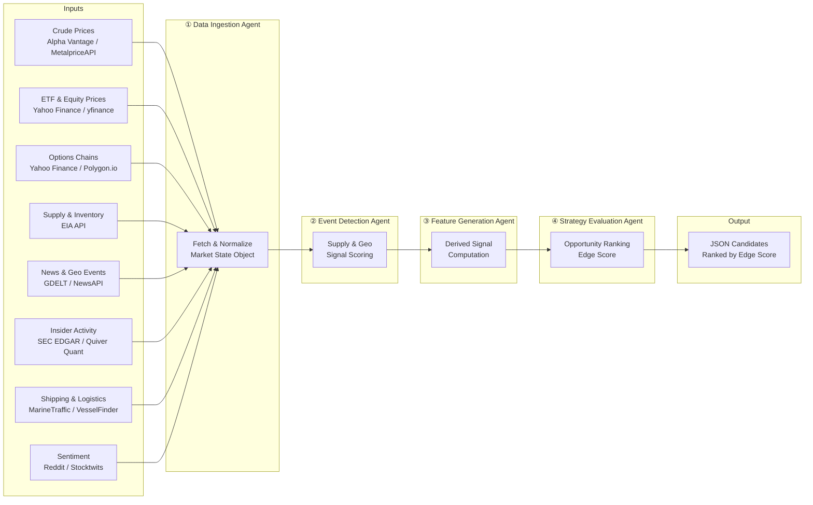

# Energy Options Opportunity Agent — User Guide

> **Version 1.0 · March 2026**
> This guide walks a developer through setting up, configuring, and running the full four-agent pipeline end-to-end.

---

## Table of Contents

1. [Overview](#overview)
2. [Prerequisites](#prerequisites)
3. [Setup & Configuration](#setup--configuration)
4. [Running the Pipeline](#running-the-pipeline)
5. [Interpreting the Output](#interpreting-the-output)
6. [Troubleshooting](#troubleshooting)

---

## Overview

The **Energy Options Opportunity Agent** is an autonomous, modular Python pipeline that identifies options trading opportunities driven by oil market instability. It ingests market data, supply signals, news events, and alternative datasets, then produces structured, ranked candidate options strategies with full signal explainability.

### Pipeline Architecture

Data flows unidirectionally through four loosely coupled agents that share a common market state object and a derived features store.


```mermaid
flowchart LR
    subgraph Inputs
        A1[Crude Prices\nAlpha Vantage / MetalpriceAPI]
        A2[ETF & Equity Prices\nYahoo Finance / yfinance]
        A3[Options Chains\nYahoo Finance / Polygon.io]
        A4[Supply & Inventory\nEIA API]
        A5[News & Geo Events\nGDELT / NewsAPI]
        A6[Insider Activity\nSEC EDGAR / Quiver Quant]
        A7[Shipping & Logistics\nMarineTraffic / VesselFinder]
        A8[Sentiment\nReddit / Stocktwits]
    end

    subgraph Agent_1 ["① Data Ingestion Agent"]
        B[Fetch & Normalize\nMarket State Object]
    end

    subgraph Agent_2 ["② Event Detection Agent"]
        C[Supply & Geo\nSignal Scoring]
    end

    subgraph Agent_3 ["③ Feature Generation Agent"]
        D[Derived Signal\nComputation]
    end

    subgraph Agent_4 ["④ Strategy Evaluation Agent"]
        E[Opportunity Ranking\nEdge Score]
    end

    subgraph Output
        F[JSON Candidates\nRanked by Edge Score]
    end

    A1 & A2 & A3 & A4 & A5 & A6 & A7 & A8 --> B
    B --> C
    C --> D
    D --> E
    E --> F
```

### In-Scope Instruments (MVP)

| Category | Instruments |
|---|---|
| Crude Futures | Brent Crude, WTI (`CL=F`) |
| ETFs | USO, XLE |
| Energy Equities | Exxon Mobil (XOM), Chevron (CVX) |

### In-Scope Option Structures (MVP)

| Structure | Enum Value |
|---|---|
| Long Straddle | `long_straddle` |
| Call Spread | `call_spread` |
| Put Spread | `put_spread` |
| Calendar Spread | `calendar_spread` |

> **Note:** Automated trade execution is explicitly out of scope. The system is **advisory only**.

---

## Prerequisites

### System Requirements

| Requirement | Minimum |
|---|---|
| Python | 3.10 or later |
| Operating System | Linux, macOS, or Windows (WSL2 recommended) |
| RAM | 2 GB |
| Disk | 10 GB (for 6–12 months of historical data) |
| Network | Outbound HTTPS to data provider APIs |

### External API Access

Register for free-tier credentials at each provider before proceeding. All sources used in the MVP are free or low-cost.

| Provider | Used By | Registration URL | Notes |
|---|---|---|---|
| Alpha Vantage | Crude prices | https://www.alphavantage.co | Free tier; minutes cadence |
| Yahoo Finance / yfinance | ETF, equity, options | No key required (yfinance) | Rate-limited; free |
| Polygon.io | Options chains | https://polygon.io | Free tier available |
| EIA API | Supply/inventory | https://www.eia.gov/opendata | Free; weekly updates |
| NewsAPI | News & geo events | https://newsapi.org | Free developer tier |
| GDELT | Geo events | No key required | Free; continuous |
| SEC EDGAR | Insider activity | No key required | Free |
| Quiver Quant | Insider activity | https://www.quiverquant.com | Free/limited tier |
| MarineTraffic | Shipping | https://www.marinetraffic.com | Free tier |
| Reddit API | Sentiment | https://www.reddit.com/prefs/apps | Free |
| Stocktwits API | Sentiment | https://api.stocktwits.com | Free |

### Python Dependencies

```bash
pip install -r requirements.txt
```

A minimal `requirements.txt` includes:

```text
yfinance>=0.2
requests>=2.31
pandas>=2.0
numpy>=1.26
pydantic>=2.0
python-dotenv>=1.0
```

---

## Setup & Configuration

### 1. Clone the Repository

```bash
git clone https://github.com/your-org/energy-options-agent.git
cd energy-options-agent
```

### 2. Create a Virtual Environment

```bash
python -m venv .venv
source .venv/bin/activate        # Linux / macOS
# .venv\Scripts\activate         # Windows PowerShell
pip install -r requirements.txt
```

### 3. Configure Environment Variables

Copy the provided template and populate your credentials:

```bash
cp .env.example .env
```

Open `.env` in your editor and set values for every variable in the table below.

#### Environment Variable Reference

| Variable | Required | Default | Description |
|---|---|---|---|
| `ALPHA_VANTAGE_API_KEY` | ✅ | — | API key for crude price feeds (WTI, Brent) |
| `POLYGON_API_KEY` | ✅ | — | API key for options chain data |
| `EIA_API_KEY` | ✅ | — | API key for EIA supply/inventory data |
| `NEWS_API_KEY` | ✅ | — | API key for NewsAPI news & geo events |
| `QUIVER_QUANT_API_KEY` | ⬜ | — | API key for Quiver Quant insider data (optional in Phase 1–2) |
| `REDDIT_CLIENT_ID` | ⬜ | — | Reddit OAuth client ID (Phase 3) |
| `REDDIT_CLIENT_SECRET` | ⬜ | — | Reddit OAuth client secret (Phase 3) |
| `REDDIT_USER_AGENT` | ⬜ | `energy-agent/1.0` | Reddit API user-agent string |
| `MARINE_TRAFFIC_API_KEY` | ⬜ | — | MarineTraffic API key for tanker flows (Phase 3) |
| `DATA_DIR` | ✅ | `./data` | Local directory for persisted raw and derived data |
| `OUTPUT_DIR` | ✅ | `./output` | Directory where ranked JSON candidates are written |
| `LOG_LEVEL` | ⬜ | `INFO` | Logging verbosity: `DEBUG`, `INFO`, `WARNING`, `ERROR` |
| `PRICE_REFRESH_INTERVAL_SECONDS` | ⬜ | `60` | Cadence for market price polling (minutes-level) |
| `HISTORY_RETENTION_DAYS` | ⬜ | `180` | Days of historical data to retain (180–365 recommended) |
| `EDGE_SCORE_THRESHOLD` | ⬜ | `0.30` | Minimum edge score `[0.0–1.0]` to include a candidate in output |
| `MVP_PHASE` | ⬜ | `1` | Active feature phase: `1`, `2`, or `3` (controls which agents and data sources are enabled) |

Example `.env`:

```dotenv
ALPHA_VANTAGE_API_KEY=your_av_key_here
POLYGON_API_KEY=your_polygon_key_here
EIA_API_KEY=your_eia_key_here
NEWS_API_KEY=your_newsapi_key_here
DATA_DIR=./data
OUTPUT_DIR=./output
LOG_LEVEL=INFO
PRICE_REFRESH_INTERVAL_SECONDS=60
HISTORY_RETENTION_DAYS=180
EDGE_SCORE_THRESHOLD=0.30
MVP_PHASE=1
```

### 4. Initialise the Data Directory

```bash
python scripts/init_storage.py
```

This creates the directory structure expected by the ingestion and feature agents:

```
data/
  raw/
    prices/
    options/
    eia/
    events/
    insider/
    shipping/
    sentiment/
  derived/
output/
```

---

## Running the Pipeline

### Pipeline Run Modes

The pipeline supports two execution modes:

| Mode | Command | Use Case |
|---|---|---|
| **One-shot** | `python run_pipeline.py --once` | Run all agents once, write output, and exit |
| **Continuous** | `python run_pipeline.py --loop` | Poll on `PRICE_REFRESH_INTERVAL_SECONDS` cadence |

### One-Shot Run

```bash
python run_pipeline.py --once
```

Expected console output:

```
[2026-03-15T09:00:00Z] INFO  Data Ingestion Agent   — fetching prices for WTI, Brent, USO, XLE, XOM, CVX
[2026-03-15T09:00:04Z] INFO  Data Ingestion Agent   — options chains fetched for 6 instruments
[2026-03-15T09:00:05Z] INFO  Event Detection Agent  — 3 supply/geo events detected (conf ≥ 0.5)
[2026-03-15T09:00:06Z] INFO  Feature Generation Agent — derived signals computed
[2026-03-15T09:00:07Z] INFO  Strategy Evaluation Agent — 5 candidates ranked; top edge_score=0.71
[2026-03-15T09:00:07Z] INFO  Output written → output/candidates_20260315T090007Z.json
```

### Continuous Loop

```bash
python run_pipeline.py --loop
```

Stop with **Ctrl-C**. The pipeline tolerates delayed or missing data from individual sources without failing the full run — a warning is logged and the affected signal is omitted from that cycle's feature set.

### Running Individual Agents

Each agent can be invoked independently for testing or development:

```bash
# Data Ingestion only
python -m agents.ingestion

# Event Detection only (reads existing market state from DATA_DIR)
python -m agents.event_detection

# Feature Generation only
python -m agents.feature_generation

# Strategy Evaluation only (reads existing derived features from DATA_DIR)
python -m agents.strategy_evaluation
```

### Selecting MVP Phase

Set `MVP_PHASE` in `.env` to control which data sources and signals are active:

| `MVP_PHASE` | Active Capabilities |
|---|---|
| `1` | Core market signals: crude prices, USO/XLE, options surface (IV, strikes); long straddles, call/put spreads |
| `2` | Phase 1 + EIA inventory, refinery utilization, GDELT/NewsAPI event detection, supply disruption indices |
| `3` | Phase 2 + EDGAR/Quiver insider data, Reddit/Stocktwits narrative velocity, MarineTraffic tanker flows, full edge scoring |

```dotenv
MVP_PHASE=2
```

---

## Interpreting the Output

### Output Location

Each pipeline run produces a timestamped JSON file in `OUTPUT_DIR`:

```
output/candidates_20260315T090007Z.json
```

### Output Schema

Each element in the output array represents a single ranked strategy candidate.

| Field | Type | Description |
|---|---|---|
| `instrument` | `string` | Target instrument, e.g. `USO`, `XLE`, `CL=F` |
| `structure` | `enum` | `long_straddle` \| `call_spread` \| `put_spread` \| `calendar_spread` |
| `expiration` | `integer` | Target expiration in calendar days from evaluation date |
| `edge_score` | `float [0.0–1.0]` | Composite opportunity score — higher = stronger signal confluence |
| `signals` | `object` | Map of contributing signals and their assessed values |
| `generated_at` | `ISO 8601 datetime` | UTC timestamp of candidate generation |

### Example Output File

```json
[
  {
    "instrument": "USO",
    "structure": "long_straddle",
    "expiration": 30,
    "edge_score": 0.71,
    "signals": {
      "tanker_disruption_index": "high",
      "volatility_gap": "positive",
      "narrative_velocity": "rising"
    },
    "generated_at": "2026-03-15T09:00:07Z"
  },
  {
    "instrument": "XLE",
    "structure": "call_spread",
    "expiration": 45,
    "edge_score": 0.47,
    "signals": {
      "volatility_gap": "positive",
      "supply_shock_probability": "elevated",
      "sector_dispersion": "high"
    },
    "generated_at": "2026-03-15T09:00:07Z"
  },
  {
    "instrument": "CL=F",
    "structure": "put_spread",
    "expiration": 21,
    "edge_score": 0.31,
    "signals": {
      "futures_curve_steepness": "contango",
      "eia_inventory_build": "above_forecast"
    },
    "generated_at": "2026-03-15T09:00:07Z"
  }
]
```

### Reading the `signals` Map

| Signal Key | What It Measures | Values |
|---|---|---|
| `volatility_gap` | Realized IV minus implied IV — positive means options are cheap relative to realized vol | `positive`, `negative`, `neutral` |
| `futures_curve_steepness` | Shape of the WTI/Brent futures curve | `contango`, `backwardation`, `flat` |
| `sector_dispersion` | Cross-instrument correlation spread within energy | `high`, `moderate`, `low` |
| `insider_conviction_score` | Aggregated insider buying/selling intensity | `high`, `moderate`, `low` |
| `narrative_velocity` | Rate of acceleration in energy-related headlines and social posts | `rising`, `stable`, `falling` |
| `supply_shock_probability` | Estimated probability of a near-term supply disruption | `elevated`, `moderate`, `low` |
| `tanker_disruption_index` | Chokepoint and tanker flow anomaly score | `high`, `moderate`, `low` |
| `eia_inventory_build` | Deviation of EIA inventory report from analyst consensus | `above_forecast`, `in_line`, `below_forecast` |

### Prioritising Candidates

Candidates are already sorted by `edge_score` descending. Use `EDGE_SCORE_THRESHOLD` to filter low-confidence candidates before surfacing them to a dashboard or manual review workflow.

```python
import json

with open("output/candidates_20260315T090007Z.json") as f:
    candidates = json.load(f)

high_conviction = [c for c in candidates if c["edge_score"] >= 0.60]
for c in high_conviction:
    print(f"{c['instrument']:6s}  {c['structure']:20s}  edge={c['edge_score']:.2f}  exp={c['expiration']}d")
```

### Visualising in thinkorswim

The JSON output is compatible with any thinkorswim thinkScript study that can consume external JSON files or with any dashboard tool capable of reading JSON (e.g., Grafana, Streamlit, custom web UI). Load `candidates_*.json` from `OUTPUT_DIR` into your preferred visualization layer.

---

## Troubleshooting

### Common Issues

| Symptom