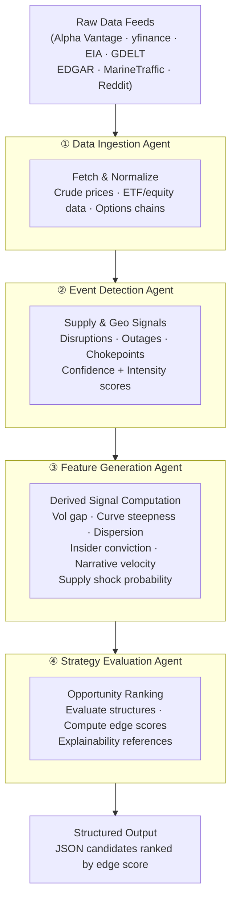

# Energy Options Opportunity Agent — User Guide

> **Version 1.0 • March 2026**
> This guide walks you through setting up, configuring, and running the full four-agent pipeline that identifies options trading opportunities driven by oil market instability.

---

## Table of Contents

1. [Overview](#overview)
2. [Prerequisites](#prerequisites)
3. [Setup & Configuration](#setup--configuration)
4. [Running the Pipeline](#running-the-pipeline)
5. [Interpreting the Output](#interpreting-the-output)
6. [Troubleshooting](#troubleshooting)

---

## Overview

The **Energy Options Opportunity Agent** is an autonomous, modular Python pipeline composed of four loosely coupled agents. It ingests market data, supply signals, news events, and alternative datasets to produce structured, ranked candidate options strategies for oil-related instruments.

### Pipeline Architecture


```mermaid
flowchart TD
    RAW["Raw Data Feeds\n(Alpha Vantage · yfinance · EIA · GDELT\nEDGAR · MarineTraffic · Reddit)"]

    subgraph Agent1["① Data Ingestion Agent"]
        A1["Fetch & Normalize\nCrude prices · ETF/equity data · Options chains"]
    end

    subgraph Agent2["② Event Detection Agent"]
        A2["Supply & Geo Signals\nDisruptions · Outages · Chokepoints\nConfidence + Intensity scores"]
    end

    subgraph Agent3["③ Feature Generation Agent"]
        A3["Derived Signal Computation\nVol gap · Curve steepness · Dispersion\nInsider conviction · Narrative velocity\nSupply shock probability"]
    end

    subgraph Agent4["④ Strategy Evaluation Agent"]
        A4["Opportunity Ranking\nEvaluate structures · Compute edge scores\nExplainability references"]
    end

    OUT["Structured Output\nJSON candidates ranked by edge score"]

    RAW --> Agent1 --> Agent2 --> Agent3 --> Agent4 --> OUT
```

### In-Scope Instruments & Structures

| Category | Items |
|---|---|
| **Crude futures** | Brent Crude, WTI (`CL=F`) |
| **ETFs** | USO, XLE |
| **Energy equities** | Exxon Mobil (XOM), Chevron (CVX) |
| **Option structures (MVP)** | Long straddles, call/put spreads, calendar spreads |

> **Advisory only.** The system produces ranked recommendations. No automated trade execution occurs in the MVP.

---

## Prerequisites

### System Requirements

| Requirement | Minimum |
|---|---|
| Python | 3.10 or later |
| OS | Linux, macOS, or Windows (WSL2 recommended) |
| RAM | 2 GB |
| Disk | 10 GB (for 6–12 months of historical data) |
| Network | Outbound HTTPS access to all data source endpoints |

### Required Tools

```bash
# Verify Python version
python --version          # must be >= 3.10

# Verify pip
pip --version

# (Recommended) Verify a working virtual-environment tool
python -m venv --help
```

### API Access

Register for free-tier credentials at each data source before proceeding.

| Data Layer | Source | Cost | Sign-up URL |
|---|---|---|---|
| Crude prices | Alpha Vantage | Free | <https://www.alphavantage.co/support/#api-key> |
| ETF / equity prices | Yahoo Finance (`yfinance`) | Free | *(no key required)* |
| Options data | Polygon.io | Free / Limited | <https://polygon.io> |
| Supply & inventory | EIA API | Free | <https://www.eia.gov/opendata/> |
| News & geo events | GDELT | Free | *(no key required)* |
| News & geo events | NewsAPI | Free | <https://newsapi.org/register> |
| Insider activity | SEC EDGAR | Free | *(no key required)* |
| Insider activity | Quiver Quant | Free / Limited | <https://www.quiverquant.com> |
| Shipping / logistics | MarineTraffic | Free tier | <https://www.marinetraffic.com/en/p/api-services> |
| Narrative / sentiment | Reddit API | Free | <https://www.reddit.com/prefs/apps> |

---

## Setup & Configuration

### 1. Clone the Repository

```bash
git clone https://github.com/your-org/energy-options-agent.git
cd energy-options-agent
```

### 2. Create and Activate a Virtual Environment

```bash
python -m venv .venv

# Linux / macOS
source .venv/bin/activate

# Windows (PowerShell)
.venv\Scripts\Activate.ps1
```

### 3. Install Dependencies

```bash
pip install --upgrade pip
pip install -r requirements.txt
```

### 4. Configure Environment Variables

The pipeline reads all secrets and tunable parameters from environment variables. Copy the provided template and populate it with your credentials:

```bash
cp .env.example .env
```

Open `.env` in your editor and fill in each value:

```bash
# .env — Energy Options Opportunity Agent

# ── Data Ingestion ─────────────────────────────────────────────────────────────
ALPHA_VANTAGE_API_KEY=your_alpha_vantage_key
POLYGON_API_KEY=your_polygon_key
EIA_API_KEY=your_eia_key

# ── Event Detection ────────────────────────────────────────────────────────────
NEWSAPI_KEY=your_newsapi_key
# GDELT requires no key; set GDELT_ENABLED=true to activate the feed
GDELT_ENABLED=true

# ── Alternative / Contextual Signals ──────────────────────────────────────────
QUIVER_QUANT_API_KEY=your_quiver_quant_key
MARINETRAFFIC_API_KEY=your_marinetraffic_key
REDDIT_CLIENT_ID=your_reddit_client_id
REDDIT_CLIENT_SECRET=your_reddit_client_secret
REDDIT_USER_AGENT=energy-options-agent/1.0

# ── Storage ────────────────────────────────────────────────────────────────────
# Directory for persisted raw and derived data
DATA_DIR=./data

# Retention window in months (6–12 recommended)
DATA_RETENTION_MONTHS=12

# ── Pipeline Behaviour ─────────────────────────────────────────────────────────
# Cadence (in minutes) for market-data refresh
MARKET_DATA_REFRESH_MINUTES=5

# Logging level: DEBUG | INFO | WARNING | ERROR
LOG_LEVEL=INFO

# Output format: json | stdout
OUTPUT_FORMAT=json

# Path for JSON output file (used when OUTPUT_FORMAT=json)
OUTPUT_PATH=./output/candidates.json
```

#### Environment Variable Reference

| Variable | Required | Default | Description |
|---|---|---|---|
| `ALPHA_VANTAGE_API_KEY` | Yes | — | Key for WTI/Brent spot & futures prices |
| `POLYGON_API_KEY` | Yes | — | Key for options chain data (strike, expiry, IV, volume) |
| `EIA_API_KEY` | Yes | — | Key for weekly inventory & refinery utilization |
| `NEWSAPI_KEY` | Yes | — | Key for energy news and geopolitical headlines |
| `GDELT_ENABLED` | No | `true` | Enable GDELT continuous geo-event feed (no key needed) |
| `QUIVER_QUANT_API_KEY` | No | — | Key for insider trading activity (Phase 3) |
| `MARINETRAFFIC_API_KEY` | No | — | Key for tanker flow data (Phase 3) |
| `REDDIT_CLIENT_ID` | No | — | Reddit OAuth client ID for sentiment feed (Phase 3) |
| `REDDIT_CLIENT_SECRET` | No | — | Reddit OAuth secret for sentiment feed (Phase 3) |
| `REDDIT_USER_AGENT` | No | `energy-options-agent/1.0` | User-agent string for Reddit API requests |
| `DATA_DIR` | No | `./data` | Root directory for persisted raw and derived datasets |
| `DATA_RETENTION_MONTHS` | No | `12` | Months of historical data to retain for backtesting |
| `MARKET_DATA_REFRESH_MINUTES` | No | `5` | Polling cadence for minute-level market feeds |
| `LOG_LEVEL` | No | `INFO` | Python logging level for all agents |
| `OUTPUT_FORMAT` | No | `json` | Destination format for ranked candidates |
| `OUTPUT_PATH` | No | `./output/candidates.json` | File path when `OUTPUT_FORMAT=json` |

> **Phase-gated variables.** Variables marked *Phase 3* (`QUIVER_QUANT_API_KEY`, `MARINETRAFFIC_API_KEY`, `REDDIT_*`) are not required for Phase 1 or Phase 2 operation. The pipeline logs a warning and skips those signal layers if the keys are absent.

### 5. Initialise the Data Directory

```bash
python -m agent.cli init
```

This command creates the directory structure under `DATA_DIR` and verifies connectivity to each configured data source, printing a status table:

```
Checking data sources...
  [✓] Alpha Vantage       — crude prices
  [✓] yfinance            — ETF / equity prices
  [✓] Polygon.io          — options chains
  [✓] EIA API             — supply & inventory
  [✓] GDELT               — geo events
  [✓] NewsAPI             — news headlines
  [!] Quiver Quant        — key not set; insider signal layer skipped
  [!] MarineTraffic       — key not set; shipping signal layer skipped
  [!] Reddit API          — key not set; sentiment signal layer skipped

Initialisation complete. Data directory: ./data
```

---

## Running the Pipeline

### Single Run (On-Demand)

Execute all four agents in sequence and write the output file:

```bash
python -m agent.cli run
```

Expected console output:

```
[INFO] 2026-03-15T09:00:00Z  Starting pipeline run
[INFO] 2026-03-15T09:00:01Z  [1/4] Data Ingestion Agent — fetching market state
[INFO] 2026-03-15T09:00:08Z  [2/4] Event Detection Agent — scanning 24-hour news window
[INFO] 2026-03-15T09:00:11Z  [3/4] Feature Generation Agent — computing derived signals
[INFO] 2026-03-15T09:00:13Z  [4/4] Strategy Evaluation Agent — ranking candidates
[INFO] 2026-03-15T09:00:14Z  Pipeline complete — 7 candidates written to ./output/candidates.json
```

### Continuous / Scheduled Mode

To run the pipeline on a repeating cadence (controlled by `MARKET_DATA_REFRESH_MINUTES`):

```bash
python -m agent.cli run --continuous
```

Press `Ctrl+C` to stop.

Alternatively, use a cron job for process-level control:

```bash
# Example: run every 5 minutes
*/5 * * * * /path/to/.venv/bin/python -m agent.cli run >> /var/log/energy-agent.log 2>&1
```

### Running Individual Agents

Each agent can be invoked independently, which is useful for debugging or incremental development:

```bash
# Run only the Data Ingestion Agent
python -m agent.cli run --agent ingestion

# Run only the Event Detection Agent (requires an existing market state)
python -m agent.cli run --agent events

# Run only the Feature Generation Agent
python -m agent.cli run --agent features

# Run only the Strategy Evaluation Agent
python -m agent.cli run --agent strategy
```

### CLI Reference

| Command | Option | Description |
|---|---|---|
| `agent.cli init` | — | Initialise data directories and verify source connectivity |
| `agent.cli run` | — | Execute the full four-agent pipeline once |
| `agent.cli run` | `--continuous` | Run on a repeating cadence defined by `MARKET_DATA_REFRESH_MINUTES` |
| `agent.cli run` | `--agent <name>` | Run a single agent (`ingestion`, `events`, `features`, `strategy`) |
| `agent.cli run` | `--output-path <path>` | Override `OUTPUT_PATH` for this run |
| `agent.cli run` | `--log-level <level>` | Override `LOG_LEVEL` for this run |

---

## Interpreting the Output

### Output File Location

By default the pipeline writes to `./output/candidates.json`. Each file contains an array of **strategy candidate objects**, sorted by `edge_score` descending (strongest opportunity first).

### Output Schema

| Field | Type | Description |
|---|---|---|
| `instrument` | `string` | Target instrument (e.g. `"USO"`, `"XLE"`, `"CL=F"`) |
| `structure` | `enum` | Options structure: `long_straddle` · `call_spread` · `put_spread` · `calendar_spread` |
| `expiration` | `integer` | Target expiration in calendar days from evaluation date |
| `edge_score` | `float [0.0–1.0]` | Composite opportunity score; higher = stronger signal confluence |
| `signals` | `object` | Map of contributing signals and their qualitative values |
| `generated_at` | `ISO 8601` | UTC timestamp of candidate generation |

### Example Output

```json
[
  {
    "instrument": "USO",
    "structure": "long_straddle",
    "expiration": 30,
    "edge_score": 0.47,
    "signals": {
      "tanker_disruption_index": "high",
      "volatility_gap": "positive",
      "narrative_velocity": "rising"
    },
    "generated_at": "2026-03-15T09:00:14Z"
  },
  {
    "instrument": "XLE",
    "structure": "call_spread",
    "expiration": 21,
    "edge_score": 0.31,
    "signals": {
      "volatility_gap": "positive",
      "supply_shock_probability": "elevated",
      "sector_dispersion": "widening"
    },
    "generated_at": "2026-03-15T09:00:14Z"
  }
]
```

### Reading the Edge Score

| `edge_score` Range | Interpretation |
|---|---|
| `0.70 – 1.00` | Strong signal confluence — multiple independent signals align |
| `0.40 – 0.69` | Moderate confluence — worth reviewing with supporting signals |
| `0.20 – 0.39` | Weak signal — treat as background monitoring only |
| `0.00 – 0.19` | Negligible — candidate surfaced but no actionable edge detected |

### Reading the Signals Map

The `signals` object maps each contributing derived signal to a qualitative value. Use these values alongside the `edge_score` to understand **why** a candidate was ranked.

| Signal Key | Possible Values | Source Agent |
|---|---|---|
| `volatility_gap` | `positive` · `negative` · `neutral` | Feature Generation |
| `futures_curve_steepness` | `steep` · `flat` · `inverted` | Feature Generation |
| `sector_dispersion` | `widening` · `stable` · `narrowing` | Feature Generation |
| `insider_conviction_score` | `high` · `moderate` · `low` | Feature Generation (Phase 3) |
| `narrative_velocity` | `rising` · `stable` · `falling` | Feature Generation (Phase 3) |
| `supply_shock_probability` | `elevated` · `moderate` · `low` | Feature Generation |
| `tanker_disruption_index` | `high` · `moderate` · `low` | Event Detection (Phase 3) |
| `geopolitical_event_intensity` | `high` · `moderate` · `low` | Event Detection |

> **Explainability principle.** Every candidate includes the full `signals` map so you can audit the basis of any recommendation. No score