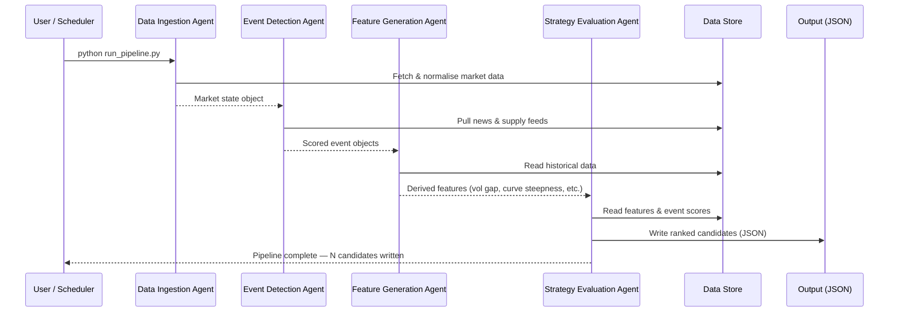

# Energy Options Opportunity Agent — User Guide

> **Version 1.0 · March 2026**
> This guide walks you through setting up, configuring, and running the full Energy Options Opportunity Agent pipeline. It is written for developers who are comfortable with Python and CLI tooling but are new to this project.

---

## Table of Contents

1. [Overview](#overview)
2. [Prerequisites](#prerequisites)
3. [Setup & Configuration](#setup--configuration)
4. [Running the Pipeline](#running-the-pipeline)
5. [Interpreting the Output](#interpreting-the-output)
6. [Troubleshooting](#troubleshooting)

---

## Overview

The **Energy Options Opportunity Agent** is a modular, autonomous Python pipeline that identifies options trading opportunities driven by oil market instability. It ingests market data, supply signals, geopolitical news, and alternative datasets, then produces structured, ranked candidate options strategies with full signal explainability.

### How the Pipeline Works

The system is composed of four loosely coupled agents that communicate through a shared **market state object** and a **derived features store**. Data flows strictly in one direction:


```mermaid
flowchart LR
    subgraph Ingestion["① Data Ingestion Agent"]
        A1[Crude Prices\nWTI · Brent]
        A2[ETF / Equity Prices\nUSO · XLE · XOM · CVX]
        A3[Options Chains\nStrike · IV · Volume]
    end

    subgraph Event["② Event Detection Agent"]
        B1[News & Geo Feeds\nGDELT · NewsAPI]
        B2[Supply Disruption\nEIA · Refinery · Tankers]
        B3[Confidence & Intensity\nScoring]
    end

    subgraph Feature["③ Feature Generation Agent"]
        C1[Volatility Gap\nRealised vs Implied]
        C2[Futures Curve\nSteepness]
        C3[Sector Dispersion\nInsider · Narrative\nShock Probability]
    end

    subgraph Strategy["④ Strategy Evaluation Agent"]
        D1[Eligible Structures\nStraddle · Spread · Calendar]
        D2[Edge Score\nComputation]
        D3[Ranked Candidates\n+ Explainability]
    end

    RawFeeds[("Raw\nFeeds")] --> Ingestion
    Ingestion -->|market state object| Event
    Event -->|scored events| Feature
    Feature -->|derived signals| Strategy
    Strategy -->|JSON output| Output[("Ranked\nOpportunities\nJSON")]
```

### In-Scope Instruments & Structures

| Category | Items |
|---|---|
| Crude Futures | Brent Crude, WTI |
| ETFs | USO, XLE |
| Energy Equities | Exxon Mobil (XOM), Chevron (CVX) |
| Option Structures (MVP) | Long straddles, call/put spreads, calendar spreads |

> **Advisory only.** The pipeline does not execute trades. All output is for informational and analytical use.

---

## Prerequisites

### System Requirements

| Requirement | Minimum |
|---|---|
| Python | 3.10 or later |
| Operating System | Linux, macOS, or Windows (WSL recommended) |
| RAM | 4 GB |
| Disk | 10 GB free (for 6–12 months of historical data) |
| Deployment target | Local machine, single VM, or container |

### Required Tools

```bash
# Verify Python version
python --version   # must be 3.10+

# Verify pip
pip --version

# Optional but recommended: virtual environment tooling
python -m venv --help
```

### API Accounts

Obtain free-tier credentials for each data source before proceeding. All sources listed below have free or limited-free tiers sufficient for the MVP.

| Layer | Source | Sign-up URL | Notes |
|---|---|---|---|
| Crude Prices | Alpha Vantage | <https://www.alphavantage.co> | Free key; minutes-level |
| Crude Prices (alt) | MetalpriceAPI | <https://metalpriceapi.com> | Secondary fallback |
| ETF / Equity | Yahoo Finance (`yfinance`) | No key required | Free Python library |
| Options Chains | Polygon.io | <https://polygon.io> | Free tier; daily options data |
| Supply / Inventory | EIA API | <https://www.eia.gov/opendata> | Free; weekly cadence |
| News & Geo Events | GDELT | <https://www.gdeltproject.org> | No key required |
| News & Geo Events | NewsAPI | <https://newsapi.org> | Free developer key |
| Insider Activity | SEC EDGAR | <https://www.sec.gov/developer> | No key required |
| Insider Activity (alt) | Quiver Quant | <https://www.quiverquant.com> | Limited free tier |
| Shipping / Logistics | MarineTraffic | <https://www.marinetraffic.com> | Free tier |
| Narrative / Sentiment | Reddit (pushshift / PRAW) | <https://www.reddit.com/dev/api> | Free; rate-limited |
| Narrative / Sentiment | Stocktwits | <https://api.stocktwits.com> | Free; rate-limited |

---

## Setup & Configuration

### 1. Clone the Repository

```bash
git clone https://github.com/your-org/energy-options-agent.git
cd energy-options-agent
```

### 2. Create and Activate a Virtual Environment

```bash
python -m venv .venv

# Linux / macOS
source .venv/bin/activate

# Windows (PowerShell)
.venv\Scripts\Activate.ps1
```

### 3. Install Dependencies

```bash
pip install --upgrade pip
pip install -r requirements.txt
```

### 4. Configure Environment Variables

The pipeline reads all credentials and tunable parameters from environment variables. Copy the provided template and populate every value before running:

```bash
cp .env.example .env
```

Open `.env` in your editor and fill in the values described in the table below.

#### Environment Variable Reference

| Variable | Required | Default | Description |
|---|---|---|---|
| `ALPHA_VANTAGE_API_KEY` | ✅ Yes | — | API key for Alpha Vantage crude price feed |
| `METALPRICE_API_KEY` | Optional | — | Fallback key for MetalpriceAPI |
| `POLYGON_API_KEY` | ✅ Yes | — | API key for Polygon.io options chains |
| `EIA_API_KEY` | ✅ Yes | — | API key for EIA supply/inventory data |
| `NEWS_API_KEY` | ✅ Yes | — | API key for NewsAPI geopolitical events |
| `REDDIT_CLIENT_ID` | Optional | — | Reddit PRAW application client ID |
| `REDDIT_CLIENT_SECRET` | Optional | — | Reddit PRAW application client secret |
| `REDDIT_USER_AGENT` | Optional | `energy-agent/1.0` | User-agent string for Reddit API calls |
| `QUIVER_API_KEY` | Optional | — | Quiver Quant API key for insider data |
| `MARINE_TRAFFIC_API_KEY` | Optional | — | MarineTraffic API key for tanker flow data |
| `DATA_DIR` | ✅ Yes | `./data` | Path where raw and derived data are persisted |
| `OUTPUT_DIR` | ✅ Yes | `./output` | Path where ranked JSON candidates are written |
| `HISTORY_DAYS` | Optional | `365` | Days of historical data to retain (180–365 recommended) |
| `MARKET_REFRESH_INTERVAL_SECONDS` | Optional | `60` | Polling cadence for minutes-level market feeds |
| `LOG_LEVEL` | Optional | `INFO` | Logging verbosity: `DEBUG`, `INFO`, `WARNING`, `ERROR` |
| `PIPELINE_MODE` | Optional | `full` | `full` \| `ingest_only` \| `evaluate_only` |

#### Example `.env` File

```dotenv
# --- Credentials ---
ALPHA_VANTAGE_API_KEY=YOUR_ALPHA_VANTAGE_KEY
POLYGON_API_KEY=YOUR_POLYGON_KEY
EIA_API_KEY=YOUR_EIA_KEY
NEWS_API_KEY=YOUR_NEWS_API_KEY

# --- Optional enrichment sources ---
REDDIT_CLIENT_ID=YOUR_REDDIT_CLIENT_ID
REDDIT_CLIENT_SECRET=YOUR_REDDIT_CLIENT_SECRET
QUIVER_API_KEY=YOUR_QUIVER_KEY
MARINE_TRAFFIC_API_KEY=YOUR_MARINE_TRAFFIC_KEY

# --- Storage ---
DATA_DIR=./data
OUTPUT_DIR=./output
HISTORY_DAYS=365

# --- Behaviour ---
MARKET_REFRESH_INTERVAL_SECONDS=60
LOG_LEVEL=INFO
PIPELINE_MODE=full
```

### 5. Initialise the Data Directory

Run the one-time initialisation script to create the required directory structure and verify connectivity to all configured data sources:

```bash
python scripts/init_data_store.py
```

Expected output:

```
[INFO] Creating data directories under ./data ...
[INFO] Checking Alpha Vantage connectivity ... OK
[INFO] Checking Polygon.io connectivity ...   OK
[INFO] Checking EIA API connectivity ...      OK
[INFO] Checking NewsAPI connectivity ...      OK
[WARN] MARINE_TRAFFIC_API_KEY not set — shipping layer will be skipped
[INFO] Initialisation complete.
```

> **Tip:** Warnings about optional sources (shipping, Reddit, Quiver) are non-fatal. The pipeline degrades gracefully and omits signals it cannot populate.

---

## Running the Pipeline

### Pipeline Execution Sequence


```mermaid
sequenceDiagram
    participant CLI as User / Scheduler
    participant DIA as Data Ingestion Agent
    participant EDA as Event Detection Agent
    participant FGA as Feature Generation Agent
    participant SEA as Strategy Evaluation Agent
    participant Store as Data Store
    participant Out as Output (JSON)

    CLI->>DIA: python run_pipeline.py
    DIA->>Store: Fetch & normalise market data
    DIA-->>EDA: Market state object

    EDA->>Store: Pull news & supply feeds
    EDA-->>FGA: Scored event objects

    FGA->>Store: Read historical data
    FGA-->>SEA: Derived features (vol gap, curve steepness, etc.)

    SEA->>Store: Read features & event scores
    SEA->>Out: Write ranked candidates (JSON)
    SEA-->>CLI: Pipeline complete — N candidates written
```

### Running the Full Pipeline (One-Shot)

Execute the pipeline once and write results to `OUTPUT_DIR`:

```bash
python run_pipeline.py
```

### Running with Continuous Refresh

To poll market data on the configured cadence and continuously update candidates:

```bash
python run_pipeline.py --mode continuous
```

Press `Ctrl+C` to stop. The pipeline will complete the in-progress evaluation cycle before exiting.

### Running Individual Agents

Each agent can be invoked independently for testing or debugging:

```bash
# Run only the Data Ingestion Agent
python run_pipeline.py --agent ingest

# Run only the Event Detection Agent (requires existing market state)
python run_pipeline.py --agent events

# Run only the Feature Generation Agent (requires ingestion + event data)
python run_pipeline.py --agent features

# Run only the Strategy Evaluation Agent (requires all upstream data)
python run_pipeline.py --agent evaluate
```

### Selecting a Pipeline Mode via Environment Variable

Alternatively, set `PIPELINE_MODE` in `.env` before invoking:

```dotenv
PIPELINE_MODE=ingest_only   # stops after data normalisation
PIPELINE_MODE=evaluate_only # skips ingestion; uses most recent stored state
PIPELINE_MODE=full          # default end-to-end run
```

### Common CLI Flags

| Flag | Description |
|---|---|
| `--mode continuous` | Continuous polling at `MARKET_REFRESH_INTERVAL_SECONDS` |
| `--agent <name>` | Run a single agent (`ingest`, `events`, `features`, `evaluate`) |
| `--output <path>` | Override `OUTPUT_DIR` for this run |
| `--log-level DEBUG` | Override `LOG_LEVEL` for this run |
| `--dry-run` | Execute full pipeline but do not write output files |

### Scheduling with Cron (Linux / macOS)

To run the pipeline once every 5 minutes via cron:

```bash
crontab -e
```

Add the following line, substituting your actual paths:

```cron
*/5 * * * * /path/to/.venv/bin/python /path/to/energy-options-agent/run_pipeline.py >> /var/log/energy-agent.log 2>&1
```

---

## Interpreting the Output

### Output Location

By default, the pipeline writes to `OUTPUT_DIR` (e.g., `./output`). Each run produces a timestamped file:

```
output/
└── candidates_2026-03-15T14:32:00Z.json
```

A convenience symlink `output/latest.json` always points to the most recent file.

### Output Schema

Each element in the output array represents one ranked strategy candidate:

| Field | Type | Description |
|---|---|---|
| `instrument` | `string` | Target instrument, e.g. `USO`, `XLE`, `CL=F` |
| `structure` | `enum` | `long_straddle` \| `call_spread` \| `put_spread` \| `calendar_spread` |
| `expiration` | `integer` (days) | Calendar days from evaluation date to target expiry |
| `edge_score` | `float [0.0–1.0]` | Composite opportunity score; higher = stronger signal confluence |
| `signals` | `object` | Map of contributing signals and their qualitative values |
| `generated_at` | `ISO 8601` | UTC timestamp when this candidate was generated |

### Example Output

```json
[
  {
    "instrument": "USO",
    "structure": "long_straddle",
    "expiration": 30,
    "edge_score": 0.47,
    "signals": {
      "tanker_disruption_index": "high",
      "volatility_gap": "positive",
      "narrative_velocity": "rising"
    },
    "generated_at": "2026-03-15T14:32:00Z"
  },
  {
    "instrument": "XLE",
    "structure": "call_spread",
    "expiration": 21,
    "edge_score": 0.31,
    "signals": {
      "volatility_gap": "positive",
      "eia_inventory_draw": "above_expectation",
      "sector_dispersion": "elevated"
    },
    "generated_at": "2026-03-15T14:32:00Z"
  }
]
```

### Understanding `edge_score`

The `edge_score` is a composite float in the range `[0.0, 1.0]`. It reflects the confluence and strength of all contributing signals for that candidate.

| Score Range | Interpretation |
|---|---|
| `0.0 – 0.20` | Weak signal confluence; low conviction |
| `0.21 – 0.40` | Moderate signal, warrants monitoring |
| `0.41 – 0.60` | Meaningful confluence; candidate worth evaluating |
| `0.61 – 0.80` | Strong signal confluence; higher conviction |
| `0.81 – 1.00` | Very strong confluence across multiple independent signals |

> **Important:** The `edge_score` is a heuristic ranking tool, not a probability of profit. Always apply independent judgment before acting on any candidate.

### Understanding the `signals` Map

Each key in the `signals` object corresponds to a derived feature computed by the Feature Generation Agent. Common signal keys and their qualitative values are shown below:

| Signal Key | Possible Values | Source |
|---|---|---|
| `volatility_gap` | `positive`, `negative`, `neutral` | Realised vs. implied IV comparison |
| `tanker_disruption_index` | `high`, `moderate`, `low` | Shipping / logistics feeds |
| `narrative_velocity` | `rising`, `stable`, `falling` | Reddit / Stocktwits sentiment |
|