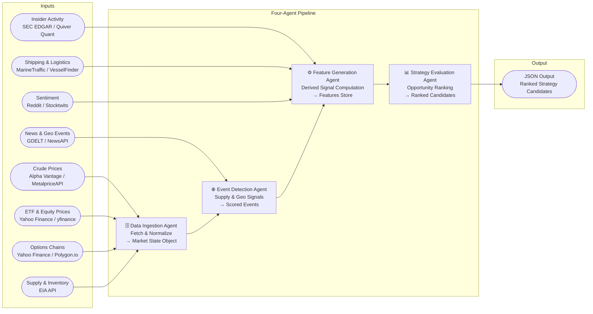
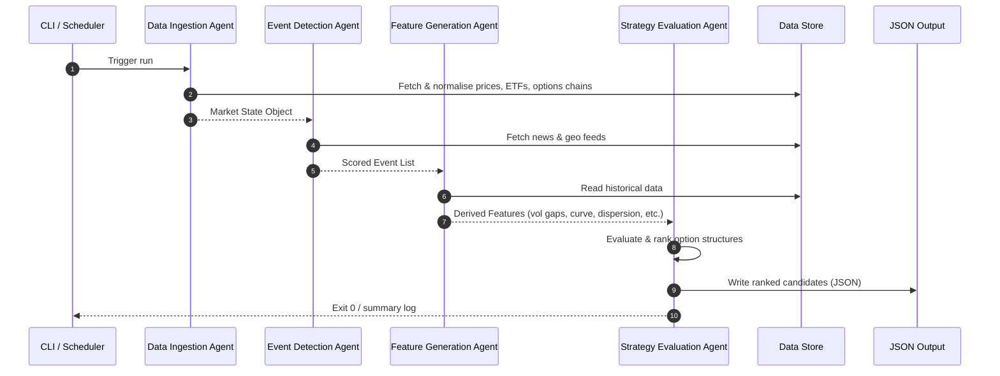

# Energy Options Opportunity Agent — User Guide

> **Version 1.0 • March 2026**
> This guide walks you through setting up, configuring, and running the full Energy Options Opportunity Agent pipeline from the command line.

---

## Table of Contents

1. [Overview](#overview)
2. [Prerequisites](#prerequisites)
3. [Setup & Configuration](#setup--configuration)
4. [Running the Pipeline](#running-the-pipeline)
5. [Interpreting the Output](#interpreting-the-output)
6. [Troubleshooting](#troubleshooting)

---

## Overview

The **Energy Options Opportunity Agent** is a modular, four-agent Python pipeline that identifies options trading opportunities driven by oil market instability. It ingests market data, supply signals, geopolitical news, and alternative datasets; derives a set of structured signals; and produces a ranked list of candidate options strategies — each with a computed **edge score** and a full explanation of the signals that contributed to it.

The pipeline is **advisory only**. It does not execute trades.

### Pipeline Architecture


```mermaid
flowchart LR
    subgraph Inputs
        A1([Crude Prices\nAlpha Vantage / MetalpriceAPI])
        A2([ETF & Equity Prices\nYahoo Finance / yfinance])
        A3([Options Chains\nYahoo Finance / Polygon.io])
        A4([Supply & Inventory\nEIA API])
        A5([News & Geo Events\nGDELT / NewsAPI])
        A6([Insider Activity\nSEC EDGAR / Quiver Quant])
        A7([Shipping & Logistics\nMarineTraffic / VesselFinder])
        A8([Sentiment\nReddit / Stocktwits])
    end

    subgraph Pipeline["Four-Agent Pipeline"]
        direction TB
        B["🗄️ Data Ingestion Agent\nFetch & Normalize\n→ Market State Object"]
        C["🌐 Event Detection Agent\nSupply & Geo Signals\n→ Scored Events"]
        D["⚙️ Feature Generation Agent\nDerived Signal Computation\n→ Features Store"]
        E["📊 Strategy Evaluation Agent\nOpportunity Ranking\n→ Ranked Candidates"]
    end

    subgraph Output
        F([JSON Output\nRanked Strategy Candidates])
    end

    A1 & A2 & A3 & A4 --> B
    A5 --> C
    A6 & A7 & A8 --> D
    B --> C
    C --> D
    D --> E
    E --> F
```

### In-Scope Instruments & Structures

| Category | Items |
|---|---|
| **Crude Futures** | Brent Crude, WTI |
| **ETFs** | USO, XLE |
| **Energy Equities** | Exxon Mobil (XOM), Chevron (CVX) |
| **Option Structures (MVP)** | Long straddles, call/put spreads, calendar spreads |

---

## Prerequisites

### System Requirements

| Requirement | Minimum |
|---|---|
| Python | 3.10 or later |
| Operating System | Linux, macOS, or Windows (WSL2 recommended) |
| RAM | 2 GB |
| Disk | 5 GB free (for 6–12 months of historical data) |
| Network | Outbound HTTPS access to all data-source APIs |

### Python Knowledge Assumed

- Virtual environments (`venv` or `conda`)
- Installing packages with `pip`
- Running scripts from the command line
- Reading and editing `.env` files

### External Accounts Required

Obtain API keys or confirm free-tier access before proceeding.

| Service | Purpose | Cost | Sign-up URL |
|---|---|---|---|
| Alpha Vantage *or* MetalpriceAPI | WTI / Brent prices | Free | https://www.alphavantage.co |
| Yahoo Finance (`yfinance`) | ETF, equity, options data | Free (no key needed) | — |
| Polygon.io *(optional)* | Options chains (higher limits) | Free tier | https://polygon.io |
| EIA API | Supply & inventory data | Free | https://www.eia.gov/opendata |
| GDELT | News & geopolitical events | Free (no key needed) | — |
| NewsAPI | Energy news headlines | Free tier | https://newsapi.org |
| SEC EDGAR | Insider activity | Free (no key needed) | — |
| Quiver Quant *(optional)* | Insider conviction scores | Free/Limited | https://www.quiverquant.com |
| MarineTraffic *or* VesselFinder | Tanker shipping data | Free tier | https://www.marinetraffic.com |
| Reddit API | Retail sentiment | Free | https://www.reddit.com/prefs/apps |
| Stocktwits *(optional)* | Narrative velocity | Free | https://api.stocktwits.com |

---

## Setup & Configuration

### 1. Clone the Repository

```bash
git clone https://github.com/your-org/energy-options-agent.git
cd energy-options-agent
```

### 2. Create a Virtual Environment

```bash
python -m venv .venv
source .venv/bin/activate        # Linux / macOS
# .venv\Scripts\activate.bat     # Windows CMD
# .venv\Scripts\Activate.ps1     # Windows PowerShell
```

### 3. Install Dependencies

```bash
pip install --upgrade pip
pip install -r requirements.txt
```

### 4. Configure Environment Variables

Copy the provided template and populate your credentials:

```bash
cp .env.example .env
```

Open `.env` in any editor and fill in your values. The full set of recognised variables is described in the table below.

#### Environment Variable Reference

| Variable | Required | Default | Description |
|---|---|---|---|
| `ALPHA_VANTAGE_API_KEY` | Yes* | — | API key for Alpha Vantage crude price feed. *Required if `CRUDE_PRICE_SOURCE=alphavantage`. |
| `METALPRICE_API_KEY` | Yes* | — | API key for MetalpriceAPI. *Required if `CRUDE_PRICE_SOURCE=metalprice`. |
| `CRUDE_PRICE_SOURCE` | Yes | `alphavantage` | Active crude price provider. Accepted values: `alphavantage`, `metalprice`. |
| `POLYGON_API_KEY` | No | — | API key for Polygon.io options chain data. Falls back to `yfinance` if unset. |
| `EIA_API_KEY` | Yes | — | API key for EIA inventory and refinery utilization feed. |
| `NEWS_API_KEY` | No | — | API key for NewsAPI energy headline feed. Omit to use GDELT only. |
| `REDDIT_CLIENT_ID` | No | — | Reddit OAuth client ID for sentiment ingestion. |
| `REDDIT_CLIENT_SECRET` | No | — | Reddit OAuth client secret. |
| `REDDIT_USER_AGENT` | No | `energy-agent/1.0` | User-agent string for Reddit API requests. |
| `QUIVER_QUANT_API_KEY` | No | — | API key for Quiver Quant insider conviction data. Omit to use raw SEC EDGAR only. |
| `MARINETRAFFIC_API_KEY` | No | — | API key for MarineTraffic tanker flow data. Falls back to VesselFinder free tier if unset. |
| `STOCKTWITS_ACCESS_TOKEN` | No | — | Access token for Stocktwits narrative velocity feed. |
| `DATA_DIR` | No | `./data` | Local directory for persisting raw and derived data. |
| `OUTPUT_DIR` | No | `./output` | Directory where ranked JSON candidates are written. |
| `LOG_LEVEL` | No | `INFO` | Logging verbosity. Accepted values: `DEBUG`, `INFO`, `WARNING`, `ERROR`. |
| `HISTORY_DAYS` | No | `180` | Number of calendar days of historical data to retain (minimum recommended: `180`; maximum recommended: `365`). |
| `PRICE_REFRESH_INTERVAL_SECONDS` | No | `300` | Cadence (seconds) for market price refreshes. Lower values increase API quota consumption. |
| `ENABLE_PHASE` | No | `1` | MVP phase to activate. Accepted values: `1`, `2`, `3`. Phase 4 features are not yet implemented. |

#### Example `.env`

```dotenv
# --- Crude Price Source ---
CRUDE_PRICE_SOURCE=alphavantage
ALPHA_VANTAGE_API_KEY=YOUR_ALPHA_VANTAGE_KEY

# --- Options Data ---
POLYGON_API_KEY=YOUR_POLYGON_KEY          # optional; remove line to use yfinance

# --- Supply & Inventory ---
EIA_API_KEY=YOUR_EIA_KEY

# --- News & Events ---
NEWS_API_KEY=YOUR_NEWSAPI_KEY             # optional

# --- Sentiment ---
REDDIT_CLIENT_ID=YOUR_REDDIT_CLIENT_ID
REDDIT_CLIENT_SECRET=YOUR_REDDIT_SECRET
REDDIT_USER_AGENT=energy-agent/1.0

# --- Alternative Signals ---
QUIVER_QUANT_API_KEY=YOUR_QUIVER_KEY      # optional
MARINETRAFFIC_API_KEY=YOUR_MT_KEY         # optional

# --- Pipeline Settings ---
DATA_DIR=./data
OUTPUT_DIR=./output
LOG_LEVEL=INFO
HISTORY_DAYS=180
PRICE_REFRESH_INTERVAL_SECONDS=300
ENABLE_PHASE=2
```

### 5. Initialise the Data Store

Run the initialisation command to create the local directory structure and seed historical data for the configured `HISTORY_DAYS` window:

```bash
python -m agent init
```

Expected output:

```
[INFO] Creating data directories at ./data ...
[INFO] Seeding 180 days of crude price history (WTI, Brent) ...
[INFO] Seeding 180 days of ETF/equity history (USO, XLE, XOM, CVX) ...
[INFO] Seeding options chain snapshot ...
[INFO] Initialisation complete.
```

> **Note:** Seeding may take several minutes depending on API rate limits. The pipeline will warn but will not fail if a non-critical feed is unavailable during initialisation.

---

## Running the Pipeline

### Pipeline Data Flow


```mermaid
sequenceDiagram
    autonumber
    participant CLI as CLI / Scheduler
    participant DIA as Data Ingestion Agent
    participant EDA as Event Detection Agent
    participant FGA as Feature Generation Agent
    participant SEA as Strategy Evaluation Agent
    participant Store as Data Store
    participant Out as JSON Output

    CLI->>DIA: Trigger run
    DIA->>Store: Fetch & normalise prices, ETFs, options chains
    DIA-->>EDA: Market State Object
    EDA->>Store: Fetch news & geo feeds
    EDA-->>FGA: Scored Event List
    FGA->>Store: Read historical data
    FGA-->>SEA: Derived Features (vol gaps, curve, dispersion, etc.)
    SEA->>SEA: Evaluate & rank option structures
    SEA->>Out: Write ranked candidates (JSON)
    SEA-->>CLI: Exit 0 / summary log
```

### Single Run (Foreground)

Execute the full pipeline once and write output to `OUTPUT_DIR`:

```bash
python -m agent run
```

### Run with Explicit Options

```bash
python -m agent run \
  --phase 2 \
  --output-dir ./output \
  --log-level DEBUG
```

| Flag | Description |
|---|---|
| `--phase` | Override `ENABLE_PHASE` for this run (`1`, `2`, or `3`). |
| `--output-dir` | Override `OUTPUT_DIR` for this run. |
| `--log-level` | Override `LOG_LEVEL` for this run. |
| `--dry-run` | Execute all agents but do not write output files. Useful for validating configuration. |

### Continuous / Scheduled Mode

To run on the configured `PRICE_REFRESH_INTERVAL_SECONDS` cadence:

```bash
python -m agent run --continuous
```

Stop with `Ctrl+C`. The pipeline logs a clean shutdown message and flushes any buffered output before exiting.

#### Running as a Background Service (systemd example)

```ini
# /etc/systemd/system/energy-agent.service
[Unit]
Description=Energy Options Opportunity Agent
After=network.target

[Service]
WorkingDirectory=/opt/energy-options-agent
EnvironmentFile=/opt/energy-options-agent/.env
ExecStart=/opt/energy-options-agent/.venv/bin/python -m agent run --continuous
Restart=on-failure
RestartSec=30

[Install]
WantedBy=multi-user.target
```

```bash
sudo systemctl daemon-reload
sudo systemctl enable --now energy-agent
sudo journalctl -fu energy-agent
```

### Running Individual Agents

Each agent can be invoked independently for debugging or incremental testing:

```bash
python -m agent.ingestion      # Data Ingestion Agent only
python -m agent.events         # Event Detection Agent only
python -m agent.features       # Feature Generation Agent only
python -m agent.strategy       # Strategy Evaluation Agent only
```

> **Dependency note:** `agent.events` expects a valid Market State Object written by `agent.ingestion`. `agent.features` expects scored events from `agent.events`. `agent.strategy` expects the full derived features store from `agent.features`. Run them in order when testing individually.

---

## Interpreting the Output

### Output File Location

After each run the pipeline writes a timestamped JSON file to `OUTPUT_DIR`:

```
./output/
└── candidates_20260315T142300Z.json
```

A symlink `./output/latest.json` always points to the most recent file.

### Output Schema

Each element in the output array represents one ranked strategy candidate.

| Field | Type | Description |
|---|---|---|
| `instrument` | `string` | Target instrument — e.g. `"USO"`, `"XLE"`, `"CL=F"` (WTI). |
| `structure` | `enum` | Options structure: `long_straddle` \| `call_spread` \| `put_spread` \| `calendar_spread`. |
| `expiration` | `integer` | Target expiration in **calendar days** from the evaluation date. |
| `edge_score` | `float [0.0–1.0]` | Composite opportunity score. Higher values indicate stronger signal confluence. |
| `signals` | `object` | Map of contributing signals and their qualitative state. See signal glossary below. |
| `generated_at` | `ISO 8601 datetime` | UTC timestamp of candidate generation. |

### Example Output File

```json
[
  {
    "instrument": "USO",
    "structure": "long_straddle",
    "expiration": 30,
    "edge_score": 0.47,
    "signals": {
      "tanker_disruption_index": "high",
      "volatility_gap": "positive",
      "narrative_velocity": "rising"
    },
    "generated_at": "2026-03-15T14:23:00Z"
  },
  {
    "instrument": "XOM",
    "structure": "call_spread",
    "expiration": 45,
    "edge_score": 0.31,
    "signals": {
      "supply_shock_probability": "elevated",
      "insider_conviction_score": "medium",
      "futures_curve_steepness": "backwardated"
    },
    "generated_at": "2026-03-15T14:23:00Z"
  }
]
```

### Signal Glossary

| Signal Key | Description | Typical Values |
|---|---|---|
| `volatility_gap` | Difference between realised volatility and implied volatility. A **positive** gap means realised > implied (options may be underpriced). | `positive`, `negative`, `neutral` |
| `futures_curve_steepness` | Shape of the WTI/Brent futures curve. **Backwardation** can signal supply tightness. | `contango`, `backwardated`, `flat` |
| `sector_dispersion` | Return dispersion across energy equities; elevated disp