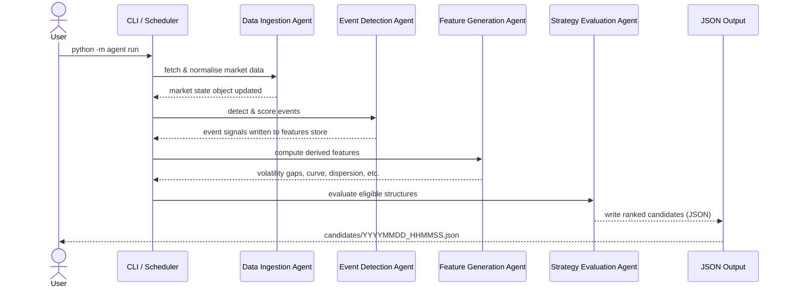

# Energy Options Opportunity Agent — User Guide

> **Version 1.0 · March 2026**
> This guide walks a developer through installing, configuring, and running the full four-agent pipeline end-to-end.

---

## Table of Contents

1. [Overview](#overview)
2. [Prerequisites](#prerequisites)
3. [Setup & Configuration](#setup--configuration)
4. [Running the Pipeline](#running-the-pipeline)
5. [Interpreting the Output](#interpreting-the-output)
6. [Troubleshooting](#troubleshooting)

---

## Overview

The **Energy Options Opportunity Agent** is a modular Python pipeline that identifies options trading opportunities driven by oil market instability. The system ingests market data, supply signals, news events, and alternative datasets, then produces structured, ranked candidate options strategies with full signal explainability.

### Four-Agent Architecture

Data flows unidirectionally through four loosely coupled agents that communicate via a shared **market state object** and a **derived features store**.


```mermaid
flowchart LR
    subgraph Ingestion ["① Data Ingestion Agent"]
        A1[Crude Prices\nAlpha Vantage / MetalpriceAPI]
        A2[ETF & Equity Prices\nyfinance / Yahoo Finance]
        A3[Options Chains\nYahoo Finance / Polygon.io]
        A4[Inventory Data\nEIA API]
    end

    subgraph Events ["② Event Detection Agent"]
        B1[News & Geo Events\nGDELT / NewsAPI]
        B2[Shipping & Logistics\nMarineTraffic / VesselFinder]
        B3[Confidence & Intensity\nScoring]
    end

    subgraph Features ["③ Feature Generation Agent"]
        C1[Volatility Gap\nRealized vs Implied]
        C2[Futures Curve Steepness]
        C3[Sector Dispersion]
        C4[Insider Conviction Score\nEDGAR / Quiver Quant]
        C5[Narrative Velocity\nReddit / Stocktwits]
        C6[Supply Shock Probability]
    end

    subgraph Strategy ["④ Strategy Evaluation Agent"]
        D1[Eligible Structure Evaluation\nStraddles · Spreads · Calendars]
        D2[Edge Score Computation]
        D3[Ranked Candidates + Signals]
    end

    RAW[(Market\nState Object)] --> Events
    Ingestion --> RAW
    Events --> FEAT[(Derived\nFeatures Store)]
    Features --> FEAT
    RAW --> Features
    FEAT --> Strategy
    Strategy --> OUT[/"JSON Output\n(ranked candidates)"/]
```

### In-Scope Instruments & Structures

| Category | Items |
|---|---|
| **Crude Futures** | Brent Crude, WTI (`CL=F`) |
| **ETFs** | USO, XLE |
| **Energy Equities** | Exxon Mobil (XOM), Chevron (CVX) |
| **Option Structures (MVP)** | Long straddles, call/put spreads, calendar spreads |

> **Advisory only.** The pipeline does not execute trades. All output is for analysis and manual review.

---

## Prerequisites

### System Requirements

| Requirement | Minimum |
|---|---|
| Python | 3.10 or later |
| RAM | 2 GB |
| Disk | 10 GB (6–12 months of historical data) |
| OS | Linux, macOS, or Windows (WSL2 recommended) |
| Deployment target | Local machine, single VM, or single container |

### Required Accounts & API Keys

Register for free-tier access at each provider before proceeding. All sources used in MVP Phases 1–3 are free or low-cost.

| Provider | Used For | Cost | Sign-up URL |
|---|---|---|---|
| Alpha Vantage or MetalpriceAPI | WTI / Brent spot & futures prices | Free | `alphavantage.co` |
| Yahoo Finance / yfinance | ETF, equity, and options data | Free | (no key required for yfinance) |
| Polygon.io | Options chains (strike, expiry, IV, volume) | Free/Limited | `polygon.io` |
| EIA API | Weekly inventory & refinery utilization | Free | `eia.gov/opendata` |
| GDELT | News & geopolitical events | Free | `gdeltproject.org` |
| NewsAPI | Headline news feeds | Free | `newsapi.org` |
| SEC EDGAR | Insider trade filings | Free | `sec.gov/developer` |
| Quiver Quant | Insider conviction signals | Free/Limited | `quiverquant.com` |
| MarineTraffic or VesselFinder | Tanker flow & shipping data | Free tier | `marinetraffic.com` |
| Reddit API | Retail sentiment / narrative velocity | Free | `reddit.com/prefs/apps` |
| Stocktwits API | Retail sentiment velocity | Free | `api.stocktwits.com` |

### Python Dependencies

```bash
pip install -r requirements.txt
```

A minimal `requirements.txt` includes:

```text
requests>=2.31
yfinance>=0.2
pandas>=2.1
numpy>=1.26
pydantic>=2.5
python-dotenv>=1.0
schedule>=1.2
```

---

## Setup & Configuration

### 1. Clone the Repository

```bash
git clone https://github.com/your-org/energy-options-agent.git
cd energy-options-agent
```

### 2. Create a Virtual Environment

```bash
python -m venv .venv
source .venv/bin/activate      # macOS / Linux
# .venv\Scripts\activate       # Windows PowerShell
pip install -r requirements.txt
```

### 3. Configure Environment Variables

Copy the example file and populate your credentials:

```bash
cp .env.example .env
```

Open `.env` in your editor and fill in each value. The table below documents every variable the pipeline reads.

#### Environment Variable Reference

| Variable | Required | Default | Description |
|---|---|---|---|
| `ALPHA_VANTAGE_API_KEY` | Yes¹ | — | API key for Alpha Vantage crude price feed |
| `METALPRICE_API_KEY` | Yes¹ | — | API key for MetalpriceAPI (alternative crude source) |
| `POLYGON_API_KEY` | Phase 1+ | — | Polygon.io key for options chain data |
| `EIA_API_KEY` | Phase 2+ | — | EIA Open Data API key for inventory feeds |
| `NEWSAPI_KEY` | Phase 2+ | — | NewsAPI key for headline ingestion |
| `GDELT_ENABLED` | Phase 2+ | `true` | Set `false` to disable GDELT polling |
| `EDGAR_USER_AGENT` | Phase 3+ | — | `Name email@example.com` string required by SEC EDGAR |
| `QUIVER_API_KEY` | Phase 3+ | — | Quiver Quant API key for insider conviction data |
| `MARINE_TRAFFIC_API_KEY` | Phase 3+ | — | MarineTraffic API key for tanker flow data |
| `REDDIT_CLIENT_ID` | Phase 3+ | — | Reddit OAuth app client ID |
| `REDDIT_CLIENT_SECRET` | Phase 3+ | — | Reddit OAuth app client secret |
| `REDDIT_USER_AGENT` | Phase 3+ | `energy-agent/1.0` | Reddit API user-agent string |
| `STOCKTWITS_ACCESS_TOKEN` | Phase 3+ | — | Stocktwits OAuth access token |
| `OUTPUT_DIR` | No | `./output` | Directory where JSON candidate files are written |
| `HISTORY_DAYS` | No | `180` | Days of historical data to retain (180–365 recommended) |
| `MARKET_DATA_INTERVAL_MIN` | No | `5` | Minutes between market data refreshes |
| `LOG_LEVEL` | No | `INFO` | Python logging level (`DEBUG`, `INFO`, `WARNING`, `ERROR`) |
| `PHASE` | No | `1` | Active MVP phase (`1`–`3`); controls which agents are enabled |

> ¹ Supply at least one of `ALPHA_VANTAGE_API_KEY` or `METALPRICE_API_KEY`. The ingestion agent falls back to the second source if the first is unavailable.

#### Example `.env`

```dotenv
# --- Crude prices (supply at least one) ---
ALPHA_VANTAGE_API_KEY=ABCDE12345
METALPRICE_API_KEY=

# --- Options data ---
POLYGON_API_KEY=your_polygon_key

# --- Supply / inventory (Phase 2+) ---
EIA_API_KEY=your_eia_key
NEWSAPI_KEY=your_newsapi_key
GDELT_ENABLED=true

# --- Alternative signals (Phase 3+) ---
EDGAR_USER_AGENT=Jane Doe jane@example.com
QUIVER_API_KEY=
MARINE_TRAFFIC_API_KEY=
REDDIT_CLIENT_ID=
REDDIT_CLIENT_SECRET=
REDDIT_USER_AGENT=energy-agent/1.0
STOCKTWITS_ACCESS_TOKEN=

# --- Pipeline behaviour ---
OUTPUT_DIR=./output
HISTORY_DAYS=180
MARKET_DATA_INTERVAL_MIN=5
LOG_LEVEL=INFO
PHASE=1
```

### 4. Initialise the Data Store

This command creates the local database and fetches the initial historical window defined by `HISTORY_DAYS`:

```bash
python -m agent init
```

Expected output:

```
[INFO] Initialising data store at ./data ...
[INFO] Fetching 180 days of historical data for: CL=F, BZ=F, USO, XLE, XOM, CVX
[INFO] Historical load complete. Records stored: 47,832
[INFO] Data store ready.
```

---

## Running the Pipeline

### Pipeline Execution Flow


```mermaid
sequenceDiagram
    actor User
    participant CLI as CLI / Scheduler
    participant DIA as Data Ingestion Agent
    participant EDA as Event Detection Agent
    participant FGA as Feature Generation Agent
    participant SEA as Strategy Evaluation Agent
    participant OUT as JSON Output

    User->>CLI: python -m agent run
    CLI->>DIA: fetch & normalise market data
    DIA-->>CLI: market state object updated
    CLI->>EDA: detect & score events
    EDA-->>CLI: event signals written to features store
    CLI->>FGA: compute derived features
    FGA-->>CLI: volatility gaps, curve, dispersion, etc.
    CLI->>SEA: evaluate eligible structures
    SEA-->>OUT: write ranked candidates (JSON)
    OUT-->>User: candidates/YYYYMMDD_HHMMSS.json
```

### Single Run (One-Shot)

Execute the full pipeline once and write results to `OUTPUT_DIR`:

```bash
python -m agent run
```

Add `--verbose` to echo structured logs to stdout in addition to the log file:

```bash
python -m agent run --verbose
```

### Continuous Mode (Scheduled Polling)

Run the pipeline on the cadence defined by `MARKET_DATA_INTERVAL_MIN`:

```bash
python -m agent run --continuous
```

To override the interval at runtime without editing `.env`:

```bash
python -m agent run --continuous --interval 10   # poll every 10 minutes
```

Press `Ctrl+C` to stop gracefully. In-flight writes are completed before shutdown.

### Running Individual Agents

Each agent can be invoked independently for testing or debugging:

```bash
# Data Ingestion only
python -m agent run --agent ingestion

# Event Detection only
python -m agent run --agent events

# Feature Generation only
python -m agent run --agent features

# Strategy Evaluation only (reads existing features store)
python -m agent run --agent strategy
```

### Running a Specific Phase

To limit the pipeline to agents activated in a given MVP phase without changing `.env`:

```bash
python -m agent run --phase 2
```

| `--phase` | Agents Active | Data Sources Enabled |
|---|---|---|
| `1` | Ingestion, Strategy | Alpha Vantage/MetalpriceAPI, yfinance, Polygon.io |
| `2` | + Event Detection | + EIA, GDELT, NewsAPI |
| `3` | + Feature Generation (full) | + EDGAR, Quiver, MarineTraffic, Reddit, Stocktwits |

### Docker (Optional)

```bash
docker build -t energy-options-agent .
docker run --env-file .env -v $(pwd)/output:/app/output energy-options-agent run --continuous
```

---

## Interpreting the Output

### Output Location

Results are written to `OUTPUT_DIR` (default `./output`) as timestamped JSON files:

```
output/
└── candidates_20260315_143022.json
```

### Output Schema

Each file contains an array of ranked candidate objects. Candidates are ordered by `edge_score` descending (strongest signal confluence first).

| Field | Type | Description |
|---|---|---|
| `instrument` | `string` | Target instrument (e.g. `"USO"`, `"XLE"`, `"CL=F"`) |
| `structure` | `enum` | Option structure: `long_straddle` · `call_spread` · `put_spread` · `calendar_spread` |
| `expiration` | `integer` | Target expiration in calendar days from the evaluation date |
| `edge_score` | `float [0.0–1.0]` | Composite opportunity score; higher = stronger signal confluence |
| `signals` | `object` | Map of contributing signals and their qualitative state |
| `generated_at` | `ISO 8601 datetime` | UTC timestamp of candidate generation |

### Example Output File

```json
[
  {
    "instrument": "USO",
    "structure": "long_straddle",
    "expiration": 30,
    "edge_score": 0.47,
    "signals": {
      "tanker_disruption_index": "high",
      "volatility_gap": "positive",
      "narrative_velocity": "rising"
    },
    "generated_at": "2026-03-15T14:30:22Z"
  },
  {
    "instrument": "XLE",
    "structure": "call_spread",
    "expiration": 21,
    "edge_score": 0.31,
    "signals": {
      "volatility_gap": "positive",
      "supply_shock_probability": "elevated",
      "sector_dispersion": "widening"
    },
    "generated_at": "2026-03-15T14:30:22Z"
  }
]
```

### Reading the Edge Score

| `edge_score` Range | Interpretation |
|---|---|
| `0.70 – 1.00` | Strong confluence — multiple independent signals aligned |
| `0.45 – 0.69` | Moderate confluence — monitor closely; consider position sizing down |
| `0.20 – 0.44` | Weak signal — useful for watchlist building, not actionable alone |
| `0.00 – 0.19` | Noise threshold — typically filtered out of default output |

### Signal Reference

| Signal Key | What It Measures | Possible Values |
|---|---|---|
| `volatility_gap` | Realized IV minus implied IV | `positive`, `negative`, `neutral` |
| `futures_curve_steepness` | Contango / backwardation severity | `steep_contango`, `flat`, `backwardation` |
| `sector_dispersion` | Cross-sector return spread widening | `widening`, `stable`, `compressing` |
| `insider_conviction_score` | Weight of recent executive buy/sell activity | `high`, `moderate`, `low` |
| `narrative_velocity` | Headline acceleration on Reddit / Stocktwits | `rising`, `stable`, `falling` |
| `supply_shock_probability` | EIA + event-driven supply disruption estimate | `elevated`, `moderate`, `low` |
| `tanker_disruption_index` | Shipping chokepoint / flow anomaly severity | `high`, `moderate`, `low` |

### Downstream Consumption

The JSON output is compatible with any JSON-capable dashboard or import tool. To load candidates into thinkorswim or a custom dashboard, point your tool at `OUTPUT_