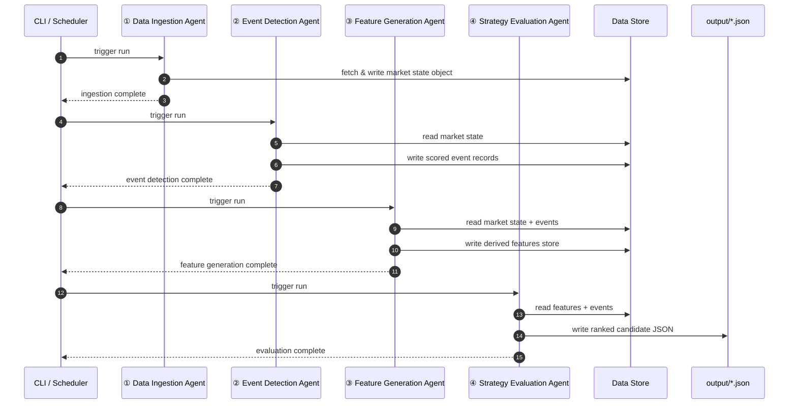

# Energy Options Opportunity Agent — User Guide

> **Version 1.0 · March 2026**
> This guide walks a developer through installing, configuring, and running the full four-agent pipeline end-to-end, and interpreting its output.

---

## Table of Contents

1. [Overview](#overview)
2. [Prerequisites](#prerequisites)
3. [Setup & Configuration](#setup--configuration)
4. [Running the Pipeline](#running-the-pipeline)
5. [Interpreting the Output](#interpreting-the-output)
6. [Troubleshooting](#troubleshooting)

---

## Overview

The **Energy Options Opportunity Agent** is a modular Python pipeline that identifies options trading opportunities driven by oil market instability. It ingests market data, supply signals, news events, and alternative datasets, then produces structured, ranked candidate options strategies.

### What the pipeline does


```mermaid
flowchart LR
    subgraph Sources["External Data Sources"]
        A1[Alpha Vantage / MetalpriceAPI\nCrude Prices]
        A2[Yahoo Finance / yfinance\nETF & Equity Prices]
        A3[Yahoo Finance / Polygon.io\nOptions Chains]
        A4[EIA API\nSupply & Inventory]
        A5[GDELT / NewsAPI\nNews & Geo Events]
        A6[SEC EDGAR / Quiver Quant\nInsider Activity]
        A7[MarineTraffic / VesselFinder\nShipping & Logistics]
        A8[Reddit / Stocktwits\nNarrative & Sentiment]
    end

    subgraph Pipeline["Agent Pipeline"]
        direction TB
        B["① Data Ingestion Agent\nFetch & Normalize\n─────────────────\nUnified Market State Object"]
        C["② Event Detection Agent\nSupply & Geo Signals\n─────────────────\nScored Event Records"]
        D["③ Feature Generation Agent\nDerived Signal Computation\n─────────────────\nDerived Features Store"]
        E["④ Strategy Evaluation Agent\nOpportunity Ranking\n─────────────────\nRanked Candidate List"]
    end

    subgraph Output["Output"]
        F[JSON Candidates\nEdge Score + Signals]
        G[thinkorswim / Dashboard]
    end

    Sources --> B
    B --> C
    C --> D
    D --> E
    E --> F
    F --> G
```

Data flows **unidirectionally** through four loosely coupled agents. Each agent can be deployed and updated independently without disrupting the rest of the pipeline.

### Agent responsibilities at a glance

| # | Agent | Role | Key Output |
|---|-------|------|------------|
| 1 | **Data Ingestion Agent** | Fetch & normalize all raw feeds | Unified market state object |
| 2 | **Event Detection Agent** | Monitor news & geopolitical feeds | Scored supply/geo event records |
| 3 | **Feature Generation Agent** | Compute derived signals | Volatility gaps, shock probabilities, etc. |
| 4 | **Strategy Evaluation Agent** | Rank options opportunities | Candidate list with edge scores |

### In-scope instruments (MVP)

| Type | Instruments |
|------|-------------|
| Crude futures | Brent Crude, WTI (`CL=F`) |
| ETFs | USO, XLE |
| Energy equities | Exxon Mobil (XOM), Chevron (CVX) |

### In-scope option structures (MVP)

- Long straddles
- Call / put spreads
- Calendar spreads

> **Advisory only.** Automated trade execution is explicitly out of scope. All output is for informational and analytical use.

---

## Prerequisites

### System requirements

| Requirement | Minimum |
|-------------|---------|
| OS | Linux, macOS, or Windows (WSL2 recommended) |
| Python | 3.10 or later |
| RAM | 2 GB |
| Disk | 10 GB free (for 6–12 months of historical data) |
| Network | Outbound HTTPS to all data source APIs |

### Required software

```bash
# Verify Python version
python --version        # must be 3.10+

# Verify pip
pip --version

# Verify git
git --version
```

### API accounts

Register for the following **free-tier** accounts before proceeding. All are free or have a usable free tier; no paid account is required for the MVP.

| Data Layer | Provider | Sign-up URL | Notes |
|------------|----------|-------------|-------|
| Crude prices | Alpha Vantage | https://www.alphavantage.co/support/#api-key | Free key, rate-limited |
| ETF / equity prices | Yahoo Finance (`yfinance`) | No key required | — |
| Options chains | Polygon.io *(optional upgrade)* | https://polygon.io | Free tier available |
| Supply & inventory | EIA Open Data | https://www.eia.gov/opendata/ | Free, weekly data |
| News & geo events | NewsAPI | https://newsapi.org | Free developer plan |
| News & geo events | GDELT | No key required | Bulk download |
| Insider activity | SEC EDGAR | No key required | Public EDGAR feed |
| Insider activity | Quiver Quant *(optional)* | https://www.quiverquant.com | Limited free tier |
| Shipping / logistics | MarineTraffic | https://www.marinetraffic.com | Free tier |
| Narrative / sentiment | Reddit API | https://www.reddit.com/prefs/apps | Free |
| Narrative / sentiment | Stocktwits | https://api.stocktwits.com | Free public API |

---

## Setup & Configuration

### 1. Clone the repository

```bash
git clone https://github.com/your-org/energy-options-agent.git
cd energy-options-agent
```

### 2. Create and activate a virtual environment

```bash
python -m venv .venv

# Linux / macOS
source .venv/bin/activate

# Windows (PowerShell)
.venv\Scripts\Activate.ps1
```

### 3. Install dependencies

```bash
pip install --upgrade pip
pip install -r requirements.txt
```

### 4. Configure environment variables

All runtime secrets and tunables are supplied through environment variables. Copy the provided template and fill in your values:

```bash
cp .env.example .env
```

Open `.env` in your editor and populate each variable:

```dotenv
# ── Data Ingestion ─────────────────────────────────────────────────────────

ALPHA_VANTAGE_API_KEY=your_alpha_vantage_key_here
POLYGON_API_KEY=your_polygon_key_here          # optional; leave blank to use yfinance only
EIA_API_KEY=your_eia_api_key_here

# ── Event Detection ─────────────────────────────────────────────────────────

NEWS_API_KEY=your_newsapi_key_here
REDDIT_CLIENT_ID=your_reddit_client_id
REDDIT_CLIENT_SECRET=your_reddit_client_secret
REDDIT_USER_AGENT=energy-options-agent/1.0

# ── Alternative / Contextual Signals (Phase 3) ──────────────────────────────

QUIVER_QUANT_API_KEY=your_quiver_key_here      # optional
MARINE_TRAFFIC_API_KEY=your_marinetraffic_key  # optional

# ── Pipeline Behaviour ───────────────────────────────────────────────────────

PIPELINE_CADENCE_MINUTES=5          # how often the market data refresh runs
SLOW_FEED_CADENCE_HOURS=24          # cadence for EIA, EDGAR (daily/weekly feeds)
DATA_RETENTION_DAYS=180             # 180 = 6 months; max 365 = 12 months
OUTPUT_DIR=./output                 # directory where JSON candidates are written
LOG_LEVEL=INFO                      # DEBUG | INFO | WARNING | ERROR
```

#### Full environment variable reference

| Variable | Required | Default | Description |
|----------|----------|---------|-------------|
| `ALPHA_VANTAGE_API_KEY` | ✅ | — | API key for WTI/Brent spot & futures prices |
| `POLYGON_API_KEY` | ⬜ | — | Polygon.io key for options chains (falls back to yfinance) |
| `EIA_API_KEY` | ✅ | — | EIA Open Data key for inventory & refinery utilization |
| `NEWS_API_KEY` | ✅ | — | NewsAPI key for energy news headlines |
| `REDDIT_CLIENT_ID` | ✅ | — | Reddit OAuth client ID for sentiment feeds |
| `REDDIT_CLIENT_SECRET` | ✅ | — | Reddit OAuth client secret |
| `REDDIT_USER_AGENT` | ✅ | `energy-options-agent/1.0` | User-agent string for Reddit API requests |
| `QUIVER_QUANT_API_KEY` | ⬜ | — | Quiver Quant key for insider conviction data (Phase 3) |
| `MARINE_TRAFFIC_API_KEY` | ⬜ | — | MarineTraffic key for tanker flow data (Phase 3) |
| `PIPELINE_CADENCE_MINUTES` | ⬜ | `5` | Refresh interval for minute-level market feeds |
| `SLOW_FEED_CADENCE_HOURS` | ⬜ | `24` | Refresh interval for daily/weekly feeds (EIA, EDGAR) |
| `DATA_RETENTION_DAYS` | ⬜ | `180` | Days of historical raw and derived data to retain |
| `OUTPUT_DIR` | ⬜ | `./output` | Directory for JSON candidate output files |
| `LOG_LEVEL` | ⬜ | `INFO` | Python logging level |

> **Tip:** Variables marked ⬜ are optional for the Phase 1 MVP. Leave them blank or omit them; the pipeline gracefully skips feeds that have no credentials configured.

### 5. Initialise the data store

Run the one-time initialisation command to create the local database schema and directory structure:

```bash
python -m agent.cli init
```

Expected output:

```
[INFO]  Initialising data store at ./data ...
[INFO]  Schema created: market_state, events, features, candidates
[INFO]  Output directory: ./output
[INFO]  Initialisation complete.
```

### 6. Verify connectivity

Run the built-in connectivity check to confirm all configured data sources are reachable:

```bash
python -m agent.cli check
```

Sample output:

```
[INFO]  Alpha Vantage        ✓  reachable
[INFO]  Yahoo Finance        ✓  reachable
[INFO]  EIA API              ✓  reachable
[INFO]  NewsAPI              ✓  reachable
[INFO]  GDELT                ✓  reachable
[INFO]  SEC EDGAR            ✓  reachable
[INFO]  Reddit               ✓  authenticated
[INFO]  Polygon.io           –  key not configured (yfinance fallback active)
[INFO]  Quiver Quant         –  key not configured (skipped)
[INFO]  MarineTraffic        –  key not configured (skipped)
[INFO]  All required sources reachable.
```

---

## Running the Pipeline

### Pipeline execution model


```mermaid
sequenceDiagram
    autonumber
    participant CLI as CLI / Scheduler
    participant DI  as ① Data Ingestion Agent
    participant ED  as ② Event Detection Agent
    participant FG  as ③ Feature Generation Agent
    participant SE  as ④ Strategy Evaluation Agent
    participant FS  as Data Store
    participant OUT as output/*.json

    CLI->>DI: trigger run
    DI->>FS: fetch & write market state object
    DI-->>CLI: ingestion complete

    CLI->>ED: trigger run
    ED->>FS: read market state
    ED->>FS: write scored event records
    ED-->>CLI: event detection complete

    CLI->>FG: trigger run
    FG->>FS: read market state + events
    FG->>FS: write derived features store
    FG-->>CLI: feature generation complete

    CLI->>SE: trigger run
    SE->>FS: read features + events
    SE->>OUT: write ranked candidate JSON
    SE-->>CLI: evaluation complete
```

### Run a single full-pipeline cycle

Execute all four agents sequentially in one command:

```bash
python -m agent.cli run --all
```

This is the primary command for manual or scheduled execution.

### Run individual agents

You can also invoke each agent independently, which is useful during development or when debugging a specific stage:

```bash
# ① Data Ingestion
python -m agent.cli run --agent ingestion

# ② Event Detection
python -m agent.cli run --agent events

# ③ Feature Generation
python -m agent.cli run --agent features

# ④ Strategy Evaluation
python -m agent.cli run --agent strategy
```

> **Dependency order matters.** Each agent reads from the data store populated by the previous agent. Running them out of order with stale data will produce stale results — not errors.

### Run continuously on a schedule

Use the built-in scheduler to run the pipeline on the cadence defined by `PIPELINE_CADENCE_MINUTES`:

```bash
python -m agent.cli run --all --watch
```

The scheduler automatically applies the slower `SLOW_FEED_CADENCE_HOURS` interval to EIA, EDGAR, and other daily/weekly feeds, regardless of the main cadence setting.

To run as a background process:

```bash
nohup python -m agent.cli run --all --watch > logs/pipeline.log 2>&1 &
```

### Limit instruments or structures for a targeted run

```bash
# Evaluate only USO and XLE
python -m agent.cli run --all --instruments USO,XLE

# Evaluate only long straddles
python -m agent.cli run --all --structures long_straddle

# Combine filters
python -m agent.cli run --all --instruments USO --structures long_straddle,call_spread
```

### Override the output directory at runtime

```bash
python -m agent.cli run --all --output-dir /tmp/candidates
```

### Example: full run with verbose logging

```bash
LOG_LEVEL=DEBUG python -m agent.cli run --all
```

---

## Interpreting the Output

### Output location

Each pipeline run writes one JSON file to `OUTPUT_DIR` (default: `./output`), named by UTC timestamp:

```
output/
└── candidates_2026-03-15T14-30-00Z.json
```

### Output schema

Each file contains a JSON array of candidate objects. Every candidate conforms to the following schema:

| Field | Type | Description |
|-------|------|-------------|
| `instrument` | `string` | Target instrument, e.g. `"USO"`, `"XLE"`, `"CL=F"` |
| `structure` | `enum` | `long_straddle` \| `call_spread` \| `put_spread` \| `calendar_spread` |
| `expiration` | `integer` | Target expiration in calendar days from evaluation date |
| `edge_score` | `float [0.0–1.0]` | Composite opportunity score; higher = stronger signal confluence |
| `signals` | `object` | Map of contributing signals and their observed states |
| `generated_at` | `ISO 8601 datetime` | UTC timestamp of candidate generation |

### Example output file

```json
[
  {
    "instrument": "USO",
    "structure": "long_straddle",
    "expiration": 30,
    "edge_score": 0.47,
    "signals": {
      "tanker_disruption_index": "high",
      "volatility_gap": "positive",
      "narrative_velocity": "rising"
    },
    "generated_at": "2026-03-15T14:30:00Z"
  },
  {
    "instrument": "XLE",
    "structure": "call_spread",
    "expiration": 21,
    "edge_score": 0.31,
    "signals": {
      "supply_shock_probability": "elevated",
      "volatility_gap": "positive",
      "sector_dispersion": "high