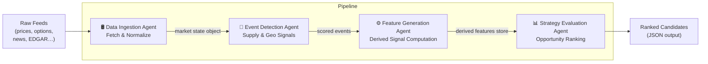
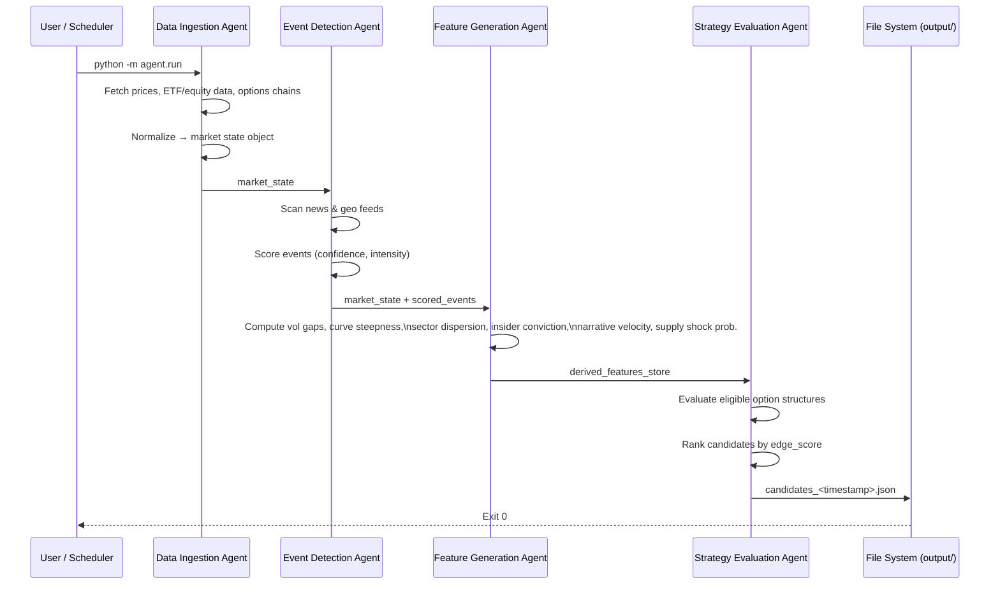

# Energy Options Opportunity Agent — User Guide

> **Version 1.0 · March 2026**
> This guide walks a developer through configuring, running, and interpreting results from the full Energy Options Opportunity Agent pipeline.

---

## Table of Contents

1. [Overview](#overview)
2. [Prerequisites](#prerequisites)
3. [Setup & Configuration](#setup--configuration)
4. [Running the Pipeline](#running-the-pipeline)
5. [Interpreting the Output](#interpreting-the-output)
6. [Troubleshooting](#troubleshooting)

---

## Overview

The **Energy Options Opportunity Agent** is an autonomous, modular Python pipeline that identifies options trading opportunities driven by oil market instability. It surfaces volatility mispricing in oil-related instruments, ranks candidate option structures by a computed **edge score**, and records a full signal provenance trail for every recommendation.

The pipeline is composed of four loosely coupled agents that execute in sequence, communicating through a shared **market state object** and a **derived features store**:


```mermaid
flowchart LR
    subgraph Pipeline
        direction LR
        A["🛢️ Data Ingestion Agent\nFetch & Normalize"]
        B["📡 Event Detection Agent\nSupply & Geo Signals"]
        C["⚙️ Feature Generation Agent\nDerived Signal Computation"]
        D["📊 Strategy Evaluation Agent\nOpportunity Ranking"]
    end

    RAW["Raw Feeds\n(prices, options,\nnews, EDGAR…)"]
    OUT["Ranked Candidates\n(JSON output)"]

    RAW --> A
    A -->|market state object| B
    B -->|scored events| C
    C -->|derived features store| D
    D --> OUT
```

### In-scope instruments

| Category | Instruments |
|---|---|
| Crude futures | Brent Crude, WTI (`CL=F`) |
| ETFs | USO, XLE |
| Energy equities | Exxon Mobil (XOM), Chevron (CVX) |

### In-scope option structures (MVP)

| Structure | Enum value |
|---|---|
| Long straddle | `long_straddle` |
| Call spread | `call_spread` |
| Put spread | `put_spread` |
| Calendar spread | `calendar_spread` |

> **Advisory only.** The system produces recommendations; it does not execute trades automatically.

---

## Prerequisites

### System requirements

| Requirement | Minimum |
|---|---|
| Python | 3.10+ |
| RAM | 2 GB |
| Disk | 10 GB (for 6–12 months of historical data) |
| OS | Linux, macOS, or Windows (WSL2 recommended) |
| Deployment target | Local machine, single VM, or container |

### Required accounts and API keys

All sources are free or low-cost. Obtain credentials before proceeding.

| Source | Used by | Sign-up URL | Cost |
|---|---|---|---|
| Alpha Vantage | Crude prices (WTI, Brent) | https://www.alphavantage.co | Free |
| Yahoo Finance / `yfinance` | ETF & equity prices, options chains | No key required | Free |
| Polygon.io | Options chains (supplemental) | https://polygon.io | Free tier |
| EIA API | Inventory & refinery utilization | https://www.eia.gov/opendata | Free |
| GDELT | News & geopolitical events | No key required | Free |
| NewsAPI | News headlines | https://newsapi.org | Free |
| SEC EDGAR | Insider trade filings | No key required | Free |
| Quiver Quant | Insider activity (supplemental) | https://www.quiverquant.com | Free/Limited |
| MarineTraffic | Tanker flow data | https://www.marinetraffic.com | Free tier |
| Reddit API | Narrative/sentiment velocity | https://www.reddit.com/prefs/apps | Free |
| Stocktwits | Sentiment velocity | https://api.stocktwits.com | Free |

### Python dependencies

```bash
pip install -r requirements.txt
```

A minimal `requirements.txt` will include packages such as:

```text
yfinance
requests
pandas
numpy
python-dotenv
```

Refer to the project's `requirements.txt` for the exact pinned versions.

---

## Setup & Configuration

### 1. Clone the repository

```bash
git clone https://github.com/your-org/energy-options-agent.git
cd energy-options-agent
```

### 2. Create and activate a virtual environment

```bash
python -m venv .venv
source .venv/bin/activate        # Linux / macOS
# .venv\Scripts\activate         # Windows (cmd)
# .venv\Scripts\Activate.ps1    # Windows (PowerShell)
```

### 3. Install dependencies

```bash
pip install --upgrade pip
pip install -r requirements.txt
```

### 4. Configure environment variables

Copy the sample environment file and populate it with your credentials:

```bash
cp .env.example .env
```

Then edit `.env`:

```dotenv
# ── Data Ingestion ────────────────────────────────────────────────────────────
ALPHA_VANTAGE_API_KEY=your_alpha_vantage_key
POLYGON_API_KEY=your_polygon_key

# ── Supply & Inventory ────────────────────────────────────────────────────────
EIA_API_KEY=your_eia_key

# ── News & Geopolitical Events ────────────────────────────────────────────────
NEWS_API_KEY=your_newsapi_key
# GDELT requires no key; leave blank or omit

# ── Insider Activity ──────────────────────────────────────────────────────────
QUIVER_QUANT_API_KEY=your_quiver_key
# SEC EDGAR requires no key

# ── Shipping / Logistics ──────────────────────────────────────────────────────
MARINE_TRAFFIC_API_KEY=your_marinetraffic_key

# ── Narrative / Sentiment ─────────────────────────────────────────────────────
REDDIT_CLIENT_ID=your_reddit_client_id
REDDIT_CLIENT_SECRET=your_reddit_client_secret
REDDIT_USER_AGENT=energy-options-agent/1.0

# ── Pipeline Behaviour ────────────────────────────────────────────────────────
MARKET_DATA_REFRESH_MINUTES=5
SLOW_FEED_REFRESH_HOURS=24
DATA_RETENTION_DAYS=365
OUTPUT_DIR=./output
LOG_LEVEL=INFO
```

### Full environment variable reference

| Variable | Required | Default | Description |
|---|---|---|---|
| `ALPHA_VANTAGE_API_KEY` | Yes | — | API key for crude price feeds (WTI, Brent spot/futures) |
| `POLYGON_API_KEY` | Optional | — | Supplemental options chain data (strike, expiry, IV, volume) |
| `EIA_API_KEY` | Yes (Phase 2+) | — | Weekly inventory and refinery utilization data |
| `NEWS_API_KEY` | Yes (Phase 2+) | — | Daily energy news headlines from NewsAPI |
| `QUIVER_QUANT_API_KEY` | Optional (Phase 3+) | — | Insider trade activity supplemental feed |
| `MARINE_TRAFFIC_API_KEY` | Optional (Phase 3+) | — | Tanker flow and shipping logistics data |
| `REDDIT_CLIENT_ID` | Optional (Phase 3+) | — | Reddit OAuth client ID for sentiment feeds |
| `REDDIT_CLIENT_SECRET` | Optional (Phase 3+) | — | Reddit OAuth client secret |
| `REDDIT_USER_AGENT` | Optional (Phase 3+) | `energy-options-agent/1.0` | User-agent string for Reddit API requests |
| `MARKET_DATA_REFRESH_MINUTES` | No | `5` | Polling cadence (minutes) for price and options feeds |
| `SLOW_FEED_REFRESH_HOURS` | No | `24` | Polling cadence (hours) for EIA, EDGAR, and similar feeds |
| `DATA_RETENTION_DAYS` | No | `365` | Days of raw and derived data to retain for backtesting |
| `OUTPUT_DIR` | No | `./output` | Directory where JSON candidate files are written |
| `LOG_LEVEL` | No | `INFO` | Python logging level (`DEBUG`, `INFO`, `WARNING`, `ERROR`) |

> **Tip:** Variables marked *Optional* are only needed for the corresponding MVP phase (noted in parentheses). You can run a Phase 1 pipeline with only `ALPHA_VANTAGE_API_KEY` and no other keys, relying on `yfinance` for ETF/equity and options data.

### 5. Validate configuration

```bash
python -m agent.validate_config
```

Expected output when all required keys for the active phase are present:

```
[OK] ALPHA_VANTAGE_API_KEY   set
[OK] EIA_API_KEY             set
[OK] NEWS_API_KEY            set
[--] QUIVER_QUANT_API_KEY    not set (Phase 3 — skipped)
[--] MARINE_TRAFFIC_API_KEY  not set (Phase 3 — skipped)
Configuration valid for Phase 2 pipeline.
```

---

## Running the Pipeline

### Pipeline execution sequence


```mermaid
sequenceDiagram
    participant CLI as User / Scheduler
    participant DI as Data Ingestion Agent
    participant ED as Event Detection Agent
    participant FG as Feature Generation Agent
    participant SE as Strategy Evaluation Agent
    participant FS as File System (output/)

    CLI->>DI: python -m agent.run
    DI->>DI: Fetch prices, ETF/equity data, options chains
    DI->>DI: Normalize → market state object
    DI->>ED: market_state
    ED->>ED: Scan news & geo feeds
    ED->>ED: Score events (confidence, intensity)
    ED->>FG: market_state + scored_events
    FG->>FG: Compute vol gaps, curve steepness,\nsector dispersion, insider conviction,\nnarrative velocity, supply shock prob.
    FG->>SE: derived_features_store
    SE->>SE: Evaluate eligible option structures
    SE->>SE: Rank candidates by edge_score
    SE->>FS: candidates_<timestamp>.json
    FS-->>CLI: Exit 0
```

### Single run (one-shot)

Execute the full pipeline once and write results to `OUTPUT_DIR`:

```bash
python -m agent.run
```

### Continuous mode (scheduled polling)

Run the pipeline on a loop, respecting the configured refresh cadences:

```bash
python -m agent.run --continuous
```

### Run a specific agent in isolation

Each agent can be invoked independently for debugging or incremental development:

```bash
# Data Ingestion only
python -m agent.ingestion

# Event Detection only (reads existing market state from disk)
python -m agent.event_detection

# Feature Generation only
python -m agent.feature_generation

# Strategy Evaluation only
python -m agent.strategy_evaluation
```

### Specify an output directory at runtime

```bash
python -m agent.run --output-dir /path/to/custom/output
```

### Enable debug logging

```bash
LOG_LEVEL=DEBUG python -m agent.run
```

### Run with a specific MVP phase profile

```bash
python -m agent.run --phase 1   # Core market signals only
python -m agent.run --phase 2   # + Supply & event augmentation
python -m agent.run --phase 3   # + Alternative / contextual signals
```

When a phase flag is supplied, the pipeline skips agents and data sources not yet available in that phase. Keys for later phases are not required.

---

## Interpreting the Output

### Output file location

Each pipeline run writes a timestamped JSON file to `OUTPUT_DIR`:

```
output/
└── candidates_2026-03-15T14:32:00Z.json
```

### Output schema

Each file contains a JSON array of **strategy candidate objects**. Every field is always present.

| Field | Type | Description |
|---|---|---|
| `instrument` | `string` | Target instrument (e.g. `"USO"`, `"XLE"`, `"CL=F"`) |
| `structure` | `enum` | Options structure: `long_straddle`, `call_spread`, `put_spread`, `calendar_spread` |
| `expiration` | `integer` (days) | Target expiration in calendar days from the evaluation date |
| `edge_score` | `float` [0.0–1.0] | Composite opportunity score; higher = stronger signal confluence |
| `signals` | `object` | Map of contributing signals and their observed states |
| `generated_at` | ISO 8601 UTC datetime | Timestamp of candidate generation |

### Example output

```json
[
  {
    "instrument": "USO",
    "structure": "long_straddle",
    "expiration": 30,
    "edge_score": 0.47,
    "signals": {
      "tanker_disruption_index": "high",
      "volatility_gap": "positive",
      "narrative_velocity": "rising"
    },
    "generated_at": "2026-03-15T14:32:00Z"
  },
  {
    "instrument": "XOM",
    "structure": "call_spread",
    "expiration": 21,
    "edge_score": 0.31,
    "signals": {
      "volatility_gap": "positive",
      "supply_shock_probability": "elevated",
      "insider_conviction_score": "moderate"
    },
    "generated_at": "2026-03-15T14:32:00Z"
  }
]
```

### Reading the edge score

| `edge_score` range | Interpretation | Suggested action |
|---|---|---|
| 0.70 – 1.00 | Strong signal confluence | High priority; review all contributing signals |
| 0.45 – 0.69 | Moderate confluence | Secondary review; check signal freshness |
| 0.20 – 0.44 | Weak confluence | Monitor only; insufficient edge for most strategies |
| 0.00 – 0.19 | Negligible signal | Discard or archive |

### Signal key reference

| Signal key | Source agent | Meaning |
|---|---|---|
| `volatility_gap` | Feature Generation | Realized vs. implied volatility differential. `positive` = IV underpriced relative to realized vol |
| `futures_curve_steepness` | Feature Generation | Contango/backwardation strength in crude futures curve |
| `sector_dispersion` | Feature Generation | Cross-sector price divergence among energy equities |
| `insider_conviction_score` | Feature Generation | Aggregated executive trade signal from EDGAR/Quiver Quant |
| `narrative_velocity` | Feature Generation | Rate of acceleration in energy-related news and social mentions |
| `supply_shock_probability` | Feature Generation | Modelled probability of near-term supply disruption |
| `tanker_disruption_index` | Event Detection | Severity of shipping lane or tanker flow disruption |
| `refinery_outage_score` | Event Detection | Detected refinery outage confidence × intensity |
| `geopolitical_event_score` | Event Detection | Confidence × intensity for detected geopolitical events |

### Downstream consumption

The JSON output is compatible with any JSON-capable dashboard or tool, including thinkorswim's scripting interface. To pretty-print the latest output file in the terminal:

```bash
cat $(ls -t output/candidates_*.json | head -1) | python -m json.tool
```

---

## Troubleshooting

### Common issues

#### Pipeline exits immediately with `Configuration valid for Phase X` but no output file

The pipeline ran but found no candidates meeting the minimum edge score threshold. This is expected during quiet market conditions.

```bash
# Lower the minimum edge score threshold to inspect all evaluated candidates
python -m agent.run --min-edge-score 0.0
```

---

#### `KeyError` or `MissingKeyError` on startup

A required environment variable is not set for the active phase.

```bash
# Re-run config validation to identify the missing key
python -m agent.validate_config
```

Then add the missing key to `.env` and re-run.

---

#### Data source returns empty or st