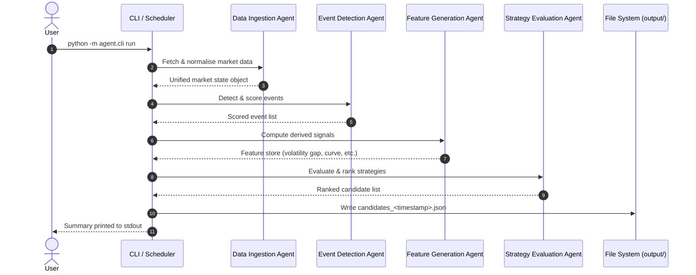

# Energy Options Opportunity Agent — User Guide

> **Version 1.0 · March 2026**
> This guide walks a developer through setting up, configuring, and running the full Energy Options Opportunity Agent pipeline end-to-end.

---

## Table of Contents

1. [Overview](#overview)
2. [Prerequisites](#prerequisites)
3. [Setup & Configuration](#setup--configuration)
4. [Running the Pipeline](#running-the-pipeline)
5. [Interpreting the Output](#interpreting-the-output)
6. [Troubleshooting](#troubleshooting)

---

## Overview

The Energy Options Opportunity Agent is an autonomous, modular Python pipeline that identifies options trading opportunities driven by oil market instability. It ingests market data, supply signals, news events, and alternative datasets, then produces structured, ranked candidate options strategies.

### What the pipeline does


```mermaid
flowchart LR
    subgraph Ingestion["① Data Ingestion Agent"]
        A1[Crude prices\nWTI · Brent]
        A2[ETF / Equity\nUSO · XLE · XOM · CVX]
        A3[Options chains\nIV · Strike · Volume]
    end

    subgraph Events["② Event Detection Agent"]
        B1[News & Geo feeds\nGDELT · NewsAPI]
        B2[Supply signals\nEIA · Shipping data]
        B3[Confidence &\nIntensity scores]
    end

    subgraph Features["③ Feature Generation Agent"]
        C1[Volatility gap\nRealised vs Implied]
        C2[Futures curve\nsteepness]
        C3[Sector dispersion\nInsider conviction]
        C4[Narrative velocity\nSupply shock prob.]
    end

    subgraph Strategy["④ Strategy Evaluation Agent"]
        D1[Eligible structures\nStraddle · Spreads]
        D2[Edge score\n0.0 – 1.0]
        D3[Ranked candidates\n+ signal references]
    end

    OUT["📄 JSON output\n(thinkorswim / dashboard)"]

    Ingestion -->|Unified market\nstate object| Events
    Events -->|Scored events| Features
    Features -->|Derived signals| Strategy
    Strategy --> OUT
```

### Key properties

| Property | Detail |
|---|---|
| **Instruments** | Brent Crude, WTI, USO, XLE, XOM, CVX |
| **Option structures (MVP)** | Long straddles, call/put spreads, calendar spreads |
| **Output format** | JSON-compatible; consumable by thinkorswim or any dashboard |
| **Execution** | Advisory only — no automated trade execution |
| **Deployment target** | Local machine or single VM / container |

---

## Prerequisites

### Runtime requirements

| Requirement | Minimum version | Notes |
|---|---|---|
| Python | 3.10+ | `python --version` to verify |
| pip | 23+ | Bundled with Python 3.10+ |
| Git | 2.x | For cloning the repository |
| Docker *(optional)* | 24+ | For containerised deployment |

### External API accounts

Register for free-tier accounts on each service before proceeding. All sources used in the MVP are free or low-cost.

| Service | Used for | Signup URL | API key env var |
|---|---|---|---|
| Alpha Vantage | WTI / Brent crude prices | <https://www.alphavantage.co/support/#api-key> | `ALPHA_VANTAGE_API_KEY` |
| Yahoo Finance (`yfinance`) | ETF / equity / options data | No key required | — |
| Polygon.io *(optional)* | Supplemental options chain data | <https://polygon.io/> | `POLYGON_API_KEY` |
| EIA API | Weekly inventory & refinery data | <https://www.eia.gov/opendata/> | `EIA_API_KEY` |
| NewsAPI | Energy news headlines | <https://newsapi.org/> | `NEWS_API_KEY` |
| GDELT | Geopolitical event detection | No key required | — |
| SEC EDGAR | Insider activity filings | No key required | — |
| Quiver Quant *(optional)* | Parsed insider trades | <https://www.quiverquant.com/> | `QUIVER_API_KEY` |
| MarineTraffic *(optional)* | Tanker / shipping flows | <https://www.marinetraffic.com/> | `MARINE_TRAFFIC_API_KEY` |
| Reddit API | Retail sentiment / narrative velocity | <https://www.reddit.com/prefs/apps> | `REDDIT_CLIENT_ID` / `REDDIT_CLIENT_SECRET` |

> **Note:** Optional sources become active only when the corresponding environment variable is set. The pipeline degrades gracefully when a key is absent — see [Troubleshooting](#troubleshooting).

---

## Setup & Configuration

### 1. Clone the repository

```bash
git clone https://github.com/your-org/energy-options-agent.git
cd energy-options-agent
```

### 2. Create and activate a virtual environment

```bash
python -m venv .venv
source .venv/bin/activate        # macOS / Linux
.venv\Scripts\activate.bat       # Windows CMD
```

### 3. Install dependencies

```bash
pip install --upgrade pip
pip install -r requirements.txt
```

### 4. Configure environment variables

Copy the provided template and fill in your credentials:

```bash
cp .env.example .env
```

Open `.env` in your editor. The full set of supported variables is described in the table below.

#### Environment variable reference

| Variable | Required | Default | Description |
|---|---|---|---|
| `ALPHA_VANTAGE_API_KEY` | **Yes** | — | Crude price feed (WTI, Brent spot/futures) |
| `EIA_API_KEY` | **Yes** | — | EIA weekly inventory and refinery utilisation |
| `NEWS_API_KEY` | **Yes** | — | NewsAPI headline feed for event detection |
| `POLYGON_API_KEY` | No | — | Supplemental options chain data via Polygon.io |
| `QUIVER_API_KEY` | No | — | Parsed insider conviction scores |
| `MARINE_TRAFFIC_API_KEY` | No | — | Tanker flow data for supply shock signals |
| `REDDIT_CLIENT_ID` | No | — | Reddit OAuth client ID for sentiment feeds |
| `REDDIT_CLIENT_SECRET` | No | — | Reddit OAuth client secret |
| `DATA_DIR` | No | `./data` | Root path for persisted raw and derived data |
| `OUTPUT_DIR` | No | `./output` | Directory where ranked JSON candidates are written |
| `LOG_LEVEL` | No | `INFO` | Logging verbosity: `DEBUG`, `INFO`, `WARNING`, `ERROR` |
| `MARKET_REFRESH_INTERVAL_SEC` | No | `60` | Cadence (seconds) for minutes-level market data refresh |
| `HISTORY_RETENTION_DAYS` | No | `180` | Days of historical data to retain (180–365 recommended) |
| `EDGE_SCORE_THRESHOLD` | No | `0.30` | Minimum edge score for a candidate to appear in output |

**Example `.env` file:**

```dotenv
# Required
ALPHA_VANTAGE_API_KEY=your_alpha_vantage_key
EIA_API_KEY=your_eia_key
NEWS_API_KEY=your_newsapi_key

# Optional — remove or leave blank to disable the corresponding signal
POLYGON_API_KEY=
QUIVER_API_KEY=
MARINE_TRAFFIC_API_KEY=
REDDIT_CLIENT_ID=
REDDIT_CLIENT_SECRET=

# Pipeline settings
DATA_DIR=./data
OUTPUT_DIR=./output
LOG_LEVEL=INFO
MARKET_REFRESH_INTERVAL_SEC=60
HISTORY_RETENTION_DAYS=180
EDGE_SCORE_THRESHOLD=0.30
```

### 5. Verify the installation

```bash
python -m agent.cli verify
```

Expected output:

```
[✓] Environment variables loaded
[✓] Alpha Vantage reachable
[✓] EIA API reachable
[✓] NewsAPI reachable
[!] MARINE_TRAFFIC_API_KEY not set — shipping signals disabled
[!] REDDIT_CLIENT_ID not set — narrative velocity signals disabled
[✓] Data directory: ./data
[✓] Output directory: ./output
Setup OK — 3 required sources active, 2 optional sources inactive.
```

---

## Running the Pipeline

### Pipeline execution flow


```mermaid
sequenceDiagram
    autonumber
    actor User
    participant CLI as CLI / Scheduler
    participant DIA as Data Ingestion Agent
    participant EDA as Event Detection Agent
    participant FGA as Feature Generation Agent
    participant SEA as Strategy Evaluation Agent
    participant FS as File System (output/)

    User->>CLI: python -m agent.cli run
    CLI->>DIA: Fetch & normalise market data
    DIA-->>CLI: Unified market state object
    CLI->>EDA: Detect & score events
    EDA-->>CLI: Scored event list
    CLI->>FGA: Compute derived signals
    FGA-->>CLI: Feature store (volatility gap, curve, etc.)
    CLI->>SEA: Evaluate & rank strategies
    SEA-->>CLI: Ranked candidate list
    CLI->>FS: Write candidates_<timestamp>.json
    CLI-->>User: Summary printed to stdout
```

### Running a single pipeline cycle

```bash
python -m agent.cli run
```

This executes all four agents sequentially — ingestion → event detection → feature generation → strategy evaluation — and writes the ranked output to `OUTPUT_DIR`.

### Continuous mode (scheduled refresh)

```bash
python -m agent.cli run --continuous
```

The pipeline re-runs automatically at the interval set by `MARKET_REFRESH_INTERVAL_SEC`. Press `Ctrl+C` to stop.

### Running individual agents

Each agent can be invoked independently for development and debugging:

```bash
# Data Ingestion Agent only
python -m agent.cli run --agent ingestion

# Event Detection Agent only (reads existing market state from DATA_DIR)
python -m agent.cli run --agent events

# Feature Generation Agent only
python -m agent.cli run --agent features

# Strategy Evaluation Agent only
python -m agent.cli run --agent strategy
```

### Filtering output by instrument or structure

```bash
# Show only USO candidates
python -m agent.cli run --instrument USO

# Show only long straddle candidates
python -m agent.cli run --structure long_straddle

# Combine filters
python -m agent.cli run --instrument XLE --structure call_spread
```

### Docker deployment

```bash
# Build the image
docker build -t energy-options-agent:latest .

# Run a single cycle, passing the .env file
docker run --rm --env-file .env \
  -v $(pwd)/data:/app/data \
  -v $(pwd)/output:/app/output \
  energy-options-agent:latest

# Continuous mode in a detached container
docker run -d --name eoa --env-file .env \
  -v $(pwd)/data:/app/data \
  -v $(pwd)/output:/app/output \
  energy-options-agent:latest python -m agent.cli run --continuous
```

---

## Interpreting the Output

### Output file location and naming

Each pipeline run writes a timestamped JSON file to `OUTPUT_DIR`:

```
output/
└── candidates_2026-03-15T14:32:00Z.json
```

### Output schema

Each element in the `candidates` array conforms to the following schema:

| Field | Type | Description |
|---|---|---|
| `instrument` | `string` | Target instrument: `USO`, `XLE`, `CL=F`, `XOM`, `CVX`, etc. |
| `structure` | `enum` | `long_straddle` \| `call_spread` \| `put_spread` \| `calendar_spread` |
| `expiration` | `integer` | Calendar days from evaluation date to target expiration |
| `edge_score` | `float [0.0–1.0]` | Composite opportunity score; higher = stronger signal confluence |
| `signals` | `object` | Map of contributing signals and their qualitative levels |
| `generated_at` | `ISO 8601 datetime` | UTC timestamp of candidate generation |

### Annotated example output

```json
{
  "generated_at": "2026-03-15T14:32:00Z",
  "candidates": [
    {
      "instrument": "USO",
      "structure": "long_straddle",
      "expiration": 30,
      "edge_score": 0.47,
      "signals": {
        "tanker_disruption_index": "high",
        "volatility_gap": "positive",
        "narrative_velocity": "rising"
      },
      "generated_at": "2026-03-15T14:32:00Z"
    },
    {
      "instrument": "XLE",
      "structure": "call_spread",
      "expiration": 45,
      "edge_score": 0.38,
      "signals": {
        "volatility_gap": "positive",
        "supply_shock_probability": "elevated",
        "sector_dispersion": "widening"
      },
      "generated_at": "2026-03-15T14:32:00Z"
    }
  ]
}
```

### Understanding the edge score

The edge score is a composite float between `0.0` and `1.0` that reflects the confluence of active signals for a given candidate.

| Edge score range | Interpretation |
|---|---|
| `0.70 – 1.00` | Strong signal confluence; high-priority candidate |
| `0.50 – 0.69` | Moderate confluence; worth monitoring |
| `0.30 – 0.49` | Weak but present signal; low conviction |
| `< 0.30` | Below threshold; filtered from output by default |

> Adjust `EDGE_SCORE_THRESHOLD` in `.env` to raise or lower the minimum score written to output.

### Understanding the signals map

| Signal key | What it measures |
|---|---|
| `volatility_gap` | Divergence between realised and implied volatility |
| `futures_curve_steepness` | Slope of the WTI/Brent futures curve (contango / backwardation) |
| `sector_dispersion` | Spread of returns across energy equities |
| `insider_conviction_score` | Aggregated directional signal from executive trade filings |
| `narrative_velocity` | Rate of acceleration in energy-related news and social sentiment |
| `supply_shock_probability` | Estimated likelihood of a near-term supply disruption |
| `tanker_disruption_index` | Severity of shipping chokepoint or tanker flow anomalies |

Qualitative levels used in the signals map: `low` · `moderate` · `elevated` · `high` for intensity signals; `positive` / `negative` / `neutral` for directional signals; `rising` / `falling` / `stable` for velocity signals.

### Consuming output in thinkorswim

The JSON output is compatible with thinkorswim's scripting interface. Import `candidates_<timestamp>.json` into your watchlist or thinkScript study, using `instrument` as the symbol and `edge_score` as a custom ranking column.

---

## Troubleshooting

### Common errors and fixes

| Symptom | Likely cause | Resolution |
|---|---|---|
| `KeyError: ALPHA_VANTAGE_API_KEY` | `.env` not loaded or variable missing | Confirm `.env` exists in project root and `ALPHA_VANTAGE_API_KEY` is set |
| `ConnectionError` on startup | Network issue or API endpoint unreachable | Run `python -m agent.cli verify` to isolate the failing source; retry or check API status page |
| Empty `candidates` array in output | All candidates scored below threshold | Lower `EDGE_SCORE_THRESHOLD` or check that ingestion returned valid data |
| `WARNING: options chain unavailable` | Yahoo Finance rate-limited or market closed | Pipeline continues without options data; set `POLYGON_API_KEY` for fallback |
| `WARNING: shipping signals disabled` | `MARINE_TRAFFIC_API_KEY` not set | Expected behaviour; tanker signals are optional. Set the