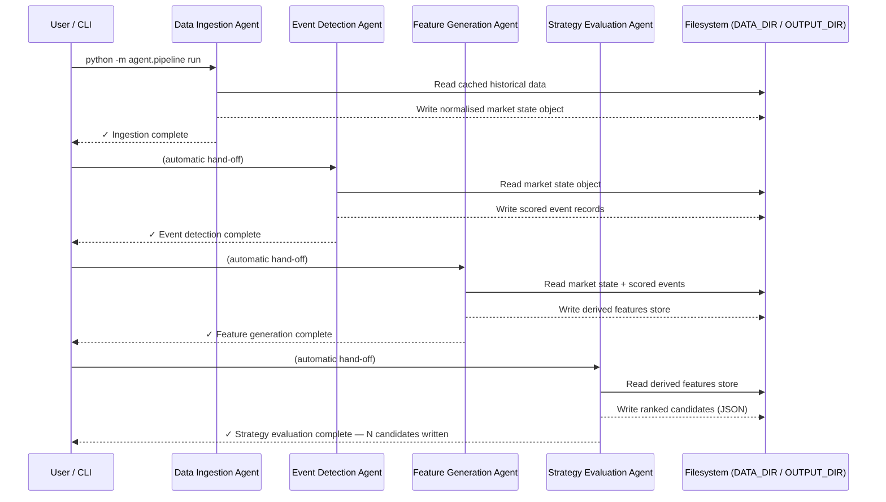

# Energy Options Opportunity Agent — User Guide

> **Version 1.0 · March 2026**
> This guide walks a developer through setting up, configuring, and running the full four-agent pipeline from a clean checkout to ranked options candidates in JSON output.

---

## Table of Contents

1. [Overview](#overview)
2. [Prerequisites](#prerequisites)
3. [Setup & Configuration](#setup--configuration)
4. [Running the Pipeline](#running-the-pipeline)
5. [Interpreting the Output](#interpreting-the-output)
6. [Troubleshooting](#troubleshooting)

---

## Overview

The **Energy Options Opportunity Agent** is a modular Python pipeline that detects volatility mispricing in oil-related instruments and surfaces ranked options trading opportunities. It is designed to run on local hardware or a single low-cost cloud VM/container with no automated trade execution — all output is advisory.

### How the pipeline works

Data flows unidirectionally through four loosely coupled agents. Each agent writes to a shared **market state object** and a **derived features store** that the next agent reads.


```mermaid
flowchart LR
    subgraph Inputs
        A1[(Crude Prices\nAlpha Vantage / MetalpriceAPI)]
        A2[(ETF & Equity\nyfinance / Yahoo Finance)]
        A3[(Options Chains\nYahoo Finance / Polygon.io)]
        A4[(EIA Supply\nEIA API)]
        A5[(News & Geo\nGDELT / NewsAPI)]
        A6[(Insider Activity\nEDGAR / Quiver Quant)]
        A7[(Shipping\nMarineTraffic / VesselFinder)]
        A8[(Sentiment\nReddit / Stocktwits)]
    end

    subgraph Pipeline
        direction LR
        DI["① Data Ingestion Agent\nFetch & Normalize"]
        ED["② Event Detection Agent\nSupply & Geo Signals"]
        FG["③ Feature Generation Agent\nDerived Signal Computation"]
        SE["④ Strategy Evaluation Agent\nOpportunity Ranking"]
    end

    subgraph Output
        OUT["Ranked Candidates\n(JSON)"]
    end

    Inputs --> DI
    DI -->|market state object| ED
    ED -->|scored events| FG
    FG -->|derived features store| SE
    SE --> OUT
```

### In-scope instruments and strategies (MVP)

| Category | Instruments |
|---|---|
| Crude futures | Brent Crude, WTI (`CL=F`) |
| ETFs | USO, XLE |
| Energy equities | Exxon Mobil (XOM), Chevron (CVX) |

| Option Structure | Enum value |
|---|---|
| Long straddle | `long_straddle` |
| Call spread | `call_spread` |
| Put spread | `put_spread` |
| Calendar spread | `calendar_spread` |

---

## Prerequisites

### System requirements

| Requirement | Minimum |
|---|---|
| OS | Linux, macOS, or Windows (WSL2 recommended) |
| Python | 3.10 or later |
| RAM | 2 GB (4 GB recommended for 12-month history) |
| Disk | 10 GB free (for 6–12 months of historical raw and derived data) |
| Network | Outbound HTTPS to data-source APIs |

### Software dependencies

```bash
# Confirm Python version
python --version   # must be 3.10+

# pip and venv are sufficient; no additional package manager required
pip --version
```

### API accounts

Register for free-tier accounts at each provider before continuing. All sources used in the MVP are free or have a usable free tier.

| Data Layer | Provider | Registration URL | Notes |
|---|---|---|---|
| Crude prices | Alpha Vantage | <https://www.alphavantage.co/support/#api-key> | Free key, rate-limited |
| Crude prices (alt) | MetalpriceAPI | <https://metalpriceapi.com> | Free tier available |
| ETF / Equity prices | Yahoo Finance (`yfinance`) | No key required | Public endpoint |
| Options chains | Polygon.io | <https://polygon.io> | Free tier; daily options data |
| Supply & inventory | EIA API | <https://www.eia.gov/opendata/> | Free, registration required |
| News & geopolitical | GDELT | No key required | Public dataset |
| News & geopolitical (alt) | NewsAPI | <https://newsapi.org> | Free developer key |
| Insider activity | SEC EDGAR | No key required | Public EDGAR feed |
| Insider activity (alt) | Quiver Quant | <https://www.quiverquant.com> | Free/limited tier |
| Shipping / logistics | MarineTraffic | <https://www.marinetraffic.com> | Free tier |
| Narrative / sentiment | Reddit (PRAW) | <https://www.reddit.com/prefs/apps> | Free OAuth app |
| Narrative / sentiment (alt) | Stocktwits | <https://api.stocktwits.com> | No key for public stream |

> **Tip:** For Phase 1 only (core market signals), you need **Alpha Vantage** (or MetalpriceAPI), **yfinance** (no key), **Polygon.io**, and the **EIA API**. The remaining keys are required for Phases 2 and 3.

---

## Setup & Configuration

### 1 — Clone the repository

```bash
git clone https://github.com/your-org/energy-options-agent.git
cd energy-options-agent
```

### 2 — Create and activate a virtual environment

```bash
python -m venv .venv

# Linux / macOS
source .venv/bin/activate

# Windows (PowerShell)
.venv\Scripts\Activate.ps1
```

### 3 — Install dependencies

```bash
pip install --upgrade pip
pip install -r requirements.txt
```

### 4 — Configure environment variables

The pipeline reads all secrets and tuning parameters from environment variables. Copy the provided template and populate each value:

```bash
cp .env.example .env
# Open .env in your editor and fill in the values described below
```

#### Complete environment variable reference

| Variable | Required | Default | Description |
|---|---|---|---|
| `ALPHA_VANTAGE_API_KEY` | Phase 1+ | — | API key for crude spot/futures prices (WTI, Brent) |
| `METALPRICE_API_KEY` | Optional | — | Fallback crude price source; used if Alpha Vantage is unavailable |
| `POLYGON_API_KEY` | Phase 1+ | — | Options chain data (strike, expiry, IV, volume) |
| `EIA_API_KEY` | Phase 2+ | — | Weekly inventory and refinery utilization data |
| `NEWSAPI_KEY` | Phase 2+ | — | Energy disruption and geopolitical news headlines |
| `QUIVER_QUANT_API_KEY` | Phase 3+ | — | Insider trade activity feed |
| `REDDIT_CLIENT_ID` | Phase 3+ | — | Reddit OAuth app client ID (PRAW) |
| `REDDIT_CLIENT_SECRET` | Phase 3+ | — | Reddit OAuth app client secret |
| `REDDIT_USER_AGENT` | Phase 3+ | `energy-agent/1.0` | Reddit API user-agent string |
| `MARINETRAFFIC_API_KEY` | Phase 3+ | — | Tanker flow and shipping disruption data |
| `DATA_DIR` | Yes | `./data` | Root directory for raw and derived data storage |
| `OUTPUT_DIR` | Yes | `./output` | Directory where ranked JSON candidates are written |
| `HISTORY_MONTHS` | Yes | `12` | Months of historical data to retain (6–12 recommended) |
| `MARKET_DATA_INTERVAL_MINUTES` | Yes | `5` | Polling cadence for market price feeds (minutes-level) |
| `LOG_LEVEL` | No | `INFO` | Logging verbosity: `DEBUG`, `INFO`, `WARNING`, `ERROR` |
| `PIPELINE_PHASE` | Yes | `1` | Active MVP phase (1–3); controls which agents and data sources are enabled |

**Example `.env` (Phase 1 minimum):**

```dotenv
ALPHA_VANTAGE_API_KEY=your_alpha_vantage_key_here
POLYGON_API_KEY=your_polygon_key_here
EIA_API_KEY=your_eia_key_here

DATA_DIR=./data
OUTPUT_DIR=./output
HISTORY_MONTHS=12
MARKET_DATA_INTERVAL_MINUTES=5
LOG_LEVEL=INFO
PIPELINE_PHASE=1
```

### 5 — Initialise the data directory

```bash
python scripts/init_storage.py
```

This creates the expected subdirectory structure under `DATA_DIR`:

```
data/
├── raw/
│   ├── prices/
│   ├── options/
│   ├── events/
│   └── alternative/
└── derived/
    ├── features/
    └── scores/
```

---

## Running the Pipeline

### Pipeline execution modes

The pipeline supports two modes:

| Mode | Command flag | Use case |
|---|---|---|
| **Single run** | *(default)* | Run all agents once; write output and exit |
| **Continuous** | `--continuous` | Poll on the configured cadence; suitable for scheduled or always-on deployment |

### Run a single pipeline pass

```bash
python -m agent.pipeline run
```

The agents execute in sequence:

```
[1/4] Data Ingestion Agent    → fetches & normalises market data
[2/4] Event Detection Agent   → scores supply & geopolitical signals
[3/4] Feature Generation Agent → computes derived signals
[4/4] Strategy Evaluation Agent → ranks candidates, writes output
```

### Run in continuous mode

```bash
python -m agent.pipeline run --continuous
```

In continuous mode, market-price feeds are refreshed at `MARKET_DATA_INTERVAL_MINUTES`; slower feeds (EIA, EDGAR) refresh on their own daily/weekly schedules automatically.

Press `Ctrl+C` to stop gracefully.

### Run individual agents in isolation

Each agent is independently deployable. You can invoke them separately for development or debugging:

```bash
# Agent 1 — Data Ingestion
python -m agent.ingestion

# Agent 2 — Event Detection
python -m agent.events

# Agent 3 — Feature Generation
python -m agent.features

# Agent 4 — Strategy Evaluation
python -m agent.strategy
```

> **Note:** Agents 2–4 read from the shared state produced by their predecessors. Running them in isolation requires that the preceding stage's output already exists in `DATA_DIR`.

### Limit to specific instruments

```bash
python -m agent.pipeline run --instruments USO XLE CL=F
```

### Limit to specific option structures

```bash
python -m agent.pipeline run --structures long_straddle call_spread
```

### Override the active phase at runtime

```bash
python -m agent.pipeline run --phase 2
```

This takes precedence over the `PIPELINE_PHASE` environment variable.

### Sequence diagram — full pipeline run


```mermaid
sequenceDiagram
    participant CLI as User / CLI
    participant DI as Data Ingestion Agent
    participant ED as Event Detection Agent
    participant FG as Feature Generation Agent
    participant SE as Strategy Evaluation Agent
    participant FS as Filesystem (DATA_DIR / OUTPUT_DIR)

    CLI->>DI: python -m agent.pipeline run
    DI->>FS: Read cached historical data
    DI-->>FS: Write normalised market state object
    DI-->>CLI: ✓ Ingestion complete

    CLI->>ED: (automatic hand-off)
    ED->>FS: Read market state object
    ED-->>FS: Write scored event records
    ED-->>CLI: ✓ Event detection complete

    CLI->>FG: (automatic hand-off)
    FG->>FS: Read market state + scored events
    FG-->>FS: Write derived features store
    FG-->>CLI: ✓ Feature generation complete

    CLI->>SE: (automatic hand-off)
    SE->>FS: Read derived features store
    SE-->>FS: Write ranked candidates (JSON)
    SE-->>CLI: ✓ Strategy evaluation complete — N candidates written
```

---

## Interpreting the Output

### Output location

Ranked candidates are written to `OUTPUT_DIR` as a JSON file named with the UTC run timestamp:

```
output/
└── candidates_2026-03-15T14_32_00Z.json
```

### Output schema

Each candidate object contains the following fields:

| Field | Type | Description |
|---|---|---|
| `instrument` | string | Target instrument (`USO`, `XLE`, `CL=F`, `XOM`, `CVX`, etc.) |
| `structure` | enum string | `long_straddle` \| `call_spread` \| `put_spread` \| `calendar_spread` |
| `expiration` | integer (days) | Calendar days from the evaluation date to target expiry |
| `edge_score` | float [0.0–1.0] | Composite opportunity score; higher = stronger signal confluence |
| `signals` | object | Map of contributing signals and their qualitative values |
| `generated_at` | ISO 8601 datetime | UTC timestamp of candidate generation |

### Example candidate output

```json
{
  "instrument": "USO",
  "structure": "long_straddle",
  "expiration": 30,
  "edge_score": 0.47,
  "signals": {
    "tanker_disruption_index": "high",
    "volatility_gap": "positive",
    "narrative_velocity": "rising"
  },
  "generated_at": "2026-03-15T14:32:00Z"
}
```

A full run produces an array of such objects, sorted by `edge_score` descending:

```json
[
  { "instrument": "USO",  "structure": "long_straddle", "expiration": 30, "edge_score": 0.81, ... },
  { "instrument": "XLE",  "structure": "call_spread",   "expiration": 45, "edge_score": 0.63, ... },
  { "instrument": "CL=F", "structure": "put_spread",    "expiration": 21, "edge_score": 0.47, ... }
]
```

### Understanding the edge score

The `edge_score` is a composite float in `[0.0, 1.0]` reflecting the confluence of active signals. It is not a probability of profit — it represents relative signal strength across candidates in the current run.

| Score range | Interpretation |
|---|---|
| 0.75 – 1.00 | Strong signal confluence; multiple independent signals aligned |
| 0.50 – 0.74 | Moderate confluence; worth reviewing contributing signals |
| 0.25 – 0.49 | Weak confluence; use as a watchlist, not a primary candidate |
| 0.00 – 0.24 | Minimal signal; likely noise or data gap |

### Understanding the signals map

Each key in the `signals` object corresponds to a derived feature computed by the Feature Generation Agent:

| Signal key | Source layer | What it measures |
|---|---|---|
| `volatility_gap` | Options chains + price history | Spread between realised and implied volatility |
| `futures_curve_steepness` | Crude futures prices | Contango or backwardation slope |
| `sector_dispersion` | ETF/equity prices | Cross-instrument price divergence |
| `insider_conviction_score` | SEC EDGAR / Quiver Quant | Intensity and recency of executive trades |
| `narrative_velocity` | Reddit / Stocktwits / NewsAPI | Acceleration of energy-related headline frequency |
| `supply_shock_probability` | EIA + event detection | Estimated probability of a near-term supply disruption |
| `tanker_disruption_index` | MarineTraffic / VesselFinder | Aggregated tanker chokepoint and route anomaly score |

Qualitative values (`"high"`, `"positive"`, `"rising"`, etc.) are assigned by the Strategy Evaluation Agent based on thresholds defined in `config/scoring.yaml`.

### Consuming output downstream

The JSON output is compatible with any JSON-