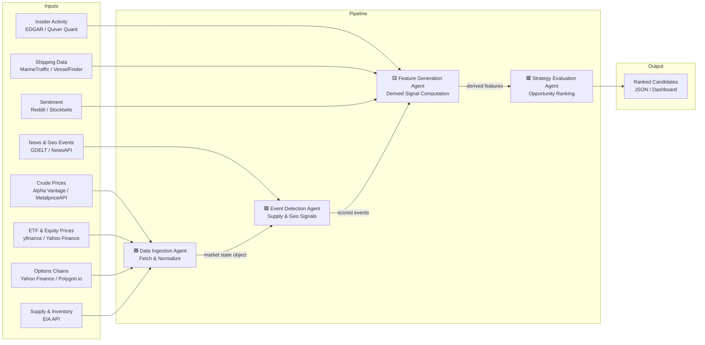
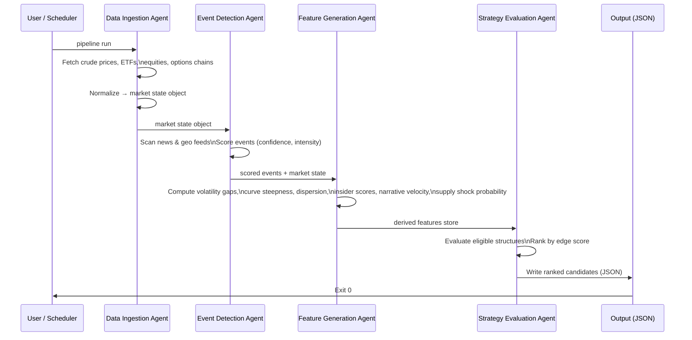

# Energy Options Opportunity Agent — User Guide

> **Version 1.0 • March 2026**
> This guide walks a developer through setting up, configuring, and running the full Energy Options Opportunity Agent pipeline from a local or cloud environment.

---

## Table of Contents

1. [Overview](#overview)
2. [Prerequisites](#prerequisites)
3. [Setup & Configuration](#setup--configuration)
4. [Running the Pipeline](#running-the-pipeline)
5. [Interpreting the Output](#interpreting-the-output)
6. [Troubleshooting](#troubleshooting)

---

## Overview

The Energy Options Opportunity Agent is a modular, four-agent Python pipeline that identifies options trading opportunities driven by oil market instability. It ingests market data, supply signals, news events, and alternative datasets, then surfaces volatility mispricing across oil-related instruments ranked by a computed **edge score**.

### Pipeline Architecture

Data flows unidirectionally through four loosely coupled agents that communicate via a shared market state object and a derived features store.


```mermaid
flowchart LR
    subgraph Inputs
        A1[Crude Prices\nAlpha Vantage / MetalpriceAPI]
        A2[ETF & Equity Prices\nyfinance / Yahoo Finance]
        A3[Options Chains\nYahoo Finance / Polygon.io]
        A4[Supply & Inventory\nEIA API]
        A5[News & Geo Events\nGDELT / NewsAPI]
        A6[Insider Activity\nEDGAR / Quiver Quant]
        A7[Shipping Data\nMarineTraffic / VesselFinder]
        A8[Sentiment\nReddit / Stocktwits]
    end

    subgraph Pipeline
        B1["🟦 Data Ingestion Agent\nFetch & Normalize"]
        B2["🟩 Event Detection Agent\nSupply & Geo Signals"]
        B3["🟨 Feature Generation Agent\nDerived Signal Computation"]
        B4["🟥 Strategy Evaluation Agent\nOpportunity Ranking"]
    end

    subgraph Output
        C1[Ranked Candidates\nJSON / Dashboard]
    end

    A1 & A2 & A3 & A4 --> B1
    A5 --> B2
    A6 & A7 & A8 --> B3
    B1 -->|market state object| B2
    B2 -->|scored events| B3
    B3 -->|derived features| B4
    B4 --> C1
```

### In-Scope Instruments & Structures

| Category | Items |
|---|---|
| **Crude Futures** | Brent Crude, WTI (`CL=F`) |
| **ETFs** | USO, XLE |
| **Energy Equities** | Exxon Mobil (XOM), Chevron (CVX) |
| **Option Structures (MVP)** | Long straddles, call/put spreads, calendar spreads |

> **Advisory only.** The pipeline produces ranked recommendations; it does not execute trades automatically.

---

## Prerequisites

### System Requirements

| Requirement | Minimum |
|---|---|
| **OS** | Linux, macOS, or Windows (WSL2 recommended) |
| **Python** | 3.10 or later |
| **RAM** | 2 GB |
| **Disk** | 10 GB free (for 6–12 months of historical data) |
| **Network** | Outbound HTTPS to external APIs |

### Software Dependencies

Ensure the following are installed before proceeding:

```bash
# Verify Python version
python --version   # must be 3.10+

# Verify pip
pip --version

# Verify git
git --version
```

### API Accounts

Obtain free credentials for the following services before configuration. All sources are free or low-cost.

| Service | Used By | Sign-up URL | Notes |
|---|---|---|---|
| Alpha Vantage | Data Ingestion | https://www.alphavantage.co | Free tier; WTI/Brent spot & futures |
| Polygon.io | Data Ingestion | https://polygon.io | Free/limited; options chains |
| EIA API | Data Ingestion | https://www.eia.gov/opendata | Free; weekly inventory data |
| NewsAPI | Event Detection | https://newsapi.org | Free tier; energy news |
| GDELT | Event Detection | No key required | Continuous geopolitical feed |
| SEC EDGAR | Feature Generation | No key required | Insider activity |
| Quiver Quant | Feature Generation | https://www.quiverquant.com | Free/limited; insider scores |
| MarineTraffic | Feature Generation | https://www.marinetraffic.com | Free tier; tanker flows |
| Reddit API (PRAW) | Feature Generation | https://www.reddit.com/prefs/apps | Free; sentiment velocity |
| Stocktwits | Feature Generation | https://api.stocktwits.com | Free; retail sentiment |

---

## Setup & Configuration

### 1. Clone the Repository

```bash
git clone https://github.com/your-org/energy-options-agent.git
cd energy-options-agent
```

### 2. Create and Activate a Virtual Environment

```bash
python -m venv .venv

# macOS / Linux
source .venv/bin/activate

# Windows (PowerShell)
.venv\Scripts\Activate.ps1
```

### 3. Install Dependencies

```bash
pip install --upgrade pip
pip install -r requirements.txt
```

### 4. Create the Environment File

Copy the provided template and populate it with your credentials:

```bash
cp .env.example .env
```

Open `.env` in your editor and fill in each value. All supported environment variables are documented in the table below.

### Environment Variables Reference

| Variable | Agent | Required | Default | Description |
|---|---|---|---|---|
| `ALPHA_VANTAGE_API_KEY` | Data Ingestion | Yes | — | API key for Alpha Vantage crude price feed |
| `METALPRICE_API_KEY` | Data Ingestion | No | — | Fallback key for MetalpriceAPI crude prices |
| `POLYGON_API_KEY` | Data Ingestion | No | — | API key for Polygon.io options chains |
| `EIA_API_KEY` | Data Ingestion | Yes | — | API key for EIA supply/inventory data |
| `NEWS_API_KEY` | Event Detection | Yes | — | API key for NewsAPI energy headlines |
| `QUIVER_API_KEY` | Feature Generation | No | — | API key for Quiver Quant insider data |
| `MARINE_TRAFFIC_API_KEY` | Feature Generation | No | — | API key for MarineTraffic tanker flows |
| `REDDIT_CLIENT_ID` | Feature Generation | No | — | Reddit app client ID (PRAW) |
| `REDDIT_CLIENT_SECRET` | Feature Generation | No | — | Reddit app client secret (PRAW) |
| `REDDIT_USER_AGENT` | Feature Generation | No | `energy-agent/1.0` | Reddit API user agent string |
| `DATA_REFRESH_INTERVAL_MINUTES` | Data Ingestion | No | `5` | Market data polling cadence in minutes |
| `SLOW_FEED_REFRESH_HOURS` | Data Ingestion | No | `24` | Cadence for EIA/EDGAR daily feeds (hours) |
| `HISTORICAL_RETENTION_DAYS` | All | No | `180` | Days of raw and derived data to retain |
| `OUTPUT_DIR` | Strategy Evaluation | No | `./output` | Directory for JSON candidate output files |
| `LOG_LEVEL` | All | No | `INFO` | Logging verbosity: `DEBUG`, `INFO`, `WARNING`, `ERROR` |
| `MIN_EDGE_SCORE` | Strategy Evaluation | No | `0.0` | Minimum edge score threshold to emit a candidate |

> **Tip:** Variables marked **Required** will cause the pipeline to raise a `ConfigurationError` at startup if absent.

### 5. Initialize the Data Store

The pipeline persists historical raw and derived data for volatility calculations and backtesting. Run the initialization script once before the first pipeline run:

```bash
python scripts/init_db.py
```

Expected output:

```
[INFO] Creating data store at ./data/market_state.db
[INFO] Schema initialized successfully.
[INFO] Ready.
```

---

## Running the Pipeline

### Pipeline Execution Flow


```mermaid
sequenceDiagram
    participant CLI as User / Scheduler
    participant DIA as Data Ingestion Agent
    participant EDA as Event Detection Agent
    participant FGA as Feature Generation Agent
    participant SEA as Strategy Evaluation Agent
    participant OUT as Output (JSON)

    CLI->>DIA: pipeline run
    DIA->>DIA: Fetch crude prices, ETFs,\nequities, options chains
    DIA->>DIA: Normalize → market state object
    DIA->>EDA: market state object
    EDA->>EDA: Scan news & geo feeds\nScore events (confidence, intensity)
    EDA->>FGA: scored events + market state
    FGA->>FGA: Compute volatility gaps,\ncurve steepness, dispersion,\ninsider scores, narrative velocity,\nsupply shock probability
    FGA->>SEA: derived features store
    SEA->>SEA: Evaluate eligible structures\nRank by edge score
    SEA->>OUT: Write ranked candidates (JSON)
    OUT->>CLI: Exit 0
```

### Running a Single Pipeline Cycle

Execute one complete end-to-end pass across all four agents:

```bash
python -m agent.pipeline run
```

### Running in Continuous Mode

In continuous mode the pipeline polls on the cadence defined by `DATA_REFRESH_INTERVAL_MINUTES`:

```bash
python -m agent.pipeline run --continuous
```

Press `Ctrl+C` to stop gracefully. The pipeline will finish the current cycle before exiting.

### Running Individual Agents

Each agent is independently deployable and can be invoked in isolation for testing or incremental integration:

```bash
# Data Ingestion only
python -m agent.ingestion run

# Event Detection only (requires a populated market state)
python -m agent.events run

# Feature Generation only
python -m agent.features run

# Strategy Evaluation only
python -m agent.strategy run
```

### Applying a Minimum Edge Score Filter

To emit only high-confidence candidates at runtime without changing `.env`:

```bash
python -m agent.pipeline run --min-edge-score 0.35
```

### Targeting a Specific Instrument

```bash
python -m agent.pipeline run --instrument USO
```

### Scheduling with cron

For market-hours polling on a Linux/macOS host, add an entry to your crontab:

```bash
crontab -e
```

```cron
# Run the pipeline every 5 minutes on weekdays between 09:00 and 17:00 UTC
*/5 9-17 * * 1-5 cd /path/to/energy-options-agent && .venv/bin/python -m agent.pipeline run >> logs/pipeline.log 2>&1
```

---

## Interpreting the Output

### Output Location

On each run the pipeline writes a dated JSON file to `OUTPUT_DIR` (default `./output`):

```
output/
└── candidates_2026-03-15T14:32:00Z.json
```

### Output Schema

Each file contains a JSON array of strategy candidates. Every candidate conforms to the following schema:

| Field | Type | Description |
|---|---|---|
| `instrument` | string | Target instrument, e.g. `USO`, `XLE`, `CL=F` |
| `structure` | enum | `long_straddle` \| `call_spread` \| `put_spread` \| `calendar_spread` |
| `expiration` | integer (days) | Calendar days from evaluation date to target expiration |
| `edge_score` | float [0.0–1.0] | Composite opportunity score; **higher = stronger signal confluence** |
| `signals` | object | Map of contributing signals and their qualitative values |
| `generated_at` | ISO 8601 datetime | UTC timestamp of candidate generation |

### Example Output File

```json
[
  {
    "instrument": "USO",
    "structure": "long_straddle",
    "expiration": 30,
    "edge_score": 0.47,
    "signals": {
      "tanker_disruption_index": "high",
      "volatility_gap": "positive",
      "narrative_velocity": "rising"
    },
    "generated_at": "2026-03-15T14:32:00Z"
  },
  {
    "instrument": "XOM",
    "structure": "call_spread",
    "expiration": 21,
    "edge_score": 0.31,
    "signals": {
      "volatility_gap": "positive",
      "insider_conviction_score": "elevated",
      "supply_shock_probability": "moderate"
    },
    "generated_at": "2026-03-15T14:32:00Z"
  }
]
```

### Reading the Edge Score

| Edge Score Range | Interpretation | Suggested Action |
|---|---|---|
| `0.60 – 1.00` | Strong signal confluence | Review promptly; multiple independent signals align |
| `0.40 – 0.59` | Moderate confluence | Worth monitoring; validate with manual review |
| `0.20 – 0.39` | Weak signal | Low priority; signals present but not compelling |
| `0.00 – 0.19` | Minimal signal | Filtered out by default if `MIN_EDGE_SCORE` is set |

### Reading the Signals Map

The `signals` object provides full explainability of each candidate. Common signal keys and their meanings:

| Signal Key | What It Measures |
|---|---|
| `volatility_gap` | Realized vs. implied volatility divergence |
| `futures_curve_steepness` | Contango / backwardation of the crude futures curve |
| `sector_dispersion` | Spread between energy equity returns |
| `insider_conviction_score` | Aggregated executive trade activity (EDGAR/Quiver) |
| `narrative_velocity` | Acceleration of energy-related headline volume |
| `supply_shock_probability` | Model probability of a near-term supply disruption |
| `tanker_disruption_index` | Shipping anomaly score from AIS/tanker flow data |

Qualitative values (`"high"`, `"positive"`, `"rising"`, `"elevated"`, `"moderate"`) are assigned by each agent's scoring functions. The presence and combination of signals in the map is the primary input for manual review and trade decision-making.

### Visualizing Output

The JSON output is compatible with any JSON-capable dashboard. To load it in **thinkorswim**, export the file and import it via the platform's custom watchlist or scan import feature. Alternatively, preview candidates directly in the terminal:

```bash
# Pretty-print the latest output file
python -m agent.pipeline show-latest

# Or use jq if installed
jq 'sort_by(-.edge_score)' output/candidates_2026-03-15T14:32:00Z.json
```

---

## Troubleshooting

### Common Errors and Resolutions

| Symptom | Likely Cause | Resolution |
|---|---|---|
| `ConfigurationError: EIA_API_KEY is not set` | Missing required environment variable | Add the key to `.env` and re-run |
| `ConfigurationError: ALPHA_VANTAGE_API_KEY is not set` | Missing required environment variable | Add the key to `.env` and re-run |
| `[WARNING] Alpha Vantage rate limit hit; retrying in 60s` | Free-tier API rate limit reached | The pipeline retries automatically; consider increasing `DATA_REFRESH_INTERVAL_MINUTES` |
| `[WARNING] Options chain unavailable for XOM; skipping` | Polygon.io free tier limit or market closed | Expected on weekends/holidays; no action needed unless persistent |
| Empty `output/` directory after a run | `MIN_EDGE_SCORE` threshold too high | Lower `MIN_EDGE_SCORE` in `.env` or via CLI flag |
| `sqlite3.OperationalError: no such table` | Data store not initialized | Run `python scripts/init_db.py` |
| Pipeline exits immediately with no output | `LOG_LEVEL` masking errors | Set `LOG_LEVEL=DEBUG` and re-