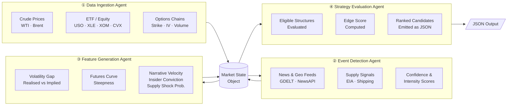
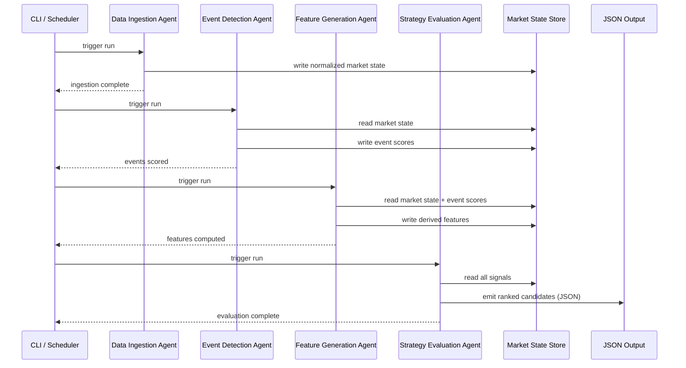

# Energy Options Opportunity Agent — User Guide

> **Version 1.0 • March 2026**
> This guide covers the full pipeline: setup, configuration, execution, output interpretation, and troubleshooting.

---

## Table of Contents

1. [Overview](#overview)
2. [Prerequisites](#prerequisites)
3. [Setup & Configuration](#setup--configuration)
4. [Running the Pipeline](#running-the-pipeline)
5. [Interpreting the Output](#interpreting-the-output)
6. [Troubleshooting](#troubleshooting)

---

## Overview

The **Energy Options Opportunity Agent** is an autonomous, modular Python pipeline that identifies options trading opportunities driven by oil market instability. It ingests market data, supply signals, news events, and alternative datasets, then produces structured, ranked candidate options strategies.

The system is composed of **four loosely coupled agents** that pass data through a shared market state object:


```mermaid
flowchart LR
    subgraph Ingestion["① Data Ingestion Agent"]
        A1[Crude Prices\nWTI · Brent]
        A2[ETF / Equity\nUSO · XLE · XOM · CVX]
        A3[Options Chains\nStrike · IV · Volume]
    end

    subgraph Event["② Event Detection Agent"]
        B1[News & Geo Feeds\nGDELT · NewsAPI]
        B2[Supply Signals\nEIA · Shipping]
        B3[Confidence &\nIntensity Scores]
    end

    subgraph Feature["③ Feature Generation Agent"]
        C1[Volatility Gap\nRealised vs Implied]
        C2[Futures Curve\nSteepness]
        C3[Narrative Velocity\nInsider Conviction\nSupply Shock Prob.]
    end

    subgraph Strategy["④ Strategy Evaluation Agent"]
        D1[Eligible Structures\nEvaluated]
        D2[Edge Score\nComputed]
        D3[Ranked Candidates\nEmitted as JSON]
    end

    MS[(Market State\nObject)]

    Ingestion --> MS
    MS --> Event
    Event --> MS
    MS --> Feature
    Feature --> MS
    MS --> Strategy
    Strategy --> Output[/JSON Output/]
```

### Key capabilities

| Capability | Detail |
|---|---|
| **Instruments** | WTI (`CL=F`), Brent, USO, XLE, XOM, CVX |
| **Option structures (MVP)** | Long straddles, call/put spreads, calendar spreads |
| **Edge scoring** | Composite float `[0.0 – 1.0]`; higher = stronger signal confluence |
| **Explainability** | Every candidate references its contributing signals |
| **Execution** | Advisory only — no automated order submission |
| **Deployment** | Runs on local hardware or a single VM/container |

---

## Prerequisites

### System requirements

| Requirement | Minimum |
|---|---|
| Python | 3.10 or later |
| Operating system | Linux, macOS, or Windows (WSL2 recommended) |
| RAM | 2 GB |
| Disk (data retention) | 10 GB (supports 6–12 months of historical data) |
| Network | Outbound HTTPS to external APIs |

### Python dependencies

Install the required packages after cloning the repository:

```bash
pip install -r requirements.txt
```

Key libraries used by the pipeline include `yfinance`, `requests`, `pandas`, `numpy`, and `pydantic`. Refer to `requirements.txt` for the pinned versions.

### API accounts

The pipeline relies on free or low-cost external data sources. Register for credentials where required before running the pipeline.

| Source | Purpose | Cost | Registration URL |
|---|---|---|---|
| Alpha Vantage | WTI / Brent spot & futures prices | Free | https://www.alphavantage.co |
| Yahoo Finance (`yfinance`) | ETF, equity, and options data | Free (no key needed) | — |
| Polygon.io | Options chains (supplementary) | Free tier | https://polygon.io |
| EIA API | Inventory & refinery utilization | Free | https://www.eia.gov/opendata |
| GDELT | News & geopolitical events | Free (no key needed) | — |
| NewsAPI | Energy news headlines | Free tier | https://newsapi.org |
| SEC EDGAR | Insider activity (EDGAR full-text) | Free (no key needed) | — |
| Quiver Quant | Insider conviction scores | Free/limited | https://www.quiverquant.com |
| MarineTraffic | Tanker flow data | Free tier | https://www.marinetraffic.com |
| VesselFinder | Tanker flow data (alternative) | Free tier | https://www.vesselfinder.com |
| Reddit API | Retail sentiment / narrative velocity | Free | https://www.reddit.com/prefs/apps |
| Stocktwits | Retail sentiment | Free | https://api.stocktwits.com |

> **Note:** The pipeline is designed to tolerate delayed or missing data without failing. If a free-tier source is rate-limited or unavailable, the affected signal is skipped and the remaining signals continue to be processed.

---

## Setup & Configuration

### 1. Clone the repository

```bash
git clone https://github.com/your-org/energy-options-agent.git
cd energy-options-agent
```

### 2. Create a virtual environment

```bash
python -m venv .venv
source .venv/bin/activate        # Linux / macOS
# .venv\Scripts\activate         # Windows PowerShell
```

### 3. Install dependencies

```bash
pip install --upgrade pip
pip install -r requirements.txt
```

### 4. Configure environment variables

Copy the provided template and populate your credentials:

```bash
cp .env.example .env
```

Open `.env` in your editor and set each value. The table below documents every supported variable.

#### Environment variable reference

| Variable | Required | Description | Example |
|---|---|---|---|
| `ALPHA_VANTAGE_API_KEY` | Yes | API key for crude price feeds | `ABC123XYZ` |
| `POLYGON_API_KEY` | No | Polygon.io key for options chain enrichment | `pX9abc...` |
| `EIA_API_KEY` | Yes | EIA Open Data key for inventory & utilization | `eia_abc123` |
| `NEWSAPI_KEY` | No | NewsAPI key for headline feeds | `na_abc123` |
| `QUIVER_API_KEY` | No | Quiver Quant key for insider conviction data | `qv_abc123` |
| `REDDIT_CLIENT_ID` | No | Reddit OAuth client ID for sentiment feeds | `rXYZ` |
| `REDDIT_CLIENT_SECRET` | No | Reddit OAuth client secret | `sXYZ` |
| `REDDIT_USER_AGENT` | No | Reddit API user-agent string | `energy-agent/1.0` |
| `STOCKTWITS_ACCESS_TOKEN` | No | Stocktwits OAuth token | `st_abc123` |
| `MARINETRAFFIC_API_KEY` | No | MarineTraffic free-tier key for tanker flows | `mt_abc123` |
| `DATA_DIR` | No | Path to local data storage directory | `./data` (default) |
| `OUTPUT_DIR` | No | Path where JSON output files are written | `./output` (default) |
| `LOG_LEVEL` | No | Logging verbosity (`DEBUG`, `INFO`, `WARNING`) | `INFO` (default) |
| `RETENTION_DAYS` | No | Days of historical data to retain | `365` (default) |
| `MARKET_DATA_INTERVAL_MINUTES` | No | Polling cadence for real-time price feeds | `5` (default) |

> **Tip:** Variables marked **No** are optional. The pipeline skips the corresponding data source when a key is absent and logs a `WARNING`. Core functionality requires at minimum `ALPHA_VANTAGE_API_KEY` and `EIA_API_KEY`.

### 5. Verify configuration

Run the built-in configuration check before executing the full pipeline:

```bash
python -m agent.cli check-config
```

Expected output on success:

```
[INFO]  Alpha Vantage     ✓ connected
[INFO]  Yahoo Finance     ✓ connected (no key required)
[INFO]  EIA API           ✓ connected
[WARNING] Polygon.io      ✗ key not set — options enrichment will be skipped
[WARNING] NewsAPI         ✗ key not set — NewsAPI headlines will be skipped
[INFO]  Configuration check complete. 2 optional sources unavailable.
```

---

## Running the Pipeline

### Pipeline architecture at a glance


```mermaid
sequenceDiagram
    participant CLI as CLI / Scheduler
    participant DIA as Data Ingestion Agent
    participant EDA as Event Detection Agent
    participant FGA as Feature Generation Agent
    participant SEA as Strategy Evaluation Agent
    participant Store as Market State Store
    participant Out as JSON Output

    CLI->>DIA: trigger run
    DIA->>Store: write normalized market state
    DIA-->>CLI: ingestion complete

    CLI->>EDA: trigger run
    EDA->>Store: read market state
    EDA->>Store: write event scores
    EDA-->>CLI: events scored

    CLI->>FGA: trigger run
    FGA->>Store: read market state + event scores
    FGA->>Store: write derived features
    FGA-->>CLI: features computed

    CLI->>SEA: trigger run
    SEA->>Store: read all signals
    SEA->>Out: emit ranked candidates (JSON)
    SEA-->>CLI: evaluation complete
```

### Full pipeline — single run

Execute all four agents in sequence with one command:

```bash
python -m agent.cli run --all
```

The agents execute in dependency order: **Ingestion → Event Detection → Feature Generation → Strategy Evaluation**.

### Running individual agents

You can run any agent independently, provided its upstream dependencies have already populated the market state store.

```bash
# Run only the Data Ingestion Agent
python -m agent.cli run --agent ingestion

# Run only the Event Detection Agent
python -m agent.cli run --agent event-detection

# Run only the Feature Generation Agent
python -m agent.cli run --agent feature-generation

# Run only the Strategy Evaluation Agent
python -m agent.cli run --agent strategy-evaluation
```

### Continuous / scheduled mode

To run the pipeline on a recurring cadence (market data refreshes on a minutes-level schedule; slower feeds such as EIA refresh daily or weekly):

```bash
python -m agent.cli run --all --continuous
```

Alternatively, use `cron` or a system scheduler:

```cron
# Full pipeline every 5 minutes during market hours (Mon–Fri, 09:00–17:00 ET)
*/5 9-17 * * 1-5 /path/to/.venv/bin/python -m agent.cli run --all >> /var/log/energy-agent.log 2>&1
```

### Useful CLI flags

| Flag | Description |
|---|---|
| `--all` | Run all four agents in sequence |
| `--agent <name>` | Run a single named agent |
| `--continuous` | Loop indefinitely using the configured polling interval |
| `--dry-run` | Execute pipeline logic but do not write output files |
| `--log-level DEBUG` | Override the log level for this invocation |
| `--output-dir <path>` | Override the `OUTPUT_DIR` environment variable |

---

## Interpreting the Output

### Output location

After each pipeline run, ranked strategy candidates are written to:

```
$OUTPUT_DIR/candidates_<ISO8601_timestamp>.json
```

For example:

```
./output/candidates_2026-03-15T14:32:00Z.json
```

### Output schema

Each file contains a JSON array of candidate objects. Every field is populated for each candidate.

| Field | Type | Description |
|---|---|---|
| `instrument` | `string` | Target instrument, e.g. `"USO"`, `"XLE"`, `"CL=F"` |
| `structure` | `enum` | One of: `long_straddle`, `call_spread`, `put_spread`, `calendar_spread` |
| `expiration` | `integer` | Target expiration in calendar days from the evaluation date |
| `edge_score` | `float [0.0–1.0]` | Composite opportunity score; **higher = stronger signal confluence** |
| `signals` | `object` | Map of contributing signals and their qualitative levels |
| `generated_at` | `ISO 8601 datetime` | UTC timestamp of candidate generation |

### Example candidate

```json
{
  "instrument": "USO",
  "structure": "long_straddle",
  "expiration": 30,
  "edge_score": 0.47,
  "signals": {
    "tanker_disruption_index": "high",
    "volatility_gap": "positive",
    "narrative_velocity": "rising"
  },
  "generated_at": "2026-03-15T14:32:00Z"
}
```

### Reading the edge score

| Edge score range | Interpretation |
|---|---|
| `0.75 – 1.00` | Strong signal confluence — high-conviction candidate |
| `0.50 – 0.74` | Moderate confluence — worth monitoring |
| `0.25 – 0.49` | Weak confluence — marginal opportunity |
| `0.00 – 0.24` | Insufficient signal strength — low priority |

> **Important:** The edge score is an advisory signal, not a trade instruction. No automated execution occurs. Always apply independent judgment and risk management before acting on any output.

### Signals reference

The `signals` object reflects the features computed by the Feature Generation Agent. The table below describes each possible signal key and its qualitative values.

| Signal key | Qualitative values | Description |
|---|---|---|
| `volatility_gap` | `positive`, `negative`, `neutral` | Realized volatility vs. implied volatility gap |
| `futures_curve_steepness` | `steep`, `flat`, `inverted` | Shape of the crude futures term structure |
| `sector_dispersion` | `high`, `moderate`, `low` | Dispersion across energy equity sector |
| `insider_conviction_score` | `high`, `moderate`, `low` | Aggregated insider trade signal (EDGAR / Quiver) |
| `narrative_velocity` | `rising`, `stable`, `falling` | Headline acceleration across news and social feeds |
| `supply_shock_probability` | `high`, `moderate`, `low` | Probability of supply disruption based on event scoring |
| `tanker_disruption_index` | `high`, `moderate`, `low` | Tanker chokepoint or shipping anomaly severity |

### Consuming output in thinkorswim or a dashboard

The JSON output is compatible with any JSON-capable visualization tool. To import into thinkorswim or a custom dashboard:

1. Point your tool's JSON data source at `$OUTPUT_DIR`.
2. Sort or filter candidates by `edge_score` descending to surface the highest-conviction opportunities.
3. Use the `signals` map to drill into the contributing factors for each candidate.

---

## Troubleshooting

### Common issues

| Symptom | Likely cause | Resolution |
|---|---|---|
| `KeyError: ALPHA_VANTAGE_API_KEY` at startup | Environment variable not set | Run `cp .env.example .env`, populate the file, and re-activate your shell |
| Pipeline exits with no output file written | All data sources unavailable or rate-limited | Check network connectivity; run `python -m agent.cli check-config` |
| `WARNING: skipping <source> — key not set` | Optional API key not configured | Set the key in `.env` if the source is needed; otherwise the warning is safe to ignore |
| Options data is empty or stale | Yahoo Finance / Polygon.io rate limit | Options data refreshes daily; avoid running the options fetch more than once per hour |
| EIA data not updating | Weekly cadence — data published Wednesdays | This is expected; EIA inventory data updates weekly |
| Edge scores are all below `0.25` | Insufficient active signals | Verify that at least `ALPHA_VANTAGE_API_KEY` and `EIA_API_KEY` are set and returning data; check `LOG_LEVEL=DEBUG` output |
| `JSONDecodeError` in output file | Pipeline interrupted mid-write | Delete the partial file and re-run