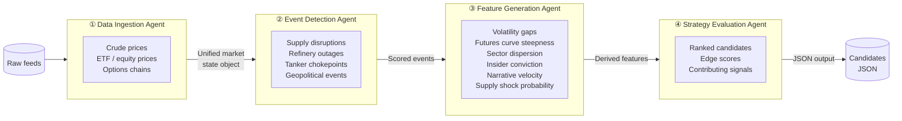
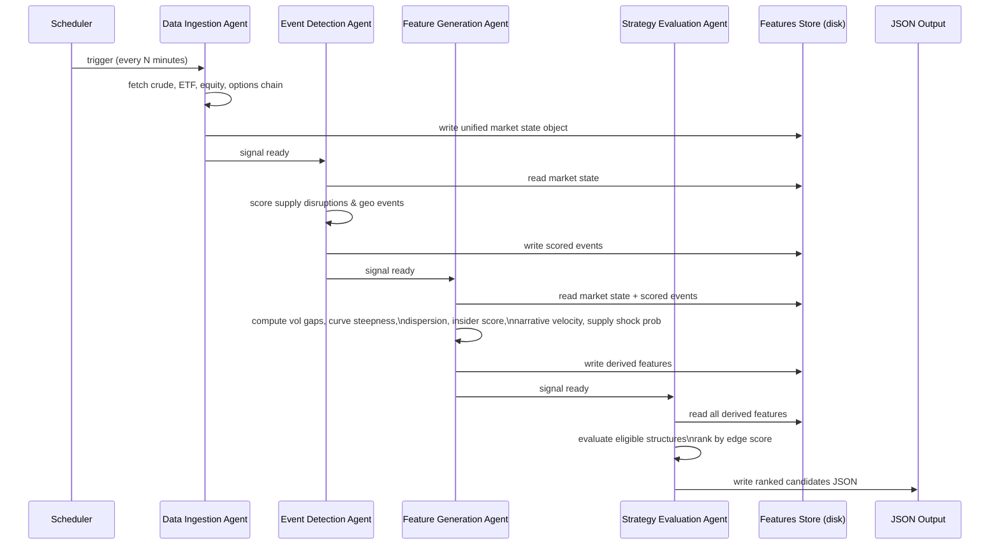

# Energy Options Opportunity Agent — User Guide

> **Version 1.0 • March 2026**
> Advisory system only. No automated trade execution is performed.

---

## Table of Contents

1. [Overview](#overview)
2. [Prerequisites](#prerequisites)
3. [Setup & Configuration](#setup--configuration)
4. [Running the Pipeline](#running-the-pipeline)
5. [Interpreting the Output](#interpreting-the-output)
6. [Troubleshooting](#troubleshooting)

---

## Overview

The **Energy Options Opportunity Agent** is a modular, four-agent Python pipeline that identifies options trading opportunities driven by oil market instability. It ingests market data, supply signals, news events, and alternative datasets, then produces structured, ranked candidate options strategies with full signal explainability.

### What the pipeline does


```mermaid
flowchart LR
    subgraph Ingestion["① Data Ingestion Agent"]
        A1[Crude prices\nETF / equity prices\nOptions chains]
    end

    subgraph Event["② Event Detection Agent"]
        B1[Supply disruptions\nRefinery outages\nTanker chokepoints\nGeopolitical events]
    end

    subgraph Feature["③ Feature Generation Agent"]
        C1[Volatility gaps\nFutures curve steepness\nSector dispersion\nInsider conviction\nNarrative velocity\nSupply shock probability]
    end

    subgraph Strategy["④ Strategy Evaluation Agent"]
        D1[Ranked candidates\nEdge scores\nContributing signals]
    end

    RAW[(Raw feeds)] --> Ingestion
    Ingestion -->|Unified market\nstate object| Event
    Event -->|Scored events| Feature
    Feature -->|Derived features| Strategy
    Strategy -->|JSON output| OUT[(Candidates\nJSON)]
```

Data flows **unidirectionally** through the four agents. Each agent is independently deployable, so you can update or redeploy any single stage without disrupting the rest of the pipeline.

### In-scope instruments (MVP)

| Category | Instruments |
|---|---|
| Crude futures | Brent Crude, WTI (`CL=F`) |
| ETFs | USO, XLE |
| Energy equities | Exxon Mobil (XOM), Chevron (CVX) |

### In-scope option structures (MVP)

| Structure | Enum value |
|---|---|
| Long straddle | `long_straddle` |
| Call spread | `call_spread` |
| Put spread | `put_spread` |
| Calendar spread | `calendar_spread` |

> **Out of scope for MVP:** exotic/multi-legged strategies, regional refined product pricing (OPIS), and automated trade execution.

---

## Prerequisites

### System requirements

| Requirement | Minimum |
|---|---|
| Operating system | Linux, macOS, or Windows (WSL2 recommended) |
| Python | 3.10 or later |
| Memory | 2 GB RAM |
| Disk | 5 GB free (for 6–12 months of historical data) |
| Deployment target | Local machine, single VM, or container |

### Python dependencies

Install all dependencies from the project root:

```bash
pip install -r requirements.txt
```

Core packages used by the pipeline include:

| Package | Purpose |
|---|---|
| `yfinance` | ETF, equity, and options chain data |
| `requests` | REST calls to Alpha Vantage, EIA, GDELT, NewsAPI, SEC EDGAR |
| `pandas` | Data normalization and historical storage |
| `pydantic` | Output schema validation |
| `schedule` / `APScheduler` | Cadence management for multi-frequency feeds |

### API access

The pipeline relies exclusively on **free or low-cost** data sources. Obtain API keys or tokens for each service before running.

| Service | Used for | Sign-up URL | Cost |
|---|---|---|---|
| Alpha Vantage | WTI / Brent spot and futures prices | https://www.alphavantage.co | Free tier |
| NewsAPI | Energy news and geopolitical events | https://newsapi.org | Free tier |
| EIA API | Inventory and refinery utilization | https://www.eia.gov/opendata | Free |
| SEC EDGAR | Insider trading filings | https://efts.sec.gov/LATEST | Free |
| Polygon.io *(optional)* | Higher-fidelity options chains | https://polygon.io | Free / limited |
| MarineTraffic *(optional)* | Tanker flow data | https://www.marinetraffic.com | Free tier |
| Quiver Quant *(optional)* | Aggregated insider conviction scores | https://www.quiverquant.com | Free / limited |

`yfinance`, GDELT, Reddit (`praw`), and Stocktwits do not require API keys for their free tiers, but rate limits apply.

---

## Setup & Configuration

### 1. Clone the repository

```bash
git clone https://github.com/your-org/energy-options-agent.git
cd energy-options-agent
```

### 2. Create and activate a virtual environment

```bash
python -m venv .venv
source .venv/bin/activate        # Linux / macOS
# .venv\Scripts\activate         # Windows PowerShell
```

### 3. Install dependencies

```bash
pip install -r requirements.txt
```

### 4. Configure environment variables

Copy the example file and fill in your credentials:

```bash
cp .env.example .env
```

Open `.env` in your editor and set every variable required for the data sources you plan to use.

#### Complete environment variable reference

| Variable | Required | Description | Example value |
|---|---|---|---|
| `ALPHA_VANTAGE_API_KEY` | Yes | Key for crude price feeds (WTI, Brent) | `AV_XXXXXXXXXXXX` |
| `NEWS_API_KEY` | Yes | Key for NewsAPI energy/geo event feed | `na_XXXXXXXXXXXX` |
| `EIA_API_KEY` | Yes | Key for EIA inventory and refinery data | `eia_XXXXXXXXXXXX` |
| `POLYGON_API_KEY` | No | Key for Polygon.io options chains | `poly_XXXXXXXXXXXX` |
| `MARINETRAFFIC_API_KEY` | No | Key for tanker flow data | `mt_XXXXXXXXXXXX` |
| `QUIVER_QUANT_API_KEY` | No | Key for insider conviction scores | `qq_XXXXXXXXXXXX` |
| `EDGAR_USER_AGENT` | Yes | User-agent string required by SEC EDGAR | `YourName contact@example.com` |
| `REDDIT_CLIENT_ID` | No | Reddit app client ID (narrative velocity) | `rcid_XXXXXXXXXXXX` |
| `REDDIT_CLIENT_SECRET` | No | Reddit app client secret | `rcsec_XXXXXXXXXXXX` |
| `REDDIT_USER_AGENT` | No | Reddit app user-agent string | `energy-agent/1.0` |
| `OUTPUT_DIR` | Yes | Directory where JSON output files are written | `./output` |
| `HISTORY_DIR` | Yes | Directory for persisted historical data | `./data/history` |
| `LOG_LEVEL` | No | Logging verbosity (`DEBUG`, `INFO`, `WARNING`) | `INFO` |
| `MARKET_DATA_INTERVAL_MINUTES` | No | Polling cadence for real-time market feeds | `5` |
| `SLOW_FEED_INTERVAL_HOURS` | No | Polling cadence for EIA/EDGAR feeds | `24` |
| `HISTORY_RETENTION_DAYS` | No | Days of historical data to retain | `365` |

> **Tip:** Variables marked **No** correspond to Phase 2 and Phase 3 data sources. The pipeline tolerates missing optional feeds without failing — candidates derived from those signals simply will not be scored for the unavailable layer.

### 5. Initialise the data directories

```bash
python -m agent.cli init
```

This creates `OUTPUT_DIR` and `HISTORY_DIR` if they do not exist and validates that all required environment variables are present.

Expected output:

```
[INFO] OUTPUT_DIR  ./output        ✓ created
[INFO] HISTORY_DIR ./data/history  ✓ created
[INFO] Required env vars           ✓ all present
[INFO] Optional env vars           ⚠ POLYGON_API_KEY not set — options fallback: yfinance
[INFO] Init complete.
```

---

## Running the Pipeline

### Pipeline architecture and timing


```mermaid
sequenceDiagram
    participant Scheduler
    participant DIA as Data Ingestion Agent
    participant EDA as Event Detection Agent
    participant FGA as Feature Generation Agent
    participant SEA as Strategy Evaluation Agent
    participant FS as Features Store (disk)
    participant OUT as JSON Output

    Scheduler->>DIA: trigger (every N minutes)
    DIA->>DIA: fetch crude, ETF, equity, options chain
    DIA->>FS: write unified market state object
    DIA->>EDA: signal ready
    EDA->>FS: read market state
    EDA->>EDA: score supply disruptions & geo events
    EDA->>FS: write scored events
    EDA->>FGA: signal ready
    FGA->>FS: read market state + scored events
    FGA->>FGA: compute vol gaps, curve steepness,\ndispersion, insider score,\nnarrative velocity, supply shock prob
    FGA->>FS: write derived features
    FGA->>SEA: signal ready
    SEA->>FS: read all derived features
    SEA->>SEA: evaluate eligible structures\nrank by edge score
    SEA->>OUT: write ranked candidates JSON
```

### Single run (one-shot mode)

Executes all four agents once, in sequence, then exits. Useful for testing and for scheduled invocation via `cron`.

```bash
python -m agent.cli run
```

Optional flags:

```bash
python -m agent.cli run --phase 1          # Restrict to Phase 1 data sources only
python -m agent.cli run --output ./my_out  # Override OUTPUT_DIR for this run
python -m agent.cli run --log-level DEBUG  # Verbose logging
```

### Continuous mode (scheduled polling)

Runs the pipeline on the cadences defined in your `.env` file (`MARKET_DATA_INTERVAL_MINUTES` for fast feeds, `SLOW_FEED_INTERVAL_HOURS` for EIA/EDGAR).

```bash
python -m agent.cli run --continuous
```

Stop with `Ctrl+C`. Graceful shutdown flushes in-progress writes before exiting.

### Running individual agents

Each agent can be invoked independently for development or debugging:

```bash
python -m agent.cli run --agent ingestion   # Data Ingestion Agent only
python -m agent.cli run --agent events      # Event Detection Agent only
python -m agent.cli run --agent features    # Feature Generation Agent only
python -m agent.cli run --agent strategy    # Strategy Evaluation Agent only
```

> **Note:** Downstream agents depend on the features store being populated by upstream agents. Running `strategy` in isolation requires a previously written features store from a prior pipeline run.

### Running in a container

A minimal `Dockerfile` is included in the repository root.

```bash
# Build the image
docker build -t energy-options-agent:latest .

# Run one-shot
docker run --env-file .env energy-options-agent:latest

# Run continuous with a mounted output directory
docker run --env-file .env \
  -v $(pwd)/output:/app/output \
  -v $(pwd)/data:/app/data \
  energy-options-agent:latest python -m agent.cli run --continuous
```

### Phase-gated execution

The pipeline is developed in four phases. Use the `--phase` flag to enable only the signals and data sources available at a given phase:

| Flag | Active agents / data sources |
|---|---|
| `--phase 1` | Crude benchmarks, USO/XLE prices, options surface, long straddles, call/put spreads |
| `--phase 2` | Phase 1 + EIA inventory, refinery utilization, GDELT/NewsAPI event detection |
| `--phase 3` | Phase 2 + EDGAR/Quiver insider data, Reddit/Stocktwits narrative velocity, MarineTraffic shipping |
| `--phase 4` | Phase 3 + optional high-fidelity enhancements (OPIS, exotic structures) |

```bash
python -m agent.cli run --phase 2
```

---

## Interpreting the Output

### Output file location

After each pipeline run, the Strategy Evaluation Agent writes one JSON file per evaluation timestamp to `OUTPUT_DIR`:

```
output/
└── candidates_2026-03-15T14-32-00Z.json
```

### Output schema

Each file contains a JSON array of **strategy candidate objects**:

```json
[
  {
    "instrument":   "USO",
    "structure":    "long_straddle",
    "expiration":   30,
    "edge_score":   0.47,
    "signals": {
      "tanker_disruption_index": "high",
      "volatility_gap":          "positive",
      "narrative_velocity":      "rising"
    },
    "generated_at": "2026-03-15T14:32:00Z"
  }
]
```

### Field reference

| Field | Type | Description |
|---|---|---|
| `instrument` | `string` | Target instrument — e.g. `USO`, `XLE`, `CL=F` (WTI) |
| `structure` | `enum` | Option structure: `long_straddle` \| `call_spread` \| `put_spread` \| `calendar_spread` |
| `expiration` | `integer` (days) | Target expiration in **calendar days** from evaluation date |
| `edge_score` | `float [0.0–1.0]` | Composite opportunity score. Higher = stronger signal confluence |
| `signals` | `object` | Map of contributing signals and their current readings |
| `generated_at` | ISO 8601 datetime | UTC timestamp of candidate generation |

### Understanding the edge score

The `edge_score` is a composite of all active signals weighted by their contribution to the detected opportunity. It is not a probability of profit.

| Score range | Interpretation |
|---|---|
| `0.70 – 1.00` | Strong signal confluence — multiple independent signals aligned |
| `0.40 – 0.69` | Moderate confluence — several signals active, some uncertainty |
| `0.20 – 0.39` | Weak signal — one or two signals present, low conviction |
| `0.00 – 0.19` | Noise threshold — generally not actionable |

### Understanding the signals map

Each key in `signals` corresponds to a derived feature computed by the Feature Generation Agent:

| Signal key | Description | Values |
|---|---|---|
| `volatility_gap` | Realized vs. implied volatility divergence | `positive`, `negative`, `neutral` |
| `futures_curve_steepness` | Contango/backwardation severity | `steep_contango`, `flat`, `steep_backwardation` |
| `sector_dispersion` | Cross-sector price divergence (XOM/CVX vs. ETFs) | `high`, `moderate`, `low` |
| `insider_conviction_score` | Aggregated executive trade signal | `high`, `moderate`, `low` |
| `narrative_velocity` | Rate of headline/sentiment acceleration | `rising`, `stable`, `falling` |
| `supply_shock_probability` | Composite probability of a supply disruption | `high`, `moderate`, `low` |
| `tanker_disruption_index` | Tanker chokepoint or logistical stress | `high`, `moderate`, `low` |

### Consuming the output in thinkorswim or other tools

The JSON output is compatible with any JSON-capable dashboard. For thinkorswim:

1. Point a custom watchlist script or thinkScript data import to the latest file in `OUTPUT_DIR`.
2. Filter candidates by `edge_score >= 0.40` as a starting threshold.
3. Use the `signals` map to review the qualitative basis for each recommendation before placing any manual order.

---

## Troubleshooting

### General diagnostic steps

```bash
# 1. Confirm environment is configured correctly
python -m agent.cli init

# 2. Run with verbose logging to identify the failing agent
python -m agent.cli run --log-level DEBUG

# 3. Run the ingestion agent