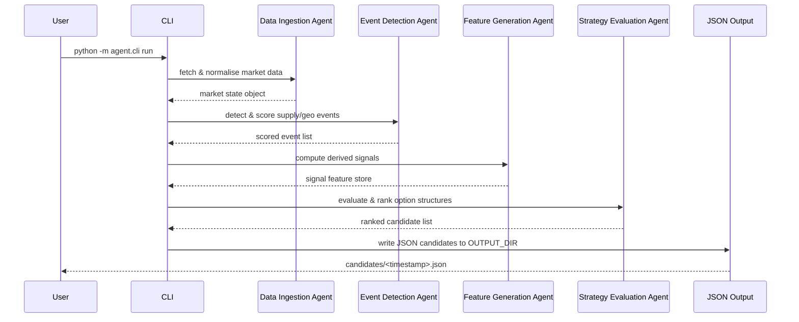

# Energy Options Opportunity Agent — User Guide

> **Version 1.0 · March 2026**
> Advisory use only. This system surfaces trading opportunities but does **not** execute trades automatically.

---

## Table of Contents

1. [Overview](#overview)
2. [Prerequisites](#prerequisites)
3. [Setup & Configuration](#setup--configuration)
4. [Running the Pipeline](#running-the-pipeline)
5. [Interpreting the Output](#interpreting-the-output)
6. [Troubleshooting](#troubleshooting)

---

## Overview

The **Energy Options Opportunity Agent** is an autonomous, modular Python pipeline that identifies options trading opportunities driven by oil market instability. It monitors crude prices, supply signals, geopolitical events, and alternative datasets, then surfaces volatility mispricing in oil-related instruments and ranks candidate strategies by a computed **edge score**.

### Pipeline Architecture

The system is composed of four loosely coupled agents that share a central market state object and a derived features store. Data flows strictly left-to-right through the pipeline.


```mermaid
flowchart LR
    subgraph Ingestion ["1 · Data Ingestion Agent"]
        A1[Crude Prices\nAlpha Vantage / MetalpriceAPI]
        A2[ETF & Equity Prices\nYahoo Finance / yfinance]
        A3[Options Chains\nYahoo Finance / Polygon.io]
    end

    subgraph Events ["2 · Event Detection Agent"]
        B1[News & Geo Events\nGDELT / NewsAPI]
        B2[Supply & Inventory\nEIA API]
        B3[Shipping & Logistics\nMarineTraffic / VesselFinder]
    end

    subgraph Features ["3 · Feature Generation Agent"]
        C1[Volatility Gap\nRealised vs Implied]
        C2[Futures Curve Steepness]
        C3[Sector Dispersion]
        C4[Insider Conviction\nSEC EDGAR / Quiver Quant]
        C5[Narrative Velocity\nReddit / Stocktwits]
        C6[Supply Shock Probability]
    end

    subgraph Strategy ["4 · Strategy Evaluation Agent"]
        D1[Evaluate Option Structures]
        D2[Compute Edge Scores]
        D3[Rank Candidates]
    end

    OUT[/"JSON Output\n(ranked candidates)"/]

    Ingestion -->|Market State Object| Events
    Events    -->|Scored Events| Features
    Features  -->|Derived Signals| Strategy
    Strategy  --> OUT
```

### In-Scope Instruments

| Category | Instruments |
|---|---|
| Crude Futures | Brent Crude, WTI (`CL=F`) |
| ETFs | USO, XLE |
| Energy Equities | Exxon Mobil (XOM), Chevron (CVX) |

### In-Scope Option Structures (MVP)

| Structure | Enum Value |
|---|---|
| Long Straddle | `long_straddle` |
| Call Spread | `call_spread` |
| Put Spread | `put_spread` |
| Calendar Spread | `calendar_spread` |

> **Out of scope for MVP:** exotic/multi-legged strategies, regional refined product pricing (OPIS), and automated trade execution.

---

## Prerequisites

### System Requirements

| Requirement | Minimum |
|---|---|
| Python | 3.10 or later |
| Operating System | Linux, macOS, or Windows (WSL2 recommended) |
| RAM | 2 GB |
| Disk | 10 GB (for 6–12 months of historical data) |
| Deployment target | Local machine, single VM, or container |

### Required Accounts & API Keys

Obtain free or free-tier credentials from each provider before proceeding.

| Provider | Purpose | Cost | Sign-up URL |
|---|---|---|---|
| Alpha Vantage **or** MetalpriceAPI | WTI / Brent crude prices | Free | `alphavantage.co` / `metalpriceapi.com` |
| Yahoo Finance (`yfinance`) | ETF, equity, and options data | Free | No key required |
| Polygon.io *(optional)* | Higher-quality options chains | Free tier | `polygon.io` |
| EIA API | Inventory & refinery utilisation | Free | `eia.gov/opendata` |
| GDELT | Geopolitical news events | Free | `gdeltproject.org` |
| NewsAPI *(optional)* | Supplementary news headlines | Free tier | `newsapi.org` |
| SEC EDGAR | Insider trading filings | Free | `sec.gov` |
| Quiver Quant *(optional)* | Structured insider signals | Free/Limited | `quiverquant.com` |
| MarineTraffic **or** VesselFinder | Tanker flow data | Free tier | `marinetraffic.com` |
| Reddit API | Retail sentiment / narrative velocity | Free | `reddit.com/prefs/apps` |
| Stocktwits *(optional)* | Financial social sentiment | Free | `api.stocktwits.com` |

### Software Dependencies

```bash
# Clone the repository
git clone https://github.com/your-org/energy-options-agent.git
cd energy-options-agent

# Create and activate a virtual environment
python -m venv .venv
source .venv/bin/activate        # Linux / macOS
# .venv\Scripts\activate         # Windows

# Install dependencies
pip install -r requirements.txt
```

---

## Setup & Configuration

### 1. Copy the Environment Template

```bash
cp .env.example .env
```

### 2. Populate Environment Variables

Open `.env` in your editor and fill in the values for every key you intend to use. The table below documents every supported variable.

| Variable | Required | Default | Description |
|---|---|---|---|
| `ALPHA_VANTAGE_API_KEY` | Yes* | — | API key for Alpha Vantage crude price feed. *Required if `CRUDE_PRICE_PROVIDER=alpha_vantage`. |
| `METALPRICE_API_KEY` | Yes* | — | API key for MetalpriceAPI. *Required if `CRUDE_PRICE_PROVIDER=metalprice`. |
| `CRUDE_PRICE_PROVIDER` | Yes | `alpha_vantage` | Which crude price provider to use: `alpha_vantage` or `metalprice`. |
| `POLYGON_API_KEY` | No | — | Polygon.io API key. Falls back to `yfinance` if omitted. |
| `EIA_API_KEY` | Yes | — | EIA Open Data API key for inventory/refinery data. |
| `NEWS_API_KEY` | No | — | NewsAPI key. GDELT is used as primary source if omitted. |
| `QUIVER_QUANT_API_KEY` | No | — | Quiver Quant key. EDGAR-only insider data used if omitted. |
| `REDDIT_CLIENT_ID` | No | — | Reddit OAuth client ID for narrative velocity signals. |
| `REDDIT_CLIENT_SECRET` | No | — | Reddit OAuth client secret. |
| `REDDIT_USER_AGENT` | No | `energy-options-agent/1.0` | Reddit API user-agent string. |
| `MARINETRAFFIC_API_KEY` | No | — | MarineTraffic API key for tanker flow data. |
| `OUTPUT_DIR` | No | `./output` | Directory where JSON candidate files are written. |
| `HISTORICAL_DATA_DIR` | No | `./data/historical` | Root directory for persisted raw and derived data. |
| `RETENTION_DAYS` | No | `365` | Days of historical data to retain (recommended: 180–365). |
| `MARKET_DATA_REFRESH_INTERVAL` | No | `300` | Seconds between market data refresh cycles (minutes-level cadence). |
| `LOG_LEVEL` | No | `INFO` | Logging verbosity: `DEBUG`, `INFO`, `WARNING`, `ERROR`. |
| `PIPELINE_PHASES_ENABLED` | No | `1,2,3` | Comma-separated list of MVP phases to activate (valid: `1`, `2`, `3`). Phase 4 is not available in MVP. |

> **Tip:** Variables marked **No** are optional. The pipeline tolerates missing data feeds without failing — omitting an optional key simply disables that signal layer.

### 3. Validate Configuration

```bash
python -m agent.cli validate-config
```

Expected output on success:

```
[OK] CRUDE_PRICE_PROVIDER     : alpha_vantage
[OK] EIA_API_KEY              : set
[OK] OUTPUT_DIR               : ./output (writable)
[OK] HISTORICAL_DATA_DIR      : ./data/historical (writable)
[SKIP] POLYGON_API_KEY        : not set — using yfinance fallback
[SKIP] MARINETRAFFIC_API_KEY  : not set — shipping signals disabled
Configuration valid. 2 optional signal layers disabled.
```

### 4. Initialise the Data Store

Run the bootstrap command once to create the directory structure and seed the historical data store:

```bash
python -m agent.cli bootstrap
```

This creates:

```
data/
  historical/
    raw/          # Normalised market state snapshots
    derived/      # Feature store (computed signals)
output/           # JSON candidate files written here
logs/             # Pipeline run logs
```

---

## Running the Pipeline

### Pipeline Execution Flow


```mermaid
sequenceDiagram
    participant User
    participant CLI
    participant Ingestion as Data Ingestion Agent
    participant Events as Event Detection Agent
    participant Features as Feature Generation Agent
    participant Strategy as Strategy Evaluation Agent
    participant Output as JSON Output

    User->>CLI: python -m agent.cli run
    CLI->>Ingestion: fetch & normalise market data
    Ingestion-->>CLI: market state object
    CLI->>Events: detect & score supply/geo events
    Events-->>CLI: scored event list
    CLI->>Features: compute derived signals
    Features-->>CLI: signal feature store
    CLI->>Strategy: evaluate & rank option structures
    Strategy-->>CLI: ranked candidate list
    CLI->>Output: write JSON candidates to OUTPUT_DIR
    Output-->>User: candidates/<timestamp>.json
```

### Single Pipeline Run

Execute the full pipeline once and write results to `OUTPUT_DIR`:

```bash
python -m agent.cli run
```

### Run a Specific Phase Only

```bash
# Phase 1: Core market signals & options only
python -m agent.cli run --phases 1

# Phases 1 and 2: Add supply & event augmentation
python -m agent.cli run --phases 1,2

# All MVP phases (default)
python -m agent.cli run --phases 1,2,3
```

### Continuous Mode (Scheduled Refresh)

Run the pipeline on a repeating cadence. Market data refreshes at the interval set by `MARKET_DATA_REFRESH_INTERVAL`; slower feeds (EIA, EDGAR) refresh on their own daily/weekly schedules automatically.

```bash
python -m agent.cli run --continuous
```

To stop, press `Ctrl+C`. The pipeline completes the current cycle before exiting.

### Run as a Background Service (systemd example)

```ini
# /etc/systemd/system/energy-options-agent.service
[Unit]
Description=Energy Options Opportunity Agent
After=network.target

[Service]
Type=simple
WorkingDirectory=/opt/energy-options-agent
EnvironmentFile=/opt/energy-options-agent/.env
ExecStart=/opt/energy-options-agent/.venv/bin/python -m agent.cli run --continuous
Restart=on-failure
RestartSec=30

[Install]
WantedBy=multi-user.target
```

```bash
sudo systemctl enable --now energy-options-agent
sudo journalctl -fu energy-options-agent
```

### Run as a Docker Container

```bash
# Build
docker build -t energy-options-agent:1.0 .

# Run (mount output and data volumes; pass env file)
docker run -d \
  --name energy-options-agent \
  --env-file .env \
  -v $(pwd)/output:/app/output \
  -v $(pwd)/data:/app/data \
  energy-options-agent:1.0
```

### CLI Reference

| Command | Description |
|---|---|
| `python -m agent.cli validate-config` | Check environment variables and writeable paths. |
| `python -m agent.cli bootstrap` | Initialise data directory structure. |
| `python -m agent.cli run` | Execute one full pipeline cycle. |
| `python -m agent.cli run --phases 1,2,3` | Execute selected phases only. |
| `python -m agent.cli run --continuous` | Run repeatedly on the configured refresh interval. |
| `python -m agent.cli status` | Show last run timestamp, candidate count, and agent health. |
| `python -m agent.cli purge --older-than 180` | Delete historical data older than N days. |

---

## Interpreting the Output

### Output Location

Each pipeline run appends a timestamped JSON file to `OUTPUT_DIR`:

```
output/
  candidates_2026-03-15T14:32:00Z.json
  candidates_2026-03-15T14:37:00Z.json
  ...
```

### Output Schema

Every candidate object contains the following fields:

| Field | Type | Description |
|---|---|---|
| `instrument` | `string` | Target instrument, e.g. `USO`, `XLE`, `CL=F` |
| `structure` | `enum` | One of: `long_straddle`, `call_spread`, `put_spread`, `calendar_spread` |
| `expiration` | `integer` | Target expiration in calendar days from the evaluation date |
| `edge_score` | `float [0.0–1.0]` | Composite opportunity score. Higher = stronger signal confluence |
| `signals` | `object` | Map of contributing signals and their qualitative values |
| `generated_at` | `ISO 8601 datetime` | UTC timestamp of candidate generation |

### Example Candidate

```json
{
  "instrument": "USO",
  "structure": "long_straddle",
  "expiration": 30,
  "edge_score": 0.47,
  "signals": {
    "tanker_disruption_index": "high",
    "volatility_gap": "positive",
    "narrative_velocity": "rising"
  },
  "generated_at": "2026-03-15T14:32:00Z"
}
```

### Understanding the Edge Score

The `edge_score` is a composite signal confluence score in the range `[0.0, 1.0]`. Use the following guidelines when reviewing candidates:

| Edge Score Range | Interpretation | Suggested Action |
|---|---|---|
| `0.70 – 1.00` | Strong multi-signal confluence | High-priority review |
| `0.45 – 0.69` | Moderate confluence | Review alongside signal details |
| `0.20 – 0.44` | Weak or single-signal confluence | Monitor; low conviction |
| `0.00 – 0.19` | Negligible confluence | Typically discard |

> **Important:** The edge score reflects signal strength, **not** a probability of profit. Always verify candidates against your own market view before placing any trade.

### Understanding Contributing Signals

Each entry in the `signals` object identifies which feature contributed to the edge score and its qualitative state at evaluation time.

| Signal Key | Source Agent | Possible Values |
|---|---|---|
| `volatility_gap` | Feature Generation | `positive`, `negative`, `neutral` |
| `futures_curve_steepness` | Feature Generation | `contango`, `backwardation`, `flat` |
| `sector_dispersion` | Feature Generation | `high`, `moderate`, `low` |
| `insider_conviction` | Feature Generation | `high`, `moderate`, `low`, `none` |
| `narrative_velocity` | Feature Generation | `rising`, `stable`, `falling` |
| `supply_shock_probability` | Feature Generation | `high`, `moderate`, `low` |
| `tanker_disruption_index` | Event Detection | `high`, `moderate`, `low` |
| `eia_inventory_surprise` | Event Detection | `bullish`, `bearish`, `neutral` |
| `geopolitical_event_score` | Event Detection | `high`, `moderate`, `low`