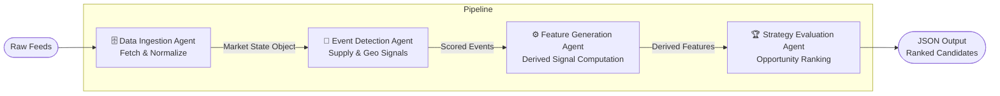

# Energy Options Opportunity Agent — User Guide

> **Version 1.0 · March 2026**
> Advisory system only. No automated trade execution occurs at any point in the pipeline.

---

## Table of Contents

1. [Overview](#overview)
2. [Prerequisites](#prerequisites)
3. [Setup & Configuration](#setup--configuration)
4. [Running the Pipeline](#running-the-pipeline)
5. [Interpreting the Output](#interpreting-the-output)
6. [Troubleshooting](#troubleshooting)

---

## Overview

The **Energy Options Opportunity Agent** is an autonomous, modular Python pipeline that identifies options trading opportunities driven by oil market instability. It ingests market data, supply signals, news events, and alternative datasets, then produces structured, ranked candidate options strategies.

The pipeline is composed of four loosely coupled agents that execute in sequence:


```mermaid
flowchart LR
    A([Raw Feeds]) --> B

    subgraph Pipeline
        direction LR
        B["🗄️ Data Ingestion Agent\nFetch & Normalize"]
        C["📡 Event Detection Agent\nSupply & Geo Signals"]
        D["⚙️ Feature Generation Agent\nDerived Signal Computation"]
        E["🏆 Strategy Evaluation Agent\nOpportunity Ranking"]

        B -->|Market State Object| C
        C -->|Scored Events| D
        D -->|Derived Features| E
    end

    E --> F([JSON Output\nRanked Candidates])
```

| Agent | Role | Key Outputs |
|---|---|---|
| **Data Ingestion** | Fetch & Normalize | Unified market state object |
| **Event Detection** | Supply & Geo Signals | Confidence/intensity-scored events |
| **Feature Generation** | Derived Signal Computation | Volatility gaps, curve steepness, shock probabilities, etc. |
| **Strategy Evaluation** | Opportunity Ranking | Ranked candidates with edge scores and signal provenance |

### In-Scope Instruments

| Category | Instruments |
|---|---|
| Crude Futures | Brent Crude, WTI (`CL=F`) |
| ETFs | USO, XLE |
| Energy Equities | Exxon Mobil (XOM), Chevron (CVX) |

### In-Scope Option Structures (MVP)

- Long straddles
- Call / put spreads
- Calendar spreads

> **Out of scope for MVP:** exotic/multi-legged strategies, OPIS regional pricing, and automated trade execution.

---

## Prerequisites

### System Requirements

| Requirement | Minimum |
|---|---|
| Python | 3.10+ |
| Memory | 2 GB RAM |
| Storage | 10 GB free (for 6–12 months of historical data) |
| OS | Linux, macOS, or Windows (WSL2 recommended) |
| Deployment target | Local machine, single VM, or container |

### Python Dependencies

Install all dependencies from the project's `requirements.txt`:

```bash
pip install -r requirements.txt
```

Key library groups used by the pipeline:

| Purpose | Libraries (examples) |
|---|---|
| Market data | `yfinance`, `alpha_vantage` |
| Options data | `yfinance`, `polygon-api-client` |
| News & events | `gdelt-doc-api`, `newsapi-python` |
| Insider activity | `requests` (SEC EDGAR REST), `quiverquant` |
| Shipping data | `requests` (MarineTraffic / VesselFinder APIs) |
| Sentiment | `praw` (Reddit), `requests` (Stocktwits) |
| Data handling | `pandas`, `numpy` |
| Output | `json`, `pydantic` |

### External API Accounts

Register for the following free or low-cost services before running the pipeline. All are free-tier or no-cost.

| Service | Used By | Registration URL |
|---|---|---|
| Alpha Vantage | Crude prices (WTI, Brent) | https://www.alphavantage.co |
| Polygon.io | Options chains (IV, volume, strike) | https://polygon.io |
| EIA Open Data | Supply/inventory data | https://www.eia.gov/opendata |
| GDELT Project | News & geopolitical events | No key required (public) |
| NewsAPI | News headlines | https://newsapi.org |
| SEC EDGAR | Insider activity | No key required (public) |
| Quiver Quant | Insider conviction scores | https://www.quiverquant.com |
| MarineTraffic | Tanker/shipping data | https://www.marinetraffic.com |
| Reddit (PRAW) | Sentiment / narrative velocity | https://www.reddit.com/prefs/apps |
| Stocktwits | Sentiment / narrative velocity | https://api.stocktwits.com |

> **Note:** Yahoo Finance (via `yfinance`) requires no API key and is used for ETF/equity prices and as a fallback for options data.

---

## Setup & Configuration

### 1. Clone the Repository

```bash
git clone https://github.com/your-org/energy-options-agent.git
cd energy-options-agent
```

### 2. Create and Activate a Virtual Environment

```bash
python -m venv .venv

# Linux / macOS
source .venv/bin/activate

# Windows (PowerShell)
.venv\Scripts\Activate.ps1
```

### 3. Install Dependencies

```bash
pip install --upgrade pip
pip install -r requirements.txt
```

### 4. Configure Environment Variables

Copy the provided template and populate it with your API credentials:

```bash
cp .env.example .env
```

Open `.env` in your editor and fill in the values described in the table below.

#### Environment Variable Reference

| Variable | Required | Description | Example Value |
|---|---|---|---|
| `ALPHA_VANTAGE_API_KEY` | Yes | API key for crude price feeds (WTI, Brent) | `AV_XXXXXXXXXXXX` |
| `POLYGON_API_KEY` | Yes | API key for options chain data (IV, volume, strike, expiry) | `PG_XXXXXXXXXXXX` |
| `EIA_API_KEY` | Yes | API key for EIA inventory and refinery utilization data | `EIA_XXXXXXXXXXXX` |
| `NEWSAPI_KEY` | Yes | API key for energy headline feeds | `NA_XXXXXXXXXXXX` |
| `QUIVER_API_KEY` | Recommended | API key for insider conviction scores via Quiver Quant | `QQ_XXXXXXXXXXXX` |
| `MARINETRAFFIC_API_KEY` | Optional | API key for tanker flow data (free tier available) | `MT_XXXXXXXXXXXX` |
| `REDDIT_CLIENT_ID` | Optional | Reddit app client ID for sentiment feeds (PRAW) | `reddit_client_id` |
| `REDDIT_CLIENT_SECRET` | Optional | Reddit app client secret | `reddit_secret` |
| `REDDIT_USER_AGENT` | Optional | User-agent string for PRAW requests | `energy-agent/1.0` |
| `STOCKTWITS_ACCESS_TOKEN` | Optional | Stocktwits API access token for sentiment velocity | `ST_XXXXXXXXXXXX` |
| `DATA_DIR` | Yes | Local path for persisting raw and derived historical data | `./data` |
| `OUTPUT_DIR` | Yes | Directory where JSON output files are written | `./output` |
| `LOG_LEVEL` | No | Logging verbosity: `DEBUG`, `INFO`, `WARNING`, `ERROR` | `INFO` |
| `HISTORY_DAYS` | No | Days of historical data to retain (180–365 recommended) | `365` |
| `MARKET_REFRESH_CADENCE_MINUTES` | No | Polling interval for minute-level market data feeds | `5` |

> **Security:** Never commit `.env` to version control. The repository's `.gitignore` excludes it by default.

### 5. Initialise the Data Directory

Run the initialisation command to create required directory structure and validate connectivity to all configured data sources:

```bash
python -m agent init
```

Expected output:

```
[INFO] Creating data directories at ./data ...
[INFO] Creating output directory at ./output ...
[INFO] Checking Alpha Vantage connection ... OK
[INFO] Checking Polygon.io connection    ... OK
[INFO] Checking EIA API connection       ... OK
[INFO] Checking NewsAPI connection       ... OK
[INFO] Checking GDELT access             ... OK
[INFO] Checking SEC EDGAR access         ... OK
[INFO] Optional: Quiver Quant            ... OK
[INFO] Optional: MarineTraffic           ... SKIPPED (no key configured)
[INFO] Optional: Reddit (PRAW)           ... SKIPPED (no key configured)
[INFO] Optional: Stocktwits              ... SKIPPED (no key configured)
[INFO] Initialisation complete.
```

Sources marked `SKIPPED` are optional; the pipeline tolerates their absence without failure.

---

## Running the Pipeline

### Pipeline Execution Sequence

```mermaid
sequenceDiagram
    participant User
    participant CLI as CLI / Scheduler
    participant DIA as Data Ingestion Agent
    participant EDA as Event Detection Agent
    participant FGA as Feature Generation Agent
    participant SEA as Strategy Evaluation Agent
    participant FS as File System (JSON)

    User->>CLI: python -m agent run
    CLI->>DIA: Trigger ingestion
    DIA-->>DIA: Fetch crude, ETF, equity, options data
    DIA-->>DIA: Normalise → Market State Object
    DIA->>EDA: Pass Market State Object
    EDA-->>EDA: Scan news, GDELT, shipping feeds
    EDA-->>EDA: Score events (confidence, intensity)
    EDA->>FGA: Pass scored events + market state
    FGA-->>FGA: Compute volatility gaps, curve steepness,\nsector dispersion, insider scores,\nnarrative velocity, supply shock probability
    FGA->>SEA: Pass derived features store
    SEA-->>SEA: Evaluate long straddles, spreads, calendars
    SEA-->>SEA: Rank by edge score; attach signal provenance
    SEA->>FS: Write ranked_candidates_<timestamp>.json
    FS-->>User: Output ready
```

### Single Run (On-Demand)

Execute the full four-agent pipeline once and write results to `OUTPUT_DIR`:

```bash
python -m agent run
```

To target a specific instrument only:

```bash
python -m agent run --instrument USO
```

Supported values for `--instrument`: `USO`, `XLE`, `XOM`, `CVX`, `CL=F` (WTI), `BZ=F` (Brent).

### Continuous / Scheduled Mode

Run the pipeline on the configured cadence (default: every 5 minutes for market data; daily for EIA/EDGAR):

```bash
python -m agent run --loop
```

To override the cadence at runtime:

```bash
python -m agent run --loop --interval-minutes 10
```

> **Tip:** For production deployments, prefer a system scheduler (cron, systemd timer, or container orchestration) over `--loop` to gain restart resilience.

Example cron entry (run every 5 minutes during market hours):

```cron
*/5 9-16 * * 1-5 /path/to/.venv/bin/python -m agent run >> /var/log/energy-agent.log 2>&1
```

### Running Individual Agents

Each agent can be invoked in isolation for development, debugging, or incremental integration:

```bash
# Data Ingestion only
python -m agent run --agent ingestion

# Event Detection only (requires a prior market state snapshot in DATA_DIR)
python -m agent run --agent events

# Feature Generation only
python -m agent run --agent features

# Strategy Evaluation only
python -m agent run --agent strategy
```

### Dry Run (No Output Written)

Validate the full pipeline without writing output files:

```bash
python -m agent run --dry-run
```

### Logging

Logs are written to stdout and to `./logs/agent.log`. Change verbosity via the `LOG_LEVEL` environment variable or the `--log-level` flag:

```bash
python -m agent run --log-level DEBUG
```

---

## Interpreting the Output

### Output File Location

Each pipeline run writes a timestamped JSON file to `OUTPUT_DIR`:

```
./output/ranked_candidates_2026-03-15T14:32:00Z.json
```

A symlink `./output/latest.json` always points to the most recent run.

### Output Schema

Each element in the output array represents one ranked strategy candidate:

| Field | Type | Description |
|---|---|---|
| `instrument` | `string` | Target instrument, e.g. `"USO"`, `"XLE"`, `"CL=F"` |
| `structure` | `enum` | Options structure: `long_straddle`, `call_spread`, `put_spread`, `calendar_spread` |
| `expiration` | `integer` (days) | Target expiration in calendar days from the evaluation date |
| `edge_score` | `float` [0.0–1.0] | Composite opportunity score; higher = stronger signal confluence |
| `signals` | `object` | Map of contributing signals and their observed states |
| `generated_at` | ISO 8601 datetime | UTC timestamp of candidate generation |

### Example Output

```json
[
  {
    "instrument": "USO",
    "structure": "long_straddle",
    "expiration": 30,
    "edge_score": 0.47,
    "signals": {
      "tanker_disruption_index": "high",
      "volatility_gap": "positive",
      "narrative_velocity": "rising"
    },
    "generated_at": "2026-03-15T14:32:00Z"
  },
  {
    "instrument": "XLE",
    "structure": "call_spread",
    "expiration": 45,
    "edge_score": 0.31,
    "signals": {
      "volatility_gap": "positive",
      "supply_shock_probability": "elevated",
      "sector_dispersion": "widening"
    },
    "generated_at": "2026-03-15T14:32:00Z"
  }
]
```

### Reading the `edge_score`

The `edge_score` is a composite float between `0.0` and `1.0` representing the degree of signal confluence supporting the candidate. Use the following bands as a starting guide:

| Score Range | Interpretation | Suggested Action |
|---|---|---|
| `0.70 – 1.00` | Strong confluence across multiple signals | High priority for manual review |
| `0.40 – 0.69` | Moderate confluence; at least one dominant signal | Review alongside fundamentals |
| `0.20 – 0.39` | Weak or mixed signals | Monitor; do not act in isolation |
| `0.00 – 0.19` | Minimal signal support | Likely background noise; deprioritise |

> **Important:** The edge score is a heuristic ranking signal, not a probability of profit. It reflects signal confluence only. Always apply independent risk assessment before placing any trade.

### Reading the `signals` Map

Each key in the `signals` object identifies a contributing derived feature. Common values:

| Signal Key | Possible Values | Meaning |
|---|---|---|
| `volatility_gap` | `positive`, `negative`, `neutral` | Realized vol vs. implied vol divergence |
| `tanker_disruption_index` | `high`, `moderate`, `low` | Shipping flow anomalies detected |
| `narrative_velocity` | `rising`, `stable`, `falling` | Acceleration of energy-related headlines/sentiment |
| `supply_shock_probability` | `elevated`, `moderate`, `low` | Composite supply disruption likelihood |
| `sector_dispersion` | `widening`, `stable`, `narrowing` | Spread between energy sub-sector returns |
| `insider_conviction` | `high`, `moderate`, `low` | Unusual insider trading activity score |
| `futures_curve_steepness` | `steep`, `flat`, `inverted` | Shape of the WTI/Brent futures curve |

### Downstream Consumption

The JSON output is compatible with any JSON-capable dashboard or import tool. For **thinkorswim**, import `latest.json` using the platform's custom data import or scripting interface, or pipe the output into any visualisation layer of your choice.

---