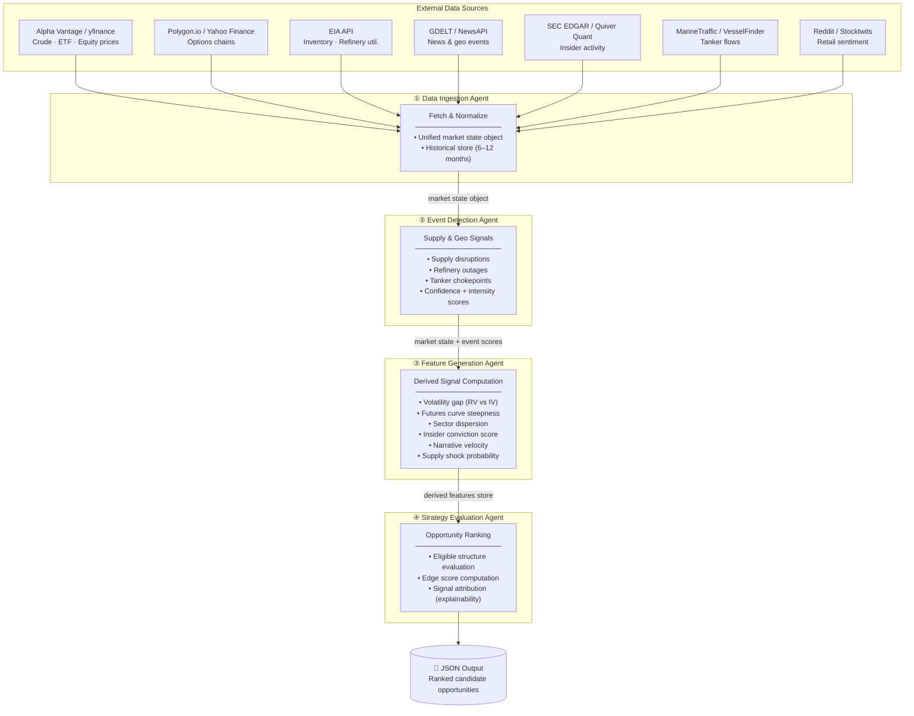

# Energy Options Opportunity Agent — User Guide

> **Version 1.0 • March 2026**
> This guide covers the full pipeline: from environment setup through running all four agents to interpreting ranked output.

---

## Table of Contents

1. [Overview](#overview)
2. [Prerequisites](#prerequisites)
3. [Setup & Configuration](#setup--configuration)
4. [Pipeline Architecture](#pipeline-architecture)
5. [Running the Pipeline](#running-the-pipeline)
6. [Interpreting the Output](#interpreting-the-output)
7. [Troubleshooting](#troubleshooting)

---

## Overview

The **Energy Options Opportunity Agent** is an autonomous, modular Python pipeline that identifies options trading opportunities driven by oil market instability. It ingests market data, supply signals, news events, and alternative datasets, then produces structured, ranked candidate options strategies.

The system surfaces **volatility mispricing** in oil-related instruments, ranks candidates by a computed **edge score**, and preserves full **explainability** of every recommendation.

### Key capabilities

| Capability | Detail |
|---|---|
| Instruments covered | Brent Crude, WTI, USO, XLE, XOM, CVX |
| Option structures (MVP) | Long straddles, call/put spreads, calendar spreads |
| Output format | JSON-compatible structured candidates |
| Deployment target | Local machine or single VM / container |
| Trade execution | **Advisory only — no automated execution** |

---

## Prerequisites

### System requirements

| Requirement | Minimum |
|---|---|
| Python | 3.10 or later |
| OS | Linux, macOS, or Windows (WSL2 recommended) |
| RAM | 2 GB available |
| Disk | 5 GB free (for 6–12 months of historical data) |
| Network | Outbound HTTPS to external APIs |

### Python dependencies

Install all dependencies from the project root:

```bash
pip install -r requirements.txt
```

Core packages expected by the pipeline:

| Package | Purpose |
|---|---|
| `yfinance` | ETF/equity prices (USO, XLE, XOM, CVX) |
| `requests` | Alpha Vantage, EIA, NewsAPI, SEC EDGAR HTTP calls |
| `pandas` | Data normalization and feature computation |
| `numpy` | Numerical operations (volatility, curve math) |
| `pydantic` | Market state object validation |
| `python-dotenv` | Environment variable loading |
| `schedule` | Cadenced pipeline execution |

### API accounts

All required data sources are free or offer a free tier. Register and obtain API keys before proceeding.

| Source | URL | Tier needed | Used by |
|---|---|---|---|
| Alpha Vantage | https://www.alphavantage.co | Free | Crude prices |
| EIA Open Data | https://www.eia.gov/opendata | Free | Supply/inventory |
| NewsAPI | https://newsapi.org | Free | News & geo events |
| GDELT | https://www.gdeltproject.org | Free (no key) | News & geo events |
| SEC EDGAR | https://www.sec.gov/developer | Free | Insider activity |
| Polygon.io | https://polygon.io | Free tier | Options chains |
| MarineTraffic | https://www.marinetraffic.com/en/ais-api | Free tier | Tanker/shipping data |
| Quiver Quant | https://www.quiverquant.com | Free/Limited | Insider conviction |

> **Note:** Yahoo Finance (via `yfinance`) requires no API key for equity and options data within its free-tier rate limits.

---

## Setup & Configuration

### 1. Clone the repository

```bash
git clone https://github.com/your-org/energy-options-agent.git
cd energy-options-agent
```

### 2. Create and activate a virtual environment

```bash
python -m venv .venv
source .venv/bin/activate      # Linux / macOS
# .venv\Scripts\activate       # Windows
```

### 3. Install dependencies

```bash
pip install -r requirements.txt
```

### 4. Configure environment variables

Copy the provided template and populate your credentials:

```bash
cp .env.example .env
```

Open `.env` in your editor and set each variable:

```dotenv
# ── Data Ingestion ──────────────────────────────────────────────
ALPHA_VANTAGE_API_KEY=your_alpha_vantage_key
POLYGON_API_KEY=your_polygon_key

# ── Supply & Inventory ──────────────────────────────────────────
EIA_API_KEY=your_eia_key

# ── News & Geopolitical Events ──────────────────────────────────
NEWS_API_KEY=your_newsapi_key
# GDELT requires no key; leave blank or omit

# ── Insider Activity ────────────────────────────────────────────
QUIVER_QUANT_API_KEY=your_quiver_key
# SEC EDGAR is keyless; leave blank or omit

# ── Shipping & Logistics ────────────────────────────────────────
MARINE_TRAFFIC_API_KEY=your_marinetraffic_key

# ── Pipeline Behaviour ──────────────────────────────────────────
MARKET_DATA_REFRESH_MINUTES=5
EIA_REFRESH_HOURS=24
NEWS_REFRESH_MINUTES=60
DATA_RETENTION_DAYS=365

# ── Output ──────────────────────────────────────────────────────
OUTPUT_DIR=./output
OUTPUT_FORMAT=json
LOG_LEVEL=INFO
```

### Environment variable reference

| Variable | Type | Default | Description |
|---|---|---|---|
| `ALPHA_VANTAGE_API_KEY` | string | — | API key for WTI/Brent crude price feed |
| `POLYGON_API_KEY` | string | — | API key for options chains (strike, expiry, IV, volume) |
| `EIA_API_KEY` | string | — | API key for EIA inventory and refinery utilization |
| `NEWS_API_KEY` | string | — | API key for NewsAPI headline feed |
| `QUIVER_QUANT_API_KEY` | string | — | API key for insider conviction data |
| `MARINE_TRAFFIC_API_KEY` | string | — | API key for tanker flow data |
| `MARKET_DATA_REFRESH_MINUTES` | integer | `5` | Cadence for crude/ETF/equity price refresh |
| `EIA_REFRESH_HOURS` | integer | `24` | Cadence for EIA supply/inventory refresh |
| `NEWS_REFRESH_MINUTES` | integer | `60` | Cadence for news and GDELT event polling |
| `DATA_RETENTION_DAYS` | integer | `365` | Days of historical data retained for backtesting |
| `OUTPUT_DIR` | path | `./output` | Directory where JSON output files are written |
| `OUTPUT_FORMAT` | string | `json` | Output format (`json` is the only supported value in MVP) |
| `LOG_LEVEL` | string | `INFO` | Python logging level (`DEBUG`, `INFO`, `WARNING`, `ERROR`) |

### 5. Initialise local data storage

Run the one-time setup script to create the local SQLite database and output directories:

```bash
python scripts/init_storage.py
```

Expected output:

```
[INFO] Creating data directory: ./data
[INFO] Initialising database: ./data/market_state.db
[INFO] Creating output directory: ./output
[INFO] Storage initialised successfully.
```

---

## Pipeline Architecture

The pipeline consists of four loosely coupled agents. Data flows **unidirectionally** through a shared **market state object** and a **derived features store**.


```mermaid
flowchart TD
    subgraph Sources["External Data Sources"]
        S1["Alpha Vantage / yfinance\nCrude · ETF · Equity prices"]
        S2["Polygon.io / Yahoo Finance\nOptions chains"]
        S3["EIA API\nInventory · Refinery util."]
        S4["GDELT / NewsAPI\nNews & geo events"]
        S5["SEC EDGAR / Quiver Quant\nInsider activity"]
        S6["MarineTraffic / VesselFinder\nTanker flows"]
        S7["Reddit / Stocktwits\nRetail sentiment"]
    end

    subgraph A1["① Data Ingestion Agent"]
        DIA["Fetch & Normalize\n─────────────────\n• Unified market state object\n• Historical store (6–12 months)"]
    end

    subgraph A2["② Event Detection Agent"]
        EDA["Supply & Geo Signals\n─────────────────\n• Supply disruptions\n• Refinery outages\n• Tanker chokepoints\n• Confidence + intensity scores"]
    end

    subgraph A3["③ Feature Generation Agent"]
        FGA["Derived Signal Computation\n─────────────────\n• Volatility gap (RV vs IV)\n• Futures curve steepness\n• Sector dispersion\n• Insider conviction score\n• Narrative velocity\n• Supply shock probability"]
    end

    subgraph A4["④ Strategy Evaluation Agent"]
        SEA["Opportunity Ranking\n─────────────────\n• Eligible structure evaluation\n• Edge score computation\n• Signal attribution (explainability)"]
    end

    OUT[("📄 JSON Output\nRanked candidate opportunities")]

    S1 & S2 --> DIA
    S3 & S4 & S5 & S6 & S7 --> DIA

    DIA -- "market state object" --> EDA
    EDA -- "market state + event scores" --> FGA
    FGA -- "derived features store" --> SEA
    SEA --> OUT
```

### Agent summary

| # | Agent | Primary role | Key outputs |
|---|---|---|---|
| 1 | **Data Ingestion Agent** | Fetch & normalize all raw feeds | Unified market state object, historical store |
| 2 | **Event Detection Agent** | Monitor news and supply signals | Confidence/intensity-scored events |
| 3 | **Feature Generation Agent** | Compute derived signals | Volatility gap, curve steepness, narrative velocity, etc. |
| 4 | **Strategy Evaluation Agent** | Rank option structures | Edge-scored candidates with signal attribution |

Each agent can be deployed and updated independently without disrupting the rest of the pipeline.

---

## Running the Pipeline

### Run all four agents (recommended)

The `run_pipeline.py` entry point executes all agents in sequence and writes output to `OUTPUT_DIR`.

```bash
python run_pipeline.py
```

To run continuously on a schedule (market-data cadence driven by `MARKET_DATA_REFRESH_MINUTES`):

```bash
python run_pipeline.py --schedule
```

To run a single pass and exit:

```bash
python run_pipeline.py --once
```

### Run individual agents

Each agent can be invoked independently. This is useful during development, debugging, or when you want to refresh only one layer.

```bash
# ① Ingest raw market data and update market state
python agents/data_ingestion.py

# ② Detect events and score them
python agents/event_detection.py

# ③ Compute derived features
python agents/feature_generation.py

# ④ Evaluate strategies and emit ranked candidates
python agents/strategy_evaluation.py
```

> **Important:** Agents depend on the outputs of their predecessors. Always run them in order (①→②→③→④) when executing individually.

### Scheduled refresh cadences

The pipeline respects the following update frequencies, configured via environment variables:

| Data layer | Env var | Default cadence |
|---|---|---|
| Crude prices, ETF/equity, options | `MARKET_DATA_REFRESH_MINUTES` | Every 5 minutes |
| EIA inventory & refinery utilization | `EIA_REFRESH_HOURS` | Daily |
| News, GDELT, insider activity | `NEWS_REFRESH_MINUTES` | Every 60 minutes |
| Shipping / tanker flows | `NEWS_REFRESH_MINUTES` | Every 60 minutes |

### Example: first-run walkthrough

```bash
# 1. Activate virtual environment
source .venv/bin/activate

# 2. Verify configuration
python scripts/check_config.py

# 3. Run a single full-pipeline pass
python run_pipeline.py --once

# 4. Inspect output
cat output/candidates_latest.json
```

### Command-line flags reference

| Flag | Description |
|---|---|
| `--once` | Execute one full pipeline pass and exit |
| `--schedule` | Run continuously on configured cadences |
| `--phase {1,2,3}` | Limit agents to a specific MVP phase (default: all enabled phases) |
| `--output-dir PATH` | Override `OUTPUT_DIR` for this run |
| `--log-level LEVEL` | Override `LOG_LEVEL` for this run |
| `--dry-run` | Run all agents but do not write output files |

---

## Interpreting the Output

### Output file location

After each run, candidates are written to:

```
output/
  candidates_latest.json      ← most recent run (overwritten each cycle)
  candidates_YYYYMMDD_HHMMSS.json  ← timestamped archive
```

### Output schema

Each file contains a JSON array of **strategy candidate objects**. Every candidate includes the following fields:

| Field | Type | Description |
|---|---|---|
| `instrument` | `string` | Target instrument, e.g. `USO`, `XLE`, `CL=F` |
| `structure` | `enum` | One of: `long_straddle`, `call_spread`, `put_spread`, `calendar_spread` |
| `expiration` | `integer` | Target expiration in calendar days from evaluation date |
| `edge_score` | `float [0.0–1.0]` | Composite opportunity score; **higher = stronger signal confluence** |
| `signals` | `object` | Map of contributing signals and their assessed levels |
| `generated_at` | `ISO 8601 datetime` | UTC timestamp of candidate generation |

### Example candidate

```json
{
  "instrument": "USO",
  "structure": "long_straddle",
  "expiration": 30,
  "edge_score": 0.47,
  "signals": {
    "tanker_disruption_index": "high",
    "volatility_gap": "positive",
    "narrative_velocity": "rising"
  },
  "generated_at": "2026-03-15T14:32:00Z"
}
```

### Reading the edge score

The `edge_score` is a composite float from `0.0` to `1.0` reflecting the confluence of active signals. Use this table as a starting guide:

| Edge score range | Interpretation | Suggested action |
|---|---|---|
| `0.70 – 1.00` | Strong signal confluence | High-priority candidate for further review |
| `0.45 – 0.69` | Moderate confluence | Worth monitoring; assess risk/reward manually |
| `0.20 – 0.44` | Weak confluence | Low priority; signals are mixed or thin |
| `0.00 – 0.19` | Negligible | Discard or archive for baseline tracking |

> **Reminder:** The system is **advisory only**. Edge scores indicate signal strength, not guaranteed profitability. All trading decisions remain with the user.

### Reading the signals map

Each key in the `signals` object corresponds to a derived feature. Common signal keys and their values:

| Signal key | Possible values | Meaning |
|---|---|---|
| `volatility_gap` | `positive`, `neutral`, `negative` | Realized vol vs. implied vol relationship; `positive` means IV is underpricing realized movement |
| `futures_curve_steepness` | `steep`, `flat`, `inverted` | Shape of the crude futures forward curve |
| `sector_dispersion` | `high`, `moderate`, `low` | Spread of returns across energy equities |
| `insider_conviction_score` | `high`, `moderate`, `low` | Strength of recent insider buying/selling signals |
| `narrative_velocity` | `rising`, `stable`, `falling` | Acceleration of energy-related headlines and social sentiment |
| `supply_shock_probability` | `high`, `moderate`, `low` | Composite probability of a near-term supply disruption |
| `tanker_disruption_index` | `high`,